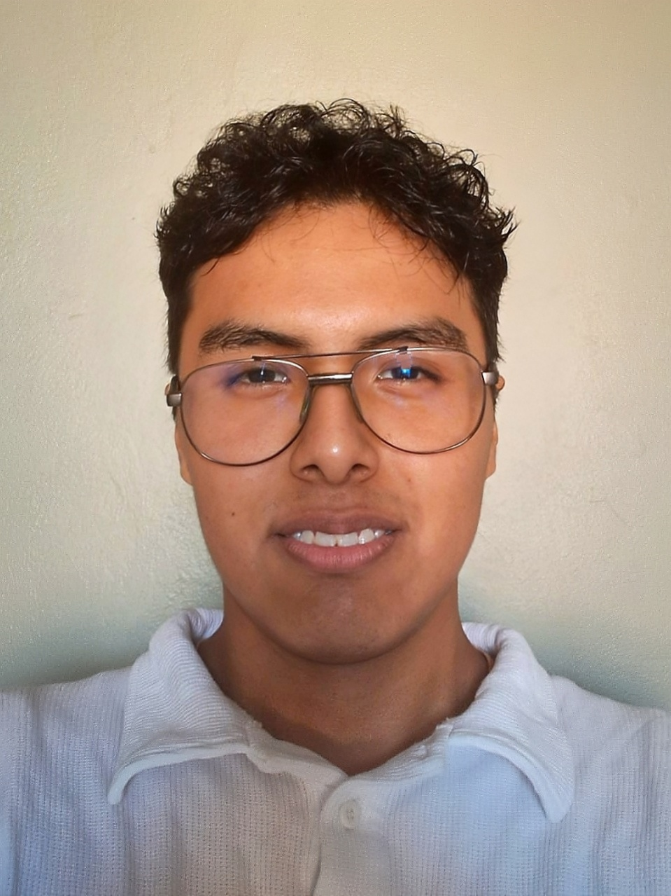
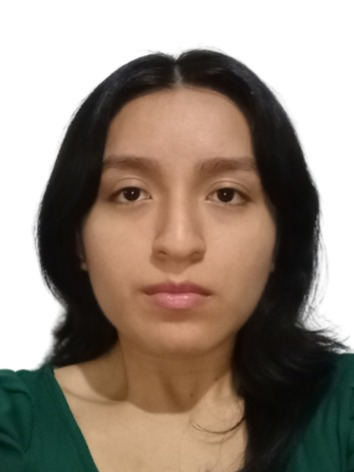
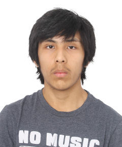
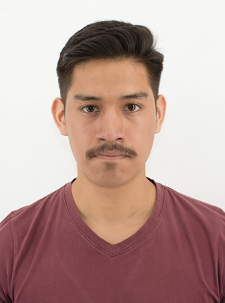

## Capítulo I: Presentación

### 1.1 Startup Profile
#### 1.1.1 Descripción de la Startup

Sanuvi surge con el propósito de abordar uno de los principales problemas de salud pública en el Perú: la baja adherencia al tratamiento de la anemia en niños y gestantes. A pesar de la disponibilidad de suplementos de hierro y programas de control, una gran proporción de pacientes abandona el tratamiento antes de completarlo, generando consecuencias en el desarrollo infantil y riesgos en la salud materna. Frente a esta problemática, proponemos una solución tecnológica integral que conecta a pacientes, cuidadores y personal de salud mediante una plataforma digital enfocada en el seguimiento y la prevención.

Nuestra solución, es una plataforma móvil que permite a las madres y cuidadores registrar y dar seguimiento diario al tratamiento de anemia, facilitando el cumplimiento de las dosis mediante recordatorios inteligentes, herramientas educativas y elementos de gamificación que fomentan la constancia. Al mismo tiempo, el personal de salud puede monitorear en tiempo real la adherencia de sus pacientes, identificar casos de riesgo y brindar acompañamiento oportuno sin depender únicamente de visitas presenciales.

Además, la plataforma incorpora capacidades analíticas que permiten a los coordinadores de salud visualizar tendencias, identificar zonas críticas y tomar decisiones informadas para mejorar la efectividad de las intervenciones.

En Sanuvi, buscamos contribuir a la transformación digital del sector salud mediante soluciones accesibles, escalables y centradas en el usuario. Nuestra visión es reducir significativamente las tasas de abandono del tratamiento de anemia, promoviendo hábitos sostenibles en las familias y fortaleciendo la capacidad de respuesta del sistema sanitario, con el objetivo de generar un impacto real en la calidad de vida de la población.

#### 1.1.2 Perfiles de integrantes del equipo

| Foto | Información |
|------|------------|
|  | **Vitaly Arturo Baca Camargo**    **Código:** U20231C426    **Carrera:** Ingeniería de Software – UPC     **Perfil:**    Estudiante de Ingeniería de Software con interés en la resolución de problemas en diversos sectores mediante el uso de tecnología. Apasionado por el diseño de interfaces de usuario (UI) y enfocado en el desarrollo de soluciones arquitectónicas eficientes y escalables, orientadas a mejorar la experiencia del usuario y el rendimiento de los sistemas.    **Habilidades Técnicas:**    - C#   - MySQL, MongoDB   - DDD    - Git, Git Flow   - Raliway   **Habilidades Sociales**   -  Trabajo en equipo y colaboración en entornos ágile   - Comunicación efectiva para coordinación técnica y funcional  - Pensamiento analítico y resolución de problemas  - Adaptabilidad y aprendizaje continuo   |
|  | **Nombre Completo:** Sebastian Pariachi Limahuaya   **Código:** U202314115   **Carrera:** Ingeniería de Software – UPC    **Perfil:**   Estudiante de Ingeniería de Software enfocado en el desarrollo full-stack y la construcción de arquitecturas escalables orientadas a resolver problemas reales. Apasionado por el diseño de soluciones limpias y eficientes, con experiencia en proyectos que van desde plataformas SaaS hasta aplicaciones móviles de impacto social. Comprometido con las buenas prácticas de ingeniería, el trabajo colaborativo y el aprendizaje continuo. Actualmente en el top 10% de su programa.    **Habilidades Técnicas:**   - React, Node.js, Express   - MySQL, JWT, PayPal API   - RESTful API, DDD, Bounded Contexts    **Habilidades Sociales:**   - Liderazgo técnico y coordinación en equipos multidisciplinarios   - Gestión eficiente del tiempo y priorización de tareas en entornos ágiles   - Proactividad en la identificación y resolución de problemas complejos   - Comunicación asertiva entre equipos técnicos y stakeholders no técnicos |
|  | **Nombre Completo**    **Código:** XXXXXXXX    **Carrera:** Ingeniería de Software – UPC     **Perfil:**    [Descripción breve del perfil]     **Habilidades Técnicas:**    - Lenguajes    - Frameworks    - Herramientas     **Habilidades Sociales:**    [Poner Habilidades Sociales] |
|  | **Nombre Completo**    **Código:** XXXXXXXX    **Carrera:** Ingeniería de Software – UPC     **Perfil:**    [Descripción breve del perfil]     **Habilidades Técnicas:**    - Lenguajes    - Frameworks    - Herramientas     **Habilidades Sociales:**    [Poner Habilidades Sociales] |
|  | **Nombre Completo**    **Código:** XXXXXXXX    **Carrera:** Ingeniería de Software – UPC     **Perfil:**    [Descripción breve del perfil]     **Habilidades Técnicas:**    - Lenguajes    - Frameworks    - Herramientas     **Habilidades Sociales:**    [Poner Habilidades Sociales] |

### 1.2 Solution Profile
#### 1.2.1 Antecedentes y problemática
#### 1.2.2 Lean UX Process
##### 1.2.2.1 Lean UX Problem Statements
##### 1.2.2.2 Lean UX Assumptions
##### 1.2.2.3 Lean UX Hypothesis Statements
##### 1.2.2.4 Lean UX Canvas

### 1.3 Segmentos objetivo
