## Capítulo II: Requirements Development and Software Solution Design

### 2.1 Competidores
Ferova presenta tres competidores relevantes en el mercado de salud 
digital orientado al seguimiento de tratamientos y adherencia terapéutica:

- **App ALMA — MINSA** (competidor directo): Es la aplicación oficial del 
Ministerio de Salud del Perú para el seguimiento del crecimiento y 
tratamiento de anemia en niños menores de 36 meses. Permite a los padres 
registrar fechas de control, vacunas, inicio de gotitas de hierro y 
recetas ricas en hierro. Está disponible únicamente en Android y se 
distribuye de forma gratuita a través del Plan Multisectorial contra la 
Anemia del MINSA.

- **Medisafe** (competidor indirecto): Es una plataforma de gestión de 
medicamentos con más de 10 millones de usuarios a nivel global. Permite 
configurar recordatorios de dosis, gestionar múltiples perfiles de 
pacientes y notificar a cuidadores en caso de olvido. No está adaptada 
al contexto peruano ni tiene enfoque en anemia materno-infantil, pero 
compite indirectamente como herramienta general de adherencia terapéutica.

- **MyTherapy** (competidor indirecto): Es una aplicación de recordatorio 
de medicamentos desarrollada por Smartpatient GmbH con enfoque en 
pacientes con enfermedades crónicas. Incorpora un sistema de recompensas 
visuales por cumplimiento, diario de salud imprimible y notificación 
automática a familiares. Tiene alta presencia en Europa y Latinoamérica 
pero sin adaptación al sistema de salud peruano ni al dominio de anemia.
#### 2.1.1 Análisis competitivo

**¿Por qué llevar a cabo este análisis?**  
> El objetivo de este análisis es evaluar las oportunidades reales de 
competir en el mercado de salud digital materno-infantil en el Perú, 
identificando las características de producto, segmentos objetivo y 
estrategias de los principales actores. A través de este estudio, Sanuvi 
busca tomar decisiones informadas para diseñar una propuesta de valor 
diferenciada que permita a Ferova destacar frente a soluciones existentes.


| | <div align="center">**SANUVI (Nombre del Startup)** <br></div> | <div align="center">**App ALMA — MINSA (Competidor Directo)** <br></div> | <div align="center">**Medisafe (Competidor Indirecto)** <br></div> | <div align="center">**MyTherapy (Competidor Indirecto)** <br></div> |
|:---|:---|:---|:---|:---|
| **Perfil** | | | | |
| Overview | Plataforma móvil integral para el seguimiento del tratamiento de anemia en niños y gestantes. Conecta a madres con el personal de salud del MINSA en tiempo real, con gamificación y analítica de adherencia. | App oficial del MINSA para el seguimiento del crecimiento y tratamiento de anemia en niños menores de 36 meses. Orientada a padres de familia como herramienta informativa. | App de recordatorio de medicamentos para pacientes con tratamientos crónicos. Permite notificar a cuidadores y gestionar múltiples perfiles. | App de recordatorio de medicamentos con diario de salud, gráficas de adherencia y sistema de recompensas visuales por cumplimiento. |
| Ventaja competitiva | Cierra la brecha entre la madre y la enfermera: detecta el abandono antes de que ocurra. Única solución con panel de personal de salud, predicción de riesgo y datos reales del MINSA. | Es la app oficial del MINSA, gratuita y diseñada específicamente para el contexto peruano de anemia infantil. | Más de 10 millones de usuarios, base de datos de 30,000 interacciones medicamentosas, disponible en Android e iOS. | Sistema de recompensas que mejora la motivación, interfaz intuitiva y notificación automática a familiares si se olvida la dosis. |
| **Perfil de Marketing** | | | | |
| Mercado objetivo | Madres con niños menores de 5 años diagnosticados con anemia y gestantes en control prenatal. Personal de salud de postas MINSA en el Perú. | Padres de familia con hijos menores de 36 meses en el Perú, usuarios del sistema de salud del MINSA. | Pacientes con enfermedades crónicas a nivel global que requieren gestión de múltiples medicamentos. | Pacientes con tratamientos crónicos a nivel global, especialmente en Europa y Latinoamérica. |
| Estrategias de marketing | Alianza con postas de salud del MINSA, difusión a través del personal de salud, redes sociales y campaña de salud pública. | Difusión oficial a través del Ministerio de Salud, postas de salud y campañas nacionales contra la anemia. | Google Play y App Store, partnerships con farmacias, médicos y aseguradoras. | Google Play y App Store, partnerships con hospitales y centros de salud europeos. |
| **Perfil de Producto** | | | | |
| Productos & Servicios | Registro diario de dosis, gamificación con rachas e insignias, teleconsulta madre-enfermera, diario nutricional con cálculo de hierro, panel de enfermera con semáforo de riesgo, mapa de postas cercanas. | Control de crecimiento, vacunas, inicio de gotitas de hierro, recetas ricas en hierro, fechas de control de hemoglobina. Orientado a información y recordatorio de citas. | Recordatorio de medicamentos, control de salud (presión, peso), alertas de recarga, perfil de médico, historial de dosis. | Recordatorio de medicamentos, diario de salud imprimible, gráficas de adherencia, recompensas visuales por cumplimiento. |
| Precios & Costos | Gratuito para madres y personal de salud. | Gratuito. | Freemium — versión premium a $4.99/mes o $39.99/año. | Freemium — funciones avanzadas de pago por suscripción. |
| Canales de distribución (Web y/o Móvil) | Google Play (app Kotlin nativa Android) · App Store (app Flutter cross-platform) · Landing Page estático. | Google Play (solo Android). | Google Play y App Store. | Google Play y App Store. |
| **Análisis SWOT** | | | | |
| Fortalezas | Diseñada para el contexto peruano. Conexión real entre madre y personal de salud. Predicción de abandono. Gamificación motivacional. Datos reales del MINSA. Dos apps móviles distintas. | App oficial respaldada por el MINSA. Gratuita. Reconocida a nivel nacional. Diseñada específicamente para anemia infantil. | Gran base de usuarios global. Interfaz robusta y madura. Soporte multiidioma. Integración con EHR (HL7 FHIR). | Interfaz muy intuitiva. Sistema de recompensas motivador. Notificación a familiares. Alta calificación en tiendas (4.7/5). |
| Debilidades | Nuevo en el mercado. Requiere adopción simultánea de madres y personal de salud. Dependencia de conectividad para sincronización. | Solo informativa — no conecta con el personal de salud. Sin panel para enfermeras. Sin seguimiento de adherencia en tiempo real. Sin gamificación. Solo Android. | No adaptada al contexto peruano. Sin enfoque en anemia ni salud materno-infantil. Sin conexión con personal de salud. | Sin adaptación al sistema de salud latinoamericano. Sin conexión con personal de salud. Sin enfoque en anemia infantil. |
| Oportunidades | Alta prevalencia de anemia en Perú (43% en niños). Política pública activa del MINSA 2024-2030. Brecha digital en postas de salud sin herramientas de seguimiento remoto. | Puede evolucionar incorporando un módulo para enfermeras con el respaldo institucional del MINSA. | Expansión a mercados latinoamericanos con apps especializadas por condición crónica. | Expansión con módulos para enfermedades prevalentes en Latinoamérica. |
| Amenazas | Posible actualización de App ALMA con más funcionalidades. Resistencia del personal de salud a adoptar nueva tecnología. Limitada conectividad en zonas periurbanas. | Puede actualizarse e incorporar funcionalidades similares a Ferova al contar con el respaldo institucional del MINSA. | Competidores locales con mejor adaptación cultural y al sistema de salud peruano. | Competidores locales con mejor contextualización al entorno latinoamericano. |

#### 2.1.2 Estrategias y tácticas frente a competidores

**Enfoque Estratégico de Ferova**

Ferova surge como una solución especializada en el **seguimiento del 
tratamiento de anemia materno-infantil**, con una propuesta de valor 
centrada en la **conexión entre madres y personal de salud**, la 
**gamificación motivacional** y la **predicción temprana del abandono 
terapéutico**, diferenciándose de sus competidores en especialización, 
contexto local y visibilidad en tiempo real. A continuación, se detallan 
las estrategias y tácticas específicas frente a los principales actores 
del mercado.

**1. Frente a App ALMA — MINSA**

- **Estrategia de complementariedad activa**: Posicionarse no como rival 
de ALMA sino como su complemento técnico — mientras ALMA informa, Ferova 
conecta. La táctica es acercarse directamente a las enfermeras de las 
postas como canal de adopción, generando tracción desde el sistema de 
salud hacia las madres.
- **Cierre de la brecha de seguimiento**: ALMA no tiene panel para 
personal de salud. Ferova cubre exactamente esa ausencia con el semáforo 
de riesgo y la predicción de abandono, convirtiéndose en la herramienta 
que el personal de salud necesita y que ALMA no puede ofrecer.
- **Ventaja de arquitectura**: Al ser cross-platform con Flutter, Ferova 
funciona en Android e iOS, superando la limitación de ALMA que solo está 
disponible en Android.

**2. Frente a Medisafe**

- **Estrategia de especialización en dominio**: Medisafe es genérica. 
Ferova es la única solución diseñada específicamente para anemia 
materno-infantil en el Perú, con valores de referencia de hemoglobina 
por altitud, integración con datos del MINSA y guía nutricional local. 
Esa especialización es una barrera de entrada que una app internacional 
no puede replicar fácilmente.
- **Táctica de adopción institucional**: Mientras Medisafe depende de que 
el usuario la descargue por cuenta propia, Ferova llega a las madres a 
través de la enfermera que las atiende en la posta — un canal de 
confianza que ningún competidor internacional tiene.

**3. Frente a MyTherapy**

- **Estrategia de gamificación contextual**: MyTherapy premia con imágenes 
genéricas. Ferova vincula la motivación directamente con la salud real 
del niño — la madre no solo ve que cumplió, sino que ve cómo ese 
cumplimiento se refleja en la mejora de la hemoglobina de su hijo. Esa 
conexión emocional es imposible de replicar con una app genérica.
- **Táctica de red de soporte**: Ferova agrega la perspectiva del personal 
de salud como red de apoyo formal, algo que MyTherapy no contempla en su 
modelo de notificación a familiares.

### 2.2 Entrevistas
#### 2.2.1 Diseño de entrevistas

##### <h4>Segmento Objetivo 1: Madres y Cuidadores de niños con anemia</h4> 
---

<h4>Preguntas Personales:</h4> 

- ¿Cuál es su nombre?<br>
- ¿Qué edad tiene?<br>
- ¿Cuál es su estado civil?<br>
- ¿Cuál es su ocupación?<br>
- ¿En qué distrito vive?<br>
- ¿Cuál es su relación con el niño (madre, padre, cuidador)?<br>

<h4>Contexto y antecedentes:</h4> 

- ¿Su hijo(a) ha sido diagnosticado con anemia? ¿Hace cuánto tiempo?<br>
- ¿Cómo fue su experiencia al recibir el diagnóstico?<br>

<h4>Comportamiento y uso actual:</h4> 

- ¿Cómo realiza actualmente el seguimiento del tratamiento?<br>
- ¿Con qué frecuencia administra el suplemento de hierro?<br>
- ¿Ha olvidado alguna vez una dosis? ¿Por qué?<br>
- ¿Cómo controla las citas médicas?<br>

<h4>Frustraciones:</h4> 

- ¿Qué es lo más difícil de seguir el tratamiento contra la anemia?<br>
- ¿Qué problemas ha tenido con las indicaciones médicas?<br>

<h4>Objetivos:</h4> 

- ¿Qué le gustaría lograr con el tratamiento de su hijo?<br>

<h4>Tecnología y canales digitales:</h4> 

- ¿Qué tipo de celular utiliza?<br>
- ¿Qué aplicaciones usa con frecuencia?<br>
- ¿Qué tan cómoda/o se siente usando aplicaciones móviles?<br>

<h4>Preferencias y comportamiento digital:</h4> 

- ¿Qué tipo de contenido le resulta más fácil de entender? (texto, imágenes, videos)<br>

<h4>Necesidades:</h4> 

- ¿Qué tipo de ayuda le gustaría recibir para mejorar el tratamiento?<br>
- ¿Qué funcionalidades le gustaría en una app? (recordatorios, dietas, seguimiento, contacto con médicos)<br>

<h4>Confianza y percepción:</h4> 

- ¿Qué le generaría confianza al usar una aplicación de salud y qué le haría dejar de usarla?<br>

<h4>Personalidad e influencias:</h4> 

- ¿Se considera una persona organizada o más improvisada?<br>
- ¿Suele seguir indicaciones médicas al pie de la letra?<br>

##### <h4>Segmento Objetivo 2: Personal de salud (enfermeros/as y nutricionistas)</h4> 
---

<h4>Preguntas Personales:</h4> 

- ¿Cuál es su nombre?<br>
- ¿Qué edad tiene?<br>
- ¿Cuál es su profesión o especialidad?<br>
- ¿Dónde trabaja actualmente?<br>
- ¿Cuántos años de experiencia tiene?<br>

<h4>Nutrición y manejo alimenticio:</h4> 

- ¿Qué recomendaciones nutricionales suele brindar a pacientes con anemia?<br>
- ¿Qué tan importante considera la alimentación en el tratamiento de la anemia?<br>
- ¿Qué problemas ha identificado en la alimentación de los pacientes (costumbres, acceso a alimentos, desconocimiento, etc.)?<br>

<h4>Comportamiento actual:</h4> 

- ¿Cómo realiza el seguimiento de pacientes con anemia?<br>
- ¿Qué herramientas utiliza actualmente? (Papel, Excel, etc.)<br>
- ¿Cómo organiza la información de sus pacientes?<br>

<h4>Frustraciones:</h4> 

- ¿Qué tan frecuente es el abandono del tratamiento?<br>

<h4>Objetivos:</h4> 

- ¿Qué le gustaría mejorar en el seguimiento de pacientes?<br>
- ¿Qué resultados considera ideales en un tratamiento exitoso?<br>

<h4>Tecnología y herramientas:</h4> 

- ¿Qué herramientas tecnológicas usa con mayor frecuencia?<br>
- ¿Qué tan cómodo se siente usando nuevas tecnologías?<br>

<h4>Necesidades:</h4> 

- ¿Qué información necesita para hacer un mejor seguimiento?<br>
- ¿Qué funcionalidades considera esenciales en una app? (alertas, reportes, historial, teleconsultas, etc.)<br>

<h4>Confianza y adopción:</h4> 

- ¿Qué le generaría confianza para usar una aplicación médica?<br>
- ¿Qué barreras ve en la implementación de una solución digital?<br>

<h4>Personalidad y trabajo:</h4> 

- ¿Se considera una persona organizada en el manejo de pacientes?<br>
- ¿Qué tan importante es la eficiencia en su trabajo diario?<br>


#### 2.2.2 Registro de entrevistas
En esta sección presentamos los registros de las entrevistas que hicimos para cada segmento objetivo de nuestra aplicación.

##### **Segmento objetivo 1:  Madres y Cuidadores de Pacientes con Anemia** 
---

<table>
<colgroup>
</colgroup>
<thead>
  <tr>
    <th colspan="2">Entrevista #1<br></th>
  </tr>
</thead>
<tbody>
  <tr>
    <td>Nombre</td>
    <td>Sonia</td>
  </tr>
  <tr>
    <td>Apellidos</td>
    <td>Ludeña</td>
  </tr>
  <tr>
    <td>Edad</td>
    <td>40 años</td>
  </tr>
  <tr>
    <td>Distrito</td>
    <td>Chorrillos</td>
  </tr>
  <tr>
    <td>Aplicaciones Usadas</td>
    <td>Facebook, Tiktok, WhatsApp</td>
  </tr>
  <tr>
    <td>Motivacion</td>
    <td>Sanar la enfermedad de su hijo</td>
  </tr>
  <tr>
    <td>Frustracion</td>
    <td>Falta de información adicional sobre dietas de anemia</td>
  </tr>
  <tr>
    <td>Evidencia</td>
    <td><div align="center"></td>
  </tr>
  <tr>
    <td>Link</td>
    <td><p><a target="_blank"  href="https://upcedupe-my.sharepoint.com/:v:/g/personal/u20231c426_upc_edu_pe/IQAAOed0dsA0T4t4vSGXtoWKAa1LkKlYsFnXlXdZmk7jdXo?nav=eyJyZWZlcnJhbEluZm8iOnsicmVmZXJyYWxBcHAiOiJTdHJlYW1XZWJBcHAiLCJyZWZlcnJhbFZpZXciOiJTaGFyZURpYWxvZy1MaW5rIiwicmVmZXJyYWxBcHBQbGF0Zm9ybSI6IldlYiIsInJlZmVycmFsTW9kZSI6InZpZXcifX0%3D&e=6fBFog" title="Title">Microsoft Stream</p></td>
  </tr>
  <tr>
    <td>Duracion<br></td>
    <td>0:00 min - 5:23 min</td>
  </tr>
  <tr>
    <td>Resumen</td>
    <td>
		Sonia es una enfermera de Chorrillos que, aunque sepa administrar correctamente las medicinas de su hijo, se complica un poco con la cocina y sus horarios rotativos. Está muy pendiente de su hijo y busca una app sencilla, que no sea dificil de utilizar y que le mande videos con ideas de dietas, porque siente que se aprende mejor viendo videos.
</td>
  </tr>
</tbody>
</table>

<table>
<colgroup>
</colgroup>
<thead>
  <tr>
    <th colspan="2">Entrevista #2<br></th>
  </tr>
</thead>
<tbody>
  <tr>
    <td>Nombre</td>
    <td>Jonathan</td>
  </tr>
  <tr>
    <td>Apellidos</td>
    <td>Ramírez</td>
  </tr>
  <tr>
    <td>Edad</td>
    <td>40 años</td>
  </tr>
  <tr>
    <td>Distrito</td>
    <td>Villa Maria del Triunfo</td>
  </tr>
  <tr>
    <td>Aplicaciones Usadas</td>
    <td>WhatsApp, YouTube, Facebook</td>
  </tr>
  <tr>
    <td>Motivacion</td>
    <td>Que su hijo se recupere completamente y mantenerlo saludable</td>
  </tr>
  <tr>
    <td>Frustracion</td>
    <td>Olvido de dosis y dificultad para entender o seguir correctamente las indicaciones médicas</td>
  </tr>
  <tr>
    <td>Evidencia</td>
    <td><div align="center"></td>
  </tr>
  <tr>
    <td>Link</td>
    <td><p><a target="_blank"  href="https://upcedupe-my.sharepoint.com/:v:/g/personal/u20231c426_upc_edu_pe/IQAAOed0dsA0T4t4vSGXtoWKAa1LkKlYsFnXlXdZmk7jdXo?nav=eyJyZWZlcnJhbEluZm8iOnsicmVmZXJyYWxBcHAiOiJTdHJlYW1XZWJBcHAiLCJyZWZlcnJhbFZpZXciOiJTaGFyZURpYWxvZy1MaW5rIiwicmVmZXJyYWxBcHBQbGF0Zm9ybSI6IldlYiIsInJlZmVycmFsTW9kZSI6InZpZXcifX0%3D&e=6fBFog" title="Title">Microsoft Stream</p></td>
  </tr>
  <tr>
    <td>Duracion<br></td>
    <td>5:23 min - 9:33 min</td>
  </tr>
  <tr>
    <td>Resumen</td>
    <td>
		Jonathan es un padre de familia de Villa Maria del Triunfo que trabaja en el área de panaderia. Aunque está comprometido con el tratamiento de su hijo con anemia, su rutina laboral y el cansancio hacen que a veces olvide administrar las dosis o seguir correctamente las indicaciones médicas. Busca una solución simple que le ayude con recordatorios, le brinde información clara y le facilite el seguimiento del tratamiento sin complicaciones.
</td>
  </tr>
</tbody>
</table>

<table>
<colgroup>
</colgroup>
<thead>
  <tr>
    <th colspan="2">Entrevista #3<br></th>
  </tr>
</thead>
<tbody>
  <tr>
    <td>Nombre</td>
    <td>Milagros</td>
  </tr>
  <tr>
    <td>Apellidos</td>
    <td>Vera</td>
  </tr>
  <tr>
    <td>Edad</td>
    <td>45 años</td>
  </tr>
  <tr>
    <td>Distrito</td>
    <td>San Clemente, Pisco</td>
  </tr>
  <tr>
    <td>Aplicaciones Usadas</td>
    <td>WhatsApp, Facebook, TikTok</td>
  </tr>
  <tr>
    <td>Motivacion</td>
    <td>Recuperar la salud de su hijo y asegurarse de que no tenga problemas en su crecimiento o desarrollo.</td>
  </tr>
  <tr>
    <td>Frustracion</td>
    <td>Falta de claridad en las indicaciones médicas y poca información sobre qué alimentos ayudan en el tratamiento. Además, dificultad para recordar las dosis diariamente.</td>
  </tr>
  <tr>
    <td>Evidencia</td>
    <td><div align="center"></td>
  </tr>
  <tr>
    <td>Link</td>
    <td><p><a target="_blank"  href="https://upcedupe-my.sharepoint.com/:v:/g/personal/u20231c426_upc_edu_pe/IQAAOed0dsA0T4t4vSGXtoWKAa1LkKlYsFnXlXdZmk7jdXo?nav=eyJyZWZlcnJhbEluZm8iOnsicmVmZXJyYWxBcHAiOiJTdHJlYW1XZWJBcHAiLCJyZWZlcnJhbFZpZXciOiJTaGFyZURpYWxvZy1MaW5rIiwicmVmZXJyYWxBcHBQbGF0Zm9ybSI6IldlYiIsInJlZmVycmFsTW9kZSI6InZpZXcifX0%3D&e=6fBFog" title="Title">Microsoft Stream</p></td>
  </tr>
  <tr>
    <td>Duracion<br></td>
    <td> 9:33  min - 14:47 min</td>
  </tr>
  <tr>
    <td>Resumen</td>
    <td>
		Milagros es una madre de 45 años que vive en Pisco y se preocupa mucho por la salud de su hijo diagnosticado con anemia. Aunque intenta seguir el tratamiento, tiene dificultades para ser constante debido a olvidos y falta de herramientas de apoyo. Además, siente que la información médica no siempre es clara, especialmente en temas de alimentación. Usa aplicaciones como WhatsApp, Facebook y TikTok, y prefiere contenido visual como videos. Busca una solución simple que le ayude con recordatorios, seguimiento del tratamiento y orientación práctica para mejorar la alimentación de su hijo.
</td>
  </tr>
</tbody>
</table>
			
##### **Segmento objetivo 2: Personal de salud (enfermeros/as y nutricionistas)**
---

<table>
<colgroup>
</colgroup>
<thead>
  <tr>
    <th colspan="2">Entrevista #1<br></th>
  </tr>
</thead>
<tbody>
  <tr>
    <td>Nombre</td>
    <td>Edith del Carmen</td>
  </tr>
  <tr>
    <td>Apellidos</td>
    <td>Garcia Castillo</td>
  </tr>
  <tr>
    <td>Edad</td>
    <td>45 años</td>
  </tr>
  <tr>
    <td>Distrito</td>
    <td>San Isidro</td>
  </tr>
  <tr>
    <td>Aplicaciones Usadas</td>
    <td> WhatsApp, Excel, Word</td>
  </tr>
  <tr>
    <td>Motivacion</td>
    <td>Mejorar la atención y recuperación del paciente.</td>
  </tr>
  <tr>
    <td>Frustracion</td>
    <td>La falta de herramientas digitales simples y amigables para realizar seguimiento efectivo de pacientes y educarlos adecuadamente.</td>
  </tr>
  <tr>
    <td>Evidencia</td>
    <td><div align="center"></div></td>
  </tr>
  <tr>
    <td>Link</td>
    <td>
		<p><a target="_blank"  href="https://upcedupe-my.sharepoint.com/:v:/g/personal/u202315890_upc_edu_pe/IQBeJZvfyHIHSZ-TZwiVwGFqAWMchsgCAPyR_F-neP4fWqU?e=PO1fJ9&nav=eyJyZWZlcnJhbEluZm8iOnsicmVmZXJyYWxBcHAiOiJTdHJlYW1XZWJBcHAiLCJyZWZlcnJhbFZpZXciOiJTaGFyZURpYWxvZy1MaW5rIiwicmVmZXJyYWxBcHBQbGF0Zm9ybSI6IldlYiIsInJlZmVycmFsTW9kZSI6InZpZXcifX0%3D" title="Title">Microsoft Stream</p>
	</td>
  </tr>
  <tr>
    <td>Duracion<br></td>
    <td>
		22:44 min - 35:20 min
	</td>
  </tr>
  <tr>
    <td>Resumen</td>
    <td>
		La entrevistada, enfermera con 20 años de experiencia en el Hospital Rebagliati, considera que la alimentación es clave en el tratamiento de la anemia y que el seguimiento debe empezar desde los primeros signos de riesgo, no cuando la enfermedad ya es severa. Señala que actualmente se apoya en Excel y en sistemas internos del hospital, pero cree que una app sería útil si fuera simple, visual, amigable y con alertas o recordatorios. Además, menciona que para hacer un buen seguimiento se debe considerar también el contexto social y los hábitos del paciente, y que la confianza en una herramienta digital dependerá de su utilidad real y de opiniones de otros usuarios.
</table>

<table>
<colgroup>
</colgroup>
<thead>
  <tr>
    <th colspan="2">Entrevista #2<br></th>
  </tr>
</thead>
<tbody>
  <tr>
    <td>Nombre</td>
    <td>Carmen Lucero</td>
  </tr>
  <tr>
    <td>Apellidos</td>
    <td>Rivas Sanguilera</td>
  </tr>
  <tr>
    <td>Edad</td>
    <td>36 años</td>
  </tr>
  <tr>
    <td>Distrito</td>
    <td>Jesus María</td>
  </tr>
  <tr>
    <td>Aplicaciones Usadas</td>
    <td>Excel, word, SO del hospital</td>
  </tr>
  <tr>
    <td>Motivacion</td>
    <td>Mejorar la recuperación del paciente mediante una buena alimentación.</td>
  </tr>
  <tr>
    <td>Frustracion</td>
    <td>Baja frecuencia de controles y poca continuidad en el seguimiento.</td>
  </tr>
  <tr>
    <td>Evidencia</td>
    <td><div align="center"></td>
  </tr>
  <tr>
    <td>Link</td>
    <td><p><a target="_blank"  href="https://upcedupe-my.sharepoint.com/:v:/g/personal/u202315890_upc_edu_pe/IQBeJZvfyHIHSZ-TZwiVwGFqAWMchsgCAPyR_F-neP4fWqU?e=PO1fJ9&nav=eyJyZWZlcnJhbEluZm8iOnsicmVmZXJyYWxBcHAiOiJTdHJlYW1XZWJBcHAiLCJyZWZlcnJhbFZpZXciOiJTaGFyZURpYWxvZy1MaW5rIiwicmVmZXJyYWxBcHBQbGF0Zm9ybSI6IldlYiIsInJlZmVycmFsTW9kZSI6InZpZXcifX0%3D" title="Title">Microsoft Stream</p></td>
  </tr>
  <tr>
    <td>Duracion<br></td>
    <td>35:22 min - 46:07 min</td>
  </tr>
  <tr>
    <td>Resumen</td>
    <td>
		La entrevistada, nutricionista con cerca de 10 años de experiencia, señala que la alimentación es clave en el tratamiento de la anemia junto con la suplementación de hierro. Identifica problemas como la falta de adherencia, el desconocimiento y hábitos alimenticios inadecuados, lo que contribuye al abandono frecuente del tratamiento. Considera fundamental mejorar la comunicación y el seguimiento del paciente, y valora aplicaciones simples que incluyan recordatorios y mensajes claros para reforzar la adherencia.
</td>
  </tr>
</tbody>
</table>

<table>
<colgroup>
</colgroup>
<thead>
  <tr>
    <th colspan="2">Entrevista #3<br></th>
  </tr>
</thead>
<tbody>
  <tr>
    <td>Nombre</td>
    <td>Paolo</td>
  </tr>
  <tr>
    <td>Apellidos</td>
    <td>Salas</td>
  </tr>
  <tr>
    <td>Edad</td>
    <td>39 años</td>
  </tr>
  <tr>
    <td>Distrito</td>
    <td>Jesus Maria</td>
  </tr>
  <tr>
    <td>Aplicaciones Usadas</td>
    <td>Excel, word, chat gpt</td>
  </tr>
  <tr>
    <td>Motivacion</td>
    <td>Brindar una atención de calidad y eficiente pese a limitaciones de tiempo.</td>
  </tr>
  <tr>
    <td>Frustracion</td>
    <td>Alto abandono del tratamiento por parte de los pacientes.</td>
  </tr>
  <tr>
    <td>Evidencia</td>
    <td><div align="center"></td>
  </tr>
  <tr>
    <td>Link</td>
    <td><p><a target="_blank"  href="https://upcedupe-my.sharepoint.com/:v:/g/personal/u202315890_upc_edu_pe/IQBeJZvfyHIHSZ-TZwiVwGFqAWMchsgCAPyR_F-neP4fWqU?e=PO1fJ9&nav=eyJyZWZlcnJhbEluZm8iOnsicmVmZXJyYWxBcHAiOiJTdHJlYW1XZWJBcHAiLCJyZWZlcnJhbFZpZXciOiJTaGFyZURpYWxvZy1MaW5rIiwicmVmZXJyYWxBcHBQbGF0Zm9ybSI6IldlYiIsInJlZmVycmFsTW9kZSI6InZpZXcifX0%3D" title="Title">Microsoft Stream</p></td>
  </tr>
  <tr>
    <td>Duracion<br></td>
    <td>0:00 min - 22:40 min</td>
  </tr>
  <tr>
    <td>Resumen</td>
    <td>
		El entrevistado, nutricionista con varios años de experiencia en un centro de salud, destaca que la alimentación es esencial en el tratamiento de la anemia, complementando el tratamiento farmacológico y previniendo recaídas. Identifica como principales problemas la desinformación, los hábitos alimenticios inadecuados y factores sociales como el acceso limitado a servicios básicos. Señala que el abandono del tratamiento es muy frecuente, especialmente en niños, debido a la pérdida de interés de los padres y dificultades en el seguimiento. Considera que se debe mejorar el acceso a información, la actualización de datos de los pacientes y el uso de herramientas digitales simples, seguras y accesibles que permitan un seguimiento más eficiente.
</td>
  </tr>
</tbody>
</table>

#### 2.2.3 Análisis de entrevistas

##### **Segmento objetivo 1:  Madres y Cuidadores de Pacientes con Anemia**
---

**Contexto actual del seguimiento**
Las entrevistas realizadas a madres y cuidadores evidencian que el seguimiento del tratamiento de la anemia se realiza de manera manual, informal y poco estructurada. El 100% de los entrevistados menciona que utiliza métodos básicos como la memoria, cuadernos o indicaciones verbales del médico para llevar el control. Además, el tratamiento depende en gran medida de la rutina diaria del hogar y del trabajo, lo que genera inconsistencias en los horarios y olvidos ocasionales. Aunque todos intentan cumplir con las indicaciones médicas, no cuentan con herramientas que les permitan un seguimiento continuo y confiable. También se observa que el control de citas médicas se realiza de forma básica (anotaciones o indicaciones del centro de salud), lo que puede generar desorganización o dependencia de recordatorios externos.

**Motivaciones de los profesionales**
En cuanto a motivaciones, el 100% de los entrevistados coincide en que su principal objetivo es recuperar la salud del niño y evitar complicaciones futuras. Asimismo, aproximadamente el 80% muestra interés en aprender más sobre cómo mejorar la alimentación y complementar el tratamiento, especialmente en relación con dietas ricas en hierro. También se evidencia que todos los entrevistados están abiertos al uso de tecnología, siempre que esta sea simple, clara y fácil de usar, destacando una preferencia marcada por contenido visual como videos.

**Principales problemáticas identificadas**
Las principales dificultades están relacionadas con la adherencia al tratamiento, aunque no por falta de intención, sino por limitaciones prácticas:

- **Olvido de dosis** (≈70%): debido al trabajo, responsabilidades del hogar o falta de recordatorios
- **Falta de claridad en indicaciones médicas** (≈70%): especialmente en temas de alimentación y tratamiento
- **Dificultad en la alimentación adecuada** (≈80%): no saben exactamente qué comidas ayudan a mejorar la anemia
- **Dependencia de métodos manuales** (100%): cuadernos, memoria o indicaciones verbales
- **Carga laboral o rutinas variables** (≈60%): afecta la organización diaria del tratamiento
  
A pesar de esto, se identifica que los cuidadores sí están comprometidos, pero no cuentan con herramientas adecuadas.

**Brechas en el sistema actual**

A partir del análisis, se identifican tres brechas principales:

- **Brecha de seguimiento**
No existe un sistema que permita llevar un control diario estructurado del tratamiento.
- **Brecha de información**
Las indicaciones médicas no siempre son claras ni prácticas, especialmente en nutrición.
- **Brecha de adherencia**
Los olvidos y la falta de acompañamiento afectan la continuidad del tratamiento.

Estas brechas evidencian que el problema no es solo médico, sino también **organizacional**, **educativo** y **conductual.**

**Oportunidades de solución**
A partir de los hallazgos, se identifican oportunidades claras:

- Recordatorios automáticos de dosis **(≈90% necesidad)**
- Seguimiento diario del tratamiento **(100% necesidad)**
- Contenido educativo en videos sobre anemia y dietas **(≈90% preferencia)**
- Guías prácticas de alimentación **(≈80% necesidad)**
- Contacto o asesoría con profesionales de salud **(≈70% interés)**
- Aplicación simple, intuitiva y fácil de usar **(100% requisito crítico)**

Las entrevistas muestran que los cuidadores están altamente comprometidos con la salud de los niños, pero enfrentan dificultades prácticas que afectan la continuidad del tratamiento. La falta de herramientas de apoyo, información clara y seguimiento estructurado impacta directamente en la adherencia. Existe una oportunidad clara para desarrollar una solución digital que no solo informe, sino que acompañe activamente el proceso del tratamiento, facilitando la organización, el aprendizaje y el cumplimiento diario.

##### **Segmento objetivo 2: Personal de salud (enfermeros/as y nutricionistas)**
---

**Contexto actual del seguimiento**
Las entrevistas realizadas a profesionales de salud evidencian que el seguimiento del tratamiento de la anemia se desarrolla de manera fragmentada y poco digitalizada. Aproximadamente el **100% de los entrevistados** utiliza herramientas básicas como Excel, papel o sistemas internos no integrados, lo que genera duplicidad de información y pérdida de tiempo en la gestión. Además, el seguimiento suele depender de consultas presenciales, visitas domiciliarias o comunicación informal, lo que limita la continuidad del tratamiento. Esta situación provoca que la información esté dispersa entre diferentes áreas (enfermería, nutrición, medicina), dificultando una visión integral del paciente.

**Motivaciones de los profesionales**
En cuanto a sus motivaciones, el **100% de los entrevistados** coincide en que su principal objetivo es **mejorar la salud del paciente y prevenir recaídas**, especialmente en poblaciones vulnerables como niños y gestantes. Asimismo, alrededor del **80% destaca la importancia de optimizar el seguimiento y la comunicación**, buscando herramientas que les permitan ahorrar tiempo y ser más eficientes en su trabajo diario. También se evidencia una disposición positiva hacia la adopción de tecnología, siempre que esta sea **simple, intuitiva y accesible**, sin aumentar la carga operativa.

**Principales problemáticas identificadas**
Las principales dificultades detectadas giran en torno a la **baja adherencia al tratamiento**. Según los entrevistados, el **abandono del tratamiento es frecuente**, especialmente en etapas intermedias cuando el paciente empieza a mostrar mejoría. Este problema está asociado a varios factores:

- **Desinformación** sobre alimentación y tratamiento.  
- **Falta de interés o compromiso** por parte de pacientes o cuidadores.  
- **Hábitos alimenticios inadecuados**, incluyendo rechazo a alimentos ricos en hierro.  
- **Limitaciones logísticas**, como distancia, trabajo o falta de tiempo.  
- **Datos desactualizados**, lo que dificulta el contacto y seguimiento.  

Además, el **100% de los entrevistados** coincide en que los procesos actuales son ineficientes y requieren demasiado esfuerzo manual, lo que reduce la capacidad de cubrir a todos los pacientes.

**Brechas en el sistema actual**

Se identifican tres brechas principales:

- **1. Brecha de información**
La información del paciente no está centralizada ni actualizada, lo que genera pérdida de seguimiento.
- **2. Brecha de comunicación**
Existe poca interacción continua entre profesional y paciente, limitándose a citas esporádicas.
- **3. Brecha de adherencia**
Los pacientes no mantienen el tratamiento por falta de recordatorios, educación clara y acompañamiento.

Estas brechas reflejan que el problema no es únicamente médico, sino también **comportamental y sistémico**.

**Oportunidades de solución**
A partir de los hallazgos, se identifica una clara oportunidad para desarrollar una solución digital que:

- Centralice la información del paciente (**100% necesidad detectada**).  
- Incorpore recordatorios y seguimiento continuo (**≈90% relevancia**).  
- Brinde educación clara y práctica sobre anemia (**≈80% necesidad**).  
- Mejore la comunicación entre paciente y profesional (**≈80% necesidad**).  
- Sea simple, intuitiva y accesible para todo tipo de usuario (**100% requisito crítico**).  

En conjunto, las entrevistas demuestran que existe una necesidad urgente de herramientas que no solo optimicen procesos, sino que también **incrementen la adherencia al tratamiento**, atacando directamente una de las principales causas del fracaso en la recuperación de la anemia.


### 2.3 Needfinding

Para crear un producto que cumpla con las necesidades específicas de un cliente, nuestro equipo se dedicará a identificar los User persona, User Task Matrix, User Journey Maps y Empathy Mapping.

#### 2.3.1 User Personas

Después de analizar las entrevistas de nuestro segmento objetivo, nuestra tarea es definir el perfil del usuario ideal con el que estamos tratando. Hemos elaborado los perfiles de usuario teniendo en cuenta las personalidades y cualidades identificadas en cada entrevista. A continuación, se presentan las user personas resultantes de la investigación:

##### **Usuario Madre / Cuidadora (Carla Briceño)**


##### **Usuario Enfermera (Leslie Rodriguez)**


#### 2.3.2 User Task Matrix

La seccion User Task Matrix permite identificar y comparar las tareas más relevantes que realizan los usuarios representados en nuestras User Personas. En esta matriz se organiza cada tarea según su frecuencia y su importancia.

##### **Usuario Madre / Cuidadora (Carla Briceño)**

| USER TASK                                                | Frecuencia | Importancia |
| -------------------------------------------------------- | ---------- | ----------- |
| Administrar suplemento de hierro al niño                 | Alta       | Crítica     |
| Consultar recordatorios de dosis y horarios              | Alta       | Crítica     |
| Registrar cumplimiento de dosis diaria                   | Alta       | Crítica     |
| Revisar recomendaciones de alimentación (hierro)         | Alta       | Crítica     |
| Preparar alimentos ricos en hierro                       | Alta       | Alta        |
| Registrar alimentos consumidos por el niño               | Media      | Alta        |
| Monitorear evolución del tratamiento (síntomas/mejoras)  | Media      | Alta        |
| Controlar citas médicas                                  | Media      | Alta        |
| Recibir alertas por olvido de dosis                      | Alta       | Importante  |
| Consultar información sobre anemia (contenido educativo) | Alta       | Crítica     |
| Comunicarse con personal de salud                        | Media      | Alta        |
| Revisar historial de tratamiento del niño                | Media      | Alta        |
| Actualizar datos del paciente                            | Baja       | Importante  |


##### **Usuario Enfermera (Leslie Rodriguez)**

| USER TASK | Frecuencia | Importancia |
|----------|------------|-------------|
| Registrar consumo diario de hierro / medicación | Alta | Crítica |
| Consultar recordatorios de tratamiento (dosis, citas) | Alta | Crítica |
| Revisar recomendaciones de alimentación (hierro) | Alta | Crítica |
| Registrar hábitos alimenticios del paciente | Media | Alta |
| Monitorear evolución (niveles de hemoglobina) | Media | Alta |
| Recibir alertas sobre incumplimiento del tratamiento | Alta | Importante |
| Comunicarse con personal de salud (mensajes / teleconsulta) | Media | Alta |
| Consultar historial clínico y seguimiento | Media | Alta |
| Actualizar datos del paciente (contacto, dirección) | Baja | Importante |
| Recibir educación sobre anemia (contenido simple y claro) | Alta | Crítica |
| Coordinar citas médicas y controles | Media | Alta |
| Confirmar cumplimiento de tareas (checklist diario) | Alta | Crítica |

#### 2.3.3 User Journey Mapping

En esta sección, se desarrollan los User Journey Maps para cada User Persona, proporcionando una visión completa del recorrido del usuario desde el inicio hasta el final. Estos mapas representan la situación actual (As-Is) de cada segmento, sin ofrecer soluciones.

##### **Usuario Madre / Cuidadora (Carla Briceño)**

Mediante este artefacto se explicará y comprenderá como los usuarios del segmento cuidador realizan sus actividades para alcanzar sus objetivos desde su perspectiva.


##### **Usuario Enfermera (Leslie Rodriguez)**

Mediante este artefacto se explicará y comprenderá como los usuarios del segmento nutricionista/enfermera realizan sus actividades para alcanzar sus objetivos desde su perspectiva.


#### 2.3.4 Empathy Mapping

Lo siguiente a evaluar como parte del needfinding es a nuestros segmentos objetivos a través de empathy maps, con el objetivo de conocer mejor a nuestros segmentos objetivos e identificar sus necesidades profundas.

##### **Usuario Madre / Cuidadora (Carla Briceño)**


##### **Usuario Enfermera (Leslie Rodriguez)**


#### 2.3.5 Ubiquitous Language

En esta sección se presentan los términos clave del proyecto UI-Topic. Estos términos han sido acordados en el equipo del proyecto y serán usados de manera consistente en la comunicación, documentación y desarrollo del sistema.


| Term (EN)                                               | Definición (ES)                                                                                    |
| ------------------------------------------------------- | -------------------------------------------------------------------------------------------------- |
| **Patient (Paciente)**                                  | Niño o persona diagnosticada con anemia que recibe tratamiento y seguimiento en el sistema.        |
| **Caregiver (Cuidador)**                                | Madre, padre o responsable encargado de administrar el tratamiento y cuidado del paciente.         |
| **Treatment (Tratamiento)**                             | Conjunto de indicaciones médicas que incluyen suplementación de hierro, alimentación y controles.  |
| **Dose (Dosis)**                                        | Cantidad de suplemento de hierro que debe administrarse al paciente en un horario específico.      |
| **Dose reminder (Recordatorio de dosis)**               | Notificación automática que indica al cuidador cuándo administrar el suplemento de hierro.         |
| **Adherence (Adherencia)**                              | Nivel de cumplimiento del tratamiento por parte del cuidador o paciente.                           |
| **Missed dose (Dosis omitida)**                         | Dosis que no fue administrada en el tiempo programado.                                             |
| **Treatment tracking (Seguimiento del tratamiento)**    | Registro continuo del cumplimiento de dosis, citas médicas y evolución del paciente.               |
| **Medical appointment (Cita médica)**                   | Consulta programada con el personal de salud para evaluar el estado del paciente.                  |
| **Appointment reminder (Recordatorio de cita)**         | Notificación que alerta al usuario sobre una próxima cita médica.                                  |
| **Hemoglobin level (Nivel de hemoglobina)**             | Medición clínica que indica el estado de anemia del paciente.                                      |
| **Nutrition plan (Plan nutricional)**                   | Conjunto de recomendaciones alimenticias orientadas a mejorar los niveles de hierro.               |
| **Iron-rich food (Alimento rico en hierro)**            | Alimento recomendado para mejorar la hemoglobina del paciente.                                     |
| **Food inhibitor (Inhibidor de hierro)**                | Alimento que reduce la absorción de hierro (ej. leche, café).                                      |
| **Daily log (Registro diario)**                         | Registro donde el cuidador confirma la dosis administrada y alimentación del día.                  |
| **Alert (Alerta)**                                      | Notificación generada por el sistema ante eventos importantes (dosis omitida, riesgo de abandono). |
| **Risk level (Nivel de riesgo)**                        | Indicador del sistema que muestra la probabilidad de abandono del tratamiento.                     |
| **Treatment completion (Finalización del tratamiento)** | Estado en el que el paciente alcanza niveles normales de hemoglobina.                              |
| **Treatment abandonment (Abandono del tratamiento)**    | Situación en la que el paciente deja de seguir el tratamiento antes de completarlo.                |
| **Health education (Educación en salud)**               | Contenido informativo (videos, guías) para ayudar al cuidador a entender el tratamiento.           |
| **Teleconsultation (Teleconsulta)**                     | Comunicación digital entre cuidador y personal de salud para resolver dudas.                       |
| **Notification (Notificación)**                         | Mensaje enviado al usuario para informar, recordar o alertar sobre eventos del sistema.            |
| **User (Usuario)**                                      | Persona que interactúa con la aplicación (cuidador, enfermera o administrador).                    |

### 2.4 Requirements Specification
#### 2.4.1 User Stories

En esta sección, se incluyen todos los *Epic* y *User Stories* que fueron identificados durante el análisis del proyecto.

**Epics**

<table border="1" cellpadding="10" cellspacing="0" width="100%">
  <thead>
    <tr>
      <th>Epic ID</th>
      <th>User</th>
      <th>Priority</th>
      <th>Epic</th>
    </tr>
  </thead>
  <tbody>
    <tr>
      <td>EP-01</td>
      <td>Usuario</td>
      <td>High</font></td>
      <td>EP-01</td>
    </tr>
    <tr>
      <td><b>Title</b></td>
      <td colspan="3">Autenticacion y Acceso</td>
    </tr>
    <tr>
      <td colspan="4"><b>Description</b></td>
    </tr>
    <tr>
      <td colspan="4">
        Como usuario, quiero poder registrarme, iniciar sesion y gestionar mi cuenta en la plataforma, para acceder de forma segura a los servicios de Ferova     segun mi rol asignado.
      </td>
    </tr>
  </tbody>
</table>

<table border="1" cellpadding="10" cellspacing="0" width="100%">
  <thead>
    <tr>
      <th>Epic ID</th>
      <th>User</th>
      <th>Priority</th>
      <th>Epic</th>
    </tr>
  </thead>
  <tbody>
    <tr>
      <td>EP-02</td>
      <td>Madre / Enfermera</td>
      <td>High</font></td>
      <td>EP-02</td>
    </tr>
    <tr>
      <td><b>Title</b></td>
      <td colspan="3">Gestion de Pacientes</td>
    </tr>
    <tr>
      <td colspan="4"><b>Description</b></td>
    </tr>
    <tr>
      <td colspan="4">
        Como madre o enfermera, quiero poder registrar y gestionar la informacion clinica y personal de los pacientes con anemia, para contar con un expediente digital completo que sirva de base para el seguimiento del tratamiento.
      </td>
    </tr>
  </tbody>
</table>

<table border="1" cellpadding="10" cellspacing="0" width="100%">
  <thead>
    <tr>
      <th>Epic ID</th>
      <th>User</th>
      <th>Priority</th>
      <th>Epic</th>
    </tr>
  </thead>
  <tbody>
    <tr>
      <td>EP-03</td>
      <td>Madre / Enfermera</td>
      <td>High</font></td>
      <td>EP-03</td>
    </tr>
    <tr>
      <td><b>Title</b></td>
      <td colspan="3">Seguimiento del Tratamiento</td>
    </tr>
    <tr>
      <td colspan="4"><b>Description</b></td>
    </tr>
    <tr>
      <td colspan="4">
        Como madre o enfermera, quiero poder hacer seguimiento diario del tratamiento de anemia de cada paciente, para garantizar el cumplimiento de las dosis programadas y detectar a tiempo los casos en riesgo de abandono.
      </td>
    </tr>
  </tbody>
</table>

<table border="1" cellpadding="10" cellspacing="0" width="100%">
  <thead>
    <tr>
      <th>Epic ID</th>
      <th>User</th>
      <th>Priority</th>
      <th>Epic</th>
    </tr>
  </thead>
  <tbody>
    <tr>
      <td>EP-04</td>
      <td>Madre</td>
      <td>High</font></td>
      <td>EP-04</td>
    </tr>
    <tr>
      <td><b>Title</b></td>
      <td colspan="3">Diario Nutricional</td>
    </tr>
    <tr>
      <td colspan="4"><b>Description</b></td>
    </tr>
    <tr>
      <td colspan="4">
        Como madre, quiero poder registrar los alimentos que consume mi hijo cada dia, para que el sistema calcule el hierro absorbido y me alerte cuando alguno inhiba la efectividad del suplemento de hierro.
      </td>
    </tr>
  </tbody>
</table>

<table border="1" cellpadding="10" cellspacing="0" width="100%">
  <thead>
    <tr>
      <th>Epic ID</th>
      <th>User</th>
      <th>Priority</th>
      <th>Epic</th>
    </tr>
  </thead>
  <tbody>
    <tr>
      <td>EP-05</td>
      <td>Madre</td>
      <td>Medium</font></td>
      <td>EP-05</td>
    </tr>
    <tr>
      <td><b>Title</b></td>
      <td colspan="3">Gamificacion</td>
    </tr>
    <tr>
      <td colspan="4"><b>Description</b></td>
    </tr>
    <tr>
      <td colspan="4">
       Como madre, quiero poder ver mis rachas de dias cumplidos, desbloquear insignias y acumular puntos por confirmar las dosis de mi hijo, para sentirme motivada y recompensada por mantener la constancia en el tratamiento.
      </td>
    </tr>
  </tbody>
</table>

<table border="1" cellpadding="10" cellspacing="0" width="100%">
  <thead>
    <tr>
      <th>Epic ID</th>
      <th>User</th>
      <th>Priority</th>
      <th>Epic</th>
    </tr>
  </thead>
  <tbody>
    <tr>
      <td>EP-06</td>
      <td>Madre / Enfermera</td>
      <td>High</font></td>
      <td>EP-06</td>
    </tr>
    <tr>
      <td><b>Title</b></td>
      <td colspan="3">Teleconsulta</td>
    </tr>
    <tr>
      <td colspan="4"><b>Description</b></td>
    </tr>
    <tr>
      <td colspan="4">
        Como madre o enfermera, quiero poder comunicarme de forma asincrona a traves de un chat privado dentro de la app, para resolver dudas sobre el tratamiento de anemia sin necesidad de una visita presencial a la posta.
      </td>
    </tr>
  </tbody>
</table>

<table border="1" cellpadding="10" cellspacing="0" width="100%">
  <thead>
    <tr>
      <th>Epic ID</th>
      <th>User</th>
      <th>Priority</th>
      <th>Epic</th>
    </tr>
  </thead>
  <tbody>
    <tr>
      <td>EP-07</td>
      <td>Madre / Enfermera / Admin</td>
      <td>High</font></td>
      <td>EP-07</td>
    </tr>
    <tr>
      <td><b>Title</b></td>
      <td colspan="3">Gestion de Postas y Citas</td>
    </tr>
    <tr>
      <td colspan="4"><b>Description</b></td>
    </tr>
    <tr>
      <td colspan="4">
        Como madre, enfermera o admin, quiero poder registrar postas medicas, asignar personal y reservar citas de control desde la app, para conectar el mundo digital de Ferova con el mundo fisico de las postas del MINSA.
      </td>
    </tr>
  </tbody>
</table>

<table border="1" cellpadding="10" cellspacing="0" width="100%">
  <thead>
    <tr>
      <th>Epic ID</th>
      <th>User</th>
      <th>Priority</th>
      <th>Epic</th>
    </tr>
  </thead>
  <tbody>
    <tr>
      <td>EP-08</td>
      <td>Madre / Enfermera</td>
      <td>High</font></td>
      <td>EP-08</td>
    </tr>
    <tr>
      <td><b>Title</b></td>
      <td colspan="3">Notificaciones</td>
    </tr>
    <tr>
      <td colspan="4"><b>Description</b></td>
    </tr>
    <tr>
      <td colspan="4">
        Como madre o enfermera, quiero recibir notificaciones push inteligentes sobre dosis, citas, consultas y logros, para mantenerme informada y tomar accion oportuna cuando sea necesario.
      </td>
    </tr>
  </tbody>
</table>

<table border="1" cellpadding="10" cellspacing="0" width="100%">
  <thead>
    <tr>
      <th>Epic ID</th>
      <th>User</th>
      <th>Priority</th>
      <th>Epic</th>
    </tr>
  </thead>
  <tbody>
    <tr>
      <td>EP-09</td>
      <td>Enfermera / Admin</td>
      <td>High</font></td>
      <td>EP-09</td>
    </tr>
    <tr>
      <td><b>Title</b></td>
      <td colspan="3">Analytics y Reportes</td>
    </tr>
    <tr>
      <td colspan="4"><b>Description</b></td>
    </tr>
    <tr>
      <td colspan="4">
        Como enfermera o admin, quiero poder enviar reportes de adherencia y visualizar el dashboard analitico del distrito, para monitorear el estado del tratamiento de anemia y exportar reportes en PDF para el MINSA central.
      </td>
    </tr>
  </tbody>
</table>

**User Stories**

<table border="1" cellpadding="10" cellspacing="0" width="100%">
  <thead>
    <tr>
      <th>Story ID</th>
      <th>User</th>
      <th>Priority</th>
      <th>Epic</th>
    </tr>
  </thead>
  <tbody>
    <tr>
      <td>US-01</td>
      <td>Usuario</td>
      <td>High</font></td>
      <td>EP-01</td>
    </tr>
    <tr>
      <td><b>Title</b></td>
      <td colspan="3">Registro de nuevo usuario</td>
    </tr>
    <tr>
      <td colspan="4"><b>Description</b></td>
    </tr>
    <tr>
      <td colspan="4">
        Como usuario, quiero poder registrarme en la plataforma ingresando mis datos personales, para poder acceder a los servicios de Ferova.
      </td>
    </tr>
    <tr>
      <td colspan="4"><b>Aceptance Criteria</b></td>
    </tr>
    <tr>
      <td colspan="4">
        Escenario 1: Registro exitoso<br>
        Dado que el usuario no posee una cuenta registrada,<br>
        cuando ingresa sus datos personales y presiona 'Registrarse',<br>
        entonces el sistema debe crear su cuenta y asignarle un rol automaticamente.<br><br>
        Escenario 2: Registro con correo ya existente<br>
        Dado que el usuario intenta registrarse con un correo ya registrado,<br>
        cuando presiona 'Registrarse',<br>
        entonces el sistema debe mostrar un mensaje de error indicando que el correo ya existe.
      </td>
    </tr>
  </tbody>
</table>

<table border="1" cellpadding="10" cellspacing="0" width="100%">
  <thead>
    <tr>
      <th>Story ID</th>
      <th>User</th>
      <th>Priority</th>
      <th>Epic</th>
    </tr>
  </thead>
  <tbody>
    <tr>
      <td>US-02</td>
      <td>Usuario</td>
      <td>High</td>
      <td>EP-01</td>
    </tr>
    <tr>
      <td><b>Title</b></td>
      <td colspan="3">Inicio de sesión</td>
    </tr>
    <tr>
      <td colspan="4"><b>Description</b></td>
    </tr>
    <tr>
      <td colspan="4">
        Como usuario, quiero poder iniciar sesión con mi número de DNI y contraseña, para poder acceder a mi cuenta y los servicios de Ferova.
      </td>
    </tr>
    <tr>
      <td colspan="4"><b>Acceptance Criteria</b></td>
    </tr>
    <tr>
      <td colspan="4">
        Escenario 1: Inicio de sesión exitoso<br>
        Dado que el usuario posee una cuenta registrada,<br>
        cuando ingresa su número de DNI y contraseña correctamente y presiona 'Iniciar sesión',<br>
        entonces el sistema debe validar sus credenciales y permitirle el acceso a la plataforma según su rol asignado.<br>
        <br>
        Escenario 2: Credenciales incorrectas<br>
        Dado que el usuario ingresa credenciales incorrectas,<br>
        cuando presiona 'Iniciar sesión',<br>
        entonces el sistema debe mostrar un mensaje de error indicando que el DNI o contraseña son incorrectos.
      </td>
    </tr>
  </tbody>
</table>

<table border="1" cellpadding="10" cellspacing="0" width="100%">
  <thead>
    <tr>
      <th>Story ID</th>
      <th>User</th>
      <th>Priority</th>
      <th>Epic</th>
    </tr>
  </thead>
  <tbody>
    <tr>
      <td>US-03</td>
      <td>Usuario</td>
      <td>High</td>
      <td>EP-01</td>
    </tr>
    <tr>
      <td><b>Title</b></td>
      <td colspan="3">Bloqueo de cuenta por intentos fallidos</td>
    </tr>
    <tr>
      <td colspan="4"><b>Description</b></td>
    </tr>
    <tr>
      <td colspan="4">
        Como usuario, quiero que mi cuenta sea protegida ante multiples intentos fallidos de inicio de sesion, para garantizar la seguridad de mi informacion personal.
      </td>
    </tr>
    <tr>
      <td colspan="4"><b>Acceptance Criteria</b></td>
    </tr>
    <tr>
      <td colspan="4">
        Escenario 1: Bloqueo de cuenta<br>
        Dado que el usuario ha ingresado credenciales incorrectas 3 veces consecutivas,<br>
        cuando intenta iniciar sesion por tercera vez de forma incorrecta,<br>
        entonces el sistema debe bloquear temporalmente el acceso a la cuenta por 30 minutos y mostrar un mensaje informando al usuario del bloqueo.<br>
        <br>
        Escenario 2: Acceso restaurado tras el bloqueo<br>
        Dado que la cuenta del usuario fue bloqueada por 30 minutos,<br>
        cuando transcurre el tiempo de bloqueo,<br>
        entonces el sistema debe restaurar el acceso y permitirle intentar iniciar sesion nuevamente.
      </td>
    </tr>
  </tbody>
</table>

<table border="1" cellpadding="10" cellspacing="0" width="100%">
  <thead>
    <tr>
      <th>Story ID</th>
      <th>User</th>
      <th>Priority</th>
      <th>Epic</th>
    </tr>
  </thead>
  <tbody>
    <tr>
      <td>US-04</td>
      <td>Usuario</td>
      <td>Medium</td>
      <td>EP-01</td>
    </tr>
    <tr>
      <td><b>Title</b></td>
      <td colspan="3">Cambio de contraseña</td>
    </tr>
    <tr>
      <td colspan="4"><b>Description</b></td>
    </tr>
    <tr>
      <td colspan="4">
        Como usuario, quiero poder cambiar mi contraseña desde la app, para mantener la seguridad de mi cuenta en todo momento.
      </td>
    </tr>
    <tr>
      <td colspan="4"><b>Acceptance Criteria</b></td>
    </tr>
    <tr>
      <td colspan="4">
        Escenario 1: Cambio de contraseña exitoso<br>
        Dado que el usuario desea cambiar su contraseña,<br>
        cuando ingresa su contraseña actual y la nueva contraseña correctamente y presiona 'Guardar',<br>
        entonces el sistema debe actualizar la contraseña y mostrar un mensaje de confirmación exitosa.<br>
        <br>
        Escenario 2: Contraseña actual incorrecta<br>
        Dado que el usuario ingresa una contraseña actual incorrecta,<br>
        cuando presiona 'Guardar',<br>
        entonces el sistema debe mostrar un mensaje de error indicando que la contraseña actual no es correcta.
      </td>
    </tr>
  </tbody>
</table>

<table border="1" cellpadding="10" cellspacing="0" width="100%">
  <thead>
    <tr>
      <th>Story ID</th>
      <th>User</th>
      <th>Priority</th>
      <th>Epic</th>
    </tr>
  </thead>
  <tbody>
    <tr>
      <td>US-05</td>
      <td>Usuario</td>
      <td>High</td>
      <td>EP-01</td>
    </tr>
    <tr>
      <td><b>Title</b></td>
      <td colspan="3">Cierre de sesión</td>
    </tr>
    <tr>
      <td colspan="4"><b>Description</b></td>
    </tr>
    <tr>
      <td colspan="4">
        Como usuario, quiero poder cerrar sesión desde la app, para proteger mi cuenta cuando deje de usar la plataforma.
      </td>
    </tr>
    <tr>
      <td colspan="4"><b>Acceptance Criteria</b></td>
    </tr>
    <tr>
      <td colspan="4">
        Escenario 1: Cierre de sesión exitoso<br>
        Dado que el usuario se encuentra dentro de la plataforma,<br>
        cuando presiona la opción 'Cerrar sesión',<br>
        entonces el sistema debe cerrar su sesión activa y redirigirlo a la pantalla de inicio de sesión.<br>
        <br>
        Escenario 2: Cierre de sesión accidental<br>
        Dado que el usuario presiona la opción 'Cerrar sesión',<br>
        cuando el sistema solicita confirmación,<br>
        entonces debe mostrar un mensaje de confirmación preguntando si está seguro de cerrar sesión antes de proceder.
      </td>
    </tr>
  </tbody>
</table>

<table border="1" cellpadding="10" cellspacing="0" width="100%">
  <thead>
    <tr>
      <th>Story ID</th>
      <th>User</th>
      <th>Priority</th>
      <th>Epic</th>
    </tr>
  </thead>
  <tbody>
    <tr>
      <td>US-06</td>
      <td>Madre</td>
      <td>High</td>
      <td>EP-02</td>
    </tr>
    <tr>
      <td><b>Title</b></td>
      <td colspan="3">Registro de paciente</td>
    </tr>
    <tr>
      <td colspan="4"><b>Description</b></td>
    </tr>
    <tr>
      <td colspan="4">
        Como madre, quiero poder registrar a mi hijo en la plataforma ingresando sus datos personales, para comenzar el seguimiento de su tratamiento de anemia.
      </td>
    </tr>
    <tr>
      <td colspan="4"><b>Acceptance Criteria</b></td>
    </tr>
    <tr>
      <td colspan="4">
        Escenario 1: Registro de paciente exitoso<br>
        Dado que la madre desea registrar a su hijo,<br>
        cuando ingresa los datos personales del niño como nombre, apellido, fecha de nacimiento y peso y presiona 'Registrar paciente',<br>
        entonces el sistema debe crear el perfil del paciente y guardarlo en el sistema.<br>
        <br>
        Escenario 2: Registro con datos incompletos<br>
        Dado que la madre intenta registrar a su hijo sin completar todos los campos requeridos,<br>
        cuando presiona 'Registrar paciente',<br>
        entonces el sistema debe mostrar un mensaje de error indicando los campos que faltan por completar.
      </td>
    </tr>
  </tbody>
</table>

<table border="1" cellpadding="10" cellspacing="0" width="100%">
  <thead>
    <tr>
      <th>Story ID</th>
      <th>User</th>
      <th>Priority</th>
      <th>Epic</th>
    </tr>
  </thead>
  <tbody>
    <tr>
      <td>US-07</td>
      <td>Enfermera</td>
      <td>High</td>
      <td>EP-02</td>
    </tr>
    <tr>
      <td><b>Title</b></td>
      <td colspan="3">Registro del diagnóstico del paciente</td>
    </tr>
    <tr>
      <td colspan="4"><b>Description</b></td>
    </tr>
    <tr>
      <td colspan="4">
        Como enfermera, quiero poder registrar el diagnostico oficial de anemia del paciente en la plataforma, para tener un expediente digital completo y comenzar su tratamiento.
      </td>
    </tr>
    <tr>
      <td colspan="4"><b>Acceptance Criteria</b></td>
    </tr>
    <tr>
      <td colspan="4">
        Escenario 1: Registro de diagnóstico exitoso<br>
        Dado que la enfermera atiende a un paciente registrado en el sistema,<br>
        cuando ingresa el tipo de anemia y nivel de severidad del paciente y presiona 'Guardar diagnostico',<br>
        entonces el sistema debe registrar el diagnostico en el historial médico del paciente.<br>
        <br>
        Escenario 2: Registro de diagnóstico con datos incompletos<br>
        Dado que la enfermera intenta registrar el diagnostico sin completar todos los campos requeridos,<br>
        cuando presiona 'Guardar diagnostico',<br>
        entonces el sistema debe mostrar un mensaje de error indicando los campos que faltan por completar.
      </td>
    </tr>
  </tbody>
</table>

<table border="1" cellpadding="10" cellspacing="0" width="100%">
  <thead>
    <tr>
      <th>Story ID</th>
      <th>User</th>
      <th>Priority</th>
      <th>Epic</th>
    </tr>
  </thead>
  <tbody>
    <tr>
      <td>US-08</td>
      <td>Enfermera</td>
      <td>High</td>
      <td>EP-02</td>
    </tr>
    <tr>
      <td><b>Title</b></td>
      <td colspan="3">Registro del nivel de hemoglobina del paciente</td>
    </tr>
    <tr>
      <td colspan="4"><b>Description</b></td>
    </tr>
    <tr>
      <td colspan="4">
        Como enfermera, quiero poder registrar el nivel de hemoglobina del paciente despues de cada control presencial, para hacer seguimiento de la evolucion del tratamiento de anemia.
      </td>
    </tr>
    <tr>
      <td colspan="4"><b>Acceptance Criteria</b></td>
    </tr>
    <tr>
      <td colspan="4">
        Escenario 1: Registro de hemoglobina exitoso<br>
        Dado que la enfermera atiende a un paciente en la posta,<br>
        cuando ingresa el nivel de hemoglobina del paciente en g/dL y presiona 'Guardar',<br>
        entonces el sistema debe registrar el nuevo nivel en el historial medico del paciente y actualizar su grafica de progreso.<br>
        <br>
        Escenario 2: Registro de hemoglobina con valor invalido<br>
        Dado que la enfermera ingresa un valor de hemoglobina fuera del rango permitido,<br>
        cuando presiona 'Guardar',<br>
        entonces el sistema debe mostrar un mensaje de error indicando que el valor ingresado no es valido.
      </td>
    </tr>
  </tbody>
</table>

<table border="1" cellpadding="10" cellspacing="0" width="100%">
  <thead>
    <tr>
      <th>Story ID</th>
      <th>User</th>
      <th>Priority</th>
      <th>Epic</th>
    </tr>
  </thead>
  <tbody>
    <tr>
      <td>US-09</td>
      <td>Enfermera</td>
      <td>High</td>
      <td>EP-02</td>
    </tr>
    <tr>
      <td><b>Title</b></td>
      <td colspan="3">Asignacion de paciente a enfermera</td>
    </tr>
    <tr>
      <td colspan="4"><b>Description</b></td>
    </tr>
    <tr>
      <td colspan="4">
        Como enfermera, quiero poder buscar a una madre por su numero de DNI para ver los datos de su hijo registrado en el sistema y asignarmelo como paciente, para hacerle seguimiento personalizado de su tratamiento de anemia.
      </td>
    </tr>
    <tr>
      <td colspan="4"><b>Acceptance Criteria</b></td>
    </tr>
    <tr>
      <td colspan="4">
        Escenario 1: Busqueda y asignacion exitosa<br>
        Dado que la enfermera desea asignarse un paciente,<br>
        cuando ingresa el numero de DNI de la madre en el buscador de FerovaClinic,<br>
        entonces el sistema debe mostrar los datos del menor registrado por esa madre y permitirle presionar 'Asignar paciente' para vincularlo a su cargo.<br>
        <br>
        Escenario 2: DNI de madre no encontrado<br>
        Dado que la enfermera ingresa un numero de DNI que no existe en el sistema,<br>
        cuando realiza la busqueda,<br>
        entonces el sistema debe mostrar un mensaje indicando que no se encontro ningun paciente registrado con ese DNI.
      </td>
    </tr>
  </tbody>
</table>

<table border="1" cellpadding="10" cellspacing="0" width="100%">
  <thead>
    <tr>
      <th>Story ID</th>
      <th>User</th>
      <th>Priority</th>
      <th>Epic</th>
    </tr>
  </thead>
  <tbody>
    <tr>
      <td>US-10</td>
      <td>Enfermera</td>
      <td>Medium</td>
      <td>EP-02</td>
    </tr>
    <tr>
      <td><b>Title</b></td>
      <td colspan="3">Actualización del historial medico del paciente</td>
    </tr>
    <tr>
      <td colspan="4"><b>Description</b></td>
    </tr>
    <tr>
      <td colspan="4">
        Como enfermera, quiero poder actualizar los datos del control del paciente en cada visita presencial, para registrar su evolución durante el tratamiento de anemia.
      </td>
    </tr>
    <tr>
      <td colspan="4"><b>Acceptance Criteria</b></td>
    </tr>
    <tr>
      <td colspan="4">
        Escenario 1: Actualización del historial exitosa<br>
        Dado que la enfermera atiende a un paciente en la posta,<br>
        cuando ingresa los datos del control: nivel de hemoglobina en g/dL, peso actualizado del niño y observaciones de la visita, y presiona 'Guardar',<br>
        entonces el sistema debe actualizar el historial médico del paciente con los nuevos datos y registrar la fecha y hora de la actualización.<br>
        <br>
        Escenario 2: Actualización con datos incompletos<br>
        Dado que la enfermera intenta guardar el control sin completar todos los campos requeridos,<br>
        cuando presiona 'Guardar',<br>
        entonces el sistema debe mostrar un mensaje de error indicando los campos que faltan por completar como nivel de hemoglobina y peso del niño.
      </td>
    </tr>
  </tbody>
</table>

<table border="1" cellpadding="10" cellspacing="0" width="100%">
  <thead>
    <tr>
      <th>Story ID</th>
      <th>User</th>
      <th>Priority</th>
      <th>Epic</th>
    </tr>
  </thead>
  <tbody>
    <tr>
      <td>US-11</td>
      <td>Enfermera</td>
      <td>Medium</td>
      <td>EP-02</td>
    </tr>
    <tr>
      <td><b>Title</b></td>
      <td colspan="3">Actualizacion del estado del paciente</td>
    </tr>
    <tr>
      <td colspan="4"><b>Description</b></td>
    </tr>
    <tr>
      <td colspan="4">
        Como enfermera, quiero poder actualizar el estado del paciente segun como va su tratamiento, para mantener un control claro de que pacientes siguen activos y cuales han completado o abandonado el tratamiento.
      </td>
    </tr>
    <tr>
      <td colspan="4"><b>Acceptance Criteria</b></td>
    </tr>
    <tr>
      <td colspan="4">
        Escenario 1: Actualizacion de estado exitosa<br>
        Dado que la enfermera desea actualizar el estado de un paciente,<br>
        cuando selecciona al paciente en FerovaClinic y cambia su estado entre activo, completado o abandonado y presiona 'Guardar',<br>
        entonces el sistema debe actualizar el estado del paciente y reflejarlo inmediatamente en la lista de pacientes de la enfermera.<br>
        <br>
        Escenario 2: Intento de cambio de estado sin justificacion<br>
        Dado que la enfermera intenta cambiar el estado del paciente a abandonado o completado,<br>
        cuando presiona 'Guardar' sin ingresar una observacion que justifique el cambio,<br>
        entonces el sistema debe mostrar un mensaje de error solicitando que ingrese una observacion antes de proceder.
      </td>
    </tr>
  </tbody>
</table>

<table border="1" cellpadding="10" cellspacing="0" width="100%">
  <thead>
    <tr>
      <th>Story ID</th>
      <th>User</th>
      <th>Priority</th>
      <th>Epic</th>
    </tr>
  </thead>
  <tbody>
    <tr>
      <td>US-12</td>
      <td>Enfermera</td>
      <td>High</td>
      <td>EP-03</td>
    </tr>
    <tr>
      <td><b>Title</b></td>
      <td colspan="3">Inicio del tratamiento del paciente</td>
    </tr>
    <tr>
      <td colspan="4"><b>Description</b></td>
    </tr>
    <tr>
      <td colspan="4">
        Como enfermera, quiero poder iniciar el tratamiento de anemia de un paciente y programar sus dosis diarias de hierro, para que el sistema comience automáticamente el seguimiento del tratamiento.
      </td>
    </tr>
    <tr>
      <td colspan="4"><b>Acceptance Criteria</b></td>
    </tr>
    <tr>
      <td colspan="4">
        Escenario 1: Inicio de tratamiento exitoso<br>
        Dado que la enfermera desea iniciar el tratamiento de un paciente asignado,<br>
        cuando selecciona al paciente en FerovaClinic, define el suplemento de hierro, la cantidad y la hora de la dosis diaria, la duración de dicho tratamiento y presiona 'Iniciar tratamiento',<br>
        entonces el sistema debe activar el tratamiento y programar automáticamente los recordatorios diarios de dosis en FerovaFamilia para la madre.<br>
        <br>
        Escenario 2: Inicio de tratamiento con datos incompletos<br>
        Dado que la enfermera intenta iniciar el tratamiento sin completar todos los parámetros de la dosis,<br>
        cuando presiona 'Iniciar tratamiento',<br>
        entonces el sistema debe mostrar un mensaje de error indicando los campos que faltan por completar.
      </td>
    </tr>
  </tbody>
</table>

<table border="1" cellpadding="10" cellspacing="0" width="100%">
  <thead>
    <tr>
      <th>Story ID</th>
      <th>User</th>
      <th>Priority</th>
      <th>Epic</th>
    </tr>
  </thead>
  <tbody>
    <tr>
      <td>US-13</td>
      <td>Madre</td>
      <td>High</td>
      <td>EP-03</td>
    </tr>
    <tr>
      <td><b>Title</b></td>
      <td colspan="3">Confirmación de dosis diarias</td>
    </tr>
    <tr>
      <td colspan="4"><b>Description</b></td>
    </tr>
    <tr>
      <td colspan="4">
        Como madre, quiero poder confirmar diariamente que le di el suplemento de hierro a mi hijo, para que el sistema registre el cumplimiento del tratamiento y mantenga actualizado su seguimiento.
      </td>
    </tr>
    <tr>
      <td colspan="4"><b>Acceptance Criteria</b></td>
    </tr>
    <tr>
      <td colspan="4">
        Escenario 1: Confirmación de dosis exitosa<br>
        Dado que la madre ya le dio el suplemento de hierro a su hijo,<br>
        cuando abre FerovaFamilia y presiona el botón 'Confirmar dosis de hoy',<br>
        entonces el sistema debe registrar la confirmación de la dosis del día, actualizar la racha de días consecutivos cumplidos y actualizar el score de adherencia del paciente.<br>
        <br>
        Escenario 2: Intento de confirmar la dosis dos veces en el mismo día<br>
        Dado que la madre ya confirmo la dosis del día,<br>
        cuando intenta confirmarla nuevamente,<br>
        entonces el sistema debe mostrar un mensaje indicando que la dosis del día ya fue confirmada anteriormente.
      </td>
    </tr>
  </tbody>
</table>

<table border="1" cellpadding="10" cellspacing="0" width="100%">
  <thead>
    <tr>
      <th>Story ID</th>
      <th>User</th>
      <th>Priority</th>
      <th>Epic</th>
    </tr>
  </thead>
  <tbody>
    <tr>
      <td>US-14</td>
      <td>Madre</td>
      <td>High</td>
      <td>EP-03</td>
    </tr>
    <tr>
      <td><b>Title</b></td>
      <td colspan="3">Visualización del progreso del tratamiento</td>
    </tr>
    <tr>
      <td colspan="4"><b>Description</b></td>
    </tr>
    <tr>
      <td colspan="4">
        Como madre, quiero poder ver el progreso del tratamiento de mi hijo con una gráfica de evolución de hemoglobina, para conocer cómo va mejorando su condición de anemia a lo largo del tiempo.
      </td>
    </tr>
    <tr>
      <td colspan="4"><b>Acceptance Criteria</b></td>
    </tr>
    <tr>
      <td colspan="4">
        Escenario 1: Visualización del progreso exitosa<br>
        Dado que la madre desea ver el progreso del tratamiento de su hijo,<br>
        cuando accede a la sección 'Progreso del tratamiento' en FerovaFamilia,<br>
        entonces el sistema debe mostrar una gráfica con la evolución de los niveles de hemoglobina del niño registrados en cada control presencial junto con el porcentaje de dosis cumplidas.<br>
        <br>
        Escenario 2: Sin datos suficientes para mostrar la grafica<br>
        Dado que el paciente recién inicio su tratamiento y no tiene controles de hemoglobina registrados,<br>
        cuando la madre accede a la sección 'Progreso del tratamiento',<br>
        entonces el sistema debe mostrar un mensaje indicando que aún no hay suficientes datos para mostrar la grafica.
      </td>
    </tr>
  </tbody>
</table>

<table border="1" cellpadding="10" cellspacing="0" width="100%">
  <thead>
    <tr>
      <th>Story ID</th>
      <th>User</th>
      <th>Priority</th>
      <th>Epic</th>
    </tr>
  </thead>
  <tbody>
    <tr>
      <td>US-15</td>
      <td>Enfermera</td>
      <td>High</td>
      <td>EP-03</td>
    </tr>
    <tr>
      <td><b>Title</b></td>
      <td colspan="3">Visualización del semáforo de riesgo de pacientes</td>
    </tr>
    <tr>
      <td colspan="4"><b>Description</b></td>
    </tr>
    <tr>
      <td colspan="4">
        Como enfermera, quiero poder ver el semáforo de riesgo de todos mis pacientes asignados en FerovaClinic, para identificar rápidamente cuales están cumpliendo el tratamiento y cuales están en riesgo de abandonarlo.
      </td>
    </tr>
    <tr>
      <td colspan="4"><b>Acceptance Criteria</b></td>
    </tr>
    <tr>
      <td colspan="4">
        Escenario 1: Visualización del semáforo exitosa<br>
        Dado que la enfermera accede a su panel de pacientes en FerovaClinic,<br>
        cuando revisa la lista de sus pacientes asignados,<br>
        entonces el sistema debe mostrar a cada paciente con su semáforo de riesgo correspondiente: verde para bajo riesgo, amarillo para riesgo medio y rojo para alto riesgo, basado en su score de adherencia calculado automáticamente.<br>
        <br>
        Escenario 2: Paciente sin actividad registrada<br>
        Dado que un paciente no ha confirmado ninguna dosis desde que inició su tratamiento,<br>
        cuando la enfermera revisa su lista de pacientes,<br>
        entonces el sistema debe mostrar al paciente automáticamente en rojo indicando que no hay actividad registrada.
      </td>
    </tr>
  </tbody>
</table>

<table border="1" cellpadding="10" cellspacing="0" width="100%">
  <thead>
    <tr>
      <th>Story ID</th>
      <th>User</th>
      <th>Priority</th>
      <th>Epic</th>
    </tr>
  </thead>
  <tbody>
    <tr>
      <td>US-16</td>
      <td>Enfermera</td>
      <td>High</td>
      <td>EP-03</td>
    </tr>
    <tr>
      <td><b>Title</b></td>
      <td colspan="3">Visualización de lista de pacientes críticos</td>
    </tr>
    <tr>
      <td colspan="4"><b>Description</b></td>
    </tr>
    <tr>
      <td colspan="4">
        Como enfermera, quiero poder ver una lista de mis pacientes críticos que llevan más de 72 horas sin confirmar su dosis, para tomar acción inmediata y evitar que abandonen el tratamiento.
      </td>
    </tr>
    <tr>
      <td colspan="4"><b>Acceptance Criteria</b></td>
    </tr>
    <tr>
      <td colspan="4">
        Escenario 1: Visualización de lista critica exitosa<br>
        Dado que la enfermera accede a la sección 'Pacientes críticos' en FerovaClinic,<br>
        cuando revisa la lista,<br>
        entonces el sistema debe mostrar únicamente los pacientes que llevan 72 horas o más sin confirmar su dosis, indicando el nombre del paciente, el número de horas sin confirmación y su score de riesgo de abandono.<br>
        <br>
        Escenario 2: Sin pacientes críticos<br>
        Dado que todos los pacientes de la enfermera están cumpliendo su tratamiento correctamente,<br>
        cuando accede a la sección 'Pacientes críticos',<br>
        entonces el sistema debe mostrar un mensaje indicando que no hay pacientes en estado crítico en este momento.
      </td>
    </tr>
  </tbody>
</table>

<table border="1" cellpadding="10" cellspacing="0" width="100%">
  <thead>
    <tr>
      <th>Story ID</th>
      <th>User</th>
      <th>Priority</th>
      <th>Epic</th>
    </tr>
  </thead>
  <tbody>
    <tr>
      <td>US-17</td>
      <td>Enfermera</td>
      <td>High</td>
      <td>EP-03</td>
    </tr>
    <tr>
      <td><b>Title</b></td>
      <td colspan="3">Completar tratamiento del paciente</td>
    </tr>
    <tr>
      <td colspan="4"><b>Description</b></td>
    </tr>
    <tr>
      <td colspan="4">
        Como enfermera, quiero poder marcar el tratamiento de un paciente como completado cuando alcanza niveles normales de hemoglobina, para cerrar su caso exitosamente en el sistema y actualizar su estado.
      </td>
    </tr>
    <tr>
      <td colspan="4"><b>Acceptance Criteria</b></td>
    </tr>
    <tr>
      <td colspan="4">
        Escenario 1: Completar tratamiento exitosamente<br>
        Dado que el paciente ha finalizado su tratamiento con niveles normales de hemoglobina,<br>
        cuando la enfermera selecciona al paciente en FerovaClinic y presiona 'Completar tratamiento' ingresando una observación final,<br>
        entonces el sistema debe marcar el tratamiento como completado, actualizar el estado del paciente y notificar a la madre en FerovaFamilia que el tratamiento de su hijo fue completado exitosamente.<br>
        <br>
        Escenario 2: Intento de completar tratamiento sin observación final<br>
        Dado que la enfermera intenta completar el tratamiento de un paciente,<br>
        cuando presiona 'Completar tratamiento' sin ingresar una observación final,<br>
        entonces el sistema debe mostrar un mensaje de error solicitando que ingrese una observación antes de proceder.
      </td>
    </tr>
  </tbody>
</table>

<table border="1" cellpadding="10" cellspacing="0" width="100%">
  <thead>
    <tr>
      <th>Story ID</th>
      <th>User</th>
      <th>Priority</th>
      <th>Epic</th>
    </tr>
  </thead>
  <tbody>
    <tr>
      <td>US-18</td>
      <td>Enfermera</td>
      <td>High</td>
      <td>EP-03</td>
    </tr>
    <tr>
      <td><b>Title</b></td>
      <td colspan="3">Registro de abandono del tratamiento</td>
    </tr>
    <tr>
      <td colspan="4"><b>Description</b></td>
    </tr>
    <tr>
      <td colspan="4">
        Como enfermera, quiero poder registrar el abandono del tratamiento de un paciente cuando supera un umbral critico de omisiones sin respuesta, para mantener actualizado el estado del caso en el sistema y alimentar las estadísticas del distrito.
      </td>
    </tr>
    <tr>
      <td colspan="4"><b>Acceptance Criteria</b></td>
    </tr>
    <tr>
      <td colspan="4">
        Escenario 1: Registro de abandono exitoso<br>
        Dado que un paciente ha superado el umbral critico de omisiones sin respuesta de la madre ni de la enfermera,<br>
        cuando la enfermera selecciona al paciente en FerovaClinic y presiona 'Registrar abandono' ingresando una observación que justifique el abandono,<br>
        entonces el sistema debe marcar el tratamiento como abandonado, actualizar el estado del paciente y registrar el caso en las estadísticas del distrito.<br>
        <br>
        Escenario 2: Intento de registrar abandono sin observación<br>
        Dado que la enfermera intenta registrar el abandono de un paciente,<br>
        cuando presiona 'Registrar abandono' sin ingresar una observación,<br>
        entonces el sistema debe mostrar un mensaje de error solicitando que ingrese una observación antes de proceder.
      </td>
    </tr>
  </tbody>
</table>

<table border="1" cellpadding="10" cellspacing="0" width="100%">
  <thead>
    <tr>
      <th>Story ID</th>
      <th>User</th>
      <th>Priority</th>
      <th>Epic</th>
    </tr>
  </thead>
  <tbody>
    <tr>
      <td>US-19</td>
      <td>Madre</td>
      <td>High</td>
      <td>EP-04</td>
    </tr>
    <tr>
      <td><b>Title</b></td>
      <td colspan="3">Registro de alimentos en el diario nutricional</td>
    </tr>
    <tr>
      <td colspan="4"><b>Description</b></td>
    </tr>
    <tr>
      <td colspan="4">
        Como madre, quiero poder registrar los alimentos que consumió mi hijo durante el día en FerovaFamilia, para que el sistema calcule automáticamente el hierro absorbido y me ayude a mejorar su alimentación durante el tratamiento.
      </td>
    </tr>
    <tr>
      <td colspan="4"><b>Acceptance Criteria</b></td>
    </tr>
    <tr>
      <td colspan="4">
        Escenario 1: Registro de alimentos exitoso<br>
        Dado que la madre desea registrar los alimentos de su hijo,<br>
        cuando accede a la sección 'Diario nutricional' en FerovaFamilia, presiona 'Nueva entrada' y selecciona los alimentos consumidos por el niño durante el día,<br>
        entonces el sistema debe registrar los alimentos y calcular automáticamente el contenido de hierro absorbido por cada alimento registrado.<br>
        <br>
        Escenario 2: Registro sin alimentos seleccionados<br>
        Dado que la madre accede al diario nutricional pero no selecciona ningún alimento,<br>
        cuando presiona 'Guardar',<br>
        entonces el sistema debe mostrar un mensaje de error indicando que debe seleccionar al menos un alimento para guardar la entrada del día.
      </td>
    </tr>
  </tbody>
</table>

<table border="1" cellpadding="10" cellspacing="0" width="100%">
  <thead>
    <tr>
      <th>Story ID</th>
      <th>User</th>
      <th>Priority</th>
      <th>Epic</th>
    </tr>
  </thead>
  <tbody>
    <tr>
      <td>US-20</td>
      <td>Madre</td>
      <td>High</td>
      <td>EP-04</td>
    </tr>
    <tr>
      <td><b>Title</b></td>
      <td colspan="3">Alerta de alimento inhibidor de hierro</td>
    </tr>
    <tr>
      <td colspan="4"><b>Description</b></td>
    </tr>
    <tr>
      <td colspan="4">
        Como madre, quiero recibir una alerta cuando registre un alimento que inhibe la absorción del hierro, para evitar que la alimentación de mi hijo afecte negativamente la efectividad del suplemento de hierro.
      </td>
    </tr>
    <tr>
      <td colspan="4"><b>Acceptance Criteria</b></td>
    </tr>
    <tr>
      <td colspan="4">
        Escenario 1: Detección de alimento inhibidor exitosa<br>
        Dado que la madre registra un alimento inhibidor de la absorción de hierro como leche, te o café en el diario nutricional,<br>
        cuando el sistema detecta el alimento inhibidor,<br>
        entonces debe mostrar inmediatamente una alerta en FerovaFamilia indicando que dicho alimento reduce la absorción del suplemento de hierro y recomendando evitar darlo junto con la dosis.<br>
        <br>
        Escenario 2: Registro de alimentos sin inhibidores<br>
        Dado que la madre registra alimentos que no inhiben la absorción de hierro,<br>
        cuando el sistema verifica los alimentos registrados,<br>
        entonces no debe mostrar ninguna alerta y debe continuar calculando normalmente el hierro absorbido del día.
      </td>
    </tr>
  </tbody>
</table>

<table border="1" cellpadding="10" cellspacing="0" width="100%">
  <thead>
    <tr>
      <th>Story ID</th>
      <th>User</th>
      <th>Priority</th>
      <th>Epic</th>
    </tr>
  </thead>
  <tbody>
    <tr>
      <td>US-21</td>
      <td>Madre</td>
      <td>High</td>
      <td>EP-04</td>
    </tr>
    <tr>
      <td><b>Title</b></td>
      <td colspan="3">Visualización del resumen nutricional diario</td>
    </tr>
    <tr>
      <td colspan="4"><b>Description</b></td>
    </tr>
    <tr>
      <td colspan="4">
        Como madre, quiero poder ver el resumen nutricional del día de mi hijo en FerovaFamilia, para conocer cuanto hierro absorbió y si alcanzo la meta diaria establecida.
      </td>
    </tr>
    <tr>
      <td colspan="4"><b>Acceptance Criteria</b></td>
    </tr>
    <tr>
      <td colspan="4">
        Escenario 1: Visualización del resumen nutricional exitosa<br>
        Dado que la madre ha registrado los alimentos del día de su hijo,<br>
        cuando accede a la sección 'Resumen nutricional' en FerovaFamilia,<br>
        entonces el sistema debe mostrar el total de hierro absorbido durante el día, los alimentos registrados, si se alcanzó la meta diaria de hierro y si hubo alimentos inhibidores detectados.<br>
        <br>
        Escenario 2: Sin alimentos registrados en el día<br>
        Dado que la madre no ha registrado ningún alimento durante el día,<br>
        cuando accede a la sección 'Resumen nutricional',<br>
        entonces el sistema debe mostrar un mensaje indicando que aún no hay alimentos registrados para el día de hoy.
      </td>
    </tr>
  </tbody>
</table>

<table border="1" cellpadding="10" cellspacing="0" width="100%">
  <thead>
    <tr>
      <th>Story ID</th>
      <th>User</th>
      <th>Priority</th>
      <th>Epic</th>
    </tr>
  </thead>
  <tbody>
    <tr>
      <td>US-22</td>
      <td>Madre</td>
      <td>Medium</td>
      <td>EP-05</td>
    </tr>
    <tr>
      <td><b>Title</b></td>
      <td colspan="3">Visualización de racha de tratamiento</td>
    </tr>
    <tr>
      <td colspan="4"><b>Description</b></td>
    </tr>
    <tr>
      <td colspan="4">
        Como madre, quiero poder ver mi racha de días consecutivos cumplidos en FerovaFamilia, para motivarme a mantener la constancia en el tratamiento de mi hijo.
      </td>
    </tr>
    <tr>
      <td colspan="4"><b>Acceptance Criteria</b></td>
    </tr>
    <tr>
      <td colspan="4">
        Escenario 1: Visualización de racha exitosa<br>
        Dado que la madre ha confirmado la dosis de su hijo al menos un día consecutivo,<br>
        cuando accede a la sección de gamificación en FerovaFamilia,<br>
        entonces el sistema debe mostrar un contador visible con el número de días consecutivos cumplidos y un mensaje motivador como 'Llevas 7 días consecutivos sin fallar una dosis.'<br>
        <br>
        Escenario 2: Racha perdida por omisión de dosis<br>
        Dado que la madre no confirmo la dosis de su hijo en un día,<br>
        cuando accede a la sección de gamificación en FerovaFamilia,<br>
        entonces el sistema debe mostrar que la racha se perdió, reiniciar el contador a cero y mostrar un mensaje motivador invitándola a comenzar de nuevo.
      </td>
    </tr>
  </tbody>
</table>

<table border="1" cellpadding="10" cellspacing="0" width="100%">
  <thead>
    <tr>
      <th>Story ID</th>
      <th>User</th>
      <th>Priority</th>
      <th>Epic</th>
    </tr>
  </thead>
  <tbody>
    <tr>
      <td>US-23</td>
      <td>Madre</td>
      <td>Medium</td>
      <td>EP-05</td>
    </tr>
    <tr>
      <td><b>Title</b></td>
      <td colspan="3">Desbloqueo de insignias por hitos del tratamiento</td>
    </tr>
    <tr>
      <td colspan="4"><b>Description</b></td>
    </tr>
    <tr>
      <td colspan="4">
        Como madre, quiero poder desbloquear insignias al alcanzar hitos importantes del tratamiento de mi hijo, para sentirme recompensada por mi constancia y motivarme a continuar.
      </td>
    </tr>
    <tr>
      <td colspan="4"><b>Acceptance Criteria</b></td>
    </tr>
    <tr>
      <td colspan="4">
        Escenario 1: Desbloqueo de insignia exitoso<br>
        Dado que la madre alcanza un hito importante del tratamiento como completar la primera semana, un mes sin fallar o la mitad del tratamiento,<br>
        cuando el sistema detecta que se alcanzó el hito,<br>
        entonces debe mostrar automáticamente una animación celebratoria en FerovaFamilia y desbloquear la insignia correspondiente al hito alcanzado.<br>
        <br>
        Escenario 2: Visualización de insignias bloqueadas<br>
        Dado que la madre accede a la sección de insignias en FerovaFamilia,<br>
        cuando revisa las insignias disponibles,<br>
        entonces el sistema debe mostrar tanto las insignias desbloqueadas como las que aún puede obtener, indicando que hito debe alcanzar para desbloquear cada una.
      </td>
    </tr>
  </tbody>
</table>

<table border="1" cellpadding="10" cellspacing="0" width="100%">
  <thead>
    <tr>
      <th>Story ID</th>
      <th>User</th>
      <th>Priority</th>
      <th>Epic</th>
    </tr>
  </thead>
  <tbody>
    <tr>
      <td>US-24</td>
      <td>Madre</td>
      <td>Medium</td>
      <td>EP-05</td>
    </tr>
    <tr>
      <td><b>Title</b></td>
      <td colspan="3">Acumulación de puntos por confirmación de dosis</td>
    </tr>
    <tr>
      <td colspan="4"><b>Description</b></td>
    </tr>
    <tr>
      <td colspan="4">
        Como madre, quiero poder acumular puntos cada vez que confirmo la dosis diaria de mi hijo en FerovaFamilia, para ver mi progreso y sentirme motivada a mantener la constancia en el tratamiento.
      </td>
    </tr>
    <tr>
      <td colspan="4"><b>Acceptance Criteria</b></td>
    </tr>
    <tr>
      <td colspan="4">
        Escenario 1: Acumulación de puntos exitosa<br>
        Dado que la madre confirma la dosis diaria de su hijo,<br>
        cuando el sistema registra la confirmación,<br>
        entonces debe sumar automáticamente los puntos correspondientes al saldo de puntos de la madre y mostrar el nuevo saldo actualizado en FerovaFamilia.<br>
        <br>
        Escenario 2: Visualización del saldo de puntos<br>
        Dado que la madre desea ver sus puntos acumulados,<br>
        cuando accede a la sección de puntos en FerovaFamilia,<br>
        entonces el sistema debe mostrar el saldo total de puntos acumulados hasta el momento y el historial de puntos ganados por cada confirmación de dosis realizada.
      </td>
    </tr>
  </tbody>
</table>

<table border="1" cellpadding="10" cellspacing="0" width="100%">
  <thead>
    <tr>
      <th>Story ID</th>
      <th>User</th>
      <th>Priority</th>
      <th>Epic</th>
    </tr>
  </thead>
  <tbody>
    <tr>
      <td>US-25</td>
      <td>Madre</td>
      <td>High</td>
      <td>EP-06</td>
    </tr>
    <tr>
      <td><b>Title</b></td>
      <td colspan="3">Creación de consulta a la enfermera</td>
    </tr>
    <tr>
      <td colspan="4"><b>Description</b></td>
    </tr>
    <tr>
      <td colspan="4">
        Como madre, quiero poder crear una consulta dirigida a mi enfermera asignada desde FerovaFamilia, para resolver mis dudas sobre el tratamiento de anemia de mi hijo sin necesidad de ir físicamente a la posta.
      </td>
    </tr>
    <tr>
      <td colspan="4"><b>Acceptance Criteria</b></td>
    </tr>
    <tr>
      <td colspan="4">
        Escenario 1: Creación de consulta exitosa<br>
        Dado que la madre tiene una duda sobre el tratamiento de su hijo,<br>
        cuando accede a la sección de teleconsulta en FerovaFamilia, presiona 'Nueva consulta' y escribe su mensaje,<br>
        entonces el sistema debe enviar la consulta a la enfermera asignada vía Firebase Firestore y notificarle que tiene una nueva consulta pendiente de responder.<br>
        <br>
        Escenario 2: Intento de enviar consulta vacía<br>
        Dado que la madre accede a la sección de teleconsulta y presiona 'Nueva consulta',<br>
        cuando intenta enviar el mensaje sin escribir nada,<br>
        entonces el sistema debe mostrar un mensaje de error indicando que debe escribir su consulta antes de enviarla.
      </td>
    </tr>
  </tbody>
</table>

<table border="1" cellpadding="10" cellspacing="0" width="100%">
  <thead>
    <tr>
      <th>Story ID</th>
      <th>User</th>
      <th>Priority</th>
      <th>Epic</th>
    </tr>
  </thead>
  <tbody>
    <tr>
      <td>US-26</td>
      <td>Enfermera</td>
      <td>High</td>
      <td>EP-06</td>
    </tr>
    <tr>
      <td><b>Title</b></td>
      <td colspan="3">Respuesta a consulta de la madre</td>
    </tr>
    <tr>
      <td colspan="4"><b>Description</b></td>
    </tr>
    <tr>
      <td colspan="4">
        Como enfermera, quiero poder responder las consultas de las madres desde FerovaClinic, para brindarles orientación oportuna sobre el tratamiento de anemia de sus hijos sin necesidad de una visita presencial.
      </td>
    </tr>
    <tr>
      <td colspan="4"><b>Acceptance Criteria</b></td>
    </tr>
    <tr>
      <td colspan="4">
        Escenario 1: Respuesta a consulta exitosa<br>
        Dado que la enfermera recibe una nueva consulta de una madre en FerovaClinic,<br>
        cuando abre la consulta, escribe su respuesta o selecciona una plantilla de respuesta rápida y presiona 'Enviar',<br>
        entonces el sistema debe enviar la respuesta a la madre vía Firebase Firestore y comunicarle que tiene una respuesta pendiente de leer en FerovaFamilia.<br>
        <br>
        Escenario 2: Intento de enviar respuesta vacía<br>
        Dado que la enfermera abre una consulta de una madre en FerovaClinic,<br>
        cuando intenta enviar una respuesta sin escribir nada ni seleccionar una plantilla,<br>
        entonces el sistema debe mostrar un mensaje de error indicando que debe escribir una respuesta antes de enviarla.
      </td>
    </tr>
  </tbody>
</table>

<table border="1" cellpadding="10" cellspacing="0" width="100%">
  <thead>
    <tr>
      <th>Story ID</th>
      <th>User</th>
      <th>Priority</th>
      <th>Epic</th>
    </tr>
  </thead>
  <tbody>
    <tr>
      <td>US-27</td>
      <td>Madre</td>
      <td>Medium</td>
      <td>EP-06</td>
    </tr>
    <tr>
      <td><b>Title</b></td>
      <td colspan="3">Visualización del historial de consultas</td>
    </tr>
    <tr>
      <td colspan="4"><b>Description</b></td>
    </tr>
    <tr>
      <td colspan="4">
        Como madre, quiero poder ver el historial completo de mis consultas anteriores con mi enfermera asignada en FerovaFamilia, para revisar las respuestas recibidas y tenerlas como referencia durante el tratamiento de mi hijo.
      </td>
    </tr>
    <tr>
      <td colspan="4"><b>Acceptance Criteria</b></td>
    </tr>
    <tr>
      <td colspan="4">
        Escenario 1: Visualización del historial exitosa<br>
        Dado que la madre desea revisar sus consultas anteriores,<br>
        cuando accede a la sección de teleconsulta en FerovaFamilia,<br>
        entonces el sistema debe mostrar el historial completo de todas sus consultas ordenadas por fecha, indicando el estado de cada una como abierta o cerrada y permitiéndole ver los mensajes completos de cada consulta.<br>
        <br>
        Escenario 2: Sin consultas registradas<br>
        Dado que la madre accede a la sección de teleconsulta por primera vez,<br>
        cuando revisa el historial de consultas,<br>
        entonces el sistema debe mostrar un mensaje indicando que aún no tiene consultas registradas e invitándola a crear su primera consulta.
      </td>
    </tr>
  </tbody>
</table>

<table border="1" cellpadding="10" cellspacing="0" width="100%">
  <thead>
    <tr>
      <th>Story ID</th>
      <th>User</th>
      <th>Priority</th>
      <th>Epic</th>
    </tr>
  </thead>
  <tbody>
    <tr>
      <td>US-28</td>
      <td>Enfermera</td>
      <td>Medium</td>
      <td>EP-06</td>
    </tr>
    <tr>
      <td><b>Title</b></td>
      <td colspan="3">Cierre de consulta</td>
    </tr>
    <tr>
      <td colspan="4"><b>Description</b></td>
    </tr>
    <tr>
      <td colspan="4">
        Como enfermera, quiero poder cerrar una consulta una vez que la duda de la madre fue resuelta, para mantener organizado el historial de consultas y llevar un control de los casos atendidos.
      </td>
    </tr>
    <tr>
      <td colspan="4"><b>Acceptance Criteria</b></td>
    </tr>
    <tr>
      <td colspan="4">
        Escenario 1: Cierre de consulta exitoso<br>
        Dado que la enfermera ha respondido satisfactoriamente la consulta de una madre,<br>
        cuando selecciona la consulta en FerovaClinic y presiona 'Cerrar consulta',<br>
        entonces el sistema debe cambiar el estado de la consulta de abierta a cerrada y registrar la fecha y hora del cierre en el historial de consultas del paciente.<br>
        <br>
        Escenario 2: Intento de cerrar consulta sin haber respondido<br>
        Dado que la enfermera intenta cerrar una consulta que aún no ha sido respondida,<br>
        cuando presiona 'Cerrar consulta',<br>
        entonces el sistema debe mostrar un mensaje de error indicando que debe responder la consulta antes de proceder a cerrarla.
      </td>
    </tr>
  </tbody>
</table>

<table border="1" cellpadding="10" cellspacing="0" width="100%">
  <thead>
    <tr>
      <th>Story ID</th>
      <th>User</th>
      <th>Priority</th>
      <th>Epic</th>
    </tr>
  </thead>
  <tbody>
    <tr>
      <td>US-29</td>
      <td>Admin</td>
      <td>High</td>
      <td>EP-07</td>
    </tr>
    <tr>
      <td><b>Title</b></td>
      <td colspan="3">Registro de posta medica</td>
    </tr>
    <tr>
      <td colspan="4"><b>Description</b></td>
    </tr>
    <tr>
      <td colspan="4">
        Como admin, quiero poder registrar las postas medicas de mi distrito en FerovaClinic con su ubicación en Google Maps, para que las madres puedan encontrarlas fácilmente desde FerovaFamilia.
      </td>
    </tr>
    <tr>
      <td colspan="4"><b>Acceptance Criteria</b></td>
    </tr>
    <tr>
      <td colspan="4">
        Escenario 1: Registro de posta exitoso<br>
        Dado que el admin desea registrar una nueva posta médica,<br>
        cuando ingresa el nombre de la posta, fija su ubicación exacta en Google Maps y presiona 'Registrar posta',<br>
        entonces el sistema debe guardar la posta en MongoDB y hacerla visible en el mapa para todas las madres del distrito.<br>
        <br>
        Escenario 2: Registro de posta con datos incompletos<br>
        Dado que el admin intenta registrar una posta sin completar todos los campos requeridos,<br>
        cuando presiona 'Registrar posta',<br>
        entonces el sistema debe mostrar un mensaje de error indicando los campos que faltan por completar.
      </td>
    </tr>
  </tbody>
</table>

<table border="1" cellpadding="10" cellspacing="0" width="100%">
  <thead>
    <tr>
      <th>Story ID</th>
      <th>User</th>
      <th>Priority</th>
      <th>Epic</th>
    </tr>
  </thead>
  <tbody>
    <tr>
      <td>US-30</td>
      <td>Admin</td>
      <td>High</td>
      <td>EP-07</td>
    </tr>
    <tr>
      <td><b>Title</b></td>
      <td colspan="3">Registro de horario de atención de la posta</td>
    </tr>
    <tr>
      <td colspan="4"><b>Description</b></td>
    </tr>
    <tr>
      <td colspan="4">
        Como admin, quiero poder registrar los horarios de atención de cada posta medica en FerovaClinic, para que las madres sepan en que horarios pueden reservar una cita.
      </td>
    </tr>
    <tr>
      <td colspan="4"><b>Acceptance Criteria</b></td>
    </tr>
    <tr>
      <td colspan="4">
        Escenario 1: Registro de horario exitoso<br>
        Dado que el admin desea registrar el horario de atención de una posta,<br>
        cuando selecciona la posta en FerovaClinic, ingresa los días y horas de atención y presiona 'Guardar horario',<br>
        entonces el sistema debe guardar el horario de atención de la posta y mostrarlo disponible para las madres cuando consulten los detalles de la posta en FerovaFamilia.<br>
        <br>
        Escenario 2: Actualización de horario de atención<br>
        Dado que el admin necesita actualizar el horario de atención de una posta,<br>
        cuando selecciona la posta en FerovaClinic, modifica los días y horas de atención y presiona 'Guardar horario',<br>
        entonces el sistema debe actualizar el horario de atención y reflejar el cambio inmediatamente en FerovaFamilia para todas las madres.
      </td>
    </tr>
  </tbody>
</table>

<table border="1" cellpadding="10" cellspacing="0" width="100%">
  <thead>
    <tr>
      <th>Story ID</th>
      <th>User</th>
      <th>Priority</th>
      <th>Epic</th>
    </tr>
  </thead>
  <tbody>
    <tr>
      <td>US-31</td>
      <td>Admin</td>
      <td>High</td>
      <td>EP-07</td>
    </tr>
    <tr>
      <td><b>Title</b></td>
      <td colspan="3">Asignación de enfermera a posta medica</td>
    </tr>
    <tr>
      <td colspan="4"><b>Description</b></td>
    </tr>
    <tr>
      <td colspan="4">
        Como admin, quiero poder asignar enfermeras a cada posta medica registrada en FerovaClinic, para que las madres sepan que enfermera las atenderá en cada posta.
      </td>
    </tr>
    <tr>
      <td colspan="4"><b>Acceptance Criteria</b></td>
    </tr>
    <tr>
      <td colspan="4">
        Escenario 1: Asignación de enfermera exitosa<br>
        Dado que el admin desea asignar una enfermera a una posta médica,<br>
        cuando selecciona la posta en FerovaClinic, busca a la enfermera por su nombre y presiona 'Asignar enfermera',<br>
        entonces el sistema debe vincular a la enfermera con la posta y mostrarla disponible en los detalles de la posta en FerovaFamilia.<br>
        <br>
        Escenario 2: Enfermera ya asignada a otra posta<br>
        Dado que el admin intenta asignar una enfermera que ya está asignada a otra posta,<br>
        cuando presiona 'Asignar enfermera',<br>
        entonces el sistema debe mostrar un mensaje indicando que la enfermera ya esta asignada a otra posta y preguntando si desea transferirla.
      </td>
    </tr>
  </tbody>
</table>

<table border="1" cellpadding="10" cellspacing="0" width="100%">
  <thead>
    <tr>
      <th>Story ID</th>
      <th>User</th>
      <th>Priority</th>
      <th>Epic</th>
    </tr>
  </thead>
  <tbody>
    <tr>
      <td>US-32</td>
      <td>Admin</td>
      <td>Medium</td>
      <td>EP-07</td>
    </tr>
    <tr>
      <td><b>Title</b></td>
      <td colspan="3">Transferencia de enfermera entre postas</td>
    </tr>
    <tr>
      <td colspan="4"><b>Description</b></td>
    </tr>
    <tr>
      <td colspan="4">
        Como admin, quiero poder transferir una enfermera de una posta a otra desde FerovaClinic, para rebalancear el personal de salud entre las postas del distrito cuando sea necesario.
      </td>
    </tr>
    <tr>
      <td colspan="4"><b>Acceptance Criteria</b></td>
    </tr>
    <tr>
      <td colspan="4">
        Escenario 1: Transferencia de enfermera exitosa<br>
        Dado que el admin desea transferir una enfermera a otra posta,<br>
        cuando selecciona a la enfermera en FerovaClinic, elige la nueva posta de destino y presiona 'Transferir enfermera',<br>
        entonces el sistema debe desvincular a la enfermera de su posta actual, vincularla a la nueva posta y actualizar automáticamente la lista de enfermeras disponibles en ambas postas.<br>
        <br>
        Escenario 2: Transferencia a la misma posta<br>
        Dado que el admin intenta transferir a una enfermera a la misma posta donde ya está asignada,<br>
        cuando presiona 'Transferir enfermera',<br>
        entonces el sistema debe mostrar un mensaje de error indicando que la enfermera ya se encuentra asignada a esa posta.
      </td>
    </tr>
  </tbody>
</table>

<table border="1" cellpadding="10" cellspacing="0" width="100%">
  <thead>
    <tr>
      <th>Story ID</th>
      <th>User</th>
      <th>Priority</th>
      <th>Epic</th>
    </tr>
  </thead>
  <tbody>
    <tr>
      <td>US-33</td>
      <td>Madre</td>
      <td>High</td>
      <td>EP-07</td>
    </tr>
    <tr>
      <td><b>Title</b></td>
      <td colspan="3">Visualización de postas medicas en el mapa</td>
    </tr>
    <tr>
      <td colspan="4"><b>Description</b></td>
    </tr>
    <tr>
      <td colspan="4">
        Como madre, quiero poder ver en un mapa todas las postas medicas disponibles cerca de mi ubicación actual desde FerovaFamilia, para encontrar fácilmente la posta más conveniente para llevar a mi hijo a sus controles.
      </td>
    </tr>
    <tr>
      <td colspan="4"><b>Acceptance Criteria</b></td>
    </tr>
    <tr>
      <td colspan="4">
        Escenario 1: Visualización de postas en el mapa exitosa<br>
        Dado que la madre desea encontrar una posta medica cercana,<br>
        cuando accede a la sección 'Postas medicas' en FerovaFamilia,<br>
        entonces el sistema debe usar Google Maps API y el GPS de su dispositivo para mostrarle todas las postas medicas disponibles en el mapa con sus ubicaciones exactas.<br>
        <br>
        Escenario 2: GPS desactivado en el dispositivo<br>
        Dado que la madre accede a la sección 'Postas medicas' con el GPS de su dispositivo desactivado,<br>
        cuando el sistema intenta obtener su ubicación actual,<br>
        entonces debe mostrar un mensaje solicitándole que active el GPS de su dispositivo para poder mostrarle las postas más cercanas a su ubicación.
      </td>
    </tr>
  </tbody>
</table>

<table border="1" cellpadding="10" cellspacing="0" width="100%">
  <thead>
    <tr>
      <th>Story ID</th>
      <th>User</th>
      <th>Priority</th>
      <th>Epic</th>
    </tr>
  </thead>
  <tbody>
    <tr>
      <td>US-34</td>
      <td>Madre</td>
      <td>High</td>
      <td>EP-07</td>
    </tr>
    <tr>
      <td><b>Title</b></td>
      <td colspan="3">Reserva de cita en posta medica</td>
    </tr>
    <tr>
      <td colspan="4"><b>Description</b></td>
    </tr>
    <tr>
      <td colspan="4">
        Como madre, quiero poder reservar una cita en la posta medica de mi preferencia desde FerovaFamilia, para programar el control presencial de mi hijo sin necesidad de ir físicamente a la posta.
      </td>
    </tr>
    <tr>
      <td colspan="4"><b>Acceptance Criteria</b></td>
    </tr>
    <tr>
      <td colspan="4">
        Escenario 1: Reserva de cita exitosa<br>
        Dado que la madre desea reservar una cita en una posta médica,<br>
        cuando selecciona la posta en el mapa, elige un horario disponible y presiona 'Reservar cita',<br>
        entonces el sistema debe confirmar la cita, guardarla en MongoDB, notificar a la madre con los detalles de la cita y enviar una notificación a la enfermera asignada de la nueva cita reservada.<br>
        <br>
        Escenario 2: Horario no disponible<br>
        Dado que la madre intenta reservar una cita en un horario que ya está ocupado,<br>
        cuando presiona 'Reservar cita',<br>
        entonces el sistema debe mostrar un mensaje indicando que el horario seleccionado no está disponible y sugerirle otros horarios disponibles en la misma posta.
      </td>
    </tr>
  </tbody>
</table>

<table border="1" cellpadding="10" cellspacing="0" width="100%">
  <thead>
    <tr>
      <th>Story ID</th>
      <th>User</th>
      <th>Priority</th>
      <th>Epic</th>
    </tr>
  </thead>
  <tbody>
    <tr>
      <td>US-35</td>
      <td>Madre</td>
      <td>Medium</td>
      <td>EP-07</td>
    </tr>
    <tr>
      <td><b>Title</b></td>
      <td colspan="3">Cancelación de cita en posta medica</td>
    </tr>
    <tr>
      <td colspan="4"><b>Description</b></td>
    </tr>
    <tr>
      <td colspan="4">
        Como madre, quiero poder cancelar una cita reservada en la posta medica desde FerovaFamilia, para liberar el horario en caso de que no pueda asistir y avisar a la enfermera con anticipación.
      </td>
    </tr>
    <tr>
      <td colspan="4"><b>Acceptance Criteria</b></td>
    </tr>
    <tr>
      <td colspan="4">
        Escenario 1: Cancelación de cita exitosa<br>
        Dado que la madre desea cancelar una cita reservada,<br>
        cuando accede a la sección 'Mis citas' en FerovaFamilia, selecciona la cita y presiona 'Cancelar cita',<br>
        entonces el sistema debe cancelar la cita, liberar el horario en MongoDB y enviar una notificación a la enfermera informándole de la cancelación.<br>
        <br>
        Escenario 2: Intento de cancelar una cita ya cancelada<br>
        Dado que la madre intenta cancelar una cita que ya fue cancelada anteriormente,<br>
        cuando accede a la sección 'Mis citas' y selecciona dicha cita,<br>
        entonces el sistema debe mostrar un mensaje indicando que la cita ya fue cancelada anteriormente y no puede cancelarse nuevamente.
      </td>
    </tr>
  </tbody>
</table>

<table border="1" cellpadding="10" cellspacing="0" width="100%">
  <thead>
    <tr>
      <th>Story ID</th>
      <th>User</th>
      <th>Priority</th>
      <th>Epic</th>
    </tr>
  </thead>
  <tbody>
    <tr>
      <td>US-36</td>
      <td>Madre</td>
      <td>High</td>
      <td>EP-08</td>
    </tr>
    <tr>
      <td><b>Title</b></td>
      <td colspan="3">Recepción de recordatorio diario de dosis</td>
    </tr>
    <tr>
      <td colspan="4"><b>Description</b></td>
    </tr>
    <tr>
      <td colspan="4">
        Como madre, quiero recibir una notificación push diaria recordándome que debo dar el suplemento de hierro a mi hijo, para no olvidar ninguna dosis durante el tratamiento.
      </td>
    </tr>
    <tr>
      <td colspan="4"><b>Acceptance Criteria</b></td>
    </tr>
    <tr>
      <td colspan="4">
        Escenario 1: Recepción de recordatorio exitosa<br>
        Dado que la madre tiene un tratamiento activo para su hijo,<br>
        cuando llega la hora programada de la dosis diaria y la madre aún no ha confirmado,<br>
        entonces el sistema debe enviar automáticamente una notificación push vía Firebase FCM a FerovaFamilia recordándole que debe dar el suplemento de hierro a su hijo.<br>
        <br>
        Escenario 2: Recordatorio no recibido por falta de conexión<br>
        Dado que la madre no tiene conexión a internet en el momento del recordatorio,<br>
        cuando recupera la conexión,<br>
        entonces el sistema debe enviar la notificación pendiente informándole que tiene una dosis del día que aún no ha sido confirmada.
      </td>
    </tr>
  </tbody>
</table>

<table border="1" cellpadding="10" cellspacing="0" width="100%">
  <thead>
    <tr>
      <th>Story ID</th>
      <th>User</th>
      <th>Priority</th>
      <th>Epic</th>
    </tr>
  </thead>
  <tbody>
    <tr>
      <td>US-37</td>
      <td>Madre</td>
      <td>High</td>
      <td>EP-08</td>
    </tr>
    <tr>
      <td><b>Title</b></td>
      <td colspan="3">Recepción de segundo recordatorio de dosis</td>
    </tr>
    <tr>
      <td colspan="4"><b>Description</b></td>
    </tr>
    <tr>
      <td colspan="4">
        Como madre, quiero recibir un segundo recordatorio más urgente si no confirme la dosis de mi hijo después de 2 horas del primer recordatorio, para asegurarme de no olvidar el tratamiento durante el día.
      </td>
    </tr>
    <tr>
      <td colspan="4"><b>Acceptance Criteria</b></td>
    </tr>
    <tr>
      <td colspan="4">
        Escenario 1: Recepción de segundo recordatorio exitosa<br>
        Dado que la madre no confirmo la dosis de su hijo después de 2 horas del primer recordatorio,<br>
        cuando el sistema detecta que la dosis sigue sin confirmarse,<br>
        entonces debe enviar automáticamente un segundo recordatorio más urgente vía Firebase FCM a FerovaFamilia indicándole que la dosis del día aún no ha sido confirmada.<br>
        <br>
        Escenario 2: Segundo recordatorio no necesario<br>
        Dado que la madre confirmo la dosis de su hijo antes de que pasen 2 horas del primer recordatorio,<br>
        cuando el sistema detecta la confirmación,<br>
        entonces no debe enviar el segundo recordatorio ya que la dosis del día fue confirmada exitosamente.
      </td>
    </tr>
  </tbody>
</table>

<table border="1" cellpadding="10" cellspacing="0" width="100%">
  <thead>
    <tr>
      <th>Story ID</th>
      <th>User</th>
      <th>Priority</th>
      <th>Epic</th>
    </tr>
  </thead>
  <tbody>
    <tr>
      <td>US-38</td>
      <td>Enfermera</td>
      <td>High</td>
      <td>EP-08</td>
    </tr>
    <tr>
      <td><b>Title</b></td>
      <td colspan="3">Recepción de alerta de riesgo de abandono</td>
    </tr>
    <tr>
      <td colspan="4"><b>Description</b></td>
    </tr>
    <tr>
      <td colspan="4">
        Como enfermera, quiero recibir una notificación push cuando uno de mis pacientes este en riesgo de abandonar el tratamiento, para tomar acción inmediata y evitar que lo abandone.
      </td>
    </tr>
    <tr>
      <td colspan="4"><b>Acceptance Criteria</b></td>
    </tr>
    <tr>
      <td colspan="4">
        Escenario 1: Recepción de alerta de riesgo exitosa<br>
        Dado que un paciente lleva 72 horas o más sin confirmar su dosis diaria,<br>
        cuando el sistema detecta que el paciente está en riesgo de abandono,<br>
        entonces debe enviar automáticamente una notificación push vía Firebase FCM a FerovaClinic indicando el nombre del paciente, las horas sin confirmación y su score de riesgo de abandono.<br>
        <br>
        Escenario 2: Paciente retoma el tratamiento tras la alerta<br>
        Dado que la enfermera recibió una alerta de riesgo de abandono de un paciente,<br>
        cuando la madre del paciente confirma la dosis posteriormente,<br>
        entonces el sistema debe actualizar automáticamente el estado del paciente y notificar a la enfermera que el paciente retomo el tratamiento.
      </td>
    </tr>
  </tbody>
</table>

<table border="1" cellpadding="10" cellspacing="0" width="100%">
  <thead>
    <tr>
      <th>Story ID</th>
      <th>User</th>
      <th>Priority</th>
      <th>Epic</th>
    </tr>
  </thead>
  <tbody>
    <tr>
      <td>US-39</td>
      <td>Madre</td>
      <td>Medium</td>
      <td>EP-08</td>
    </tr>
    <tr>
      <td><b>Title</b></td>
      <td colspan="3">Recepción de notificación de recordatorio de cita</td>
    </tr>
    <tr>
      <td colspan="4"><b>Description</b></td>
    </tr>
    <tr>
      <td colspan="4">
        Como madre, quiero recibir una notificación push recordándome mi cita programada en la posta medica un día antes, para no olvidar llevar a mi hijo a su control presencial.
      </td>
    </tr>
    <tr>
      <td colspan="4"><b>Acceptance Criteria</b></td>
    </tr>
    <tr>
      <td colspan="4">
        Escenario 1: Recepción de recordatorio de cita exitosa<br>
        Dado que la madre tiene una cita programada en una posta médica,<br>
        cuando falta un día para la cita,<br>
        entonces el sistema debe enviar automáticamente una notificación push vía Firebase FCM a FerovaFamilia recordándole la fecha, hora y nombre de la posta donde tiene programada su cita.<br>
        <br>
        Escenario 2: Cita cancelada antes del recordatorio<br>
        Dado que la madre cancelo su cita antes de que se envié el recordatorio,<br>
        cuando llega el momento de enviar el recordatorio,<br>
        entonces el sistema no debe enviar ninguna notificación ya que la cita fue cancelada previamente.
      </td>
    </tr>
  </tbody>
</table>

<table border="1" cellpadding="10" cellspacing="0" width="100%">
  <thead>
    <tr>
      <th>Story ID</th>
      <th>User</th>
      <th>Priority</th>
      <th>Epic</th>
    </tr>
  </thead>
  <tbody>
    <tr>
      <td>US-40</td>
      <td>Madre</td>
      <td>Medium</td>
      <td>EP-08</td>
    </tr>
    <tr>
      <td><b>Title</b></td>
      <td colspan="3">Recepción de notificación de logro desbloqueado</td>
    </tr>
    <tr>
      <td colspan="4"><b>Description</b></td>
    </tr>
    <tr>
      <td colspan="4">
        Como madre, quiero recibir una notificación push cuando desbloquee una insignia o logro en FerovaFamilia, para sentirme motivada y reconocida por mi constancia en el tratamiento de mi hijo.
      </td>
    </tr>
    <tr>
      <td colspan="4"><b>Acceptance Criteria</b></td>
    </tr>
    <tr>
      <td colspan="4">
        Escenario 1: Recepción de notificación de logro exitosa<br>
        Dado que la madre alcanza un hito importante del tratamiento y desbloquea una insignia,<br>
        cuando el sistema registra el logro desbloqueado,<br>
        entonces debe enviar automáticamente una notificación push vía Firebase FCM a FerovaFamilia felicitándola e indicando el nombre de la insignia que acaba de desbloquear.<br>
        <br>
        Escenario 2: Notificación de logro con app cerrada<br>
        Dado que la madre tiene FerovaFamilia cerrada en el momento en que desbloquea un logro,<br>
        cuando el sistema registra el logro,<br>
        entonces debe enviar igualmente la notificación push vía Firebase FCM que aparecerá en la barra de notificaciones de su dispositivo Android.
      </td>
    </tr>
  </tbody>
</table>

<table border="1" cellpadding="10" cellspacing="0" width="100%">
  <thead>
    <tr>
      <th>Story ID</th>
      <th>User</th>
      <th>Priority</th>
      <th>Epic</th>
    </tr>
  </thead>
  <tbody>
    <tr>
      <td>US-41</td>
      <td>Admin</td>
      <td>Medium</td>
      <td>EP-08</td>
    </tr>
    <tr>
      <td><b>Title</b></td>
      <td colspan="3">Visualización de historial de notificaciones enviadas</td>
    </tr>
    <tr>
      <td colspan="4"><b>Description</b></td>
    </tr>
    <tr>
      <td colspan="4">
        Como admin, quiero poder ver un historial de todas las notificaciones push enviadas por el sistema desde FerovaClinic, para llevar un control de las comunicaciones realizadas a madres y enfermeras.
      </td>
    </tr>
    <tr>
      <td colspan="4"><b>Acceptance Criteria</b></td>
    </tr>
    <tr>
      <td colspan="4">
        Escenario 1: Visualización de historial de notificaciones exitosa<br>
        Dado que el admin desea revisar las notificaciones enviadas,<br>
        cuando accede a la sección 'Historial de notificaciones' en FerovaClinic,<br>
        entonces el sistema debe mostrar una lista de todas las notificaciones enviadas, incluyendo el tipo de notificación, destinatario, fecha, hora y el estado de entrega (enviado/fallido).<br>
        <br>
        Escenario 2: Filtrado de historial por tipo de notificación<br>
        Dado que el admin se encuentra en la sección 'Historial de notificaciones',<br>
        cuando aplica un filtro por tipo (ej. recordatorio de dosis, alerta de riesgo, reserva de cita),<br>
        entonces el sistema debe mostrar únicamente las notificaciones que correspondan al tipo seleccionado.
      </td>
    </tr>
  </tbody>
</table>

<table border="1" cellpadding="10" cellspacing="0" width="100%">
  <thead>
    <tr>
      <th>Story ID</th>
      <th>User</th>
      <th>Priority</th>
      <th>Epic</th>
    </tr>
  </thead>
  <tbody>
    <tr>
      <td>US-42</td>
      <td>Admin</td>
      <td>High</td>
      <td>EP-09</td>
    </tr>
    <tr>
      <td><b>Title</b></td>
      <td colspan="3">Visualización del dashboard analítico del distrito</td>
    </tr>
    <tr>
      <td colspan="4"><b>Description</b></td>
    </tr>
    <tr>
      <td colspan="4">
        Como admin, quiero poder ver el dashboard analítico completo de mi distrito en FerovaClinic, para monitorear el estado del tratamiento de anemia en todas las postas y tomar decisiones informadas.
      </td>
    </tr>
    <tr>
      <td colspan="4"><b>Acceptance Criteria</b></td>
    </tr>
    <tr>
      <td colspan="4">
        Escenario 1: Visualización del dashboard exitosa<br>
        Dado que el admin accede al dashboard analítico en FerovaClinic,<br>
        cuando revisa el panel principal,<br>
        entonces el sistema debe mostrar el porcentaje de adherencia de cada posta del distrito, la cantidad de pacientes activos, completados y abandonados, y una tabla comparativa del rendimiento entre todas las postas.<br>
        <br>
        Escenario 2: Sin reportes enviados por las enfermeras<br>
        Dado que ninguna enfermera ha enviado su reporte de adherencia aun,<br>
        cuando el admin accede al dashboard analítico,<br>
        entonces el sistema debe mostrar un mensaje indicando que aún no hay reportes disponibles para mostrar en el dashboard.
      </td>
    </tr>
  </tbody>
</table>

<table border="1" cellpadding="10" cellspacing="0" width="100%">
  <thead>
    <tr>
      <th>Story ID</th>
      <th>User</th>
      <th>Priority</th>
      <th>Epic</th>
    </tr>
  </thead>
  <tbody>
    <tr>
      <td>US-43</td>
      <td>Admin</td>
      <td>High</td>
      <td>EP-09</td>
    </tr>
    <tr>
      <td><b>Title</b></td>
      <td colspan="3">Visualización del mapa de calor del distrito</td>
    </tr>
    <tr>
      <td colspan="4"><b>Description</b></td>
    </tr>
    <tr>
      <td colspan="4">
        Como admin, quiero poder ver el mapa de calor de mi distrito en FerovaClinic, para identificar visualmente que zonas tienen mayor tasa de abandono del tratamiento y priorizar las intervenciones necesarias.
      </td>
    </tr>
    <tr>
      <td colspan="4"><b>Acceptance Criteria</b></td>
    </tr>
    <tr>
      <td colspan="4">
        Escenario 1: Visualización del mapa de calor exitosa<br>
        Dado que el admin accede a la sección del mapa de calor en FerovaClinic,<br>
        cuando revisa el mapa del distrito,<br>
        entonces el sistema debe mostrar cada posta coloreada según su porcentaje de adherencia: rojo intenso para las postas con bajo porcentaje de adherencia, amarillo para las de riesgo medio y verde para las que van bien.<br>
        <br>
        Escenario 2: Zona crítica identificada en el mapa<br>
        Dado que una posta tiene un porcentaje de adherencia críticamente bajo,<br>
        cuando el admin revisa el mapa de calor,<br>
        entonces el sistema debe marcar automáticamente esa zona como crítica en rojo intenso y destacarla para que el admin tome acción inmediata.
      </td>
    </tr>
  </tbody>
</table>

<table border="1" cellpadding="10" cellspacing="0" width="100%">
  <thead>
    <tr>
      <th>Story ID</th>
      <th>User</th>
      <th>Priority</th>
      <th>Epic</th>
    </tr>
  </thead>
  <tbody>
    <tr>
      <td>US-44</td>
      <td>Admin</td>
      <td>High</td>
      <td>EP-09</td>
    </tr>
    <tr>
      <td><b>Title</b></td>
      <td colspan="3">Exportación de reporte del distrito en PDF</td>
    </tr>
    <tr>
      <td colspan="4"><b>Description</b></td>
    </tr>
    <tr>
      <td colspan="4">
        Como admin, quiero poder exportar el reporte completo del distrito en formato PDF desde FerovaClinic, para enviarlo al MINSA central con las estadísticas actualizadas del tratamiento de anemia en mi distrito.
      </td>
    </tr>
    <tr>
      <td colspan="4"><b>Acceptance Criteria</b></td>
    </tr>
    <tr>
      <td colspan="4">
        Escenario 1: Exportación de reporte exitosa<br>
        Dado que el admin desea exportar el reporte del distrito,<br>
        cuando presiona 'Exportar reporte en PDF' en FerovaClinic,<br>
        entonces el sistema debe generar automáticamente un documento PDF con el porcentaje de adherencia por posta, la comparativa de rendimiento entre postas y las zonas críticas identificadas en el mapa de calor, y permitirle descargarlo en su dispositivo.<br>
        <br>
        Escenario 2: Exportación sin datos suficientes<br>
        Dado que el admin intenta exportar el reporte sin que ninguna enfermera haya enviado su reporte de adherencia,<br>
        cuando presiona 'Exportar reporte en PDF',<br>
        entonces el sistema debe mostrar un mensaje indicando que no hay suficientes datos para generar el reporte y solicitando que las enfermeras envíen sus reportes primero.
      </td>
    </tr>
  </tbody>
</table>

**Technical Stories**

<table border="1" cellpadding="10" cellspacing="0" width="100%">
  <thead>
    <tr>
      <th>Story ID</th>
      <th>User</th>
      <th>Priority</th>
      <th>Epic</th>
    </tr>
  </thead>
  <tbody>
    <tr>
      <td>TS-01</td>
      <td>Desarrollador</td>
      <td>High</td>
      <td>EP-01</td>
    </tr>
    <tr>
      <td><b>Title</b></td>
      <td colspan="3">Registrar usuario mediante API RESTful</td>
    </tr>
    <tr>
      <td colspan="4"><b>Description</b></td>
    </tr>
    <tr>
      <td colspan="4">
        Como desarrollador, quiero implementar el endpoint de registro de usuarios mediante una API REST, para que la aplicación pueda crear nuevas cuentas con rol asignado automáticamente y almacenarlas en MongoDB.
      </td>
    </tr>
    <tr>
      <td colspan="4"><b>Acceptance Criteria</b></td>
    </tr>
    <tr>
      <td colspan="4">
        <b>Escenario 1: Registro exitoso</b><br>
        Dado que el endpoint /api/v1/auth/register está disponible,<br>
        cuando se envía una solicitud POST con nombre, DNI, correo, contraseña y tipo de usuario,<br>
        entonces se recibe una respuesta con estado 201 y el cuerpo contiene el usuario registrado con su rol asignado automáticamente.<br>
        <br>
        <b>Escenario 2: DNI o correo ya registrado</b><br>
        Dado que el endpoint /api/v1/auth/register está disponible,<br>
        cuando se envía una solicitud POST con un DNI o correo ya existente en el sistema,<br>
        entonces se recibe una respuesta con estado 409 y el cuerpo contiene el mensaje: 'El usuario ya se encuentra registrado.'<br>
        <br>
        <b>Escenario 3: Datos inválidos</b><br>
        Dado que el endpoint /api/v1/auth/register está disponible,<br>
        cuando se envía una solicitud POST con campos vacíos o con formato incorrecto,<br>
        entonces se recibe una respuesta con estado 422 y el cuerpo contiene un mensaje indicando los campos inválidos.
      </td>
    </tr>
  </tbody>
</table>

<table border="1" cellpadding="10" cellspacing="0" width="100%">
  <thead>
    <tr>
      <th>Story ID</th>
      <th>User</th>
      <th>Priority</th>
      <th>Epic</th>
    </tr>
  </thead>
  <tbody>
    <tr>
      <td>TS-02</td>
      <td>Desarrollador</td>
      <td>High</td>
      <td>EP-01</td>
    </tr>
    <tr>
      <td><b>Title</b></td>
      <td colspan="3">Autenticar usuario mediante API RESTful</td>
    </tr>
    <tr>
      <td colspan="4"><b>Description</b></td>
    </tr>
    <tr>
      <td colspan="4">
        Como desarrollador, quiero implementar el endpoint de inicio de sesión mediante una API REST, para que la aplicación pueda autenticar usuarios con su DNI y contraseña y retornar un token JWT para el acceso seguro a la plataforma.
      </td>
    </tr>
    <tr>
      <td colspan="4"><b>Acceptance Criteria</b></td>
    </tr>
    <tr>
      <td colspan="4">
        <b>Escenario 1: Inicio de sesión exitoso</b><br>
        Dado que el endpoint /api/v1/auth/login está disponible,<br>
        cuando se envía una solicitud POST con un DNI y contraseña válidos,<br>
        entonces se recibe una respuesta con estado 200 y el cuerpo contiene el token JWT y los datos del usuario autenticado con su rol asignado.<br>
        <br>
        <b>Escenario 2: Credenciales incorrectas</b><br>
        Dado que el endpoint /api/v1/auth/login está disponible,<br>
        cuando se envía una solicitud POST con un DNI o contraseña incorrectos,<br>
        entonces se recibe una respuesta con estado 401 y el cuerpo contiene el mensaje: 'Credenciales incorrectas.'<br>
        <br>
        <b>Escenario 3: Cuenta bloqueada por intentos fallidos</b><br>
        Dado que el endpoint /api/v1/auth/login está disponible,<br>
        cuando se envía una solicitud POST con credenciales incorrectas por tercera vez consecutiva,<br>
        entonces se recibe una respuesta con estado 403 y el cuerpo contiene el mensaje: 'Cuenta bloqueada temporalmente por 30 minutos.'
      </td>
    </tr>
  </tbody>
</table>

<table border="1" cellpadding="10" cellspacing="0" width="100%">
  <thead>
    <tr>
      <th>Story ID</th>
      <th>User</th>
      <th>Priority</th>
      <th>Epic</th>
    </tr>
  </thead>
  <tbody>
    <tr>
      <td>TS-03</td>
      <td>Desarrollador</td>
      <td>Medium</td>
      <td>EP-01</td>
    </tr>
    <tr>
      <td><b>Title</b></td>
      <td colspan="3">Cambiar contraseña de usuario mediante API RESTful</td>
    </tr>
    <tr>
      <td colspan="4"><b>Description</b></td>
    </tr>
    <tr>
      <td colspan="4">
        Como desarrollador, quiero implementar el endpoint de cambio de contraseña mediante una API REST, para que la aplicación pueda actualizar la contraseña del usuario autenticado de forma segura en MongoDB.
      </td>
    </tr>
    <tr>
      <td colspan="4"><b>Acceptance Criteria</b></td>
    </tr>
    <tr>
      <td colspan="4">
        <b>Escenario 1: Cambio de contraseña exitoso</b><br>
        Dado que el endpoint /api/v1/auth/change-password está disponible,<br>
        cuando se envía una solicitud PUT con el token JWT válido, la contraseña actual y la nueva contraseña,<br>
        entonces se recibe una respuesta con estado 200 y el cuerpo contiene el mensaje: 'Contraseña actualizada exitosamente.'<br>
        <br>
        <b>Escenario 2: Contraseña actual incorrecta</b><br>
        Dado que el endpoint /api/v1/auth/change-password está disponible,<br>
        cuando se envía una solicitud PUT con una contraseña actual incorrecta,<br>
        entonces se recibe una respuesta con estado 400 y el cuerpo contiene el mensaje: 'La contraseña actual no es correcta.'<br>
        <br>
        <b>Escenario 3: Token JWT inválido o expirado</b><br>
        Dado que el endpoint /api/v1/auth/change-password está disponible,<br>
        cuando se envía una solicitud PUT con un token JWT inválido o expirado,<br>
        entonces se recibe una respuesta con estado 401 y el cuerpo contiene el mensaje: 'Token de autenticación inválido o expirado.'
      </td>
    </tr>
  </tbody>
</table>

<table border="1" cellpadding="10" cellspacing="0" width="100%">
  <thead>
    <tr>
      <th>Story ID</th>
      <th>User</th>
      <th>Priority</th>
      <th>Epic</th>
    </tr>
  </thead>
  <tbody>
    <tr>
      <td>TS-04</td>
      <td>Desarrollador</td>
      <td>High</td>
      <td>EP-02</td>
    </tr>
    <tr>
      <td><b>Title</b></td>
      <td colspan="3">Registrar paciente mediante API RESTful</td>
    </tr>
    <tr>
      <td colspan="4"><b>Description</b></td>
    </tr>
    <tr>
      <td colspan="4">
        Como desarrollador, quiero implementar el endpoint de registro de pacientes mediante una API REST, para que la aplicación pueda crear el perfil del paciente con anemia y almacenarlo en MongoDB.
      </td>
    </tr>
    <tr>
      <td colspan="4"><b>Acceptance Criteria</b></td>
    </tr>
    <tr>
      <td colspan="4">
        <b>Escenario 1: Registro de paciente exitoso</b><br>
        Dado que el endpoint /api/v1/patients está disponible,<br>
        cuando se envía una solicitud POST con el token JWT válido y los datos del paciente como nombre, apellido, fecha de nacimiento y peso,<br>
        entonces se recibe una respuesta con estado 201 y el cuerpo contiene el perfil del paciente creado con su ID asignado.<br>
        <br>
        <b>Escenario 2: Datos del paciente incompletos</b><br>
        Dado que el endpoint /api/v1/patients está disponible,<br>
        cuando se envía una solicitud POST con campos obligatorios vacíos o con formato incorrecto,<br>
        entonces se recibe una respuesta con estado 422 y el cuerpo contiene un mensaje indicando los campos inválidos.<br>
        <br>
        <b>Escenario 3: Token JWT inválido o expirado</b><br>
        Dado que el endpoint /api/v1/patients está disponible,<br>
        cuando se envía una solicitud POST con un token JWT inválido o expirado,<br>
        entonces se recibe una respuesta con estado 401 y el cuerpo contiene el mensaje: 'Token de autenticación inválido o expirado.'
      </td>
    </tr>
  </tbody>
</table>

<table border="1" cellpadding="10" cellspacing="0" width="100%">
  <thead>
    <tr>
      <th>Story ID</th>
      <th>User</th>
      <th>Priority</th>
      <th>Epic</th>
    </tr>
  </thead>
  <tbody>
    <tr>
      <td>TS-05</td>
      <td>Desarrollador</td>
      <td>High</td>
      <td>EP-02</td>
    </tr>
    <tr>
      <td><b>Title</b></td>
      <td colspan="3">Obtener paciente por DNI de la madre mediante API RESTful</td>
    </tr>
    <tr>
      <td colspan="4"><b>Description</b></td>
    </tr>
    <tr>
      <td colspan="4">
        Como desarrollador, quiero implementar el endpoint de búsqueda de paciente por DNI de la madre mediante una API REST, para que la enfermera pueda encontrar al paciente registrado y asignárselo desde FerovaClinic.
      </td>
    </tr>
    <tr>
      <td colspan="4"><b>Acceptance Criteria</b></td>
    </tr>
    <tr>
      <td colspan="4">
        <b>Escenario 1: Búsqueda exitosa</b><br>
        Dado que el endpoint /api/v1/patients/search está disponible,<br>
        cuando se envía una solicitud GET con el token JWT válido y el DNI de la madre como parámetro de búsqueda,<br>
        entonces se recibe una respuesta con estado 200 y el cuerpo contiene los datos del paciente registrado por esa madre.<br>
        <br>
        <b>Escenario 2: DNI de madre no encontrado</b><br>
        Dado que el endpoint /api/v1/patients/search está disponible,<br>
        cuando se envía una solicitud GET con un DNI que no existe en el sistema,<br>
        entonces se recibe una respuesta con estado 404 y el cuerpo contiene el mensaje: 'No se encontró ningún paciente registrado con ese DNI.'<br>
        <br>
        <b>Escenario 3: Token JWT inválido o expirado</b><br>
        Dado que el endpoint /api/v1/patients/search está disponible,<br>
        cuando se envía una solicitud GET con un token JWT inválido o expirado,<br>
        entonces se recibe una respuesta con estado 401 y el cuerpo contiene el mensaje: 'Token de autenticación inválido o expirado.'
      </td>
    </tr>
  </tbody>
</table>

<table border="1" cellpadding="10" cellspacing="0" width="100%">
  <thead>
    <tr>
      <th>Story ID</th>
      <th>User</th>
      <th>Priority</th>
      <th>Epic</th>
    </tr>
  </thead>
  <tbody>
    <tr>
      <td>TS-06</td>
      <td>Desarrollador</td>
      <td>High</td>
      <td>EP-02</td>
    </tr>
    <tr>
      <td><b>Title</b></td>
      <td colspan="3">Asignar paciente a enfermera mediante API RESTful</td>
    </tr>
    <tr>
      <td colspan="4"><b>Description</b></td>
    </tr>
    <tr>
      <td colspan="4">
        Como desarrollador, quiero implementar el endpoint de asignación de paciente a enfermera mediante una API REST, para que el sistema pueda vincular a un paciente con una enfermera específica y almacenar la relación en MongoDB.
      </td>
    </tr>
    <tr>
      <td colspan="4"><b>Acceptance Criteria</b></td>
    </tr>
    <tr>
      <td colspan="4">
        <b>Escenario 1: Asignación exitosa</b><br>
        Dado que el endpoint /api/v1/patients/{patientId}/assign está disponible,<br>
        cuando se envía una solicitud PUT con el token JWT válido y el ID de la enfermera,<br>
        entonces se recibe una respuesta con estado 200 y el cuerpo contiene el paciente actualizado con la enfermera asignada.<br>
        <br>
        <b>Escenario 2: Paciente ya asignado a otra enfermera</b><br>
        Dado que el endpoint /api/v1/patients/{patientId}/assign está disponible,<br>
        cuando se envía una solicitud PUT con el ID de un paciente que ya tiene una enfermera asignada,<br>
        entonces se recibe una respuesta con estado 409 y el cuerpo contiene el mensaje: 'El paciente ya cuenta con una enfermera asignada.'<br>
        <br>
        <b>Escenario 3: Paciente o enfermera no encontrado</b><br>
        Dado que el endpoint /api/v1/patients/{patientId}/assign está disponible,<br>
        cuando se envía una solicitud PUT con un ID de paciente o enfermera que no existe en el sistema,<br>
        entonces se recibe una respuesta con estado 404 y el cuerpo contiene el mensaje: 'Paciente o enfermera no encontrado.'
      </td>
    </tr>
  </tbody>
</table>

<table border="1" cellpadding="10" cellspacing="0" width="100%">
  <thead>
    <tr>
      <th>Story ID</th>
      <th>User</th>
      <th>Priority</th>
      <th>Epic</th>
    </tr>
  </thead>
  <tbody>
    <tr>
      <td>TS-07</td>
      <td>Desarrollador</td>
      <td>High</td>
      <td>EP-02</td>
    </tr>
    <tr>
      <td><b>Title</b></td>
      <td colspan="3">Registrar diagnóstico del paciente mediante API RESTful</td>
    </tr>
    <tr>
      <td colspan="4"><b>Description</b></td>
    </tr>
    <tr>
      <td colspan="4">
        Como desarrollador, quiero implementar el endpoint de registro del diagnóstico de anemia del paciente mediante una API REST, para que la enfermera pueda registrar el tipo y severidad de la anemia y almacenarlo en el historial médico del paciente en MongoDB.
      </td>
    </tr>
    <tr>
      <td colspan="4"><b>Acceptance Criteria</b></td>
    </tr>
    <tr>
      <td colspan="4">
        <b>Escenario 1: Registro de diagnóstico exitoso</b><br>
        Dado que el endpoint /api/v1/patients/{patientId}/diagnosis está disponible,<br>
        cuando se envía una solicitud POST con el token JWT válido, el tipo de anemia y el nivel de severidad,<br>
        entonces se recibe una respuesta con estado 201 y el cuerpo contiene el diagnóstico registrado con su fecha de registro y el ID del paciente asociado.<br>
        <br>
        <b>Escenario 2: Datos del diagnóstico incompletos</b><br>
        Dado que el endpoint /api/v1/patients/{patientId}/diagnosis está disponible,<br>
        cuando se envía una solicitud POST con campos obligatorios vacíos o con formato incorrecto,<br>
        entonces se recibe una respuesta con estado 422 y el cuerpo contiene un mensaje indicando los campos inválidos.<br>
        <br>
        <b>Escenario 3: Paciente no encontrado</b><br>
        Dado que el endpoint /api/v1/patients/{patientId}/diagnosis está disponible,<br>
        cuando se envía una solicitud POST con un ID de paciente que no existe en el sistema,<br>
        entonces se recibe una respuesta con estado 404 y el cuerpo contiene el mensaje: 'Paciente no encontrado.'
      </td>
    </tr>
  </tbody>
</table>

<table border="1" cellpadding="10" cellspacing="0" width="100%">
  <thead>
    <tr>
      <th>Story ID</th>
      <th>User</th>
      <th>Priority</th>
      <th>Epic</th>
    </tr>
  </thead>
  <tbody>
    <tr>
      <td>TS-08</td>
      <td>Desarrollador</td>
      <td>High</td>
      <td>EP-02</td>
    </tr>
    <tr>
      <td><b>Title</b></td>
      <td colspan="3">Registrar nivel de hemoglobina del paciente mediante API RESTful</td>
    </tr>
    <tr>
      <td colspan="4"><b>Description</b></td>
    </tr>
    <tr>
      <td colspan="4">
        Como desarrollador, quiero implementar el endpoint de registro del nivel de hemoglobina del paciente mediante una API REST, para que la enfermera pueda registrar los resultados de cada control presencial y actualizar automáticamente el historial médico del paciente en MongoDB.
      </td>
    </tr>
    <tr>
      <td colspan="4"><b>Acceptance Criteria</b></td>
    </tr>
    <tr>
      <td colspan="4">
        <b>Escenario 1: Registro de hemoglobina exitoso</b><br>
        Dado que el endpoint /api/v1/patients/{patientId}/hemoglobin está disponible,<br>
        cuando se envía una solicitud POST con el token JWT válido y el nivel de hemoglobina en g/dL,<br>
        entonces se recibe una respuesta con estado 201 y el cuerpo contiene el nivel de hemoglobina registrado con su fecha de registro y el ID del paciente asociado.<br>
        <br>
        <b>Escenario 2: Valor de hemoglobina inválido</b><br>
        Dado que el endpoint /api/v1/patients/{patientId}/hemoglobin está disponible,<br>
        cuando se envía una solicitud POST con un valor de hemoglobina fuera del rango permitido,<br>
        entonces se recibe una respuesta con estado 422 y el cuerpo contiene el mensaje: 'El valor de hemoglobina ingresado no es válido.'<br>
        <br>
        <b>Escenario 3: Paciente no encontrado</b><br>
        Dado que el endpoint /api/v1/patients/{patientId}/hemoglobin está disponible,<br>
        cuando se envía una solicitud POST con un ID de paciente que no existe en el sistema,<br>
        entonces se recibe una respuesta con estado 404 y el cuerpo contiene el mensaje: 'Paciente no encontrado.'
      </td>
    </tr>
  </tbody>
</table>

<table border="1" cellpadding="10" cellspacing="0" width="100%">
  <thead>
    <tr>
      <th>Story ID</th>
      <th>User</th>
      <th>Priority</th>
      <th>Epic</th>
    </tr>
  </thead>
  <tbody>
    <tr>
      <td>TS-09</td>
      <td>Desarrollador</td>
      <td>Medium</td>
      <td>EP-02</td>
    </tr>
    <tr>
      <td><b>Title</b></td>
      <td colspan="3">Actualizar historial médico del paciente mediante API RESTful</td>
    </tr>
    <tr>
      <td colspan="4"><b>Description</b></td>
    </tr>
    <tr>
      <td colspan="4">
        Como desarrollador, quiero implementar el endpoint de actualización del historial médico del paciente mediante una API REST, para que la enfermera pueda registrar los datos de cada control presencial como peso, hemoglobina y observaciones en MongoDB.
      </td>
    </tr>
    <tr>
      <td colspan="4"><b>Acceptance Criteria</b></td>
    </tr>
    <tr>
      <td colspan="4">
        <b>Escenario 1: Actualización del historial exitosa</b><br>
        Dado que el endpoint /api/v1/patients/{patientId}/medical-history está disponible,<br>
        cuando se envía una solicitud PUT con el token JWT válido, el nivel de hemoglobina en g/dL, el peso actualizado del niño y las observaciones de la visita,<br>
        entonces se recibe una respuesta con estado 200 y el cuerpo contiene el historial médico actualizado con la fecha y hora de la actualización.<br>
        <br>
        <b>Escenario 2: Datos incompletos</b><br>
        Dado que el endpoint /api/v1/patients/{patientId}/medical-history está disponible,<br>
        cuando se envía una solicitud PUT con campos obligatorios vacíos o con formato incorrecto,<br>
        entonces se recibe una respuesta con estado 422 y el cuerpo contiene un mensaje indicando los campos inválidos como nivel de hemoglobina y peso del niño.<br>
        <br>
        <b>Escenario 3: Paciente no encontrado</b><br>
        Dado que el endpoint /api/v1/patients/{patientId}/medical-history está disponible,<br>
        cuando se envía una solicitud PUT con un ID de paciente que no existe en el sistema,<br>
        entonces se recibe una respuesta con estado 404 y el cuerpo contiene el mensaje: 'Paciente no encontrado.'
      </td>
    </tr>
  </tbody>
</table>

<table border="1" cellpadding="10" cellspacing="0" width="100%">
  <thead>
    <tr>
      <th>Story ID</th>
      <th>User</th>
      <th>Priority</th>
      <th>Epic</th>
    </tr>
  </thead>
  <tbody>
    <tr>
      <td>TS-10</td>
      <td>Desarrollador</td>
      <td>High</td>
      <td>EP-03</td>
    </tr>
    <tr>
      <td><b>Title</b></td>
      <td colspan="3">Iniciar tratamiento del paciente mediante API RESTful</td>
    </tr>
    <tr>
      <td colspan="4"><b>Description</b></td>
    </tr>
    <tr>
      <td colspan="4">
        Como desarrollador, quiero implementar el endpoint de inicio de tratamiento mediante una API REST, para que la enfermera pueda activar el tratamiento de anemia de un paciente y programar automáticamente los recordatorios diarios de dosis en el sistema.
      </td>
    </tr>
    <tr>
      <td colspan="4"><b>Acceptance Criteria</b></td>
    </tr>
    <tr>
      <td colspan="4">
        <b>Escenario 1: Inicio de tratamiento exitoso</b><br>
        Dado que el endpoint /api/v1/treatments está disponible,<br>
        cuando se envía una solicitud POST con el token JWT válido, el ID del paciente, el suplemento de hierro, la cantidad, la hora de la dosis diaria y la duración de dicho tratamiento,<br>
        entonces se recibe una respuesta con estado 201 y el cuerpo contiene el tratamiento creado con su ID asignado, los parámetros de la dosis y la fecha de inicio.<br>
        <br>
        <b>Escenario 2: Datos del tratamiento incompletos</b><br>
        Dado que el endpoint /api/v1/treatments está disponible,<br>
        cuando se envía una solicitud POST con campos obligatorios vacíos o con formato incorrecto,<br>
        entonces se recibe una respuesta con estado 422 y el cuerpo contiene un mensaje indicando los campos inválidos.<br>
        <br>
        <b>Escenario 3: Paciente no encontrado</b><br>
        Dado que el endpoint /api/v1/treatments está disponible,<br>
        cuando se envía una solicitud POST con un ID de paciente que no existe en el sistema,<br>
        entonces se recibe una respuesta con estado 404 y el cuerpo contiene el mensaje: 'Paciente no encontrado.'
      </td>
    </tr>
  </tbody>
</table>

<table border="1" cellpadding="10" cellspacing="0" width="100%">
  <thead>
    <tr>
      <th>Story ID</th>
      <th>User</th>
      <th>Priority</th>
      <th>Epic</th>
    </tr>
  </thead>
  <tbody>
    <tr>
      <td>TS-11</td>
      <td>Desarrollador</td>
      <td>High</td>
      <td>EP-03</td>
    </tr>
    <tr>
      <td><b>Title</b></td>
      <td colspan="3">Confirmar dosis diaria mediante API RESTful</td>
    </tr>
    <tr>
      <td colspan="4"><b>Description</b></td>
    </tr>
    <tr>
      <td colspan="4">
        Como desarrollador, quiero implementar el endpoint de confirmación de dosis diaria mediante una API REST, para que la madre pueda registrar el cumplimiento de la dosis del día y el sistema actualice automáticamente la racha y el score de adherencia del paciente en MongoDB.
      </td>
    </tr>
    <tr>
      <td colspan="4"><b>Acceptance Criteria</b></td>
    </tr>
    <tr>
      <td colspan="4">
        <b>Escenario 1: Confirmación de dosis exitosa</b><br>
        Dado que el endpoint /api/v1/treatments/{treatmentId}/confirm-dose está disponible,<br>
        cuando se envía una solicitud POST con el token JWT válido y la fecha de confirmación,<br>
        entonces se recibe una respuesta con estado 200 y el cuerpo contiene la confirmación registrada con la racha actualizada y el nuevo score de adherencia del paciente.<br>
        <br>
        <b>Escenario 2: Dosis ya confirmada en el día</b><br>
        Dado que el endpoint /api/v1/treatments/{treatmentId}/confirm-dose está disponible,<br>
        cuando se envía una solicitud POST para un tratamiento cuya dosis ya fue confirmada en el día,<br>
        entonces se recibe una respuesta con estado 409 y el cuerpo contiene el mensaje: 'La dosis del día ya fue confirmada anteriormente.'<br>
        <br>
        <b>Escenario 3: Tratamiento no encontrado</b><br>
        Dado que el endpoint /api/v1/treatments/{treatmentId}/confirm-dose está disponible,<br>
        cuando se envía una solicitud POST con un ID de tratamiento que no existe en el sistema,<br>
        entonces se recibe una respuesta con estado 404 y el cuerpo contiene el mensaje: 'Tratamiento no encontrado.'
      </td>
    </tr>
  </tbody>
</table>

<table border="1" cellpadding="10" cellspacing="0" width="100%">
  <thead>
    <tr>
      <th>Story ID</th>
      <th>User</th>
      <th>Priority</th>
      <th>Epic</th>
    </tr>
  </thead>
  <tbody>
    <tr>
      <td>TS-12</td>
      <td>Desarrollador</td>
      <td>High</td>
      <td>EP-03</td>
    </tr>
    <tr>
      <td><b>Title</b></td>
      <td colspan="3">Obtener score de riesgo de abandono del paciente mediante API RESTful</td>
    </tr>
    <tr>
      <td colspan="4"><b>Description</b></td>
    </tr>
    <tr>
      <td colspan="4">
        Como desarrollador, quiero implementar el endpoint de obtención del score de riesgo de abandono del paciente mediante una API REST, para que FerovaClinic pueda mostrar a la enfermera el semáforo de riesgo de cada paciente calculado automáticamente por el sistema.
      </td>
    </tr>
    <tr>
      <td colspan="4"><b>Acceptance Criteria</b></td>
    </tr>
    <tr>
      <td colspan="4">
        <b>Escenario 1: Obtención del score exitosa</b><br>
        Dado que el endpoint /api/v1/treatments/{treatmentId}/risk-score está disponible,<br>
        cuando se envía una solicitud GET con el token JWT válido,<br>
        entonces se recibe una respuesta con estado 200 y el cuerpo contiene el score de riesgo del paciente, su clasificación en semáforo como bajo, medio o alto y la justificación del score basada en días sin dosis e historial de omisiones.<br>
        <br>
        <b>Escenario 2: Paciente sin actividad registrada</b><br>
        Dado que el endpoint /api/v1/treatments/{treatmentId}/risk-score está disponible,<br>
        cuando se envía una solicitud GET para un paciente que no ha confirmado ninguna dosis desde que inició su tratamiento,<br>
        entonces se recibe una respuesta con estado 200 y el cuerpo contiene el score máximo de riesgo con clasificación roja y el mensaje: 'El paciente no tiene actividad registrada.'<br>
        <br>
        <b>Escenario 3: Tratamiento no encontrado</b><br>
        Dado que el endpoint /api/v1/treatments/{treatmentId}/risk-score está disponible,<br>
        cuando se envía una solicitud GET con un ID de tratamiento que no existe en el sistema,<br>
        entonces se recibe una respuesta con estado 404 y el cuerpo contiene el mensaje: 'Tratamiento no encontrado.'
      </td>
    </tr>
  </tbody>
</table>

<table border="1" cellpadding="10" cellspacing="0" width="100%">
  <thead>
    <tr>
      <th>Story ID</th>
      <th>User</th>
      <th>Priority</th>
      <th>Epic</th>
    </tr>
  </thead>
  <tbody>
    <tr>
      <td>TS-13</td>
      <td>Desarrollador</td>
      <td>High</td>
      <td>EP-03</td>
    </tr>
    <tr>
      <td><b>Title</b></td>
      <td colspan="3">Obtener lista de pacientes críticos mediante API RESTful</td>
    </tr>
    <tr>
      <td colspan="4"><b>Description</b></td>
    </tr>
    <tr>
      <td colspan="4">
        Como desarrollador, quiero implementar el endpoint de obtención de la lista de pacientes críticos mediante una API REST, para que FerovaClinic pueda mostrar a la enfermera los pacientes que llevan 72 horas o más sin confirmar su dosis diaria.
      </td>
    </tr>
    <tr>
      <td colspan="4"><b>Acceptance Criteria</b></td>
    </tr>
    <tr>
      <td colspan="4">
        <b>Escenario 1: Obtención de lista crítica exitosa</b><br>
        Dado que el endpoint /api/v1/treatments/critical-patients está disponible,<br>
        cuando se envía una solicitud GET con el token JWT válido y el ID de la enfermera,<br>
        entonces se recibe una respuesta con estado 200 y el cuerpo contiene la lista de pacientes que llevan 72 horas o más sin confirmar su dosis, indicando el nombre del paciente, las horas sin confirmación y su score de riesgo de abandono.<br>
        <br>
        <b>Escenario 2: Sin pacientes críticos</b><br>
        Dado que el endpoint /api/v1/treatments/critical-patients está disponible,<br>
        cuando se envía una solicitud GET y todos los pacientes de la enfermera están cumpliendo su tratamiento correctamente,<br>
        entonces se recibe una respuesta con estado 200 y el cuerpo contiene una lista vacía con el mensaje: 'No hay pacientes en estado crítico en este momento.'<br>
        <br>
        <b>Escenario 3: Token JWT inválido o expirado</b><br>
        Dado que el endpoint /api/v1/treatments/critical-patients está disponible,<br>
        cuando se envía una solicitud GET con un token JWT inválido o expirado,<br>
        entonces se recibe una respuesta con estado 401 y el cuerpo contiene el mensaje: 'Token de autenticación inválido o expirado.'
      </td>
    </tr>
  </tbody>
</table>

<table border="1" cellpadding="10" cellspacing="0" width="100%">
  <thead>
    <tr>
      <th>Story ID</th>
      <th>User</th>
      <th>Priority</th>
      <th>Epic</th>
    </tr>
  </thead>
  <tbody>
    <tr>
      <td>TS-14</td>
      <td>Desarrollador</td>
      <td>High</td>
      <td>EP-03</td>
    </tr>
    <tr>
      <td><b>Title</b></td>
      <td colspan="3">Completar tratamiento del paciente mediante API RESTful</td>
    </tr>
    <tr>
      <td colspan="4"><b>Description</b></td>
    </tr>
    <tr>
      <td colspan="4">
        Como desarrollador, quiero implementar el endpoint de cierre exitoso del tratamiento del paciente mediante una API REST, para que la enfermera pueda marcar el tratamiento como completado y el sistema notifique automáticamente a la madre en FerovaFamilia.
      </td>
    </tr>
    <tr>
      <td colspan="4"><b>Acceptance Criteria</b></td>
    </tr>
    <tr>
      <td colspan="4">
        <b>Escenario 1: Completar tratamiento exitosamente</b><br>
        Dado que el endpoint /api/v1/treatments/{treatmentId}/complete está disponible,<br>
        cuando se envía una solicitud PUT con el token JWT válido y una observación final,<br>
        entonces se recibe una respuesta con estado 200 y el cuerpo contiene el tratamiento actualizado con estado completado, la fecha de cierre y la observación final registrada.<br>
        <br>
        <b>Escenario 2: Observación final no proporcionada</b><br>
        Dado que el endpoint /api/v1/treatments/{treatmentId}/complete está disponible,<br>
        cuando se envía una solicitud PUT sin incluir una observación final,<br>
        entonces se recibe una respuesta con estado 422 y el cuerpo contiene el mensaje: 'Se requiere una observación final para completar el tratamiento.'<br>
        <br>
        <b>Escenario 3: Tratamiento no encontrado</b><br>
        Dado que el endpoint /api/v1/treatments/{treatmentId}/complete está disponible,<br>
        cuando se envía una solicitud PUT con un ID de tratamiento que no existe en el sistema,<br>
        entonces se recibe una respuesta con estado 404 y el cuerpo contiene el mensaje: 'Tratamiento no encontrado.'
      </td>
    </tr>
  </tbody>
</table>

<table border="1" cellpadding="10" cellspacing="0" width="100%">
  <thead>
    <tr>
      <th>Story ID</th>
      <th>User</th>
      <th>Priority</th>
      <th>Epic</th>
    </tr>
  </thead>
  <tbody>
    <tr>
      <td>TS-15</td>
      <td>Desarrollador</td>
      <td>High</td>
      <td>EP-03</td>
    </tr>
    <tr>
      <td><b>Title</b></td>
      <td colspan="3">Registrar abandono del tratamiento mediante API RESTful</td>
    </tr>
    <tr>
      <td colspan="4"><b>Description</b></td>
    </tr>
    <tr>
      <td colspan="4">
        Como desarrollador, quiero implementar el endpoint de registro de abandono del tratamiento mediante una API REST, para que la enfermera pueda marcar el tratamiento como abandonado y el sistema actualice las estadísticas del distrito en MongoDB.
      </td>
    </tr>
    <tr>
      <td colspan="4"><b>Acceptance Criteria</b></td>
    </tr>
    <tr>
      <td colspan="4">
        <b>Escenario 1: Registro de abandono exitoso</b><br>
        Dado que el endpoint /api/v1/treatments/{treatmentId}/abandon está disponible,<br>
        cuando se envía una solicitud PUT con el token JWT válido y una observación que justifique el abandono,<br>
        entonces se recibe una respuesta con estado 200 y el cuerpo contiene el tratamiento actualizado con estado abandonado, la fecha de abandono y la observación registrada.<br>
        <br>
        <b>Escenario 2: Observación no proporcionada</b><br>
        Dado que el endpoint /api/v1/treatments/{treatmentId}/abandon está disponible,<br>
        cuando se envía una solicitud PUT sin incluir una observación que justifique el abandono,<br>
        entonces se recibe una respuesta con estado 422 y el cuerpo contiene el mensaje: 'Se requiere una observación para registrar el abandono del tratamiento.'<br>
        <br>
        <b>Escenario 3: Tratamiento no encontrado</b><br>
        Dado que el endpoint /api/v1/treatments/{treatmentId}/abandon está disponible,<br>
        cuando se envía una solicitud PUT con un ID de tratamiento que no existe en el sistema,<br>
        entonces se recibe una respuesta con estado 404 y el cuerpo contiene el mensaje: 'Tratamiento no encontrado.'
      </td>
    </tr>
  </tbody>
</table>

<table border="1" cellpadding="10" cellspacing="0" width="100%">
  <thead>
    <tr>
      <th>Story ID</th>
      <th>User</th>
      <th>Priority</th>
      <th>Epic</th>
    </tr>
  </thead>
  <tbody>
    <tr>
      <td>TS-16</td>
      <td>Desarrollador</td>
      <td>High</td>
      <td>EP-04</td>
    </tr>
    <tr>
      <td><b>Title</b></td>
      <td colspan="3">Registrar entrada del diario nutricional mediante API RESTful</td>
    </tr>
    <tr>
      <td colspan="4"><b>Description</b></td>
    </tr>
    <tr>
      <td colspan="4">
        Como desarrollador, quiero implementar el endpoint de registro de alimentos en el diario nutricional mediante una API REST, para que la madre pueda registrar los alimentos consumidos por su hijo y el sistema calcule automáticamente el hierro absorbido y detecte alimentos inhibidores en MongoDB.
      </td>
    </tr>
    <tr>
      <td colspan="4"><b>Acceptance Criteria</b></td>
    </tr>
    <tr>
      <td colspan="4">
        <b>Escenario 1: Registro de alimentos exitoso</b><br>
        Dado que el endpoint /api/v1/nutritional-diary está disponible, cuando se envía una solicitud POST con el token JWT válido, el ID del paciente y la lista de alimentos consumidos durante el día, entonces se recibe una respuesta con estado 201 y el cuerpo contiene la entrada del diario registrada con el contenido de hierro calculado por alimento y el total de hierro absorbido del día.<br>
        <br>
        <b>Escenario 2: Alimento inhibidor detectado</b><br>
        Dado que el endpoint /api/v1/nutritional-diary está disponible, cuando se envía una solicitud POST con alimentos que incluyen inhibidores de la absorción de hierro como leche, té o café, entonces se recibe una respuesta con estado 201 y el cuerpo contiene la entrada registrada junto con una alerta indicando los alimentos inhibidores detectados y su impacto en la absorción del hierro.<br>
        <br>
        <b>Escenario 3: Lista de alimentos vacía</b><br>
        Dado que el endpoint /api/v1/nutritional-diary está disponible, cuando se envía una solicitud POST sin incluir ningún alimento en la lista, entonces se recibe una respuesta con estado 422 y el cuerpo contiene el mensaje: 'Debe incluir al menos un alimento para registrar la entrada del diario.'
      </td>
    </tr>
  </tbody>
</table>

<table border="1" cellpadding="10" cellspacing="0" width="100%">
  <thead>
    <tr>
      <th>Story ID</th>
      <th>User</th>
      <th>Priority</th>
      <th>Epic</th>
    </tr>
  </thead>
  <tbody>
    <tr>
      <td>TS-17</td>
      <td>Desarrollador</td>
      <td>High</td>
      <td>EP-04</td>
    </tr>
    <tr>
      <td><b>Title</b></td>
      <td colspan="3">Obtener resumen nutricional diario mediante API RESTful</td>
    </tr>
    <tr>
      <td colspan="4"><b>Description</b></td>
    </tr>
    <tr>
      <td colspan="4">
        Como desarrollador, quiero implementar el endpoint de obtención del resumen nutricional diario mediante una API REST, para que FerovaFamilia pueda mostrar a la madre el total de hierro absorbido por su hijo durante el día y si alcanzó la meta diaria establecida.
      </td>
    </tr>
    <tr>
      <td colspan="4"><b>Acceptance Criteria</b></td>
    </tr>
    <tr>
      <td colspan="4">
        <b>Escenario 1: Obtención del resumen exitosa</b><br>
        Dado que el endpoint /api/v1/nutritional-diary/{patientId}/summary está disponible, cuando se envía una solicitud GET con el token JWT válido y la fecha del día, entonces se recibe una respuesta con estado 200 y el cuerpo contiene el total de hierro absorbido durante el día, los alimentos registrados, si se alcanzó la meta diaria de hierro y si hubo alimentos inhibidores detectados.<br>
        <br>
        <b>Escenario 2: Sin alimentos registrados en el día</b><br>
        Dado que el endpoint /api/v1/nutritional-diary/{patientId}/summary está disponible, cuando se envía una solicitud GET para un día en el que no se registró ningún alimento, entonces se recibe una respuesta con estado 200 y el cuerpo contiene el mensaje: 'No hay alimentos registrados para el día solicitado.'.<br>
        <br>
        <b>Escenario 3: Paciente no encontrado</b><br>
        Dado que el endpoint /api/v1/nutritional-diary/{patientId}/summary está disponible, cuando se envía una solicitud GET con un ID de paciente que no existe en el sistema, entonces se recibe una respuesta con estado 404 y el cuerpo contiene el mensaje: 'Paciente no encontrado.'.
      </td>
    </tr>
  </tbody>
</table>

<table border="1" cellpadding="10" cellspacing="0" width="100%">
  <thead>
    <tr>
      <th>Story ID</th>
      <th>User</th>
      <th>Priority</th>
      <th>Epic</th>
    </tr>
  </thead>
  <tbody>
    <tr>
      <td>TS-18</td>
      <td>Desarrollador</td>
      <td>Medium</td>
      <td>EP-05</td>
    </tr>
    <tr>
      <td><b>Title</b></td>
      <td colspan="3">Obtener racha y puntos del tratamiento mediante API RESTful</td>
    </tr>
    <tr>
      <td colspan="4"><b>Description</b></td>
    </tr>
    <tr>
      <td colspan="4">
        Como desarrollador, quiero implementar el endpoint de obtención de la racha de días consecutivos cumplidos y el saldo de puntos acumulados mediante una API REST, para que FerovaFamilia pueda mostrar a la madre su progreso de gamificación actualizado.
      </td>
    </tr>
    <tr>
      <td colspan="4"><b>Acceptance Criteria</b></td>
    </tr>
    <tr>
      <td colspan="4">
        <b>Escenario 1: Obtención de racha y puntos exitosa</b><br>
        Dado que el endpoint /api/v1/achievements/{patientId}/streak está disponible, cuando se envía una solicitud GET con el token JWT válido, entonces se recibe una respuesta con estado 200 y el cuerpo contiene el número de días consecutivos cumplidos, el saldo total de puntos acumulados y la fecha de inicio de la racha actual.<br>
        <br>
        <b>Escenario 2: Racha perdida por omisión de dosis</b><br>
        Dado que el endpoint /api/v1/achievements/{patientId}/streak está disponible, cuando se envía una solicitud GET para un paciente que omitió su dosis en el día anterior, entonces se recibe una respuesta con estado 200 y el cuerpo contiene el contador de racha en cero y el mensaje: 'La racha se perdió por omisión de dosis.'<br>
        <br>
        <b>Escenario 3: Paciente no encontrado</b><br>
        Dado que el endpoint /api/v1/achievements/{patientId}/streak está disponible, cuando se envía una solicitud GET con un ID de paciente que no existe en el sistema, entonces se recibe una respuesta con estado 404 y el cuerpo contiene el mensaje: 'Paciente no encontrado.'
      </td>
    </tr>
  </tbody>
</table>

<table border="1" cellpadding="10" cellspacing="0" width="100%">
  <thead>
    <tr>
      <th>Story ID</th>
      <th>User</th>
      <th>Priority</th>
      <th>Epic</th>
    </tr>
  </thead>
  <tbody>
    <tr>
      <td>TS-19</td>
      <td>Desarrollador</td>
      <td>Medium</td>
      <td>EP-05</td>
    </tr>
    <tr>
      <td><b>Title</b></td>
      <td colspan="3">Obtener insignias del tratamiento mediante API RESTful</td>
    </tr>
    <tr>
      <td colspan="4"><b>Description</b></td>
    </tr>
    <tr>
      <td colspan="4">
        Como desarrollador, quiero implementar el endpoint de obtención de insignias desbloqueadas y bloqueadas mediante una API REST, para que FerovaFamilia pueda mostrar a la madre todas las insignias disponibles del tratamiento y su estado actual.
      </td>
    </tr>
    <tr>
      <td colspan="4"><b>Acceptance Criteria</b></td>
    </tr>
    <tr>
      <td colspan="4">
        <b>Escenario 1: Obtención de insignias exitosa</b><br>
        Dado que el endpoint /api/v1/achievements/{patientId}/badges está disponible, cuando se envía una solicitud GET con el token JWT válido, entonces se recibe una respuesta con estado 200 y el cuerpo contiene la lista completa de insignias con su estado como desbloqueada o bloqueada, el nombre de cada insignia y el hito requerido para desbloquear las que aún están bloqueadas.<br>
        <br>
        <b>Escenario 2: Insignia desbloqueada por hito alcanzado</b><br>
        Dado que el endpoint /api/v1/achievements/{patientId}/badges está disponible, cuando se envía una solicitud GET para un paciente que acaba de alcanzar un hito importante del tratamiento, entonces se recibe una respuesta con estado 200 y el cuerpo contiene la insignia recién desbloqueada marcada como nueva junto con las demás insignias del tratamiento.<br>
        <br>
        <b>Escenario 3: Paciente no encontrado</b><br>
        Dado que el endpoint /api/v1/achievements/{patientId}/badges está disponible, cuando se envía una solicitud GET con un ID de paciente que no existe en el sistema, entonces se recibe una respuesta con estado 404 y el cuerpo contiene el mensaje: 'Paciente no encontrado.'
      </td>
    </tr>
  </tbody>
</table>

<table border="1" cellpadding="10" cellspacing="0" width="100%">
  <thead>
    <tr>
      <th>Story ID</th>
      <th>User</th>
      <th>Priority</th>
      <th>Epic</th>
    </tr>
  </thead>
  <tbody>
    <tr>
      <td>TS-20</td>
      <td>Desarrollador</td>
      <td>High</td>
      <td>EP-06</td>
    </tr>
    <tr>
      <td><b>Title</b></td>
      <td colspan="3">Crear consulta de teleconsulta mediante API RESTful</td>
    </tr>
    <tr>
      <td colspan="4"><b>Description</b></td>
    </tr>
    <tr>
      <td colspan="4">
        Como desarrollador, quiero implementar el endpoint de creación de consulta de teleconsulta mediante una API REST, para que la madre pueda enviar su mensaje a la enfermera asignada y el sistema lo almacene en Firebase Firestore en tiempo real.
      </td>
    </tr>
    <tr>
      <td colspan="4"><b>Acceptance Criteria</b></td>
    </tr>
    <tr>
      <td colspan="4">
        <b>Escenario 1: Creación de consulta exitosa</b><br>
        Dado que el endpoint /api/v1/consultations está disponible, cuando se envía una solicitud POST con el token JWT válido, el ID del paciente y el mensaje de la consulta, entonces se recibe una respuesta con estado 201 y el cuerpo contiene la consulta creada con su ID asignado, el ID de la madre, el ID de la enfermera asignada y la fecha de creación.<br>
        <br>
        <b>Escenario 2: Mensaje de consulta vacío</b><br>
        Dado que el endpoint /api/v1/consultations está disponible, cuando se envía una solicitud POST con el campo de mensaje vacío, entonces se recibe una respuesta con estado 422 y el cuerpo contiene el mensaje: 'El mensaje de la consulta no puede estar vacío.'<br>
        <br>
        <b>Escenario 3: Paciente sin enfermera asignada</b><br>
        Dado que el endpoint /api/v1/consultations está disponible, cuando se envía una solicitud POST para un paciente que no tiene una enfermera asignada, entonces se recibe una respuesta con estado 409 y el cuerpo contiene el mensaje: 'El paciente no tiene una enfermera asignada para recibir la consulta.'
      </td>
    </tr>
  </tbody>
</table>

<table border="1" cellpadding="10" cellspacing="0" width="100%">
  <thead>
    <tr>
      <th>Story ID</th>
      <th>User</th>
      <th>Priority</th>
      <th>Epic</th>
    </tr>
  </thead>
  <tbody>
    <tr>
      <td>TS-21</td>
      <td>Desarrollador</td>
      <td>Medium</td>
      <td>EP-06</td>
    </tr>
    <tr>
      <td><b>Title</b></td>
      <td colspan="3">Obtener lista de consultas de teleconsulta mediante API RESTful</td>
    </tr>
    <tr>
      <td colspan="4"><b>Description</b></td>
    </tr>
    <tr>
      <td colspan="4">
        Como desarrollador, quiero implementar el endpoint de obtención de la lista de consultas de teleconsulta mediante una API REST, para que la enfermera pueda visualizar y responder a las consultas enviadas por las madres en tiempo real desde FerovaClinic.
      </td>
    </tr>
    <tr>
      <td colspan="4"><b>Acceptance Criteria</b></td>
    </tr>
    <tr>
      <td colspan="4">
        <b>Escenario 1: Obtención de lista de consultas exitosa</b><br>
        Dado que el endpoint /api/v1/consultations está disponible, cuando se envía una solicitud GET con el token JWT válido y el ID de la enfermera, entonces se recibe una respuesta con estado 200 y el cuerpo contiene la lista de todas las consultas recibidas, incluyendo el nombre de la madre, el último mensaje enviado y la fecha de la última actualización.<br>
        <br>
        <b>Escenario 2: Sin consultas recibidas</b><br>
        Dado que el endpoint /api/v1/consultations está disponible, cuando se envía una solicitud GET y la enfermera no tiene ninguna consulta pendiente ni historial de mensajes, entonces se recibe una respuesta con estado 200 y el cuerpo contiene una lista vacía con el mensaje: 'No hay consultas registradas para esta enfermera.'<br>
        <br>
        <b>Escenario 3: Token JWT inválido o expirado</b><br>
        Dado que el endpoint /api/v1/consultations está disponible, cuando se envía una solicitud GET con un token JWT inválido o expirado, entonces se recibe una respuesta con estado 401 y el cuerpo contiene el mensaje: 'Token de autenticación inválido o expirado.'
      </td>
    </tr>
  </tbody>
</table>

<table border="1" cellpadding="10" cellspacing="0" width="100%">
  <thead>
    <tr>
      <th>Story ID</th>
      <th>User</th>
      <th>Priority</th>
      <th>Epic</th>
    </tr>
  </thead>
  <tbody>
    <tr>
      <td>TS-22</td>
      <td>Desarrollador</td>
      <td>Medium</td>
      <td>EP-06</td>
    </tr>
    <tr>
      <td><b>Title</b></td>
      <td colspan="3">Obtener historial de consultas mediante API RESTful</td>
    </tr>
    <tr>
      <td colspan="4"><b>Description</b></td>
    </tr>
    <tr>
      <td colspan="4">
        Como desarrollador, quiero implementar el endpoint de obtención del historial de consultas mediante una API REST, para que FerovaFamilia y FerovaClinic puedan mostrar el historial completo de consultas entre la madre y la enfermera ordenadas por fecha.
      </td>
    </tr>
    <tr>
      <td colspan="4"><b>Acceptance Criteria</b></td>
    </tr>
    <tr>
      <td colspan="4">
        <b>Escenario 1: Obtención del historial exitosa</b><br>
        Dado que el endpoint /api/v1/consultations/{patientId}/history está disponible, cuando se envía una solicitud GET con el token JWT válido, entonces se recibe una respuesta con estado 200 y el cuerpo contiene la lista completa de consultas ordenadas por fecha, indicando el estado de cada una como abierta o cerrada y los mensajes completos de cada consulta.<br>
        <br>
        <b>Escenario 2: Sin consultas registradas</b><br>
        Dado que el endpoint /api/v1/consultations/{patientId}/history está disponible, cuando se envía una solicitud GET para un paciente que no tiene consultas registradas, entonces se recibe una respuesta con estado 200 y el cuerpo contiene una lista vacía con el mensaje: 'No hay consultas registradas para este paciente.'<br>
        <br>
        <b>Escenario 3: Paciente no encontrado</b><br>
        Dado que el endpoint /api/v1/consultations/{patientId}/history está disponible, cuando se envía una solicitud GET con un ID de paciente que no existe en el sistema, entonces se recibe una respuesta con estado 404 y el cuerpo contiene el mensaje: 'Paciente no encontrado.'
      </td>
    </tr>
  </tbody>
</table>

<table border="1" cellpadding="10" cellspacing="0" width="100%">
  <thead>
    <tr>
      <th>Story ID</th>
      <th>User</th>
      <th>Priority</th>
      <th>Epic</th>
    </tr>
  </thead>
  <tbody>
    <tr>
      <td>TS-23</td>
      <td>Desarrollador</td>
      <td>Medium</td>
      <td>EP-06</td>
    </tr>
    <tr>
      <td><b>Title</b></td>
      <td colspan="3">Cerrar consulta de teleconsulta mediante API RESTful</td>
    </tr>
    <tr>
      <td colspan="4"><b>Description</b></td>
    </tr>
    <tr>
      <td colspan="4">
        Como desarrollador, quiero implementar el endpoint de cierre de consulta de teleconsulta mediante una API REST, para que la enfermera pueda marcar una consulta como cerrada y el sistema actualice su estado en Firebase Firestore y registre la fecha y hora del cierre.
      </td>
    </tr>
    <tr>
      <td colspan="4"><b>Acceptance Criteria</b></td>
    </tr>
    <tr>
      <td colspan="4">
        <b>Escenario 1: Cierre de consulta exitoso</b><br>
        Dado que el endpoint /api/v1/consultations/{consultationId}/close está disponible, cuando se envía una solicitud PUT con el token JWT válido, entonces se recibe una respuesta con estado 200 y el cuerpo contiene la consulta actualizada con estado cerrada y la fecha y hora del cierre registrada.<br>
        <br>
        <b>Escenario 2: Intento de cerrar consulta sin respuesta</b><br>
        Dado que el endpoint /api/v1/consultations/{consultationId}/close está disponible, cuando se envía una solicitud PUT para una consulta que aún no ha sido respondida por la enfermera, entonces se recibe una respuesta con estado 409 y el cuerpo contiene el mensaje: 'No se puede cerrar una consulta que aún no ha sido respondida.'<br>
        <br>
        <b>Escenario 3: Consulta no encontrada</b><br>
        Dado que el endpoint /api/v1/consultations/{consultationId}/close está disponible, cuando se envía una solicitud PUT con un ID de consulta que no existe en el sistema, entonces se recibe una respuesta con estado 404 y el cuerpo contiene el mensaje: 'Consulta no encontrada.'
      </td>
    </tr>
  </tbody>
</table>

<table border="1" cellpadding="10" cellspacing="0" width="100%">
  <thead>
    <tr>
      <th>Story ID</th>
      <th>User</th>
      <th>Priority</th>
      <th>Epic</th>
    </tr>
  </thead>
  <tbody>
    <tr>
      <td>TS-24</td>
      <td>Desarrollador</td>
      <td>High</td>
      <td>EP-07</td>
    </tr>
    <tr>
      <td><b>Title</b></td>
      <td colspan="3">Registrar posta médica mediante API RESTful</td>
    </tr>
    <tr>
      <td colspan="4"><b>Description</b></td>
    </tr>
    <tr>
      <td colspan="4">
        Como desarrollador, quiero implementar el endpoint de registro de postas médicas mediante una API REST, para que el admin pueda registrar las postas de su distrito con su ubicación en Google Maps y almacenarlas en MongoDB.
      </td>
    </tr>
    <tr>
      <td colspan="4"><b>Acceptance Criteria</b></td>
    </tr>
    <tr>
      <td colspan="4">
        <b>Escenario 1: Registro de posta exitoso</b><br>
        Dado que el endpoint /api/v1/health-facilities está disponible, cuando se envía una solicitud POST con el token JWT válido, el nombre de la posta, la dirección y las coordenadas de ubicación en Google Maps, entonces se recibe una respuesta con estado 201 y el cuerpo contiene la posta registrada con su ID asignado, nombre, dirección y coordenadas de ubicación.<br>
        <br>
        <b>Escenario 2: Datos de la posta incompletos</b><br>
        Dado que el endpoint /api/v1/health-facilities está disponible, cuando se envía una solicitud POST con campos obligatorios vacíos o con formato incorrecto, entonces se recibe una respuesta con estado 422 y el cuerpo contiene un mensaje indicando los campos inválidos.<br>
        <br>
        <b>Escenario 3: Token JWT inválido o expirado</b><br>
        Dado que el endpoint /api/v1/health-facilities está disponible, cuando se envía una solicitud POST con un token JWT inválido o expirado, entonces se recibe una respuesta con estado 401 y el cuerpo contiene el mensaje: 'Token de autenticación inválido o expirado.'
      </td>
    </tr>
  </tbody>
</table>

<table border="1" cellpadding="10" cellspacing="0" width="100%">
  <thead>
    <tr>
      <th>Story ID</th>
      <th>User</th>
      <th>Priority</th>
      <th>Epic</th>
    </tr>
  </thead>
  <tbody>
    <tr>
      <td>TS-25</td>
      <td>Desarrollador</td>
      <td>High</td>
      <td>EP-07</td>
    </tr>
    <tr>
      <td><b>Title</b></td>
      <td colspan="3">Registrar horario de atención de la posta mediante API RESTful</td>
    </tr>
    <tr>
      <td colspan="4"><b>Description</b></td>
    </tr>
    <tr>
      <td colspan="4">
        Como desarrollador, quiero implementar el endpoint de registro y actualización del horario de atención de la posta mediante una API REST, para que el admin pueda definir los días y horas de atención de cada posta y el sistema los refleje automáticamente en FerovaFamilia.
      </td>
    </tr>
    <tr>
      <td colspan="4"><b>Acceptance Criteria</b></td>
    </tr>
    <tr>
      <td colspan="4">
        <b>Escenario 1: Registro de horario exitoso</b><br>
        Dado que el endpoint /api/v1/health-facilities/{facilityId}/schedule está disponible, cuando se envía una solicitud POST con el token JWT válido, los días de atención y las horas de inicio y fin, entonces se recibe una respuesta con estado 201 y el cuerpo contiene el horario de atención registrado con su ID asignado y la posta asociada.<br>
        <br>
        <b>Escenario 2: Actualización de horario exitosa</b><br>
        Dado que el endpoint /api/v1/health-facilities/{facilityId}/schedule está disponible, cuando se envía una solicitud PUT con el token JWT válido y los nuevos días y horas de atención, entonces se recibe una respuesta con estado 200 y el cuerpo contiene el horario de atención actualizado reflejando los cambios realizados.<br>
        <br>
        <b>Escenario 3: Posta no encontrada</b><br>
        Dado que el endpoint /api/v1/health-facilities/{facilityId}/schedule está disponible, cuando se envía una solicitud POST o PUT con un ID de posta que no existe en el sistema, entonces se recibe una respuesta con estado 404 y el cuerpo contiene el mensaje: 'Posta médica no encontrada.'
      </td>
    </tr>
  </tbody>
</table>

<table border="1" cellpadding="10" cellspacing="0" width="100%">
  <thead>
    <tr>
      <th>Story ID</th>
      <th>User</th>
      <th>Priority</th>
      <th>Epic</th>
    </tr>
  </thead>
  <tbody>
    <tr>
      <td>TS-26</td>
      <td>Desarrollador</td>
      <td>High</td>
      <td>EP-07</td>
    </tr>
    <tr>
      <td><b>Title</b></td>
      <td colspan="3">Obtener postas médicas cercanas mediante API RESTful</td>
    </tr>
    <tr>
      <td colspan="4"><b>Description</b></td>
    </tr>
    <tr>
      <td colspan="4">
        Como desarrollador, quiero implementar el endpoint de obtención de postas médicas cercanas mediante una API REST, para que FerovaFamilia pueda mostrar a la madre las postas de su distrito con su horario de atención y ubicación en Google Maps.
      </td>
    </tr>
    <tr>
      <td colspan="4"><b>Acceptance Criteria</b></td>
    </tr>
    <tr>
      <td colspan="4">
        <b>Escenario 1: Obtención de postas exitosa</b><br>
        Dado que el endpoint /api/v1/health-facilities está disponible, cuando se envía una solicitud GET con el token JWT válido y el distrito del paciente, entonces se recibe una respuesta con estado 200 y el cuerpo contiene la lista de postas médicas del distrito, incluyendo su nombre, dirección, horario de atención actual y link de ubicación en Google Maps.<br>
        <br>
        <b>Escenario 2: No hay postas registradas en el distrito</b><br>
        Dado que el endpoint /api/v1/health-facilities está disponible, cuando se envía una solicitud GET para un distrito que aún no tiene postas registradas en el sistema, entonces se recibe una respuesta con estado 200 y el cuerpo contiene una lista vacía con el mensaje: 'No hay postas médicas registradas en este distrito.'<br>
        <br>
        <b>Escenario 3: Token JWT inválido o expirado</b><br>
        Dado que el endpoint /api/v1/health-facilities está disponible, cuando se envía una solicitud GET con un token JWT inválido o expirado, entonces se recibe una respuesta con estado 401 y el cuerpo contiene el mensaje: 'Token de autenticación inválido o expirado.'
      </td>
    </tr>
  </tbody>
</table>

<table border="1" cellpadding="10" cellspacing="0" width="100%">
  <thead>
    <tr>
      <th>Story ID</th>
      <th>User</th>
      <th>Priority</th>
      <th>Epic</th>
    </tr>
  </thead>
  <tbody>
    <tr>
      <td>TS-27</td>
      <td>Desarrollador</td>
      <td>Medium</td>
      <td>EP-07</td>
    </tr>
    <tr>
      <td><b>Title</b></td>
      <td colspan="3">Transferir enfermera entre postas mediante API RESTful</td>
    </tr>
    <tr>
      <td colspan="4"><b>Description</b></td>
    </tr>
    <tr>
      <td colspan="4">
        Como desarrollador, quiero implementar el endpoint de transferencia de enfermera entre postas mediante una API REST, para que el admin pueda reasignar a una enfermera de una posta a otra y el sistema actualice automáticamente la lista de personal en ambas postas en MongoDB.
      </td>
    </tr>
    <tr>
      <td colspan="4"><b>Acceptance Criteria</b></td>
    </tr>
    <tr>
      <td colspan="4">
        <b>Escenario 1: Transferencia de enfermera exitosa</b><br>
        Dado que el endpoint /api/v1/health-facilities/{facilityId}/transfer-nurse está disponible, cuando se envía una solicitud PUT con el token JWT válido, el ID de la enfermera y el ID de la nueva posta de destino, entonces se recibe una respuesta con estado 200 y el cuerpo contiene la enfermera actualizada con su nueva posta asignada y la fecha de transferencia.<br>
        <br>
        <b>Escenario 2: Transferencia a la misma posta</b><br>
        Dado que el endpoint /api/v1/health-facilities/{facilityId}/transfer-nurse está disponible, cuando se envía una solicitud PUT con el ID de una posta de destino igual a la posta actual de la enfermera, entonces se recibe una respuesta con estado 409 y el cuerpo contiene el mensaje: 'La enfermera ya se encuentra asignada a esa posta médica.'<br>
        <br>
        <b>Escenario 3: Enfermera o posta no encontrada</b><br>
        Dado que el endpoint /api/v1/health-facilities/{facilityId}/transfer-nurse está disponible, cuando se envía una solicitud PUT con un ID de enfermera o posta que no existe en el sistema, entonces se recibe una respuesta con estado 404 y el cuerpo contiene el mensaje: 'Enfermera o posta médica no encontrada.'
      </td>
    </tr>
  </tbody>
</table>

<table border="1" cellpadding="10" cellspacing="0" width="100%">
  <thead>
    <tr>
      <th>Story ID</th>
      <th>User</th>
      <th>Priority</th>
      <th>Epic</th>
    </tr>
  </thead>
  <tbody>
    <tr>
      <td>TS-28</td>
      <td>Desarrollador</td>
      <td>High</td>
      <td>EP-07</td>
    </tr>
    <tr>
      <td><b>Title</b></td>
      <td colspan="3">Obtener postas medicas cercanas mediante API RESTful</td>
    </tr>
    <tr>
      <td colspan="4"><b>Description</b></td>
    </tr>
    <tr>
      <td colspan="4">
        Como desarrollador, quiero implementar el endpoint de obtención de postas medicas cercanas mediante una API REST, para que FerovaFamilia pueda mostrar a la madre las postas disponibles en el mapa usando las coordenadas GPS de su dispositivo y Google Maps API.
      </td>
    </tr>
    <tr>
      <td colspan="4"><b>Acceptance Criteria</b></td>
    </tr>
    <tr>
      <td colspan="4">
        <b>Escenario 1: Obtención de postas cercanas exitosa</b><br>
        Dado que el endpoint /api/v1/health-facilities/nearby está disponible, cuando se envía una solicitud GET con el token JWT valido y las coordenadas de latitud y longitud del dispositivo de la madre, entonces se recibe una respuesta con estado 200 y el cuerpo contiene la lista de postas medicas disponibles ordenadas por distancia, con su nombre, dirección, coordenadas de ubicación y horarios de atención.<br>
        <br>
        <b>Escenario 2: Sin postas registradas en el distrito</b><br>
        Dado que el endpoint /api/v1/health-facilities/nearby está disponible, cuando se envía una solicitud GET y no existen postas registradas en el sistema, entonces se recibe una respuesta con estado 200 y el cuerpo contiene una lista vacía con el mensaje: 'No hay postas medicas disponibles en su zona.'<br>
        <br>
        <b>Escenario 3: Coordenadas GPS no proporcionadas</b><br>
        Dado que el endpoint /api/v1/health-facilities/nearby está disponible, cuando se envía una solicitud GET sin incluir las coordenadas de latitud y longitud, entonces se recibe una respuesta con estado 422 y el cuerpo contiene el mensaje: 'Se requieren las coordenadas de ubicación para buscar postas cercanas.'
      </td>
    </tr>
  </tbody>
</table>

<table border="1" cellpadding="10" cellspacing="0" width="100%">
  <thead>
    <tr>
      <th>Story ID</th>
      <th>User</th>
      <th>Priority</th>
      <th>Epic</th>
    </tr>
  </thead>
  <tbody>
    <tr>
      <td>TS-29</td>
      <td>Desarrollador</td>
      <td>High</td>
      <td>EP-07</td>
    </tr>
    <tr>
      <td><b>Title</b></td>
      <td colspan="3">Reservar cita en posta medica mediante API RESTful</td>
    </tr>
    <tr>
      <td colspan="4"><b>Description</b></td>
    </tr>
    <tr>
      <td colspan="4">
        Como desarrollador, quiero implementar el endpoint de reserva de cita en posta medica mediante una API REST, para que la madre pueda programar su cita de control presencial y el sistema notifique automáticamente a la enfermera asignada en MongoDB.
      </td>
    </tr>
    <tr>
      <td colspan="4"><b>Acceptance Criteria</b></td>
    </tr>
    <tr>
      <td colspan="4">
        <b>Escenario 1: Reserva de cita exitosa</b><br>
        Dado que el endpoint /api/v1/appointments está disponible, cuando se envía una solicitud POST con el token JWT valido, el ID de la posta, el ID del paciente y el horario seleccionado, entonces se recibe una respuesta con estado 201 y el cuerpo contiene la cita registrada con su ID asignado, la fecha, hora, posta y enfermera asignada.<br>
        <br>
        <b>Escenario 2: Horario no disponible</b><br>
        Dado que el endpoint /api/v1/appointments está disponible, cuando se envía una solicitud POST con un horario que ya está ocupado en la posta seleccionada, entonces se recibe una respuesta con estado 409 y el cuerpo contiene el mensaje: 'El horario seleccionado no está disponible. Por favor seleccione otro horario.'<br>
        <br>
        <b>Escenario 3: Posta o paciente no encontrado</b><br>
        Dado que el endpoint /api/v1/appointments está disponible, cuando se envía una solicitud POST con un ID de posta o paciente que no existe en el sistema, entonces se recibe una respuesta con estado 404 y el cuerpo contiene el mensaje: 'Posta medica o paciente no encontrado.'
      </td>
    </tr>
  </tbody>
</table>

<table border="1" cellpadding="10" cellspacing="0" width="100%">
  <thead>
    <tr>
      <th>Story ID</th>
      <th>User</th>
      <th>Priority</th>
      <th>Epic</th>
    </tr>
  </thead>
  <tbody>
    <tr>
      <td>TS-30</td>
      <td>Desarrollador</td>
      <td>Medium</td>
      <td>EP-07</td>
    </tr>
    <tr>
      <td><b>Title</b></td>
      <td colspan="3">Cancelar cita en posta medica mediante API RESTful</td>
    </tr>
    <tr>
      <td colspan="4"><b>Description</b></td>
    </tr>
    <tr>
      <td colspan="4">
        Como desarrollador, quiero implementar el endpoint de cancelación de cita en posta medica mediante una API REST, para que la madre pueda cancelar su cita reservada y el sistema libere automáticamente el horario y notifique a la enfermera en MongoDB.
      </td>
    </tr>
    <tr>
      <td colspan="4"><b>Acceptance Criteria</b></td>
    </tr>
    <tr>
      <td colspan="4">
        <b>Escenario 1: Cancelación de cita exitosa</b><br>
        Dado que el endpoint /api/v1/appointments/{appointmentId}/cancel está disponible, cuando se envía una solicitud PUT con el token JWT valido, entonces se recibe una respuesta con estado 200 y el cuerpo contiene la cita actualizada con estado cancelada, la fecha y hora de cancelación y el horario liberado para nuevas reservas.<br>
        <br>
        <b>Escenario 2: Cita ya cancelada anteriormente</b><br>
        Dado que el endpoint /api/v1/appointments/{appointmentId}/cancel está disponible, cuando se envía una solicitud PUT para una cita que ya fue cancelada anteriormente, entonces se recibe una respuesta con estado 409 y el cuerpo contiene el mensaje: 'La cita ya fue cancelada anteriormente y no puede cancelarse nuevamente.'<br>
        <br>
        <b>Escenario 3: Cita no encontrada</b><br>
        Dado que el endpoint /api/v1/appointments/{appointmentId}/cancel está disponible, cuando se envía una solicitud PUT con un ID de cita que no existe en el sistema, entonces se recibe una respuesta con estado 404 y el cuerpo contiene el mensaje: 'Cita no encontrada.'
      </td>
    </tr>
  </tbody>
</table>

<table border="1" cellpadding="10" cellspacing="0" width="100%">
  <thead>
    <tr>
      <th>Story ID</th>
      <th>User</th>
      <th>Priority</th>
      <th>Epic</th>
    </tr>
  </thead>
  <tbody>
    <tr>
      <td>TS-31</td>
      <td>Desarrollador</td>
      <td>Medium</td>
      <td>EP-07</td>
    </tr>
    <tr>
      <td><b>Title</b></td>
      <td colspan="3">Obtener lista de citas programadas mediante API RESTful</td>
    </tr>
    <tr>
      <td colspan="4"><b>Description</b></td>
    </tr>
    <tr>
      <td colspan="4">
        Como desarrollador, quiero implementar el endpoint de obtención de la lista de citas programadas mediante una API REST, para que la enfermera pueda visualizar las citas de control presencial de sus pacientes asignados desde FerovaClinic.
      </td>
    </tr>
    <tr>
      <td colspan="4"><b>Acceptance Criteria</b></td>
    </tr>
    <tr>
      <td colspan="4">
        <b>Escenario 1: Obtención de lista de citas exitosa</b><br>
        Dado que el endpoint /api/v1/appointments está disponible, cuando se envía una solicitud GET con el token JWT valido y el ID de la enfermera, entonces se recibe una respuesta con estado 200 y el cuerpo contiene la lista de citas programadas para el día, incluyendo el nombre del paciente, la hora de la cita y el motivo del control.<br>
        <br>
        <b>Escenario 2: Sin citas programadas para el día</b><br>
        Dado que el endpoint /api/v1/appointments está disponible, cuando se envía una solicitud GET y la enfermera no tiene ninguna cita agendada para la fecha consultada, entonces se recibe una respuesta con estado 200 y el cuerpo contiene una lista vacía con el mensaje: 'No hay citas programadas para el día de hoy.'<br>
        <br>
        <b>Escenario 3: Token JWT inválido o expirado</b><br>
        Dado que el endpoint /api/v1/appointments está disponible, cuando se envía una solicitud GET con un token JWT inválido o expirado, entonces se recibe una respuesta con estado 401 y el cuerpo contiene el mensaje: 'Token de autenticación inválido o expirado.'
      </td>
    </tr>
  </tbody>
</table>

<table border="1" cellpadding="10" cellspacing="0" width="100%">
  <thead>
    <tr>
      <th>Story ID</th>
      <th>User</th>
      <th>Priority</th>
      <th>Epic</th>
    </tr>
  </thead>
  <tbody>
    <tr>
      <td>TS-32</td>
      <td>Desarrollador</td>
      <td>High</td>
      <td>EP-08</td>
    </tr>
    <tr>
      <td><b>Title</b></td>
      <td colspan="3">Enviar segundo recordatorio de dosis mediante API RESTful</td>
    </tr>
    <tr>
      <td colspan="4"><b>Description</b></td>
    </tr>
    <tr>
      <td colspan="4">
        Como desarrollador, quiero implementar el endpoint de envío del segundo recordatorio de dosis mediante una API REST, para que el sistema pueda enviar automáticamente una segunda notificación push más urgente vía Firebase FCM si la madre no confirmó la dosis después de 2 horas del primer recordatorio.
      </td>
    </tr>
    <tr>
      <td colspan="4"><b>Acceptance Criteria</b></td>
    </tr>
    <tr>
      <td colspan="4">
        <b>Escenario 1: Envío de segundo recordatorio exitoso</b><br>
        Dado que el endpoint /api/v1/notifications/second-dose-reminder está disponible, cuando el sistema detecta que han pasado 2 horas desde el primer recordatorio y la madre aún no ha confirmado la dosis, entonces se envía automáticamente una segunda notificación push más urgente vía Firebase FCM al dispositivo de la madre y se recibe una respuesta con estado 200 confirmando el envío exitoso.<br>
        <br>
        <b>Escenario 2: Dosis confirmada antes del segundo recordatorio</b><br>
        Dado que el endpoint /api/v1/notifications/second-dose-reminder está disponible, cuando el sistema detecta que la madre confirmó la dosis antes de que pasen 2 horas del primer recordatorio, entonces no se envía el segundo recordatorio y se recibe una respuesta con estado 200 y el mensaje: 'La dosis fue confirmada. No se requiere enviar segundo recordatorio.'<br>
        <br>
        <b>Escenario 3: Error en el envío de la notificación</b><br>
        Dado que el endpoint /api/v1/notifications/second-dose-reminder está disponible, cuando Firebase FCM falla al intentar entregar la segunda notificación al dispositivo de la madre, entonces se recibe una respuesta con estado 500 y el cuerpo contiene el mensaje: 'Error al enviar el segundo recordatorio. Se reintentará el envío automáticamente.'
      </td>
    </tr>
  </tbody>
</table>

<table border="1" cellpadding="10" cellspacing="0" width="100%">
  <thead>
    <tr>
      <th>Story ID</th>
      <th>User</th>
      <th>Priority</th>
      <th>Epic</th>
    </tr>
  </thead>
  <tbody>
    <tr>
      <td>TS-33</td>
      <td>Desarrollador</td>
      <td>Medium</td>
      <td>EP-08</td>
    </tr>
    <tr>
      <td><b>Title</b></td>
      <td colspan="3">Obtener historial de notificaciones mediante API RESTful</td>
    </tr>
    <tr>
      <td colspan="4"><b>Description</b></td>
    </tr>
    <tr>
      <td colspan="4">
        Como desarrollador, quiero implementar el endpoint de obtención del historial de notificaciones enviadas mediante una API REST, para que la madre pueda consultar en FerovaFamilia los recordatorios previos y estados de confirmación de dosis almacenados en MongoDB.
      </td>
    </tr>
    <tr>
      <td colspan="4"><b>Acceptance Criteria</b></td>
    </tr>
    <tr>
      <td colspan="4">
        <b>Escenario 1: Obtención de historial exitosa</b><br>
        Dado que el endpoint /api/v1/notifications/{patientId}/history está disponible, cuando se envía una solicitud GET con el token JWT válido, entonces se recibe una respuesta con estado 200 y el cuerpo contiene la lista de notificaciones enviadas, incluyendo tipo (recordatorio 1 o 2), fecha, hora y si fue confirmada por el usuario.<br>
        <br>
        <b>Escenario 2: Sin notificaciones previas</b><br>
        Dado que el endpoint /api/v1/notifications/{patientId}/history está disponible, cuando se envía una solicitud GET para un paciente que aún no ha recibido alertas, entonces se recibe una respuesta con estado 200 y el cuerpo contiene una lista vacía con el mensaje: 'No hay historial de notificaciones para este paciente.'<br>
        <br>
        <b>Escenario 3: Token JWT inválido o expirado</b><br>
        Dado que el endpoint /api/v1/notifications/{patientId}/history está disponible, cuando se envía una solicitud GET con un token JWT inválido, entonces se recibe una respuesta con estado 401 y el cuerpo contiene el mensaje: 'Token de autenticación inválido o expirado.'
      </td>
    </tr>
  </tbody>
</table>

<table border="1" cellpadding="10" cellspacing="0" width="100%">
  <thead>
    <tr>
      <th>Story ID</th>
      <th>User</th>
      <th>Priority</th>
      <th>Epic</th>
    </tr>
  </thead>
  <tbody>
    <tr>
      <td>TS-34</td>
      <td>Desarrollador</td>
      <td>Medium</td>
      <td>EP-08</td>
    </tr>
    <tr>
      <td><b>Title</b></td>
      <td colspan="3">Enviar notificación de recordatorio de cita mediante API RESTful</td>
    </tr>
    <tr>
      <td colspan="4"><b>Description</b></td>
    </tr>
    <tr>
      <td colspan="4">
        Como desarrollador, quiero implementar el endpoint de envío de notificación de recordatorio de cita mediante una API REST, para que el sistema pueda notificar automáticamente a la madre vía Firebase FCM un día antes de su cita programada en la posta médica.
      </td>
    </tr>
    <tr>
      <td colspan="4"><b>Acceptance Criteria</b></td>
    </tr>
    <tr>
      <td colspan="4">
        <b>Escenario 1: Envió de recordatorio de cita exitoso</b><br>
        Dado que el endpoint /api/v1/notifications/appointment-reminder está disponible, cuando el sistema detecta que falta un día para la cita programada de la madre, entonces se envía automáticamente una notificación push vía Firebase FCM al dispositivo de la madre indicando la fecha, hora y nombre de la posta donde tiene programada su cita, y se recibe una respuesta con estado 200 confirmando el envío exitoso.<br>
        <br>
        <b>Escenario 2: Cita cancelada antes del recordatorio</b><br>
        Dado que el endpoint /api/v1/notifications/appointment-reminder está disponible, cuando el sistema detecta que la madre canceló su cita antes de que se envíe el recordatorio, entonces no se envía ninguna notificación y se recibe una respuesta con estado 200 y el mensaje: 'La cita fue cancelada. No se requiere enviar recordatorio.'<br>
        <br>
        <b>Escenario 3: Error en el envío de la notificación</b><br>
        Dado que el endpoint /api/v1/notifications/appointment-reminder está disponible, cuando Firebase FCM falla al intentar entregar la notificación al dispositivo de la madre, entonces se recibe una respuesta con estado 500 y el cuerpo contiene el mensaje: 'Error al enviar el recordatorio de cita. Se reintentará el envío automáticamente.'
      </td>
    </tr>
  </tbody>
</table>

<table border="1" cellpadding="10" cellspacing="0" width="100%">
  <thead>
    <tr>
      <th>Story ID</th>
      <th>User</th>
      <th>Priority</th>
      <th>Epic</th>
    </tr>
  </thead>
  <tbody>
    <tr>
      <td>TS-35</td>
      <td>Desarrollador</td>
      <td>Medium</td>
      <td>EP-08</td>
    </tr>
    <tr>
      <td><b>Title</b></td>
      <td colspan="3">Enviar notificación de logro desbloqueado mediante API RESTful</td>
    </tr>
    <tr>
      <td colspan="4"><b>Description</b></td>
    </tr>
    <tr>
      <td colspan="4">
        Como desarrollador, quiero implementar el endpoint de envío de notificación de logro desbloqueado mediante una API REST, para que el sistema pueda enviar automáticamente a la madre vía Firebase FCM cuando desbloquee una insignia o logro importante del tratamiento.
      </td>
    </tr>
    <tr>
      <td colspan="4"><b>Acceptance Criteria</b></td>
    </tr>
    <tr>
      <td colspan="4">
        <b>Escenario 1: Envío de notificación de logro exitoso</b><br>
        Dado que el endpoint /api/v1/notifications/achievement-unlocked está disponible, cuando el sistema detecta que la madre ha alcanzado un hito importante del tratamiento y desbloquea una insignia, entonces se envía automáticamente una notificación push vía Firebase FCM al dispositivo de la madre felicitándola e indicando el nombre de la insignia desbloqueada, y se recibe una respuesta con estado 200 confirmando el envío exitoso.<br>
        <br>
        <b>Escenario 2: Notificación enviada con app cerrada</b><br>
        Dado que el endpoint /api/v1/notifications/achievement-unlocked está disponible, cuando el sistema detecta que la madre tiene FerovaFamilia cerrada en el momento en que desbloquea un logro, entonces se envía igualmente la notificación push vía Firebase FCM que aparecerá en la barra de notificaciones del dispositivo Android de la madre, y se recibe una respuesta con estado 200 confirmando el envío exitoso.<br>
        <br>
        <b>Escenario 3: Error en el envío de la notificación</b><br>
        Dado que el endpoint /api/v1/notifications/achievement-unlocked está disponible, cuando Firebase FCM falla al intentar entregar la notificación al dispositivo de la madre, entonces se recibe una respuesta con estado 500 y el cuerpo contiene el mensaje: 'Error al enviar la notificación de logro. Se reintentará el envío automáticamente.'
      </td>
    </tr>
  </tbody>
</table>

<table border="1" cellpadding="10" cellspacing="0" width="100%">
  <thead>
    <tr>
      <th>Story ID</th>
      <th>User</th>
      <th>Priority</th>
      <th>Epic</th>
    </tr>
  </thead>
  <tbody>
    <tr>
      <td>TS-36</td>
      <td>Desarrollador</td>
      <td>High</td>
      <td>EP-09</td>
    </tr>
    <tr>
      <td><b>Title</b></td>
      <td colspan="3">Registrar reporte de adherencia semanal mediante API RESTful</td>
    </tr>
    <tr>
      <td colspan="4"><b>Description</b></td>
    </tr>
    <tr>
      <td colspan="4">
        Como desarrollador, quiero implementar el endpoint de registro del reporte de adherencia semanal mediante una API REST, para que la enfermera pueda enviar los datos de dosis programadas y el sistema calcule automáticamente el porcentaje de adherencia de su posta en MongoDB.
      </td>
    </tr>
    <tr>
      <td colspan="4"><b>Acceptance Criteria</b></td>
    </tr>
    <tr>
      <td colspan="4">
        <b>Escenario 1: Registro de reporte exitoso</b><br>
        Dado que el endpoint /api/v1/reports/adherence está disponible, cuando se envía una solicitud POST con el token JWT valido, el ID de la posta y el total de dosis programadas de la semana, entonces se recibe una respuesta con estado 201 y el cuerpo contiene el reporte registrado con el porcentaje de adherencia calculado automáticamente, el ID de la posta y la fecha del reporte.<br>
        <br>
        <b>Escenario 2: Datos del reporte incompletos</b><br>
        Dado que el endpoint /api/v1/reports/adherence está disponible, cuando se envía una solicitud POST con campos obligatorios vacíos o con formato incorrecto, entonces se recibe una respuesta con estado 422 y el cuerpo contiene un mensaje indicando los campos inválidos.<br>
        <br>
        <b>Escenario 3: Posta no encontrada</b><br>
        Dado que el endpoint /api/v1/reports/adherence está disponible, cuando se envía una solicitud POST con un ID de posta que no existe en el sistema, entonces se recibe una respuesta con estado 404 y el cuerpo contiene el mensaje: 'Posta medica no encontrada.'
      </td>
    </tr>
  </tbody>
</table>

<table border="1" cellpadding="10" cellspacing="0" width="100%">
  <thead>
    <tr>
      <th>Story ID</th>
      <th>User</th>
      <th>Priority</th>
      <th>Epic</th>
    </tr>
  </thead>
  <tbody>
    <tr>
      <td>TS-37</td>
      <td>Desarrollador</td>
      <td>High</td>
      <td>EP-09</td>
    </tr>
    <tr>
      <td><b>Title</b></td>
      <td colspan="3">Obtener dashboard analítico del distrito mediante API RESTful</td>
    </tr>
    <tr>
      <td colspan="4"><b>Description</b></td>
    </tr>
    <tr>
      <td colspan="4">
        Como desarrollador, quiero implementar el endpoint de obtención del dashboard analítico del distrito mediante una API REST, para que FerovaClinic pueda mostrar al admin el porcentaje de adherencia de cada posta, la cantidad de pacientes activos, completados y abandonados y la tabla comparativa de rendimiento entre postas.
      </td>
    </tr>
    <tr>
      <td colspan="4"><b>Acceptance Criteria</b></td>
    </tr>
    <tr>
      <td colspan="4">
        <b>Escenario 1: Obtención del dashboard exitosa</b><br>
        Dado que el endpoint /api/v1/reports/dashboard está disponible, cuando se envía una solicitud GET con el token JWT valido y el ID del distrito, entonces se recibe una respuesta con estado 200 y el cuerpo contiene el porcentaje de adherencia de cada posta del distrito, la cantidad de pacientes activos, completados y abandonados y la tabla comparativa del rendimiento entre todas las postas.<br>
        <br>
        <b>Escenario 2: Sin reportes enviados por las enfermeras</b><br>
        Dado que el endpoint /api/v1/reports/dashboard está disponible, cuando se envía una solicitud GET y ninguna enfermera ha enviado su reporte de adherencia aun, entonces se recibe una respuesta con estado 200 y el cuerpo contiene el mensaje: 'No hay reportes disponibles para mostrar en el dashboard.'<br>
        <br>
        <b>Escenario 3: Token JWT invalido o sin permisos de admin</b><br>
        Dado que el endpoint /api/v1/reports/dashboard está disponible, cuando se envía una solicitud GET con un token JWT de un usuario que no tiene rol de administrador, entonces se recibe una respuesta con estado 403 y el cuerpo contiene el mensaje: 'No tiene permisos para acceder al dashboard analítico.'
      </td>
    </tr>
  </tbody>
</table>

<table border="1" cellpadding="10" cellspacing="0" width="100%">
  <thead>
    <tr>
      <th>Story ID</th>
      <th>User</th>
      <th>Priority</th>
      <th>Epic</th>
    </tr>
  </thead>
  <tbody>
    <tr>
      <td>TS-38</td>
      <td>Desarrollador</td>
      <td>High</td>
      <td>EP-09</td>
    </tr>
    <tr>
      <td><b>Title</b></td>
      <td colspan="3">Obtener mapa de calor del distrito mediante API RESTful</td>
    </tr>
    <tr>
      <td colspan="4"><b>Description</b></td>
    </tr>
    <tr>
      <td colspan="4">
        Como desarrollador, quiero implementar el endpoint de obtención del mapa de calor del distrito mediante una API REST, para que FerovaClinic pueda mostrar al admin las zonas críticas del distrito coloreadas según el porcentaje de adherencia de cada posta.
      </td>
    </tr>
    <tr>
      <td colspan="4"><b>Acceptance Criteria</b></td>
    </tr>
    <tr>
      <td colspan="4">
        <b>Escenario 1: Obtención del mapa de calor exitosa</b><br>
        Dado que el endpoint /api/v1/reports/heat-map está disponible, cuando se envía una solicitud GET con el token JWT valido y el ID del distrito, entonces se recibe una respuesta con estado 200 y el cuerpo contiene la lista de postas con sus coordenadas de ubicación, su porcentaje de adherencia y su clasificación de color: rojo intenso para adherencia baja, amarillo para riesgo medio y verde para adherencia alta.<br>
        <br>
        <b>Escenario 2: Zona critica identificada</b><br>
        Dado que el endpoint /api/v1/reports/heat-map está disponible, cuando se envía una solicitud GET y el sistema detecta una posta con porcentaje de adherencia críticamente bajo, entonces se recibe una respuesta con estado 200 y el cuerpo contiene dicha posta marcada como zona critica con color rojo intenso y una alerta indicando que requiere intervención inmediata.<br>
        <br>
        <b>Escenario 3: Token JWT invalido o sin permisos de admin</b><br>
        Dado que el endpoint /api/v1/reports/heat-map está disponible, cuando se envía una solicitud GET con un token JWT de un usuario que no tiene rol de administrador, entonces se recibe una respuesta con estado 403 y el cuerpo contiene el mensaje: 'No tiene permisos para acceder al mapa de calor del distrito.'
      </td>
    </tr>
  </tbody>
</table>

<table border="1" cellpadding="10" cellspacing="0" width="100%">
  <thead>
    <tr>
      <th>Story ID</th>
      <th>User</th>
      <th>Priority</th>
      <th>Epic</th>
    </tr>
  </thead>
  <tbody>
    <tr>
      <td>TS-39</td>
      <td>Desarrollador</td>
      <td>High</td>
      <td>EP-09</td>
    </tr>
    <tr>
      <td><b>Title</b></td>
      <td colspan="3">Exportar reporte del distrito en PDF mediante API RESTful</td>
    </tr>
    <tr>
      <td colspan="4"><b>Description</b></td>
    </tr>
    <tr>
      <td colspan="4">
        Como desarrollador, quiero implementar el endpoint de exportación del reporte del distrito en formato PDF mediante una API REST, para que el admin pueda descargar el reporte completo con las estadísticas de adherencia del distrito y enviarlo al MINSA central.
      </td>
    </tr>
    <tr>
      <td colspan="4"><b>Acceptance Criteria</b></td>
    </tr>
    <tr>
      <td colspan="4">
        <b>Escenario 1: Exportación de reporte exitosa</b><br>
        Dado que el endpoint /api/v1/reports/export-pdf está disponible, cuando se envía una solicitud GET con el token JWT valido y el ID del distrito, entonces se recibe una respuesta con estado 200 y el cuerpo contiene el archivo PDF generado automáticamente con el porcentaje de adherencia por posta, la comparativa de rendimiento entre postas y las zonas críticas identificadas en el mapa de calor.<br>
        <br>
        <b>Escenario 2: Sin datos suficientes para generar el reporte</b><br>
        Dado que el endpoint /api/v1/reports/export-pdf está disponible, cuando se envía una solicitud GET y ninguna enfermera ha enviado su reporte de adherencia, entonces se recibe una respuesta con estado 409 y el cuerpo contiene el mensaje: 'No hay suficientes datos para generar el reporte. Solicite a las enfermeras que envíen sus reportes primero.'<br>
        <br>
        <b>Escenario 3: Token JWT invalido o sin permisos de admin</b><br>
        Dado que el endpoint /api/v1/reports/export-pdf está disponible, cuando se envía una solicitud GET con un token JWT de un usuario que no tiene rol de administrador, entonces se recibe una respuesta con estado 403 y el cuerpo contiene el mensaje: 'No tiene permisos para exportar el reporte del distrito.'
      </td>
    </tr>
  </tbody>
</table>

<table border="1" cellpadding="10" cellspacing="0" width="100%">
  <thead>
    <tr>
      <th>Story ID</th>
      <th>User</th>
      <th>Priority</th>
      <th>Epic</th>
    </tr>
  </thead>
  <tbody>
    <tr>
      <td>TS-40</td>
      <td>Desarrollador</td>
      <td>High</td>
      <td>EP-09</td>
    </tr>
    <tr>
      <td><b>Title</b></td>
      <td colspan="3">Descargar historial médico completo en PDF mediante API RESTful</td>
    </tr>
    <tr>
      <td colspan="4"><b>Description</b></td>
    </tr>
    <tr>
      <td colspan="4">
        Como desarrollador, quiero implementar el endpoint de descarga del historial médico en formato PDF mediante una API REST, para que el personal autorizado pueda obtener un documento oficial con todos los antecedentes, dosis confirmadas y observaciones del paciente para su archivo o derivación.
      </td>
    </tr>
    <tr>
      <td colspan="4"><b>Acceptance Criteria</b></td>
    </tr>
    <tr>
      <td colspan="4">
        <b>Escenario 1: Descarga de historial médico exitoso</b><br>
        Dado que el endpoint /api/v1/patients/{id}/medical-history/pdf está disponible, cuando se envía una solicitud GET con el token JWT válido y el ID de un paciente existente, entonces se recibe una respuesta con estado 200 y el cuerpo contiene el archivo PDF generado automáticamente con el historial completo de consultas, registro de adherencia y datos personales del paciente.<br>
        <br>
        <b>Escenario 2: Sin datos suficientes para generar el historial médico</b><br>
        Dado que el endpoint /api/v1/patients/{id}/medical-history/pdf está disponible, cuando se envía una solicitud GET para un paciente recién registrado que aún no cuenta con consultas ni registros de dosis, entonces se recibe una respuesta con estado 409 y el cuerpo contiene el mensaje: 'No hay suficientes datos para generar el historial médico. El paciente debe contar con al menos una atención registrada.'<br>
        <br>
        <b>Escenario 3: Token JWT inválido o sin permiso de admin</b><br>
        Dado que el endpoint /api/v1/patients/{id}/medical-history/pdf está disponible, cuando se envía una solicitud GET con un token JWT de un usuario que no tiene permisos de administrador o personal médico autorizado, entonces se recibe una respuesta con estado 403 y el cuerpo contiene el mensaje: 'No tiene permisos para descargar el historial médico del paciente.'
      </td>
    </tr>
  </tbody>
</table>

<table border="1" cellpadding="10" cellspacing="0" width="100%">
  <thead>
    <tr>
      <th>Story ID</th>
      <th>User</th>
      <th>Priority</th>
      <th>Epic</th>
    </tr>
  </thead>
  <tbody>
    <tr>
      <td>TS-41</td>
      <td>Desarrollador</td>
      <td>High</td>
      <td>EP-09</td>
    </tr>
    <tr>
      <td><b>Title</b></td>
      <td colspan="3">Descarga de control médico del paciente en PDF mediante API RESTful</td>
    </tr>
    <tr>
      <td colspan="4"><b>Description</b></td>
    </tr>
    <tr>
      <td colspan="4">
        Como desarrollador, quiero implementar el endpoint de descarga de controles médicos en formato PDF mediante una API REST, para que el personal de salud pueda obtener un documento consolidado que detalle exclusivamente las citas de control, asistencias y observaciones clínicas presenciales del paciente.
      </td>
    </tr>
    <tr>
      <td colspan="4"><b>Acceptance Criteria</b></td>
    </tr>
    <tr>
      <td colspan="4">
        <b>Escenario 1: Descarga de controles médicos exitoso</b><br>
        Dado que el endpoint /api/v1/patients/{id}/controls/pdf está disponible, cuando se envía una solicitud GET con el token JWT válido y el ID de un paciente, entonces se recibe una respuesta con estado 200 y el cuerpo contiene el archivo PDF que incluye únicamente la relación cronológica de controles médicos, fechas de atención y el estado de cumplimiento de cada cita.<br>
        <br>
        <b>Escenario 2: Sin datos suficientes para generar el archivo de controles médicos</b><br>
        Dado que el endpoint /api/v1/patients/{id}/controls/pdf está disponible, cuando se envía una solicitud GET para un paciente que no tiene ninguna cita de control registrada o programada en el sistema, entonces se recibe una respuesta con estado 409 y el cuerpo contiene el mensaje: 'No existen registros de controles médicos para este paciente.'<br>
        <br>
        <b>Escenario 3: Token JWT inválido o sin permiso de admin</b><br>
        Dado que el endpoint /api/v1/patients/{id}/controls/pdf está disponible, cuando se envía una solicitud GET con un token JWT inválido, expirado o de un usuario sin el rol autorizado (Admin/Personal Médico), entonces se recibe una respuesta con estado 403 y el cuerpo contiene el mensaje: 'No tiene permisos para descargar el registro de controles médicos.'
      </td>
    </tr>
  </tbody>
</table>

<table border="1" cellpadding="10" cellspacing="0" width="100%">
  <thead>
    <tr>
      <th>Story ID</th>
      <th>User</th>
      <th>Priority</th>
      <th>Epic</th>
    </tr>
  </thead>
  <tbody>
    <tr>
      <td>TS-42</td>
      <td>Desarrollador</td>
      <td>High</td>
      <td>EP-09</td>
    </tr>
    <tr>
      <td><b>Title</b></td>
      <td colspan="3">Descarga de reporte de control médico específico por fecha mediante API RESTful</td>
    </tr>
    <tr>
      <td colspan="4"><b>Description</b></td>
    </tr>
    <tr>
      <td colspan="4">
        Como desarrollador, quiero implementar el endpoint de descarga de un control médico individual por fecha en formato PDF mediante una API REST, para que el personal de salud pueda obtener el comprobante detallado de una atención específica realizada en un día determinado.
      </td>
    </tr>
    <tr>
      <td colspan="4"><b>Acceptance Criteria</b></td>
    </tr>
    <tr>
      <td colspan="4">
        <b>Escenario 1: Descarga de control específico exitoso</b><br>
        Dado que el endpoint /api/v1/patients/{id}/controls/{date}/pdf está disponible, cuando se envía una solicitud GET con el token JWT válido, el ID del paciente y una fecha con registros, entonces se recibe una respuesta con estado 200 y el cuerpo contiene el archivo PDF con el detalle de la atención, signos vitales y observaciones clínicas de ese día específico.<br>
        <br>
        <b>Escenario 2: Sin datos suficientes de control médico en la fecha ingresada o fecha incorrecta</b><br>
        Dado que el endpoint /api/v1/patients/{id}/controls/{date}/pdf está disponible, cuando se envía una solicitud GET con una fecha en la que no se realizó ninguna atención o el formato de fecha es inválido, entonces se recibe una respuesta con estado 404 y el cuerpo contiene el mensaje: 'No se encontró ningún registro de control médico para la fecha proporcionada.'<br>
        <br>
        <b>Escenario 3: Token JWT inválido o sin permiso de admin</b><br>
        Dado que el endpoint /api/v1/patients/{id}/controls/{date}/pdf está disponible, cuando se envía una solicitud GET con un token JWT inválido o de un usuario sin los privilegios necesarios, entonces se recibe una respuesta con estado 403 y el cuerpo contiene el mensaje: 'No tiene permisos para acceder a este reporte médico específico.'
      </td>
    </tr>
  </tbody>
</table>

#### 2.4.2 Impact Mapping

En esta sección, se presentara el mapa de impacto, el cual nos ayuda a alinear nuestros objetivos de empresa con los objetivos de nuestros segmentos.


#### 2.4.3 Product Backlog

En esta sección presentamos el Product Backlog de nuestro proyecto móvil, nos ayuda a ordenar todas nuestras historias de usuario e historias técnicas en un rango de puntos que nos muestra la complejidad de la realización de la historia.

| **# Orden** | **User Story Id** | **Título** | **Descripción** | **Story Points (1/2/3/5/8)** |
| :--- | :--- | :--- | :--- | :--- |
| 1 | US-01 | Registro de nuevo usuario | Como usuario, quiero poder registrarme en la plataforma ingresando mis datos personales, para poder acceder a los servicios de Ferova. | 3 |
| 2 | US-02 | Inicio de sesión | Como usuario, quiero poder iniciar sesión con mi número de DNI y contraseña, para poder acceder a mi cuenta y los servicios de Ferova. | 2 |
| 3 | US-03 | Bloqueo de cuenta por intentos fallidos | Como usuario, quiero que mi cuenta sea protegida ante multiples intentos fallidos de inicio de sesion, para garantizar la seguridad de mi informacion personal. | 3 |
| 4 | US-04 | Cambio de contraseña | Como usuario, quiero poder cambiar mi contraseña desde la app, para mantener la seguridad de mi cuenta en todo momento. | 2 |
| 5 | US-05 | Cierre de sesión | Como usuario, quiero poder cerrar sesión desde la app, para proteger mi cuenta cuando deje de usar la plataforma. | 1 |
| 6 | US-06 | Registro de paciente | Como madre, quiero poder registrar a mi hijo en la plataforma ingresando sus datos personales, para comenzar el seguimiento de su tratamiento de anemia. | 3 |
| 7 | US-07 | Registro del diagnóstico del paciente | Como enfermera, quiero poder registrar el diagnostico oficial de anemia del paciente en la plataforma, para tener un expediente digital completo y comenzar su tratamiento. | 2 |
| 8 | US-08 | Registro del nivel de hemoglobina del paciente | Como enfermera, quiero poder registrar el nivel de hemoglobina del paciente despues de cada control presencial, para hacer seguimiento de la evolucion del tratamiento de anemia. | 2 |
| 9 | US-09 | Asignacion de paciente a enfermera | Como enfermera, quiero poder buscar a una madre por su numero de DNI para ver los datos de su hijo registrado en el sistema y asignarmelo como paciente, para hacerle seguimiento personalizado de su tratamiento de anemia. | 3 |
| 10 | US-10 | Actualización del historial medico del paciente | Como enfermera, quiero poder actualizar los datos del control del paciente en cada visita presencial, para registrar su evolución durante el tratamiento de anemia. | 2 |
| 11 | US-11 | Actualizacion del estado del paciente | Como enfermera, quiero poder actualizar el estado del paciente segun como va su tratamiento, para mantener un control claro de que pacientes siguen activos y cuales han completado o abandonado el tratamiento. | 2 |
| 12 | US-12 | Inicio del tratamiento del paciente | Como enfermera, quiero poder iniciar el tratamiento de anemia de un paciente y programar sus dosis diarias de hierro, para que el sistema comience automáticamente el seguimiento del tratamiento. | 5 |
| 13 | US-13 | Confirmación de dosis diarias | Como madre, quiero poder confirmar diariamente que le di el suplemento de hierro a mi hijo, para que el sistema registre el cumplimiento del tratamiento y mantenga actualizado su seguimiento. | 3 |
| 14 | US-14 | Visualización del progreso del tratamiento | Como madre, quiero poder ver el progreso del tratamiento de mi hijo con una gráfica de evolución de hemoglobina, para conocer cómo va mejorando su condición de anemia a lo largo del tiempo. | 5 |
| 15 | US-15 | Visualización del semáforo de riesgo de pacientes | Como enfermera, quiero poder ver el semáforo de riesgo de todos mis pacientes asignados en FerovaClinic, para identificar rápidamente cuales están cumpliendo el tratamiento y cuales están en riesgo de abandonarlo. | 5 |
| 17 | US-17 | Completar tratamiento del paciente | Como enfermera, quiero poder marcar el tratamiento de un paciente como completado cuando alcanza niveles normales de hemoglobina, para cerrar su caso exitosamente en el sistema y actualizar su estado. | 2 |
| 18 | US-18 | Registro de abandono del tratamiento | Como enfermera, quiero poder registrar el abandono del tratamiento de un paciente cuando supera un umbral critico de omisiones sin respuesta, para mantener actualizado el estado del caso en el sistema y alimentar las estadísticas del distrito. | 2 |
| 19 | US-19 | Registro de alimentos en el diario nutricional | Como madre, quiero poder registrar los alimentos que consumió mi hijo durante el día en FerovaFamilia, para que el sistema calcule automáticamente el hierro absorbido y me ayude a mejorar su alimentación durante el tratamiento. | 5 |
| 20 | US-20 | Alerta de alimento inhibidor de hierro | Como madre, quiero recibir una alerta cuando registre un alimento que inhibe la absorción del hierro, para evitar que la alimentación de mi hijo afecte negativamente la efectividad del suplemento de hierro. | 3 |
| 21 | US-21 | Visualización del resumen nutricional diario | Como madre, quiero poder ver el resumen nutricional del día de mi hijo en FerovaFamilia, para conocer cuanto hierro absorbió y si alcanzo la meta diaria establecida. | 3 |
| 22 | US-22 | Visualización de racha de tratamiento | Como madre, quiero poder ver mi racha de días consecutivos cumplidos en FerovaFamilia, para motivarme a mantener la constancia en el tratamiento de mi hijo. | 3 |
| 23 | US-23 | Desbloqueo de insignias por hitos del tratamiento | Como madre, quiero poder desbloquear insignias al alcanzar hitos importantes del tratamiento de mi hijo, para sentirme recompensada por mi constancia y motivarme a continuar. | 5 |
| 24 | US-24 | Acumulación de puntos por confirmación de dosis | Como madre, quiero poder acumular puntos cada vez que confirmo la dosis diaria de mi hijo en FerovaFamilia, para ver mi progreso y sentirme motivada a mantener la constancia en el tratamiento. | 3 |
| 25 | US-25 | Creación de consulta a la enfermera | Como madre, quiero poder crear una consulta dirigida a mi enfermera asignada desde FerovaFamilia, para resolver mis dudas sobre el tratamiento de anemia de mi hijo sin necesidad de ir físicamente a la posta. | 5 |
| 26 | US-26 | Respuesta a consulta de la madre | Como enfermera, quiero poder responder las consultas de las madres desde FerovaClinic, para brindarles orientación oportuna sobre el tratamiento de anemia de sus hijos sin necesidad de una visita presencial. | 5 |
| 27 | US-27 | Visualización del historial de consultas | Como madre, quiero poder ver el historial completo de mis consultas anteriores con mi enfermera asignada en FerovaFamilia, para revisar las respuestas recibidas y tenerlas como referencia durante el tratamiento de mi hijo. | 3 |
| 28 | US-28 | Cierre de consulta | Como enfermera, quiero poder cerrar una consulta una vez que la duda de la madre fue resuelta, para mantener organizado el historial de consultas y llevar un control de los casos atendidos. | 2 |
| 29 | US-29 | Registro de posta medica | Como admin, quiero poder registrar las postas medicas de mi distrito en FerovaClinic con su ubicación en Google Maps, para que las madres puedan encontrarlas fácilmente desde FerovaFamilia. | 5 |
| 30 | US-30 | Registro de horario de atención de la posta | Como admin, quiero poder registrar los horarios de atención de cada posta medica en FerovaClinic, para que las madres sepan en que horarios pueden reservar una cita. | 3 |
| 31 | US-31 | Asignación de enfermera a posta medica | Como admin, quiero poder asignar enfermeras a cada posta medica registrada en FerovaClinic, para que las madres sepan que enfermera las atenderá en cada posta. | 3 |
| 32 | US-32 | Transferencia de enfermera entre postas | Como admin, quiero poder transferir una enfermera de una posta a otra desde FerovaClinic, para rebalancear el personal de salud entre las postas del distrito cuando sea necesario. | 3 |
| 33 | US-33 | Visualización de postas medicas en el mapa | Como madre, quiero poder ver en un mapa todas las postas medicas disponibles cerca de mi ubicación actual desde FerovaFamilia, para encontrar fácilmente la posta más conveniente para llevar a mi hijo a sus controles. | 5 |
| 34 | US-34 | Reserva de cita en posta medica | Como madre, quiero poder reservar una cita en la posta medica de mi preferencia desde FerovaFamilia, para programar el control presencial de mi hijo sin necesidad de ir físicamente a la posta. | 5 |
| 35 | US-35 | Cancelación de cita en posta medica | Como madre, quiero poder cancelar una cita reservada en la posta medica desde FerovaFamilia, para liberar el horario en caso de que no pueda asistir y avisar a la enfermera con anticipación. | 2 |
| 36 | US-36 | Recepción de recordatorio diario de dosis | Como madre, quiero recibir una notificación push diaria recordándome que debo dar el suplemento de hierro a mi hijo, para no olvidar ninguna dosis durante el tratamiento. | 5 |
| 37 | US-37 | Recepción de segundo recordatorio de dosis | Como madre, quiero recibir un segundo recordatorio más urgente si no confirme la dosis de mi hijo después de 2 horas del primer recordatorio, para asegurarme de no olvidar el tratamiento durante el día. | 3 |
| 38 | US-38 | Recepción de alerta de riesgo de abandono | Como enfermera, quiero recibir una notificación push cuando uno de mis pacientes este en riesgo de abandonar el tratamiento, para tomar acción inmediata y evitar que lo abandone. | 5 |
| 39 | US-39 | Recepción de notificación de recordatorio de cita | Como madre, quiero recibir una notificación push recordándome mi cita programada en la posta medica un día antes, para no olvidar llevar a mi hijo a su control presencial. | 2 |
| 40 | US-40 | Recepción de notificación de logro desbloqueado | Como madre, quiero recibir una notificación push cuando desbloquee una insignia o logro en FerovaFamilia, para sentirme motivada y reconocida por mi constancia en el tratamiento de mi hijo. | 2 |
| 41 | US-41 | Visualización de historial de notificaciones enviadas | Como admin, quiero poder ver un historial de todas las notificaciones push enviadas por el sistema desde FerovaClinic, para llevar un control de las comunicaciones realizadas a madres y enfermeras. | 3 |
| 42 | US-42 | Visualización del dashboard analítico del distrito | Como admin, quiero poder ver el dashboard analítico completo de mi distrito en FerovaClinic, para monitorear el estado del tratamiento de anemia en todas las postas y tomar decisiones informadas. | 8 |
| 43 | US-43 | Visualización del mapa de calor del distrito | Como admin, quiero poder ver el mapa de calor de mi distrito en FerovaClinic, para identificar visualmente que zonas tienen mayor tasa de abandono del tratamiento y priorizar las intervenciones necesarias. | 8 |
| 44 | US-44 | Exportación de reporte del distrito en PDF | Como admin, quiero poder exportar el reporte completo del distrito en formato PDF desde FerovaClinic, para enviarlo al MINSA central con las estadísticas actualizadas del tratamiento de anemia en mi distrito. | 5 |
| 45 | TS-01 | Registrar usuario mediante API RESTful | Como desarrollador, quiero implementar el endpoint de registro de usuarios mediante una API REST, para que la aplicación pueda crear nuevas cuentas con rol asignado automáticamente y almacenarlas en MongoDB. | 3 |
| 46 | TS-02 | Autenticar usuario mediante API RESTful | Como desarrollador, quiero implementar el endpoint de inicio de sesión mediante una API REST, para que la aplicación pueda autenticar usuarios con su DNI y contraseña y retornar un token JWT para el acceso seguro a la plataforma. | 5 |
| 47 | TS-03 | Cambiar contraseña de usuario mediante API RESTful | Como desarrollador, quiero implementar el endpoint de cambio de contraseña mediante una API REST, para que la aplicación pueda actualizar la contraseña del usuario autenticado de forma segura en MongoDB. | 2 |
| 48 | TS-04 | Registrar paciente mediante API RESTful | Como desarrollador, quiero implementar el endpoint de registro de pacientes mediante una API REST, para que la aplicación pueda crear el perfil del paciente con anemia y almacenarlo en MongoDB. | 3 |
| 49 | TS-05 | Obtener paciente por DNI de la madre mediante API RESTful | Como desarrollador, quiero implementar el endpoint de búsqueda de paciente por DNI de la madre mediante una API REST, para que la enfermera pueda encontrar al paciente registrado y asignárselo desde FerovaClinic. | 2 |
| 50 | TS-06 | Asignar paciente a enfermera mediante API RESTful | Como desarrollador, quiero implementar el endpoint de asignación de paciente a enfermera mediante una API REST, para que el sistema pueda vincular a un paciente con una enfermera específica y almacenar la relación en MongoDB. | 3 |
| 51 | TS-07 | Registrar diagnóstico del paciente mediante API RESTful | Como desarrollador, quiero implementar el endpoint de registro del diagnóstico de anemia del paciente mediante una API REST, para que la enfermera pueda registrar el tipo y severidad de la anemia y almacenarlo en el historial médico del paciente en MongoDB. | 2 |
| 52 | TS-08 | Registrar nivel de hemoglobina del paciente mediante API RESTful | Como desarrollador, quiero implementar el endpoint de registro del nivel de hemoglobina del paciente mediante una API REST, para que la enfermera pueda registrar los resultados de cada control presencial y actualizar automáticamente el historial médico del paciente en MongoDB. | 2 |
| 53 | TS-09 | Actualizar historial médico del paciente mediante API RESTful | Como desarrollador, quiero implementar el endpoint de actualización del historial médico del paciente mediante una API REST, para que la enfermera pueda registrar los datos de cada control presencial como peso, hemoglobina y observaciones en MongoDB. | 3 |
| 54 | TS-10 | Iniciar tratamiento del paciente mediante API RESTful | Como desarrollador, quiero implementar el endpoint de inicio de tratamiento mediante una API REST, para que la enfermera pueda activar el tratamiento de anemia de un paciente y programar automáticamente los recordatorios diarios de dosis en el sistema. | 5 |
| 55 | TS-11 | Confirmar dosis diaria mediante API RESTful | Como desarrollador, quiero implementar el endpoint de confirmación de dosis diaria mediante una API REST, para que la madre pueda registrar el cumplimiento de la dosis del día y el sistema actualice automáticamente la racha y el score de adherencia del paciente en MongoDB. | 3 |
| 56 | TS-12 | Obtener score de riesgo de abandono del paciente mediante API RESTful | Como desarrollador, quiero implementar el endpoint de obtención del score de riesgo de abandono del paciente mediante una API REST, para que FerovaClinic pueda mostrar a la enfermera el semáforo de riesgo de cada paciente calculado automáticamente por el sistema. | 5 |
| 57 | TS-13 | Obtener lista de pacientes críticos mediante API RESTful | Como desarrollador, quiero implementar el endpoint de obtención de la lista de pacientes críticos mediante una API REST, para que FerovaClinic pueda mostrar a la enfermera los pacientes que llevan 72 horas o más sin confirmar su dosis diaria. | 3 |
| 58 | TS-14 | Completar tratamiento del paciente mediante API RESTful | Como desarrollador, quiero implementar el endpoint de cierre exitoso del tratamiento del paciente mediante una API REST, para que la enfermera pueda marcar el tratamiento como completado y el sistema notifique automáticamente a la madre en FerovaFamilia. | 2 |
| 59 | TS-15 | Registrar abandono del tratamiento mediante API RESTful | Como desarrollador, quiero implementar el endpoint de registro de abandono del tratamiento mediante una API REST, para que la enfermera pueda marcar el tratamiento como abandonado y el sistema actualice las estadísticas del distrito en MongoDB. | 2 |
| 60 | TS-16 | Registrar entrada del diario nutricional mediante API RESTful | Como desarrollador, quiero implementar el endpoint de registro de alimentos en el diario nutricional mediante una API REST, para que la madre pueda registrar los alimentos consumidos por su hijo y el sistema calcule automáticamente el hierro absorbido y detecte alimentos inhibidores en MongoDB. | 8 |
| 61 | TS-17 | Obtener resumen nutricional diario mediante API RESTful | Como desarrollador, quiero implementar el endpoint de obtención del resumen nutricional diario mediante una API REST, para que FerovaFamilia pueda mostrar a la madre el total de hierro absorbido por su hijo durante el día y si alcanzó la meta diaria establecida. | 3 |
| 62 | TS-18 | Obtener racha y puntos del tratamiento mediante API RESTful | Como desarrollador, quiero implementar el endpoint de obtención de la racha de días consecutivos cumplidos y el saldo de puntos acumulados mediante una API REST, para que FerovaFamilia pueda mostrar a la madre su progreso de gamificación actualizado. | 3 |
| 63 | TS-19 | Obtener insignias del tratamiento mediante API RESTful | Como desarrollador, quiero implementar el endpoint de obtención de insignias desbloqueadas y bloqueadas mediante una API REST, para que FerovaFamilia pueda mostrar a la madre todas las insignias disponibles del tratamiento y su estado actual. | 3 |
| 64 | TS-20 | Crear consulta de teleconsulta mediante API RESTful | Como desarrollador, quiero implementar el endpoint de creación de consulta de teleconsulta mediante una API REST, para que la madre pueda enviar su mensaje a la enfermera asignada y el sistema lo almacene en Firebase Firestore en tiempo real. | 5 |
| 65 | TS-21 | Obtener lista de consultas de teleconsulta mediante API RESTful | Como desarrollador, quiero implementar el endpoint de obtención de la lista de consultas de teleconsulta mediante una API REST, para que la enfermera pueda visualizar y responder a las consultas enviadas por las madres en tiempo real desde FerovaClinic. | 3 |
| 66 | TS-22 | Obtener historial de consultas mediante API RESTful | Como desarrollador, quiero implementar el endpoint de obtención del historial de consultas mediante una API REST, para que FerovaFamilia y FerovaClinic puedan mostrar el historial completo de consultas entre la madre y la enfermera ordenadas por fecha. | 3 |
| 67 | TS-23 | Cerrar consulta de teleconsulta mediante API RESTful | Como desarrollador, quiero implementar el endpoint de cierre de consulta de teleconsulta mediante una API REST, para que la enfermera pueda marcar una consulta como cerrada y el sistema actualice su estado en Firebase Firestore y registre la fecha y hora del cierre. | 2 |
| 68 | TS-24 | Registrar posta médica mediante API RESTful | Como desarrollador, quiero implementar el endpoint de registro de postas médicas mediante una API REST, para que el admin pueda registrar las postas de su distrito con su ubicación en Google Maps y almacenarlas en MongoDB. | 3 |
| 69 | TS-25 | Registrar horario de atención de la posta mediante API RESTful | Como desarrollador, quiero implementar el endpoint de registro y actualización del horario de atención de la posta mediante una API REST, para que el admin pueda definir los días y horas de atención de cada posta y el sistema los refleje automáticamente en FerovaFamilia. | 2 |
| 70 | TS-26 | Obtener postas médicas cercanas mediante API RESTful | Como desarrollador, quiero implementar el endpoint de obtención de postas médicas cercanas mediante una API REST, para que FerovaFamilia pueda mostrar a la madre las postas de su distrito con su horario de atención y ubicación en Google Maps. | 3 |
| 71 | TS-27 | Transferir enfermera entre postas mediante API RESTful | Como desarrollador, quiero implementar el endpoint de transferencia de enfermera entre postas mediante una API REST, para que el admin pueda reasignar a una enfermera de una posta a otra y el sistema actualice automáticamente la lista de personal en ambas postas en MongoDB. | 3 |
| 72 | TS-28 | Obtener postas medicas cercanas mediante API RESTful | Como desarrollador, quiero implementar el endpoint de obtención de postas medicas cercanas mediante una API REST, para que FerovaFamilia pueda mostrar a la madre las postas disponibles en el mapa usando las coordenadas GPS de su dispositivo y Google Maps API. | 5 |
| 73 | TS-29 | Reservar cita en posta medica mediante API RESTful | Como desarrollador, quiero implementar el endpoint de reserva de cita en posta medica mediante una API REST, para que la madre pueda programar su cita de control presencial y el sistema notifique automáticamente a la enfermera asignada en MongoDB. | 5 |
| 74 | TS-30 | Cancelar cita en posta medica mediante API RESTful | Como desarrollador, quiero implementar el endpoint de cancelación de cita en posta medica mediante una API REST, para que la madre pueda cancelar su cita reservada y el sistema libere automáticamente el horario y notifique a la enfermera en MongoDB. | 2 |
| 75 | TS-31 | Obtener lista de citas programadas mediante API RESTful | Como desarrollador, quiero implementar el endpoint de obtención de la lista de citas programadas mediante una API REST, para que la enfermera pueda visualizar las citas de control presencial de sus pacientes asignados desde FerovaClinic. | 3 |
| 76 | TS-32 | Enviar segundo recordatorio de dosis mediante API RESTful | Como desarrollador, quiero implementar el endpoint de envío del segundo recordatorio de dosis mediante una API REST, para que el sistema pueda enviar automáticamente una segunda notificación push vía Firebase FCM si no hay confirmación tras 2 horas. | 5 |
| 77 | TS-33 | Obtener historial de notificaciones mediante API RESTful | Como desarrollador, quiero implementar el endpoint de obtención del historial de notificaciones enviadas mediante una API REST, para que la madre pueda consultar en FerovaFamilia los recordatorios previos y estados de confirmación. | 2 |
| 78 | TS-34 | Enviar notificación de recordatorio de cita mediante API RESTful | Como desarrollador, quiero implementar el endpoint de envío de notificación de recordatorio de cita mediante una API REST, para que el sistema notifique a la madre vía Firebase FCM un día antes de su cita programada. | 3 |
| 79 | TS-35 | Enviar notificación de logro desbloqueado mediante API RESTful | Como desarrollador, quiero implementar el endpoint de envío de notificación de logro desbloqueado mediante una API REST, para incentivar a la madre cuando alcance hitos importantes del tratamiento. | 3 |
| 80 | TS-36 | Registrar reporte de adherencia semanal mediante API RESTful | Como desarrollador, quiero implementar el endpoint de registro del reporte de adherencia semanal para que el sistema calcule automáticamente el porcentaje de adherencia de la posta en MongoDB. | 3 |
| 81 | TS-37 | Obtener dashboard analítico del distrito mediante API RESTful | Como desarrollador, quiero implementar el endpoint de obtención del dashboard analítico para mostrar al admin el rendimiento, pacientes activos y comparativas entre postas. | 8 |
| 82 | TS-38 | Obtener mapa de calor del distrito mediante API RESTful | Como desarrollador, quiero implementar el endpoint de obtención del mapa de calor para visualizar zonas críticas coloreadas según el porcentaje de adherencia. | 8 |
| 83 | TS-39 | Exportar reporte del distrito en PDF mediante API RESTful | Como desarrollador, quiero implementar el endpoint de exportación a PDF para que el admin pueda descargar estadísticas oficiales y enviarlas al MINSA. | 5 |
| 84 | TS-40 | Descargar historial médico completo en PDF mediante API RESTful | Como desarrollador, quiero implementar el endpoint de descarga del historial médico en PDF con todos los antecedentes, dosis y observaciones del paciente. | 5 |
| 85 | TS-41 | Descarga de control médico del paciente en PDF mediante API RESTful | Como desarrollador, quiero implementar el endpoint de descarga de controles médicos en PDF para consolidar exclusivamente las citas presenciales y observaciones clínicas. | 3 |
| 86 | TS-42 | Descarga de reporte de control médico específico por fecha mediante API RESTful | Como desarrollador, quiero implementar el endpoint de descarga de un control médico individual por fecha para obtener el comprobante detallado de una atención específica. | 3 |

### 2.5 Strategic-Level Domain-Driven Design
#### 2.5.1 EventStorming

Para la construcion del Event Storming, se cordino obtener una primera version del modelo del dominio
para ello se siguio el proceso de 8 etapas.

**Paso 1:** lluvia de ideas de los eventos del dominio relacionado al dominio problematico que se esta solucionando.

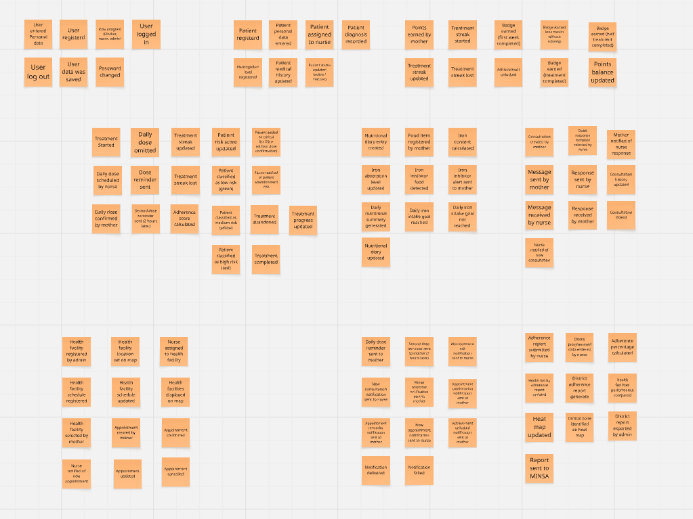

**Paso 2:** Ordenar los eventos del dominio definiendo los timelines.

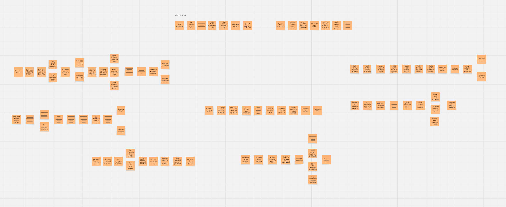

**Paso 3:**  Identificar puntos problemáticos (paint points) en el proceso.

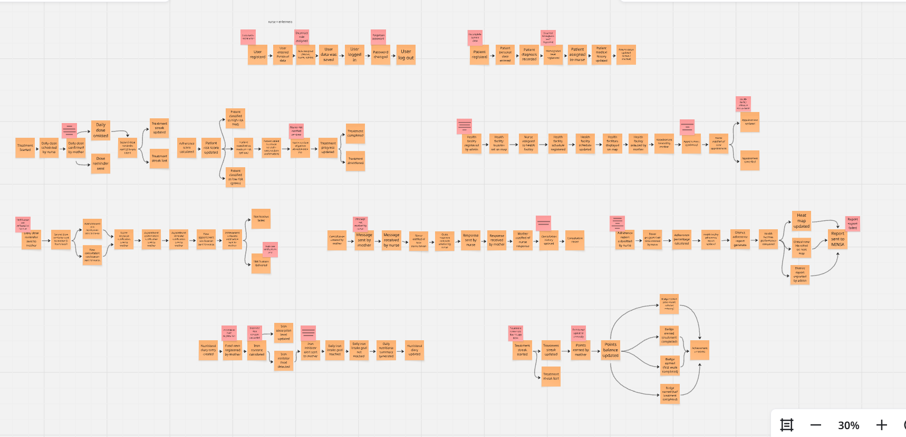

**Paso 4:**  Identificar eventos comerciales importantes (pivotal points) que indiquen un cambio en el contexto o fase del negocio.

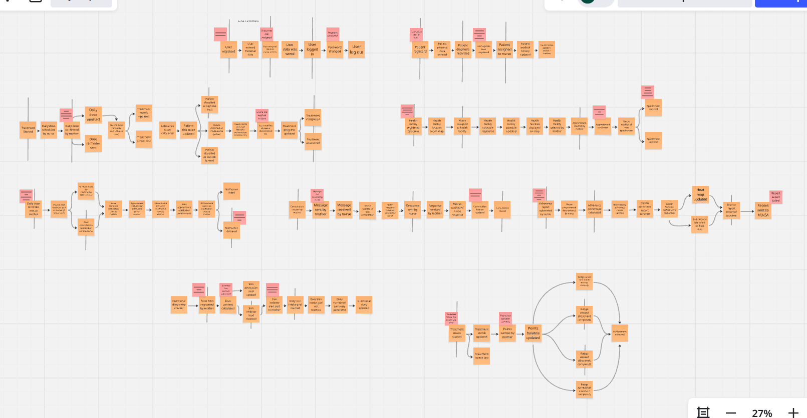

**Paso 5:**  Definir comandos que desencadenan eventos. Tambien definir las politicas que desencadenan la ejecución de comandos.

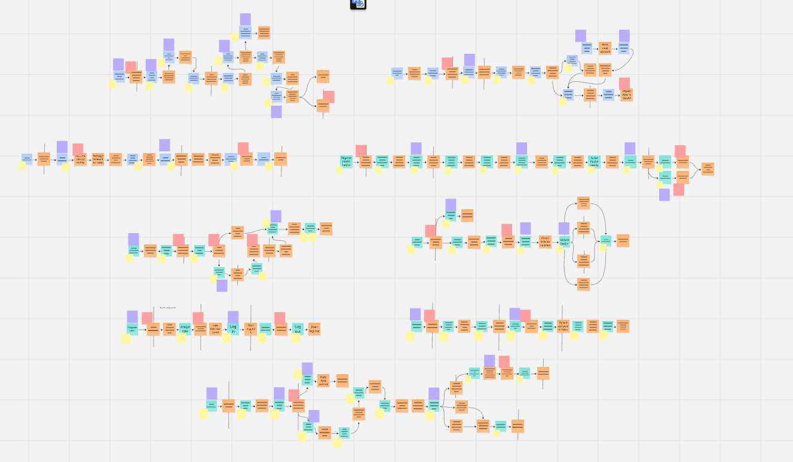

**Paso 6:** Identificar read models, los cuales son modelos de lectura o vistas que los usuarios necesitan para tomar.

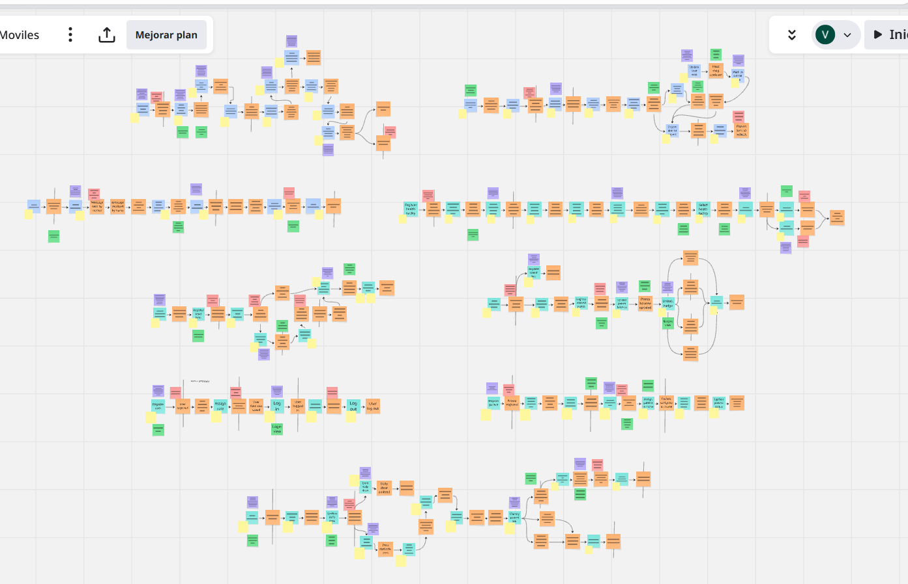

**Paso 7:**  Identificar sistemas externos que se conectan con el dominio.

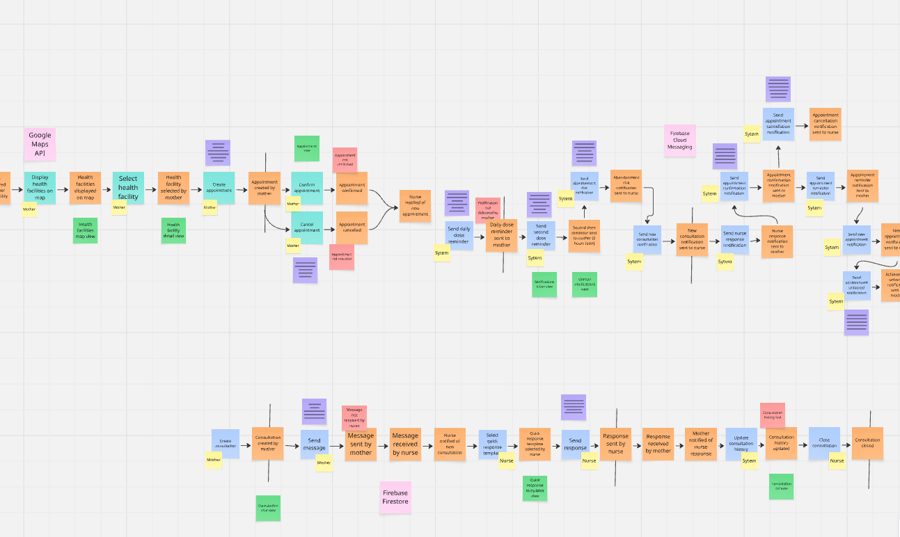

**Paso 8:**  Definir aggregates agrupando comandos y eventos relacionados en unidades lógicas.


##### 2.5.1.1 Candidate Context Discovery

A partir del modelo de Event Storming, se llevo a cabo la seccion Candidate Context Discovery para identificar los bounded context para resolver el subdominio del problema. 

Se utilizó principalmente la técnica look-for-pivotal-events durante la sesión.


Primero, se buscaron eventos clave que indiquen cambios de estado entre diferentes partes del proceso del negocio:

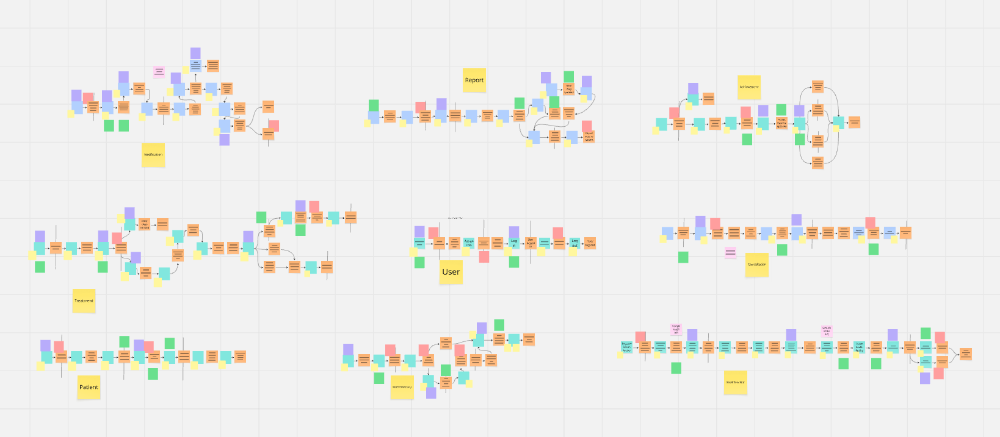

Luego, se agruparon los eventos de acuerdo a los principales cambios de contexto.

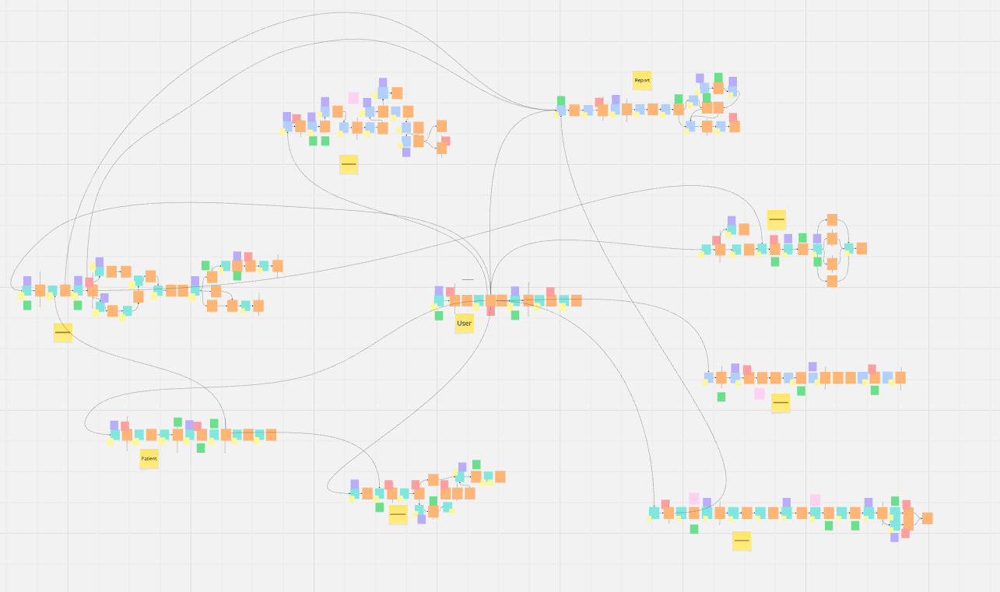

Se trazaron circulos alrededor de los grupos identificados, estableciendo los límites iniciales de los bounded contexts.

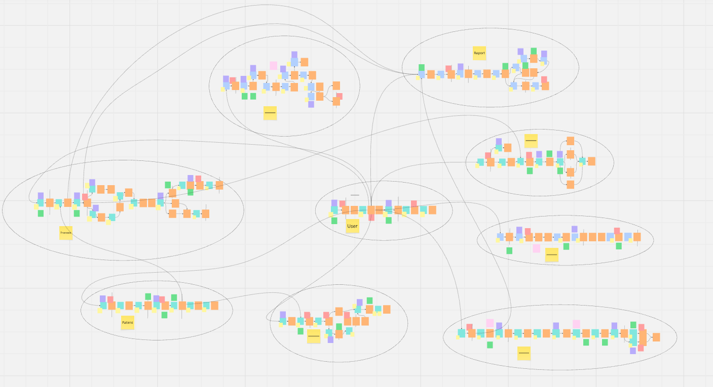

Finalmente, se seleccionaron nombres para los bounded context. Dando como resultado la definición de 9 bounded contexts y la versión final del Event Storming:

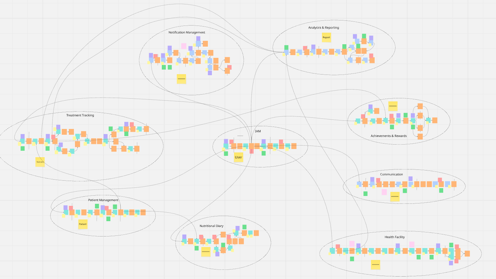

A continuación, se explicará en qué consiste cada bounded context:

#### Identity and Access Management

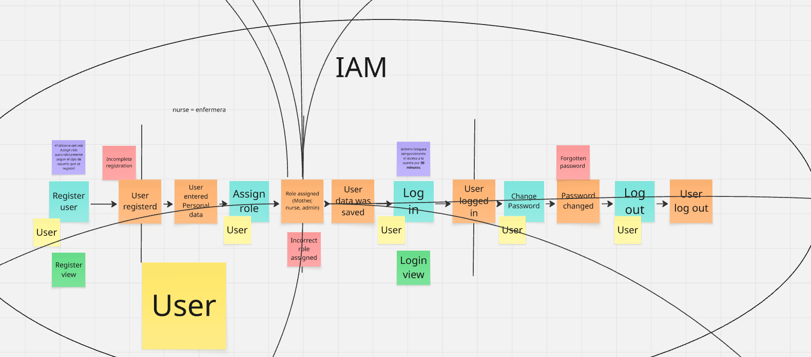

Este bounded context se encarga de gestionar el acceso y la autenticación de los usuarios dentro de la plataforma Ferova. Es responsable del registro de nuevos usuarios, la asignación automática de roles diferenciados como madre, enfermera y administrador, el inicio y cierre de sesión, y el cambio de contraseña. Sin este bounded context ningún usuario puede acceder a las funcionalidades del sistema.


#### Patient Management


Este bounded context se encarga de gestionar toda la información clínica y personal de los pacientes con anemia dentro de Ferova. Es responsable del registro de nuevos pacientes, el ingreso de datos personales, el registro del diagnóstico de anemia, el seguimiento de los niveles de hemoglobina y la asignación de pacientes a una enfermera específica. Es la base sobre la cual los demás bounded contexts operan.

#### Treatment Tracking


Este bounded context se encarga del seguimiento diario del tratamiento de anemia de cada paciente. Es responsable de programar las dosis diarias de hierro, registrar las confirmaciones de la madre, calcular el score de riesgo de abandono, clasificar a los pacientes en un semáforo de riesgo y notificar a la enfermera cuando un paciente está en peligro de abandonar el tratamiento. Es el corazón del problema que Ferova busca resolver.

#### Nutritional Diary


Este bounded context se encarga del registro y análisis del diario nutricional diario del niño con anemia. Es responsable de registrar los alimentos consumidos por el niño, calcular el contenido de hierro absorbido según cada alimento, detectar alimentos inhibidores de la absorción de hierro y enviar alertas a la madre cuando se detecta alguno. Complementa al Treatment Tracking porque una buena alimentación es clave para la recuperación de la anemia.

#### Achievements & Rewards


Este bounded context se encarga de la gamificación del tratamiento de anemia dentro de FerovaFamilia. Es responsable de gestionar las rachas de días consecutivos cumplidos, acumular puntos por cada dosis confirmada, desbloquear insignias al alcanzar hitos importantes del tratamiento y registrar los logros obtenidos por la madre. Su objetivo es motivar a la madre a mantener la constancia en el tratamiento mediante recompensas digitales.

#### Communication

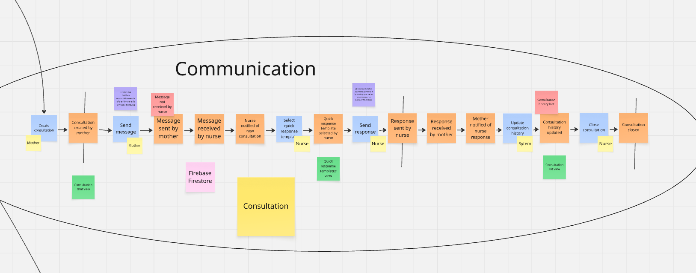

Este bounded context se encarga de la teleconsulta asíncrona entre la madre y la enfermera asignada dentro de Ferova. Es responsable de gestionar la creación de consultas por parte de la madre, el envío y recepción de mensajes, las plantillas de respuesta rápida para la enfermera y el historial completo de consultas por paciente. Los mensajes son almacenados y sincronizados en tiempo real mediante Firebase Firestore.

#### Health Facility


Este bounded context se encarga de la gestión de las postas médicas del distrito, su personal asignado y la reserva de citas. Es responsable del registro de postas médicas con su ubicación en Google Maps, la asignación y transferencia de enfermeras entre postas, el registro de horarios de atención y la reserva y cancelación de citas por parte de las madres. Conecta el mundo digital de Ferova con el mundo físico de las postas médicas del MINSA.

#### Notifications

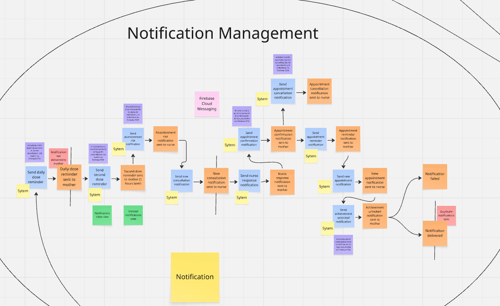

Este bounded context se encarga del sistema de notificaciones inteligentes multicapa de Ferova. Es responsable de enviar recordatorios diarios de dosis a la madre, escalar las alertas a la enfermera cuando la madre no responde, y notificar a ambas partes sobre consultas, citas y logros desbloqueados. Todas las notificaciones son enviadas via Firebase Cloud Messaging garantizando que nadie se quede sin ser avisado cuando algo importante ocurre.


#### Analytics & Reporting


Este bounded context se encarga del dashboard analítico del coordinador MINSA y la generación de reportes del distrito. Es responsable de recibir los reportes de adherencia enviados por las enfermeras, calcular automáticamente el porcentaje de adherencia por posta, generar el mapa de calor del distrito identificando zonas críticas, comparar el rendimiento entre postas y exportar reportes en PDF para ser enviados al MINSA central.

##### 2.5.1.2 Domain Message Flows Modeling

Los Domain Message Flows modelan las interacciones entre los diferentes bounded contexts, mostrando cómo se comunican entre sí mediante comandos, eventos y consultas. A continuación, se muestran los flujos de mensaje para los escenarios clave del negocio:

- <h4>Registro e Inicio de sesion</h4>

<div align="center">

</div>
En este flujo se muestra la interaccion entre el bounded context IAM y los sistemas FerovaFamily y FerovaClinic al momento en que un usuario accede a la plataforma Ferova. La madre se registra desde FerovaFamily enviando sus datos personales mientras que el Admin o Enfermera se registra desde FerovaClinic seleccionando su rol. En ambos casos el bounded context IAM gestiona la autenticacion, asigna el rol correspondiente y almacena los datos del usuario en el sistema. Adicionalmente se muestra el flujo de inicio de sesion donde el usuario envia su DNI y contrasena al Backend System que lo valida contra IAM y retorna el token JWT con el rol asignado.

- <h4>Reserva de cita en posta</h4>

<div align="center">

</div>
 En este flujo se muestra la interaccion entre el bounded context Health Facility, el bounded context Notification, el sistema Google Maps API y Firebase FCM al momento en que el admin registra una posta medica y la madre reserva una cita presencial. El flujo se divide en dos partes. En la primera el admin registra la posta desde FerovaClinic enviando el nombre, direccion, coordenadas y horario de atencion hacia Health Facility que lo registra en Google Maps API y asigna a la enfermera correspondiente a traves de IAM. En la segunda parte la madre accede desde FerovaClinic y solicita ver las postas cercanas enviando sus coordenadas GPS, Health Facility consulta Google Maps API y devuelve la lista de postas disponibles. La madre selecciona la posta y crea su cita con los datos del paciente, la enfermera, la fecha y la hora. Health Facility confirma la cita y dispara el bounded context Notification que via Firebase FCM notifica a la madre con la confirmacion de su cita y a la enfermera con los datos de la nueva cita en su posta.

- <h4>Teleconsulta madre-enfermera</h4>

<div align="center">

</div>

En este flujo se muestra la interaccion entre el bounded context Communication, el bounded context Notification, y los sistemas Firebase Firestore y Firebase FCM al momento en que la madre envia una consulta a su enfermera asignada y recibe una respuesta. El flujo se divide en dos partes. En la primera la madre crea una consulta desde FerovaFamily enviando el patientId, motherId, nurseId y el mensaje hacia el bounded context Communication, que almacena la consulta en Firebase Firestore generando el evento Consultation Created con todos los datos de la consulta. Communication dispara el bounded context Notification que envia el comando Send Consultation Notification via Firebase FCM a FerovaClinic notificando a la enfermera que tiene una nueva consulta pendiente. En la segunda parte la enfermera abre FerovaClinic, lee la consulta y envia su respuesta mediante el comando Send Reply con el consultationId, nurseId y la respuesta. Communication almacena la respuesta en Firebase Firestore y genera el evento Reply Sent. Notification recibe este evento y envia el comando Send Reply Notification via Firebase FCM a FerovaFamily notificando a la madre que su enfermera ya respondio su consulta.

 - <h4>Registro de paciente e asignacion de paciente</h4>

<div align="center">

</div>

En este flujo se muestra la interaccion entre el bounded context Patient Management, el bounded context IAM y los sistemas FerovaFamily y FerovaClinic al momento en que se registra un nuevo paciente y se le asigna una enfermera. El flujo se divide en dos partes. En la primera la madre envia el comando Register Patient desde FerovaFamily con los datos del nino como nombre, apellido, fecha de nacimiento y peso. Patient Management procesa el registro y genera el evento Patient Registered con el patientId y el motherId confirmando que el paciente fue creado correctamente en el sistema. En la segunda parte la enfermera inicia el proceso de busqueda desde FerovaClinic enviando la query Search Patient by DNI con el DNI de la madre hacia el bounded context IAM, que verifica que ese DNI existe como usuario registrado en el sistema. IAM devuelve la confirmacion a Patient Management que ejecuta la query Get Patient y retorna los datos completos del paciente a FerovaClinic incluyendo nombre, apellido, fecha de nacimiento, peso, motherId y telefono de la madre. Finalmente la enfermera envia el comando Assign Patient to Nurse con el patientId y el nurseId y Patient Management genera el evento Patient Assigned to Nurse confirmando la vinculacion del paciente con su enfermera responsable.

 - <h4>Registro de diario Nutricional</h4>
 
<div align="center">

</div>

En este flujo se muestra la interaccion entre el bounded context Nutritional Diary, el bounded context Notification, y los sistemas FerovaFamily, Backend System y Firebase FCM al momento en que la madre registra los alimentos consumidos por su hijo durante el dia. La madre inicia el flujo desde FerovaFamily enviando el comando Create Nutritional Entry con el patientId y la fecha, seguido del comando Register Food Item con el patientId, el alimento y la cantidad. El bounded context Nutritional Diary recibe estos datos y los procesa a traves del Backend System que calcula automaticamente el contenido de hierro de cada alimento generando el evento Iron Content Calculated con el patientId, el alimento, el hierro calculado y el total de hierro del dia. Si el Backend System detecta que algun alimento registrado es un inhibidor de la absorcion de hierro genera el evento Inhibitor Detected con el patientId, el flag isInhibitor, el alimento y el foodInhibitorDetected. Este evento activa el bounded context Notification que envia el comando Send Iron Inhibitor Alert via Firebase FCM a FerovaFamily generando el evento Iron Inhibitor Alert Sent con el mensaje de alerta messageAlertInhibitor para que la madre sea informada en tiempo real del impacto del alimento en el tratamiento de su hijo. Finalmente el Backend System genera el evento Daily Nutritional Summary Generated con el resumen completo del dia incluyendo los alimentos registrados, el hierro calculado y el total de hierro absorbido que se muestra a la madre en FerovaFamily.

- <h4>Generación de reporte del distrito</h4>

<div align="center">

</div>

En este flujo se muestra la interaccion entre el bounded context Analytics & Reporting, el sistema Backend System y Google Maps API al momento en que la enfermera envia su reporte de adherencia semanal y el admin visualiza y exporta el reporte del distrito. El flujo se divide en tres partes. En la primera la enfermera envia el comando Submit Adherence Report desde FerovaClinic con el nurseId, facilityId, total de dosis programadas y el periodo reportado. El Backend System recibe los datos y genera el evento Adherence Report Submitted confirmando el registro del reporte. Luego el Backend System calcula automaticamente el porcentaje de adherencia dividiendo las dosis confirmadas entre las dosis programadas y genera el evento Adherence Percentage Calculated con el facilityId, las dosis confirmadas, las dosis programadas y el porcentaje de adherencia. Analytics & Reporting actualiza el reporte de la posta y genera el evento Health Facility Report Updated con el facilityId, el porcentaje de adherencia y la fecha de actualizacion. En la segunda parte el admin envia el comando View District Dashboard con el districtId desde FerovaClinic hacia Analytics & Reporting que genera el evento District Report Generated con el porcentaje de adherencia por posta, la comparativa entre postas y las zonas criticas identificadas. Paralelamente el Sistema Backend envia el comando Generate Heat Map a Google Maps API con el districtId y las coordenadas de las postas, y Google Maps API genera el evento Heat Map Updated coloreando cada posta segun su nivel de adherencia en rojo para zonas criticas, amarillo para riesgo medio y verde para adherencia alta. En la tercera parte el admin envia el comando Export District Report con el districtId y el formato PDF y el Sistema Backend genera el evento District Report Exported con el archivo PDF completo listo para enviarlo al MINSA central.

- <h4>Confirmacion e inicio del tratamiento de dosis</h4>

<div align="center">

</div>

 En este flujo se muestra la interaccion entre el bounded context Treatment Tracking, el bounded context Achievements & Rewards, el bounded context Notification y los sistemas FerovaClinic, FerovaFamily y Firebase FCM al momento en que la enfermera inicia el tratamiento de un paciente y la madre confirma la dosis diaria. El flujo se divide en dos partes. En la primera la enfermera envia el comando Start Treatment desde FerovaClinic con el patientId, nurseId, suplemento, cantidad, hora de dosis y duracion del tratamiento en dias. El bounded context Treatment Tracking procesa el comando y genera el evento Treatment Started con el treatmentId, patientId, dosingHours, suplemento, cantidad, fecha de inicio y fecha de fin del tratamiento, activando automaticamente los recordatorios diarios en FerovaFamily. En la segunda parte la madre envia el comando Confirm Daily Dose desde FerovaFamily con el treatmentId, patientId y la fecha de confirmacion hacia Treatment Tracking. Este genera el evento Daily Dose Confirmed con el treatmentId, patientId, la racha actualizada y el score de adherencia del paciente. Treatment Tracking notifica al bounded context Achievements & Rewards que genera el evento Treatment Streak Updated con el patientId, los dias consecutivos cumplidos y los puntos ganados. Achievements & Rewards envia el comando Send Achievement Notification al bounded context Notification con el patientId y el tipo de logro alcanzado. Finalmente Notification genera el evento Notification Sent via Firebase FCM a FerovaFamily con el mensaje celebratorio y la insignia desbloqueada para que la madre vea su progreso en tiempo real.

- <h4>Confirmacion de dosis diaria</h4>

<div align="center">

</div>

En este flujo se muestra la interaccion entre el bounded context Treatment Tracking, el bounded context Notification y los sistemas Backend System, FerovaFamily, FerovaClinic y Firebase FCM al momento en que la madre no confirma la dosis diaria y el sistema escala automaticamente las alertas. El flujo inicia cuando el Backend System detecta que la madre no confirmo la dosis en el tiempo establecido y genera el evento Daily Dose Omitted con el treatmentId, patientId y la fecha de omision. Treatment Tracking recibe este evento y actualiza automaticamente el score de riesgo del paciente generando el evento Risk Score Updated con el patientId, el riskScore y la clasificacion del semaforo en rojo, amarillo o verde. Paralelamente Treatment Tracking envia el comando Send First Reminder con el patientId y la hora del primer recordatorio al bounded context Notification, que genera el evento First Reminder Sent via Firebase FCM a FerovaFamily con el mensaje de recordatorio de dosis para la madre. Si la madre no responde al primer recordatorio despues de 2 horas, Treatment Tracking envia el comando Send Second Reminder con el patientId y la hora del segundo recordatorio a Notification que genera el evento Send Second Reminder via Firebase FCM con un mensaje mas urgente a FerovaFamily. Si el paciente llega a las 72 horas sin confirmar su dosis el Backend System genera el evento Patient Added to Critical List con el patientId, las horas sin confirmacion y el riskScore. Treatment Tracking envia el comando Send Abandonment Alert al bounded context Notification con el patientId, el score de riesgo y las horas sin dosis. Notification genera el evento Abandonment Alert Sent to Nurse via Firebase FCM a FerovaClinic con el messageAlert y el scoreRisk para que la enfermera tome accion inmediata sobre el paciente en riesgo de abandono.

##### 2.5.1.3 Bounded Context Canvases

Para mejorar la organización del dominio y facilitar una comunicación consistente, se elaboraron Bounded Context Canvases para cada subdominio. Estos canvases delimitan claramente las responsabilidades, establecen el lenguaje ubicuo y los modelos clave, y describen los puntos de integración y los flujos de mensajes entre contextos. Los diagramas que siguen consolidan estas decisiones y sirvieron como guía para alinear la arquitectura, las interfaces y la evolución del sistema.

- **Identity and Access Management**

<div align="center">

</div>

- **Patient Management**

<div align="center">

</div>

- **Treatment Tracking**

<div align="center">

</div>

- **Nutritional Diary**

<div align="center">

</div>

- **Notification**

<div align="center">

</div>

- **Comunication**

<div align="center">

</div>

- **Health Facility**

<div align="center">

</div>

- **Achievements & Rewards**

<div align="center">

</div>

- **Analytics & Reporting**

<div align="center">

</div>

#### 2.5.2 Context Mapping

En esta sección se explica el proceso de elaboración de los contexts maps. Asimismo, se permite la
visualizacón de las relaciones estructurales entre bounded contexts, junto a los patrones de relaciones
entre Bounded contexts establecidos en Domain Driven Design, como Anti-corruption Layer,
Conformist, Customer/Supplier ó Shared Kernel

##### IAM → Patient Management

<div align="center">

</div>

**Patron: Customer / Supplier**

En esta relacion Identity and Access Management (IAM) actua como el upstream (U) y Patient Management actua como el downstream (D).
IAM es el proveedor porque es el bounded context que gestiona todos los usuarios registrados en la plataforma Ferova. Cuando la enfermera busca a un paciente por el DNI de la madre, Patient Management necesita primero consultar a IAM para verificar que ese DNI existe como usuario registrado en el sistema. De esta manera IAM influye directamente sobre Patient Management ya que sin la validacion del usuario no es posible encontrar ni asignar al paciente.
Patient Management es el cliente porque depende completamente de IAM para poder operar. Si IAM no valida la existencia del usuario, Patient Management no puede devolver ningun dato del paciente a la enfermera en FerovaClinic.

##### IAM → Treatment Tracking

<div align="center">

</div>

**Patron: Customer / Supplier**

En esta relacion Identity and Access Management (IAM) actua como el upstream (U) y Treatment Tracking actua como el downstream (D).
IAM es el proveedor porque es el bounded context que valida que el usuario autenticado tiene el rol correcto antes de permitir cualquier operacion sobre el tratamiento. Cuando la enfermera intenta iniciar un tratamiento desde FerovaClinic o la madre intenta confirmar una dosis desde FerovaFamilia, Treatment Tracking necesita que IAM confirme que el token JWT del usuario es valido y que su rol es el correcto para realizar esa accion.
Treatment Tracking es el cliente porque no puede ejecutar ninguna operacion de tratamiento sin que IAM primero autorice al usuario. Si IAM rechaza el token o detecta que el usuario no tiene el rol adecuado, Treatment Tracking no puede proceder con la confirmacion de dosis ni con el inicio del tratamiento.

##### Treatment Tracking → Achievements & Rewards

<div align="center">

</div>

**Patron: Customer / Supplier**

En esta relacion Treatment Tracking actua como el upstream (U) y Achievements & Rewards actua como el downstream (D).
Treatment Tracking es el proveedor porque es el bounded context que genera los eventos que activan toda la logica de gamificacion. Cada vez que la madre confirma una dosis diaria desde FerovaFamilia, Treatment Tracking dispara el evento Daily Dose Confirmed con la informacion del paciente, el tratamiento y la racha actualizada. Sin ese evento Achievements & Rewards no tiene manera de saber que ocurrio algo relevante en el sistema.
Achievements & Rewards es el cliente porque depende completamente de los eventos que genera Treatment Tracking para poder funcionar. No decide por si solo cuando actualizar la racha, sumar puntos o desbloquear una insignia. Espera pasivamente el evento del upstream y reacciona en consecuencia. Si Treatment Tracking dejara de enviar eventos, Achievements & Rewards quedaria completamente inactivo sin importar lo que la madre haga en la app.

#####  Treatment Tracking → Notifications

<div align="center">

</div>

**Patron: Customer / Supplier**

En esta relacion Treatment Tracking actua como el upstream (U) y Notifications actua como el downstream (D).
Treatment Tracking es el proveedor porque es el bounded context que detecta los eventos criticos del tratamiento y ordena a Notifications que actue. Cuando un paciente lleva 72 horas sin confirmar su dosis, Treatment Tracking genera el evento Patient Added to Critical List con el ID del paciente, el ID de la enfermera y las horas sin confirmacion. Tambien genera el evento Treatment Completed cuando la enfermera cierra exitosamente un tratamiento. En ambos casos Treatment Tracking es quien tiene la informacion y quien decide que algo importante ocurrio.
Notifications es el cliente porque no tiene logica propia para detectar cuando enviar una alerta. Simplemente espera los eventos del upstream y los convierte en notificaciones push via Firebase FCM dirigidas al usuario correcto. Si Treatment Tracking no le indica que un paciente esta en riesgo, Notifications nunca enviaria la alerta de abandono a la enfermera en FerovaClinic ni el mensaje celebratorio a la madre cuando completa el tratamiento.


#####  Nutritional Diary → Notifications

<div align="center">

</div>

**Patron: Customer / Supplier**

En esta relacion Nutritional Diary actua como el upstream (U) y Notifications actua como el downstream (D).
Nutritional Diary es el proveedor porque es el bounded context que tiene la logica de deteccion de alimentos inhibidores de la absorcion de hierro. Cuando la madre registra un alimento desde FerovaFamilia, Nutritional Diary procesa la lista predefinida de inhibidores en MongoDB y si detecta uno como leche, te o cafe genera el evento Iron Inhibitor Detected con el ID del paciente, el ID de la madre y el mensaje de alerta predefinido messageAlertInhibitor. Sin ese evento Notifications no tiene manera de saber que la madre registro un alimento que perjudica la absorcion del suplemento de hierro.
Notifications es el cliente porque depende completamente del evento que genera Nutritional Diary para saber cuando y a quien enviar la alerta de inhibidor. No tiene acceso a la lista de alimentos ni puede detectar inhibidores por si mismo. Simplemente recibe el evento del upstream y lo convierte en una alerta visible inmediatamente en FerovaFamilia para educar a la madre en tiempo real sobre el impacto del alimento en el tratamiento de su hijo

#####  Communication → Notifications


<div align="center">

</div>

**Patron: Customer / Supplier**

En esta relacion Communication actua como el upstream (U) y Notifications actua como el downstream (D).
Communication es el proveedor porque es el bounded context que gestiona toda la logica de la teleconsulta entre la madre y la enfermera. Cuando la madre crea una nueva consulta desde FerovaFamilia, Communication almacena el mensaje en Firebase Firestore y genera el evento Consultation Created con el ID de la enfermera y el ID de la consulta. De igual manera cuando la enfermera responde desde FerovaClinic, Communication genera el evento Reply Sent con el ID de la madre y el ID de la consulta. En ambos casos Communication es quien tiene el conocimiento de que ocurrio una interaccion importante entre los dos usuarios.
Notifications es el cliente porque no tiene visibilidad sobre lo que ocurre dentro del canal de teleconsulta. No sabe cuando una madre escribio una consulta ni cuando una enfermera respondio. Depende completamente de los eventos que genera Communication para saber a quien notificar y con que mensaje. Sin esos eventos la enfermera nunca sabria que tiene una consulta pendiente en FerovaClinic y la madre nunca sabria que su enfermera ya le respondio en FerovaFamilia.

#####   Health Facility → Notifications

<div align  = "center">

</div>

**Patron: Customer / Supplier**

En esta relacion Health Facility actua como el upstream (U) y Notifications actua como el downstream (D).
Health Facility es el proveedor porque es el bounded context que gestiona toda la logica de reserva y cancelacion de citas en las postas medicas del distrito. Cuando la madre reserva una cita desde FerovaFamilia, Health Facility verifica la disponibilidad del horario, confirma la reserva y genera el evento Appointment Confirmed con el ID del paciente, el ID de la madre, el ID de la enfermera, la fecha, la hora y el nombre de la posta medica. De igual manera cuando la madre cancela una cita, Health Facility libera el horario y genera el evento Appointment Cancelled con el ID de la enfermera y los detalles de la cita cancelada. En ambos casos Health Facility es quien tiene el conocimiento completo de lo que ocurrio con la cita.
Notifications es el cliente porque no tiene acceso a la informacion de las postas ni a la logica de reserva de citas. No puede detectar por si mismo cuando una cita fue confirmada o cancelada. Depende completamente de los eventos que genera Health Facility para saber a quien notificar y con que informacion. Sin esos eventos la madre nunca recibiria la confirmacion de su cita en FerovaFamilia y la enfermera nunca sabria que una madre reservo o cancelo una cita en su posta medica en FerovaClinic.

#####   Treatment Tracking → Analytics & Reporting

<div align  = "center">

</div>

**Patron: Customer / Supplier**

En esta relacion Treatment Tracking actua como el upstream (U) y Analytics & Reporting actua como el downstream (D).
Treatment Tracking es el proveedor porque es el bounded context que genera los datos de abandono del tratamiento que alimentan las estadisticas del distrito. Cuando la enfermera registra formalmente el abandono de un tratamiento desde FerovaClinic, Treatment Tracking genera el evento Treatment Abandoned con el ID del paciente, el ID de la posta medica y la fecha de abandono. Este evento es la fuente de informacion que permite a Analytics & Reporting calcular la tasa de abandono por posta, identificar las zonas criticas del distrito y actualizar el mapa de calor con los datos mas recientes.
Analytics & Reporting es el cliente porque no puede generar por si mismo las estadisticas de abandono sin los datos que provee Treatment Tracking. No tiene acceso directo al estado de los tratamientos ni puede detectar cuando un paciente abandono. Depende completamente del evento del upstream para actualizar las metricas del distrito. Sin ese evento el dashboard analitico del admin MINSA en FerovaClinic mostraria datos incompletos y el mapa de calor no reflejaria correctamente las zonas con mayor tasa de abandono del tratamiento de anemia.

#####   Health Facility → Analytics & Reporting

<div align  = "center">

</div>

**Patron: Customer / Supplier**

En esta relacion Health Facility actua como el upstream (U) y Analytics & Reporting actua como el downstream (D).
Health Facility es el proveedor porque es el bounded context que gestiona la informacion geografica y organizacional de todas las postas medicas del distrito. Cuando el admin registra una posta desde FerovaClinic, Health Facility almacena sus coordenadas exactas en Google Maps API, su nombre, su direccion y su horario de atencion. Esta informacion geografica es fundamental para que Analytics & Reporting pueda generar el mapa de calor del distrito correctamente, ya que necesita las coordenadas de cada posta para colorearla segun su porcentaje de adherencia y mostrarla en la posicion correcta del mapa.
Analytics & Reporting es el cliente porque no puede generar el mapa de calor del distrito sin la informacion de ubicacion de las postas que provee Health Facility. No tiene acceso directo a las coordenadas geograficas ni a la lista de postas del distrito. Depende completamente de los datos del upstream para poder colorear cada posta en el mapa segun su nivel de adherencia. Sin esa informacion el admin MINSA veria un dashboard analitico con estadisticas pero sin la visualizacion geografica del mapa de calor que le permite identificar rapidamente las zonas criticas del distrito.

##### Final Context Map

<div align  = "center">

</div>

#### 2.5.3 Software Architecture

Para representar la arquitectura de software de Ferova se aplica el C4 Model,
utilizando Structurizr como herramienta de modelado. Este modelo permite
describir la arquitectura en niveles progresivos de detalle, desde una vista
general de contexto hasta la descomposición interna de cada contenedor.

##### 2.5.3.1 Software Architecture Context Level Diagrams
 > El siguiente diagrama muestra a Ferova como sistema central, rodeado por
los tres actores que interactúan con él y los sistemas externos con los que
se integra.

<div align = "center">
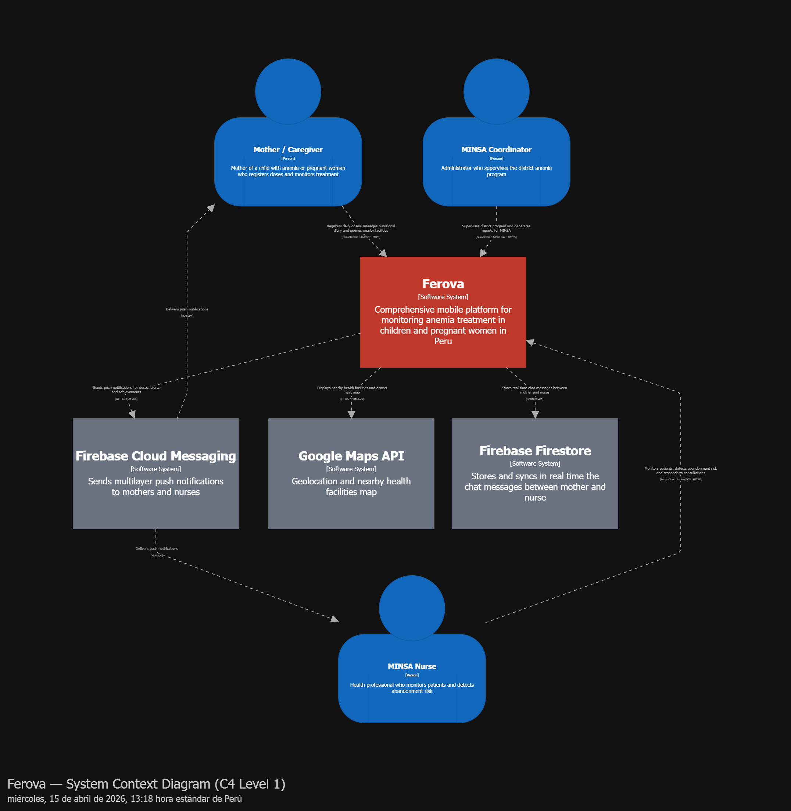
</div>

##### 2.5.3.2 Software Architecture Container Level Diagrams
> El siguiente diagrama presenta la descomposición interna de Ferova en sus
contenedores principales, mostrando las responsabilidades de cada uno y
cómo se comunican entre sí.

<div align  = "center">
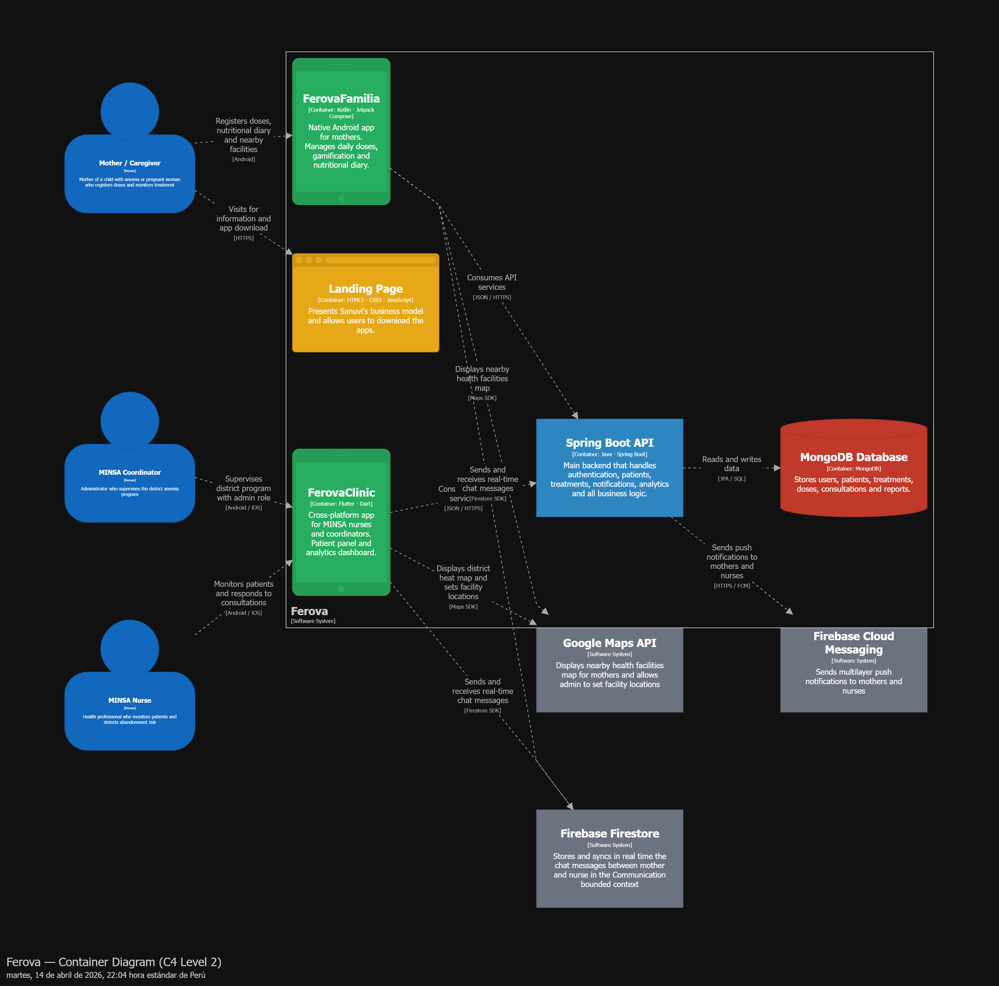
</div>

El Container Diagram descompone Ferova en: un Landing Page estático,
dos apps móviles (FerovaFamilia en Android nativo para madres y
FerovaClinic en Flutter para enfermeras y coordinadores), un backend
Spring Boot API que centraliza toda la lógica de negocio distribuida
en los nueve bounded contexts (IAM, Patient Management, Treatment
Tracking, Nutritional Diary, Achievements & Rewards, Communication,
Notifications, Health Facility y Analytics & Reporting), la persistencia
en MongoDB y las integraciones con servicios externos.

**Decisiones tecnológicas principales**

- **Mobile first:** Android nativo (Kotlin + Jetpack Compose) para
madres en FerovaFamilia; Flutter (Dart) para enfermeras y coordinadores
en FerovaClinic con acceso diferenciado por rol.
- **Backend:** Java + Spring Boot como API REST centralizada que agrupa
la lógica de los nueve bounded contexts.
- **Persistencia:** MongoDB — esquema flexible para el registro de
pacientes, tratamientos, dosis y diario nutricional.
- **Integraciones:** Google Maps SDK (geolocalización de postas),
Firebase FCM (notificaciones push multicapa), Firebase Firestore
(chat en tiempo real madre-enfermera).
- **Autenticación:** IAM emite tokens JWT; los servicios los validan
localmente para evitar consultas síncronas constantes entre
bounded contexts.

##### 2.5.3.3 Software Architecture Deployment Diagrams

> El siguiente diagrama muestra cómo los componentes de Ferova se distribuyen
en la infraestructura de despliegue real. Se visualizan los entornos de
ejecución de cada producto, las dependencias entre servicios y las
integraciones con plataformas externas.

<div align  = "center">

</div>

### 2.6 Tactical-Level Domain-Driven Design
#### 2.6.1. Bounded Context: `Identify and Access Management`

El Bounded Context de Identify and Access Management (IAM) se encarga de gestionar la identidad de los usuarios y el control de acceso al sistema, incluyendo procesos como registro, autenticación y autorización.

Este contexto se organiza siguiendo una arquitectura por capas basada en Domain-Driven Design (DDD). El Domain Layer contiene las reglas de negocio, el Interface Layer gestiona la interacción con el usuario, el Application Layer coordina los procesos y el Infrastructure Layer maneja la parte técnica y las integraciones externas.

Además, se presentan diagramas a nivel de componentes y de código para describir la estructura y el diseño del sistema.

##### 2.6.1.1. Domain Layer

En esta sección se definen las clases que representan el núcleo del Bounded Context Identity and Access Management (IAM), encargadas de gestionar la identidad de los usuarios, su autenticación y la asignación de roles dentro del sistema.

###### Aggregates

| Aggregate Root | Propósito | Atributos | Métodos | Reglas de Negocio |
| :--- | :--- | :--- | :--- | :--- |
| **User** | Gestiona la identidad, autenticación y acceso de los distintos perfiles (Madre, Enfermera, Admin) en la plataforma Ferova. | • **id**: `String (UUID)`<br>• **name**: `String`<br>• **lastName**: `String`<br>• **password**: `Hash`<br>• **roleName**: `Role`<br>• **dni**: `DNI`<br>• **phone**: `Phone`<br>• **email**: `Email` | • `registerUser()`<br>• `login()`<br>• `changePassword()`<br>• `assignRole(roleName)`<br>• `displayUserData()` | • El **DNI** debe ser único y no puede estar vacío.<br>• La **password** siempre va cifrada.<br>• Todo usuario debe tener un **rol** asignado.<br>• No se permite autenticación sin credenciales válidas. |

###### Entities

| Entidad     | Propósito | Atributos | Métodos | Reglas y Relaciones |
| :--- | :--- | :--- | :--- | :--- |
| **Role** | Define los niveles de acceso permitidos en el sistema (Madre, Enfermera, Admin). | • **name**: `String`<br>*(Mother, Nurse, Admin)* | • `getRoleName()`: **String** <br>• `getDefaultRole()`:**Role**<br>• `toRoleFromName(String name)`:**Role** | • **Relación**: 1 Role → N Usuarios.<br>• **Regla**: Un usuario solo puede tener un rol asignado a la vez. |

###### Value Object

| Value Object | Propósito | Reglas de Validación (Invariantes) | Comportamiento |
| :--- | :--- | :--- | :--- |
| **Password** | Encapsula la seguridad de acceso del usuario. | • No puede ser texto plano.<br>• Debe cumplir políticas de complejidad. | • Generación de Hash.<br>• Verificación de coincidencia. |
| **DNI** | Identificación oficial del usuario. | • Debe tener exactamente **8 dígitos**.<br>• Solo caracteres numéricos. | • Validación de formato.<br>• Comparación por valor. |
| **Phone** | Medio de contacto y comunicación. | • Formato telefónico válido.<br>• No puede estar vacío si es requerido. | • Normalización de número.<br>• Validación de país/prefijo. |
| **Email** | Dirección de correo para notificaciones y recuperación. | • Debe tener un formato válido (`ejemplo@correo.com`).<br>• No puede estar vacío. | • Validación de sintaxis.<br>• Conversión a minúsculas (normalización). |

###### Domain Services

| Domain Service | Propósito Principal | Responsabilidades Clave |
| :--- | :--- | :--- |
| **AuthenticationService** | Gestionar la identidad y el acceso seguro. | • Validar credenciales de inicio de sesión.<br>• Comparar el hash de la contraseña.<br>• Generar tokens de acceso. |
| **PasswordPolicyService** | Garantizar la robustez de la seguridad. | • Definir longitud mínima y caracteres especiales.<br>• Validar que la contraseña no sea débil.<br>• Verificar políticas de renovación. |
| **RoleAssignmentService** | Controlar la jerarquía y permisos del sistema. | • Asignar roles automáticos al registrarse.<br>• Validar permisos para cambiar de rol.<br>• Asegurar que cada usuario tenga un rol válido. |

###### Repositories (Interfaces en Domain)

| Repository (Interfaz) | Propósito | Métodos de Consulta (Lectura) | Métodos de Persistencia (Escritura) |
| :--- | :--- | :--- | :--- |
| **UserRepository** | Gestionar el acceso a los datos de los usuarios en el sistema. | • `findByUsername(dni: String)`<br>• `existsByUsername(dni: String)`<br>• `findRoleByUsername(dni: String)` | • `save(user)`<br>• `deleteByUsername(dni: String)` |
| **RoleRepository** | Administrar el catálogo de roles y sus permisos asociados. | • `findByName(name)`<br>• `getDefault()` | • `save(role)` |

###### Domain Events

| Evento de Dominio | ¿Cuándo ocurre? | Acción que lo dispara |
| :--- | :--- | :--- |
| **UserRegistered** | Cuando un nuevo usuario se crea exitosamente. | El proceso de registro ha terminado. |
| **UserLoggedIn** | Cuando un usuario entra al sistema con éxito. | El servicio de autenticación valida las credenciales. |
| **UserPasswordChanged** | Cuando se actualiza la clave de seguridad. | El usuario confirma su nueva contraseña. |
| **UserRoleAssigned** | Cuando se otorga o cambia un nivel de acceso. | El administrador o el sistema asigna un rol (Madre, Enfermera, Admin). |

##### 2.6.1.2. Interface Layer

En esta capa se definen los puntos de entrada y salida del sistema, permitiendo la interacción entre los usuarios y la aplicación mediante endpoints REST. Su función principal es recibir las solicitudes externas, transformarlas en comandos o consultas hacia el Application Layer, y devolver respuestas en formato adecuado.

###### Controllers (REST)

| Controlador (REST) | Método HTTP | Ruta (Endpoint) | Propósito / Acción |
| :--- | :--- | :--- | :--- |
| **AuthController** | `POST` | `/api/v1/auth/login` | Autentica al usuario con DNI y contraseña; entrega un token. |
| | `POST` | `/api/v1/auth/logout` | Cierra la sesión e invalida el token actual. |
| | `POST` | `/api/v1/auth/reset-password` | Restablece la contraseña olvidada usando un código de verificación. |
| **UserController** | `POST` | `/api/v1/users` | Registra un nuevo usuario con el rol por defecto. |
| | `GET` | `/api/v1/users/{dni}` | Obtiene la información detallada de un usuario por su DNI. |
| | `PUT` | `/api/v1/users/{dni}` | Actualiza datos (nombre, teléfono). |
| **RoleController** | `GET` | `/api/v1/roles` | Muestra la lista de todos los roles (Madre, Enfermera, Admin). |
| | `GET` | `/api/v1/roles/{name}` | Obtiene los detalles de un rol específico por su nombre. |

###### Resources (DTOs / Request & Response Models)

#### **1. LoginRequest**
**Propósito:** Envía las credenciales (DNI y contraseña) para iniciar sesión.

```json
{
  "dni": "12345678",
  "password": "string"
}
```

#### **2. TokenResponse**
**Propósito:** Devuelve las llaves de acceso (tokens) tras una autenticación válida.
```json
{
  "accessToken": "string",
  "refreshToken": "string"
}
```

#### **3. CreateUserRequest**
**Propósito:** Formulario con los datos necesarios para registrar a un nuevo usuario.
```json
{
  "dni": "12345678",
  "name": "Juan",
  "lastName": "Perez",
  "phone": "987654321",
  "email": "user@ejemplo.com",
  "password": "string"
}
```

#### **4. UserResource**
**Propósito:** Información del perfil del usuario que el sistema muestra públicamente.
```json
{
  "dni": "12345678",
  "name": "Juan",
  "lastName": "Perez",
  "phone": "987654321",
  "email": "user@ejemplo.com",
  "roleName": "Mother"
}
```

#### **5. ResetPasswordRequest**
**Propósito:** Permite restablecer la contraseña de un usuario mediante un código de verificación enviado previamente.
```json
{
  "email": "user@gmail.com",
  "newPassword": "string",
  "verificationCode": "123456"
}
```

#### **6. RoleResource**
**Propósito:** Muestra el nombre del rol asignado al usuario.
```json
{
  "name": "Mother"
}
```
###### Assemblers / Mappers

| Assembler / Mapper | Dirección de la Traducción | Propósito |
| :--- | :--- | :--- |
| **CreateUserCommandFromResourceAssembler** | `CreateUserRequest` → `CreateUserCommand` | Convierte el formulario de registro externo en un comando formal para el dominio. |
| **UserResourceFromEntityAssembler** | `User (Entity)` → `UserResource` | Transforma la entidad del dominio en un recurso seguro para ser enviado al cliente. |
| **ChangePasswordCommandFromResourceAssembler** | `ChangePasswordRequest` → `ChangePasswordCommand` | Traduce la petición de cambio de clave en una instrucción ejecutable por el negocio. |
| **AssignRoleCommandFromResourceAssembler** | `Entrada de datos` → `AssignRoleCommand` | Mapea la solicitud de asignación de nivel en un comando de cambio de rol. |

##### 2.6.1.3. Application Layer

En esta capa se coordinan los casos de uso del sistema relacionados con la gestión de usuarios. Su responsabilidad es orquestar las operaciones entre el Interface Layer y el Domain Layer, ejecutando comandos y consultas sin contener lógica de negocio.

###### Command Handlers

| Handler | Propósito | Responsabilidades (Flujo de Trabajo) |
| :--- | :--- | :--- |
| **CreateUserCommandHandler** | Gestionar el registro de nuevos usuarios. | • Validar unicidad del DNI (`existsByDni`).<br>• Aplicar políticas de seguridad de contraseña.<br>• Cifrar la contraseña.<br>• Asignar el rol por defecto (**Mother**).<br>• Persistir al usuario en el repositorio. |
| **LoginUserCommandHandler** | Autenticar a los usuarios en el sistema. | • Buscar al usuario por su DNI.<br>• Validar que la contraseña coincida con el Hash guardado.<br>• Generar y retornar el token de acceso (JWT). |
| **ResetPasswordCommandHandler** | Restablecer claves mediante correo electrónico. | • Verificar la existencia del usuario por su **Email**.<br>• Validar la identidad (comparar código de verificación).<br>• Aplicar políticas de robustez a la nueva clave.<br>• Encriptar y guardar los cambios. |

###### Query Handlers

| Handler | Propósito | Responsabilidades |
| :--- | :--- | :--- |
| **GetUserByDniQueryHandler** | Obtener la información de un usuario específico. | • Buscar al usuario en el repositorio usando su **DNI**.<br>• Retornar los datos encontrados para ser transformados en recurso. |
| **ListRolesQueryHandler** | Listar todos los roles disponibles en el panal. | • Consultar al repositorio de roles.<br>• Retornar la colección completa de roles (Mother, Nurse, Admin). |

###### Event Handlers.

| Event Handler | Evento al que Reacciona | Responsabilidades (Acciones) |
| :--- | :--- | :--- |
| **OnUserRegistered** | `UserRegisteredEvent` | • Registrar una auditoría (anotar que alguien nuevo llegó).<br>• Enviar una notificación de bienvenida (opcional). |
| **OnUserLoggedIn** | `UserLoggedInEvent` | • Registrar el acceso al sistema (saber quién entró y a qué hora).<br>• Monitorear la seguridad de la cuenta. |
| **OnPasswordReset** | `PasswordResetEvent` | • Registrar el cambio de contraseña en el historial. |


##### 2.6.1.4. Infrastructure Layer

En esta capa se implementan los detalles técnicos del sistema, incluyendo la persistencia de datos, la seguridad, la gestión de autenticación y la integración con servicios externos. Aquí se concretan las interfaces definidas en el Domain Layer.

###### Persistence Layer (Infraestructura - MongoDB)

| Componente | Tipo | Responsabilidades |
| :--- | :--- | :--- |
| **MongoUserRepository** | Repositorio | • Implementa `UserRepository`.<br>• Mapeo entre Entity y Documento de Mongo.<br>• Operaciones CRUD (Buscar por DNI/Email, Guardar, Eliminar). |
| **MongoRoleRepository** | Repositorio | • Implementa `RoleRepository`.<br>• Obtener roles por nombre y rol por defecto.<br>• Inicializar el catálogo de roles (Mother, Nurse, Admin). |
| **Persistence Mapper** | Mapper | • **Document ↔ Entity**: Encargado de transformar los datos del formato de base de datos al formato del dominio. |

###### Seguridad y Comunicación (Infraestructura)

| Componente | Tipo | Funciones / Responsabilidades |
| :--- | :--- | :--- |
| **PasswordHasher** | Seguridad | • **BCryptPasswordHasher**: Encripta las contraseñas para que nunca se guarden como texto plano.<br>• Compara claves ingresadas con sus versiones cifradas. |
| **JwtTokenProvider** | Seguridad | • **Generar accessToken**: Crea la "llave mágica" para el usuario.<br>• **Validar token**: Revisa que la llave no haya caducado o sea falsa.<br>• **Extraer datos**: Lee quién es el dueño del token. |
| **EmailService** | Comunicación | • **Enviar código**: Manda la clave secreta de verificación al correo.<br>• **Enviar enlace**: Crea y manda el link seguro para recuperar la cuenta. |

###### Configuración (Infraestructura)

| Componente | Tipo | Responsabilidades / Ajustes |
| :--- | :--- | :--- |
| **MongoConfig** | Base de Datos | • Configurar la conexión al servidor de MongoDB.<br>• Definir **Índices** obligatorios (DNI único, Email único) para evitar duplicados. |
| **SecurityConfig** | Seguridad | • Configurar el soporte para **JWT**.<br>• Definir filtros de autenticación (quién puede entrar a qué ruta).<br>• Configurar **CORS** y reglas generales de seguridad web. |

###### Modelo de datos (MongoDB) y mapeos

<h4> Colección: users </h4> 

```json
{
  "_id": "u:12345678",
  "dni": "12345678",
  "name": "Maria",
  "lastName": "Perez",
  "email": "Maria@gmail.com",
  "phone": "987654321",
  "password": "hash:$2b$...",
  "roleName": "Mother",
  "audit": {
    "createdAt": "2026-01-01T00:00:00Z",
    "updatedAt": "2026-01-01T00:05:00Z"
  }
}
```
Índices:
- único en `dni`
- único en `email`

<h4> Colección: roles</h4> 

```json
{
  "_id": "r:Mother",
  "name": "Mother"
}
```
Seed inicial:

- Mother
- Nurse
- Admin

<h4> Colección: password_resets</h4> 

```json
{
  "_id": "pr:uuid",
  "email": "user@gmail.com",
  "code": "123456",
  "expiresAt": "2026-01-01T01:00:00Z"
}
```
###### Seguridad y buenas prácticas

- Nunca almacenar contraseñas en texto plano
- Uso de hashing con salt (BCrypt)
- Tokens JWT con expiración
- Verificación por email para reset password
- Auditoría básica (createdAt, updatedAt)

##### 2.6.1.5. Bounded Context Software Architecture Component Level Diagrams

<div align ="center">
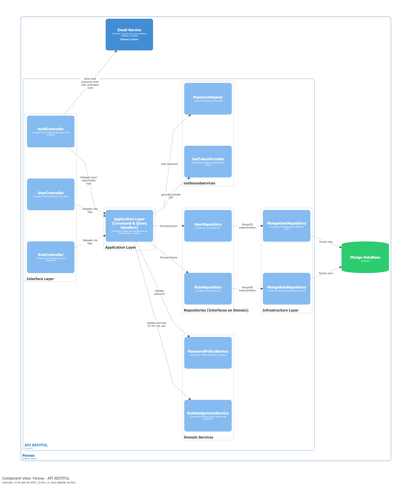
</div>

##### 2.6.1.6. Bounded Context Software Architecture Code Level Diagrams
###### 2.6.1.6.1. Bounded Context Domain Layer Class Diagrams

<div align ="center">
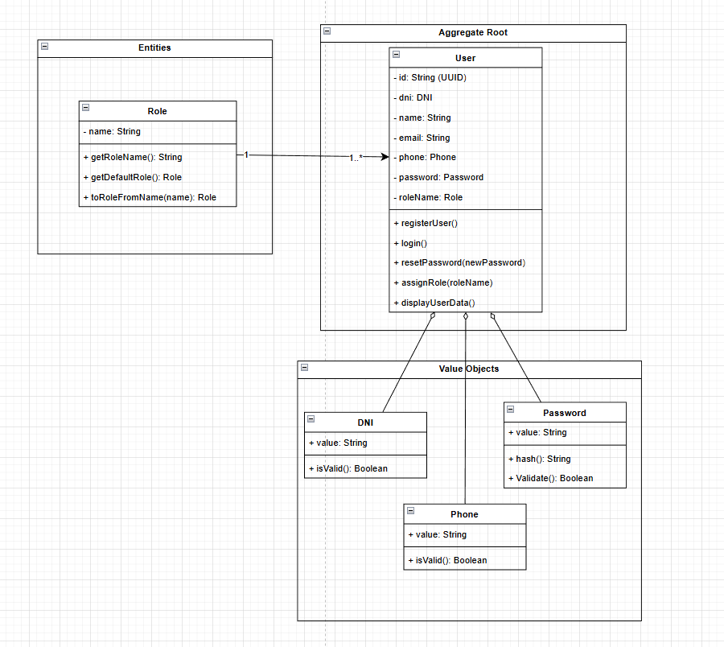
</div>

###### 2.6.1.6.2. Bounded Context Database Design Diagram

<div align ="center">
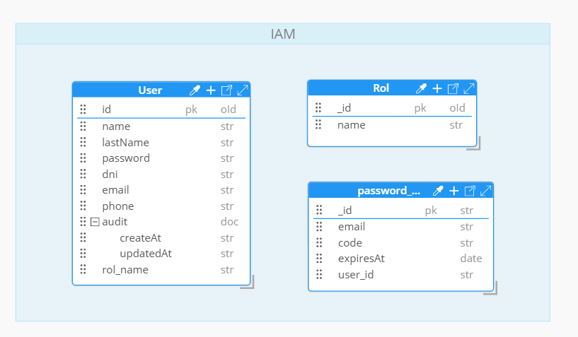
</div>

#### 2.6.2. Bounded Context: `Patient Management`

El Bounded Context de Patient Management se encarga de gestionar la información personal y clínica de los pacientes dentro de la plataforma Ferova. Incluye el registro de pacientes, la actualización de sus datos y el seguimiento de indicadores clave como el nivel de hemoglobina, peso y altura.

Asimismo, permite la asociación del paciente con su madre y la asignación de una enfermera responsable, facilitando el monitoreo continuo y organizado del estado de salud del niño.

Este contexto se estructura siguiendo una arquitectura por capas basada en Domain-Driven Design (DDD), permitiendo una clara separación de responsabilidades entre la lógica de negocio, la interacción con el usuario, la orquestación de procesos y la implementación técnica.

##### 2.6.2.1. Domain Layer

En esta capa se definen las entidades y reglas de negocio relacionadas con la gestión de pacientes con anemia dentro de la plataforma Ferova. Este bounded context es responsable del registro, almacenamiento y seguimiento de la información clínica básica del paciente, así como su asignación a una enfermera.


###### Aggregate

| Aggregate Root | Propósito | Atributos | Métodos | Reglas de Negocio |
| :--- | :--- | :--- | :--- | :--- |
| **Patient** | Representa a un niño dentro del sistema, gestionando su información personal, estado clínico actual y su historial de registros médicos junto a sus responsables. | • **id**: `String (UUID)`<br>• **name**: `String`<br>• **lastName**: `String`<br>• **birthDate**: `Date`<br>• **currentWeight**: `Float`<br>• **currentHeight**: `Float`<br>• **currentHemoglobinLevel**: `Float`<br>• **motherId**: `String`<br>• **nurseId**: `String` <br> • **sexo**: `SexoGenero` <br> • **status:** PatientStatus  | • `registerPatient()`<br>• `updatePatientData()`<br>• `assignNurse(nurseId)`<br>• `updateWeight(value)`<br>• `updateHeight(value)`<br>• `updateHemoglobinLevel(value)`<br>• `addMedicalRecord(record)`<br>• `getMedicalHistory()` <br>• `displayPatientData()` <br> `dischargePatient()`  | • El paciente debe estar asociado a una madre (**motherId** obligatorio).<br>• Solo puede tener una enfermera asignada a la vez.<br>• La fecha de nacimiento no puede ser futura.<br>• El peso, la altura y el nivel de hemoglobina deben ser mayores a **0**. <br> • El sexo del paciente es obligatorio. <br>•El paciente puede ser dado de alta únicamente por una enfermera, quien evalúa su historial médico y estado clínico antes de tomar la decisión.|

###### Entities

| Entidad | Propósito | Atributos | Métodos | Reglas y Relaciones |
| :--- | :--- | :--- | :--- | :--- |
| **MedicalRecord** | Representa un registro clínico detallado para la trazabilidad de la evolución médica y física del paciente. | • **id**: `String`<br>• **date**: `LocalDateTime`<br>• **hemoglobinLevel**: `HemoglobinLevel`<br>• **weight**: `Weight`<br>• **height**: `Height`<br>• **sexo**: `SexoGenero`<br>• **antecedentes**: `List<Antecedente>`<br>• **motivoConsulta**: `MotivoConsulta`<br>• **observaciones**: `Observaciones`<br>• **controls**: `List<Control>`<br>• **nurseId**: `String`<br>• **patientId**: `String`<br>• **motherId**: `String` | • `registerRecord()` : `void`<br>• `addControl(control: Control)` : `void`<br>• `addAntecedente(antecedente: Antecedente)` : `void` | • **Relación**: Patient (1) --- (0..*) MedicalRecord.<br>• **Regla**: Un paciente centraliza múltiples registros que forman su historial clínico histórico.<br>• **Regla**: La hemoglobina, peso y talla deben ser valores clínicos válidos y mayores a cero. |

###### Value Objects

| Value Object | Propósito | Reglas de Validación (Invariantes) | Comportamiento |
| :--- | :--- | :--- | :--- |
| **HemoglobinLevel** | Representa el nivel de hemoglobina en la sangre. | • Debe ser mayor a **0**.<br>• Debe estar dentro de un rango clínico lógico. | • `isValid()`<br>• Comparación por valor. |
| **Weight** | Almacena el peso actual del paciente. | • Debe ser mayor a **0**.<br>• Valor expresado en kilogramos. | • `isValid()`<br>• Formateo de unidad. |
| **Height** | Almacena la estatura/talla del niño. | • Debe ser mayor a **0**.<br>• Valor expresado en centímetros/metros. | • `isValid()`<br>• Validación de rango. |
| **BirthDate** | Gestiona la fecha de nacimiento del paciente. | • No puede ser una fecha futura.<br>• Debe ser una fecha válida. | • `isValid()`<br>• Cálculo de edad actual. |
| **SexoGenero** | Define el sexo biológico del paciente. | • Debe ser `MASCULINO` o `FEMENINO`.<br>• Compartido entre Patient y MedicalRecord. | • Comparación por valor. |
| **Antecedente** | Registra información médica o familiar previa relevante. | • El tipo y el contenido son obligatorios.<br>• No se permiten campos vacíos. | • `isValid()` |
| **MotivoConsulta** | Describe la razón principal de la visita médica. | • Texto descriptivo obligatorio.<br>• Longitud mínima requerida. | • Formateo de texto. |
| **Observaciones** | Notas adicionales y detalles del profesional. | • Campo de texto para hallazgos clínicos.<br>• Puede ser opcional pero debe ser válido. | • `isEmpty()` |
| **Control** | Almacena resultados específicos de laboratorio. | • Valores de Hb, Hematocrito y Ferritina deben ser `> 0`.<br>• La fecha no puede ser futura. | • `isValid()`<br>• Determinar `EstadoAnemia`. |
| **TratamientoRecetado**| Detalla la prescripción médica para el paciente. | • Medicamento, dosis y duración son obligatorios.<br>• Días de duración debe ser mayor a 0. | • `generarInstrucciones()` |
| **EstadoAnemia** | Clasifica la severidad de la condición. | • Valores: `LEVE`, `MODERADA`, `GRAVE`, `CONTROLADA`.<br>• Basado en niveles de hemoglobina. | • Lógica de cálculo automática. |
| **PatientStatus** | Representa el estado actual del ciclo de vida del paciente en el sistema. | • Valores permitidos: `ACTIVE`, `IN_TREATMENT`, `DISCHARGED`. | • `isDischarged()`|

###### Domain Services

| Servicio | Propósito | Responsabilidades |
| :--- | :--- | :--- |
| **PatientAssignmentService** | Gestionar la asignación de pacientes a enfermeras. | • Validar la disponibilidad de la enfermera.<br>• Asegurar que se cumpla la regla de una sola enfermera por paciente. |
| **HemoglobinAnalysisService** | Evaluar el estado clínico según la hemoglobina. | • Comparar el nivel de hemoglobina con los rangos de edad.<br>• Determinar el grado de anemia (leve, moderada, severa).|

###### Repositories (Interfaces en Domain)

| Repository (Interfaz) | Propósito | Métodos de Consulta (Lectura) | Métodos de Persistencia (Escritura) |
| :--- | :--- | :--- | :--- |
| **PatientRepository** | Gestionar el acceso a los datos de los pacientes y su historial clínico, permitiendo búsquedas por responsables o identidad única. | • `findById(id: String): Patient?`<br>• `findByMotherDni(dni: String): List<Patient>`<br>• `findByNurseDni(dni: String): List<Patient>` | • `save(patient: Patient): void`<br>• `deleteById(id: String): void` |

###### Domain Events

| Evento de Dominio | ¿Cuándo ocurre? | Acción que lo dispara |
| :--- | :--- | :--- |
| **PatientRegistered** | Cuando un nuevo niño es registrado en el sistema exitosamente. | El proceso de registro de paciente ha terminado. |
| **PatientUpdated** | Cuando se modifican datos personales o el estado clínico del niño. | El usuario confirma los cambios en el perfil del paciente. |
| **PatientAssignedToNurse** | Cuando se vincula a un paciente con una enfermera responsable. | El sistema o administrador realiza la asignación de seguimiento. |
| **MedicalRecordAdded** | Cuando se genera un nuevo registro clínico en la línea de tiempo. | El profesional de salud guarda una nueva consulta médica. |
| **ControlAdded** | Cuando se registran nuevos valores de laboratorio (Hb, Ferritina y Hematocrito). | Se añaden resultados de análisis al historial clínico. |
| **PatientDischarged** | Cuando el paciente completa su tratamiento y es dado de alta médica. | El médico o enfermera confirma que el paciente superó la condición. |

##### 2.6.2.2. Interface Layer

En esta capa se definen los puntos de interacción entre el sistema y los usuarios, permitiendo gestionar las operaciones relacionadas con los pacientes mediante endpoints REST. Su función es recibir solicitudes, transformarlas en comandos o consultas hacia el Application Layer y devolver respuestas estructuradas.

###### Controller(REST)

| Controlador | Endpoint | Método | Propósito |
| :--- | :--- | :--- | :--- |
| **PatientController** | `/api/v1/patients` | **POST** | Registrar un nuevo paciente en el sistema. |
| | `/api/v1/patients/{id}` | **GET** | Obtener información detallada del niño (incluye estado e historial). |
| | `/api/v1/patients/mother/{dni}` | **GET** | Listar todos los pacientes asociados a una madre. |
| | `/api/v1/patients/nurse/{dni}` | **GET** | Listar todos los pacientes asignados a una enfermera. |
| | `/api/v1/patients/{id}` | **PUT** | Actualizar datos básicos (nombre, peso, altura). |
| | `/api/v1/patients/{id}/assign-nurse` | **PUT** | Realizar el cambio o asignación de enfermera. |
| | `/api/v1/patients/{id}/medical-records` | **POST** | Registrar una nueva entrada en el historial médico. |
| | `/api/v1/patients/{id}/medical-history` | **GET** | Recuperar toda la línea de tiempo clínica del paciente. |
| | `/api/v1/patients/{id}/controls` | **POST** | Agregar un nuevo control clínico en consultas posteriores. |
| | `/api/v1/patients/{id}/discharge` | **POST** | Dar de alta médica al paciente (finalizar ciclo). |
| |`/api/v1/patients/{id}/medical-history/pdf` | **GET** | Descargar historial médico completo (PDF). |
| |`/api/v1/patients/{id}/controls/pdf` | **GET** | Descargar SOLO los controles médicos (PDF). |
| |`/api/v1/patients/{id}/controls/{date}/pdf` | **GET** | Descargar un reporte de control específico por fecha (PDF). |
###### Resources (DTOs / Request & Response Models)

#### **1. CreatePatientRequest**
**Propósito:** Envía los datos necesarios para registrar a una paciente (niño) por primera vez.

```json
{
  "name": "Juan",
  "lastName": "Perez",
  "birthDate": "2020-01-01",
  "sexo": "MASCULINO",
  "weight": 12.5,
  "height": 85.0,
  "motherId": "user-123"
}
```

#### **2. PatientResource**
**Propósito:** Devuelve la información resumida y el estado actual del paciente.

```json
{
  "id": "patient-1",
  "name": "Juan",
  "lastName": "Perez",
  "sexo": "MASCULINO",
  "currentWeight": 12.5,
  "currentHeight": 85.0,
  "currentHemoglobinLevel": 10.5,
  "status": "IN_TREATMENT"
}
```

#### **3. MedicalRecordRequest**
**Propósito:** Registra un historial clínico detallado, con antecedentes y el primer control.

```json
{
  "date": "2026-01-01T10:00:00",
  "hemoglobinLevel": 10.2,
  "weight": 12.8,
  "height": 86.0,
  "sexo": "MASCULINO",
  "motivoConsulta": "Primera evaluación",
  "observaciones": "Paciente estable",
  "antecedentes": [
    {
      "type": "ALERGIA",
      "content": "Alergia a penicilina"
    }
  ],
  "controls": [
    {
      "fecha": "2026-01-01T10:00:00",
      "hemoglobinaGdl": 10.2,
      "hematocrito": 32.5,
      "ferritina": 15.0,
      "sintomas": ["cansancio"],
      "tratamiento": {
        "medicamento": "Hierro",
        "dosis": "10mg",
        "duracionDias": 30,
        "indicaciones": "Después de comidas"
      }
    }
  ]
}
```
#### **4. AddControlRequest**
**Propósito:** Registra un nuevo control de seguimiento y tratamiento para una consulta posterior.

```json
{
 "fecha": "2026-02-01T10:00:00",
  "hemoglobinaGdl": 10.5,
  "hematocrito": 32.0,
  "ferritina": 15.0,
  "sintomas": ["cansancio"],
  "tratamiento": {
    "medicamento": "Hierro",
    "dosis": "10mg",
    "duracionDias": 30,
    "indicaciones": "Después de comidas"
  }
}
```

#### **5. AssignNurseRequest**
**Propósito:** Envía el identificador de la enfermera que tratara al paciente.

```json
{
   "nurseId": "nurse-456"
}
```

#### **6. DischargePatientRequest**
**Propósito:** Registra el alta médica del paciente, validado por la enfermera.

```json
{
"nurseId": "nurse-456"
}
```

###### Assemblers / Mappers

| Assembler / Mapper | Dirección de la Traducción | Propósito |
| :--- | :--- | :--- |
| **CreatePatientCommandFromResourceAssembler** | `CreatePatientRequest` → `CreatePatientCommand` | Convierte el formulario de registro externo en un comando formal para el dominio. |
| **MedicalRecordCommandAssembler** | `MedicalRecordRequest` → `MedicalRecord` | Traduce el JSON complejo del historial médico en un objeto estructurado, validando y convirtiendo tipos. |
| **ControlCommandAssembler** | `AddControlRequest` → `Control` | Transforma los datos de seguimiento en un objeto de control, permitiendo cálculos lógicos como el estado de anemia. |
| **PatientResourceFromEntityAssembler** | `Patient (Entity)` → `PatientResource` | Transforma la entidad del dominio en un recurso seguro y resumido para ser enviado al cliente. |
| **DischargePatientCommandAssembler** | `DischargePatientRequest` → `DischargePatientCommand` | Traduce la petición de alta médica en una instrucción ejecutable por el negocio. |

##### 2.6.2.3. Application Layer

En esta capa se coordinan los casos de uso del sistema relacionados con la gestión de pacientes. Su responsabilidad es orquestar las operaciones entre el Interface Layer y el Domain Layer, ejecutando comandos y consultas sin contener lógica de negocio compleja.

###### Command Handlers (Application Layer)

| Command Handler | Propósito | Responsabilidades |
| :--- | :--- | :--- |
| **CreatePatientCommandHandler** | Registrar un nuevo paciente. | Validar entrada, crear entidad, asignar estado ACTIVE/IN_TREATMENT y guardar. |
| **AssignNurseCommandHandler** | Asignar enfermera a un paciente. | Buscar paciente, actualizar nurseId y persistir cambios. |
| **CreateMedicalRecordCommandHandler** | Registrar historial médico inicial. | Buscar paciente, crear MedicalRecord, asociarlo y guardar cambios. |
| **AddControlCommandHandler** | Agregar control en consulta posterior. | Buscar paciente/registro, crear Control, calcular estado y guardar. |
| **DischargePatientCommandHandler** | Dar de alta médica al paciente. | Validar enfermera, cambiar estado a DISCHARGED, generar evento y guardar. |

###### Query Handlers (Application Layer)

| Query Handler | Propósito | Responsabilidades |
| :--- | :--- | :--- |
| **GetPatientByIdQueryHandler** | Obtener información completa del paciente. | Buscar paciente por ID y retornar sus datos. |
| **GetPatientsByMotherDniQueryHandler** | Obtener pacientes asociados a una madre. | Filtrar en el repositorio por DNI de la madre y retornar lista. |
| **GetPatientsByNurseDniQueryHandler** | Obtener pacientes asignados a una enfermera. | Filtrar en el repositorio por DNI de la enfermera y retornar lista. |
| **GetMedicalHistoryQueryHandler** | Obtener historial médico del paciente. | Obtener el paciente y retornar su colección de MedicalRecords. |
| **GetMedicalHistoryPdfQueryHandler** | Generar el PDF con el historial médico completo del paciente. | Obtener registros médicos, validar su existencia y enviar los datos al PDFService para generar el historial completo. |
| **GetControlsPdfQueryHandler** | Generar un PDF con todos los controles del paciente. | Obtener el historial médico, extraer únicamente la lista de todos los controles y enviarlos al PDFService. |
| **GetControlByDatePdfQueryHandler** | Generar un PDF de un control específico según su fecha. | Obtener el historial, buscar el control que coincida con la fecha solicitada, validar que exista y enviarlo al PDFService. |

###### Event Handlers

| Event Handler | Propósito | Responsabilidades |
| :--- | :--- | :--- |
| **OnPatientDischargedNotify** | Notificar a la madre del paciente. | Enviar notificación (push/email/app) sobre el alta médica. |
| **OnPatientDischargedAnalytics** | Actualizar métricas del sistema. | Registrar paciente recuperado y actualizar estadísticas de anemia. |


##### 2.6.2.4. Infrastructure Layer

En esta capa se implementan los detalles técnicos necesarios para la persistencia de datos, integración con servicios externos y soporte a las operaciones del dominio. Se encarga de materializar las interfaces definidas en el Domain Layer. Tambien permite la descarga del historial médico completo, los controles del paciente y controles específicos por fecha.

###### Persistence

| Repositorio | Implementación | Responsabilidades | Métodos |
| :--- | :--- | :--- | :--- |
| **MongoPatientRepository** | `PatientRepository` | Guardar, buscar por ID, filtrar por madre/enfermera y eliminar pacientes. | `save`, `findById`, `findByMotherDni`, `findByNurseDni`, `deleteById` |
| **MongoMedicalRecordRepository** | Técnico (Infra) | Guardar registros médicos y buscar historiales completos por paciente. | `save`, `findByPatientId` |

###### Mappers

| Mapper | Dirección de la Traducción | Propósito |
| :--- | :--- | :--- |
| **PatientDocumentMapper** | Patient ↔ PatientDocument | Convierte el agregado completo de paciente a documento Mongo y viceversa. |
| **MedicalRecordDocumentMapper** | MedicalRecord ↔ MedicalRecordDocument | Convierte el historial completo. Usa internamente otros mappers. |
| **ControlMapper** | Control ↔ Embedded Document | Convierte cada control individual. Es utilizado dentro de MedicalRecordDocumentMapper. |

###### Modelo de Datos (MongoDB)

<h4>Colección: patients </h4>

```json
{
  "_id": "patient-1",
  "name": "Juan",
  "lastName": "Perez",
  "birthDate": "2020-01-01",
  "sexo": "MASCULINO",
  "currentWeight": 12.5,
  "currentHeight": 85.0,
  "currentHemoglobinLevel": 10.5,
  "motherId": "user-123",
  "nurseId": "nurse-456",
  "status": "IN_TREATMENT"
}
```
<h4>Colección: medical_records </h4>

```json
{
  "_id": "mr-1",
  "patientId": "patient-1",
  "motherId": "user-123",
  "nurseId": "nurse-456",
  "date": "2026-01-01",
  "hemoglobinLevel": 10.2,
  "weight": 12.8,
  "height": 86.0,
  "sexo": "MASCULINO",
  "motivoConsulta": "Primera evaluación",
  "observaciones": "Paciente estable",
  "antecedentes": [],
  "controls": [
    {
      "fecha": "2026-02-01",
      "hemoglobinaGdl": 10.5,
      "hematocrito": 32.0,
      "ferritina": 15.0,
      "estado": "LEVE",
      "sintomas": ["cansancio"],
      "tratamiento": {
        "medicamento": "Hierro",
        "dosis": "10mg",
        "duracionDias": 30,
        "indicaciones": "Después de comidas"
      }
    }
  ]
}
```
###### Servicios Externos (Bounded Contexts Integrations)

| Servicio | Propósito | Integración |
| :--- | :--- | :--- |
| **NotificationService** | Envío de notificaciones a la madre del paciente. | Activado por eventos de dominio (ej. PatientDischarged). |
| **AnalyticsService** | Registro y procesamiento de métricas del sistema. | Suscrito a eventos para actualizar estadísticas de salud global. |

> Importante: Estos servicios representan Bounded Contexts independientes, ya que pertenecen a dominios distintos al de Patient Management. La comunicación se realiza mediante eventos, permitiendo una arquitectura desacoplada y escalable.

######  Exportación de Documentos (Infrastructure Layer)

| Servicio | Implementa | Responsabilidades |
| :--- | :--- | :--- |
| **PdfDocumentExportService** | DocumentExportService | Generar PDF del historial médico completo, reporte de controles y reportes individuales. |

###### Configurations (Infrastructure Layer)

| Configuración | ¿Qué hace? | Responsabilidades |
| :--- | :--- | :--- |
| **MongoConfig** | Conecta el sistema con MongoDB. | Gestiona URL de conexión, base de datos y colecciones de pacientes y registros. |
| **EventConfig** | Conecta eventos con sus manejadores (Handlers). | Asegura que al ocurrir un evento (ej. PatientDischarged) se ejecuten las acciones correspondientes. |


##### 2.6.2.5. Bounded Context Software Architecture Component Level Diagrams

<div align="center">
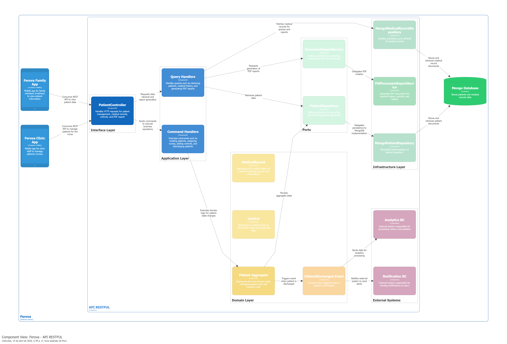
</div>

##### 2.6.2.6. Bounded Context Software Architecture Code Level Diagrams
###### 2.6.2.6.1. Bounded Context Domain Layer Class Diagrams

<div align="center">

</div>

###### 2.6.2.6.2. Bounded Context Database Design Diagram

<div align="center">

</div>

#### 2.6.3. Bounded Context: `Notifications`

El bounded context Notifications es el sistema nervioso de la plataforma Ferova. Su proposito es gestionar el envio de todas las notificaciones push del sistema via Firebase Cloud Messaging (FCM), actuando como intermediario entre los eventos generados por los demas bounded contexts y los usuarios finales. Funciona en dos capas: primero notifica a la madre con recordatorios de dosis y si ella no responde escala la alerta automaticamente a la enfermera asignada.

##### 2.6.3.1. Domain Layer

En esta seccion se documentan las clases que forman el core del bounded context Notifications. Aqui se definen las reglas de negocio relacionadas con el ciclo de vida de una notificacion, desde su creacion hasta su entrega exitosa via Firebase FCM. Se incluyen el Aggregate Root Notification, la entidad FcmToken, los Value Objects NotificationType y NotificationStatus, el Domain Service NotificationDispatcherService, las interfaces de los Repositories y los Domain Events generados por el bounded context.

###### Aggregates

| Aggregate Root | Propósito | Atributos | Métodos | Reglas de Negocio |
| :--- | :--- | :--- | :--- | :--- |
| **Notification** | Representa una notificación push enviada a un usuario de la plataforma Ferova vía Firebase FCM. Gestiona el ciclo de vida completo desde su creación hasta su entrega. | • **id:** String <br> • **recipientId:** String <br> • **recipientRole:** String <br> • **type:** NotificationType <br> • **message:** String <br> • **status:** Status <br> • **fcmToken:** String <br> • **createdAt:** Date | • send() <br> • markAsSent() <br> • markAsFailed() <br> • retry() | • El recipientId no puede ser nulo y el mensaje no puede estar vacío. <br> • El fcmToken debe estar presente antes de enviar. <br> • Se permite un máximo de 3 reintentos en caso de falla. |

###### Entities

| Entidad | Propósito | Atributos | Métodos |
| :--- | :--- | :--- | :--- |
| **FcmToken** | Representa el token de Firebase FCM asociado al dispositivo de un usuario específico. | • id: String <br> • userId: String <br> • token: String <br> • deviceType: String <br> • isActive: Boolean <br> • updatedAt: DateTime | • activate() <br> • deactivate() <br> • updateToken(newToken) |

###### Value Object


| Value Object | Propósito | Valores / Definiciones | Reglas de Validación (Invariantes) | Comportamiento |
| :--- | :--- | :--- | :--- | :--- |
| **NotificationType** | Define el tipo de notificación enviada. | DOSE_REMINDER, SECOND_DOSE_REMINDER, ABANDONMENT_ALERT, BADGE_UNLOCKED, CONSULTATION_CREATED, REPLY_SENT, APPOINTMENT_CONFIRMED, APPOINTMENT_CANCELLED, IRON_INHIBITOR_ALERT, PATIENT_DISCHARGED. | Define el tipo de notificación. | Debe ser un tipo válido y no nulo. | Selección de plantilla y prioridad. |
| **NotificationStatus** | Define el estado técnico del envío. | PENDING, SENT, FAILED, RETRYING. | Debe seguir el flujo de estados permitido. | Control de flujo y reintentos. |

###### Domain Services

| Servicio | Propósito | Métodos |
| :--- | :--- | :--- |
| **NotificationDispatcherService** | Gestiona la lógica de envío de notificaciones y el escalamiento automático de alertas. Es el cerebro que decide cuándo una simple notificación debe convertirse en una alerta urgente. | • `dispatch(notification)` : Envía la notificación al sistema de mensajería.<br><br>• `scheduleReminder(patientId, type)` : Programa recordatorios automáticos.<br><br>• `escalateAlert(patientId, nurseId)` : Eleva el nivel de alerta si no hay respuesta. |

###### Repositories

| Repositorio | Propósito | Métodos |
| :--- | :--- | :--- |
| **NotificationRepository** | Interfaz para gestionar la persistencia de las notificaciones enviadas y pendientes. | • `save(notification)` : Guarda una nueva notificación o actualiza una existente en MongoDB.<br><br>• `findById(id)` : Busca y retorna una notificación específica por su ID. Retorna null si no existe.<br><br>• `findByRecipientId(recipientId)` : Retorna todas las notificaciones enviadas a un usuario específico. Útil para ver el historial de una madre o enfermera.<br><br>• `findByStatus(status)` : Retorna todas las notificaciones con un estado específico. Útil para encontrar las **FAILED** que necesitan reintentarse. |
| **FcmTokenRepository** | Interfaz para administrar los tokens de Firebase asociados a los dispositivos de los usuarios. | • `save(token)` : Guarda o actualiza el token FCM en MongoDB. Se ejecuta cada vez que el usuario abre la app y el token se renueva.<br><br>• `findByUserId(userId)` : Busca y retorna el token FCM activo. Es el **método más importante** porque sin él no se pueden enviar notificaciones push.<br><br>• `deleteByUserId(userId)` : Elimina el token cuando el usuario cierra sesión o desinstala la app para evitar envíos a dispositivos inactivos. |

###### Domain Events 

| Evento de Dominio | Propósito y Descripción | Resultado / Acción |
| :--- | :--- | :--- |
| **NotificationSent** | Se dispara tras la confirmación de entrega exitosa por Firebase FCM. | Ciclo completado. Estado actualizado a SENT en MongoDB. |
| **NotificationFailed** | Se dispara cuando Firebase FCM falla en la entrega del mensaje. | Error detectado. Estado actualizado a FAILED para reintentos. |
| **DoseReminderScheduled** | Se dispara al programar un recordatorio automático de dosis. | Recordatorio agendado para envío automático a la madre. |
| **AbandonmentAlertTriggered** | Se dispara tras 72h de inactividad en la confirmación de dosis. | Alerta de riesgo enviada a la enfermera para acción inmediata. |

##### 2.6.3.2. Interface Layer

En esta seccion se presentan las clases que forman parte de la Interface Layer del bounded context Notifications. Esta capa actua como la puerta de entrada al sistema, recibiendo las peticiones HTTP que llegan desde FerovaFamilia y FerovaClinic y transformandolas en comandos y consultas que entiende la Application Layer. Tambien se encarga de transformar las respuestas del dominio en DTOs que el cliente puede consumir. Se incluyen los Controllers REST, los Resources o modelos de solicitud y respuesta, y los Assemblers o Mappers que realizan la traduccion entre ambos mundos.

###### Controllers

| Controlador | Propósito | Endpoints |
| :--- | :--- | :--- |
| **NotificationController** | Expone los endpoints REST para gestionar el envío y consulta de notificaciones push desde el sistema hacia los usuarios de **FerovaFamilia** y **FerovaClinic**. | • `POST /api/v1/notifications/send` : Envía una notificación push vía Firebase FCM.<br><br>• `GET /api/v1/notifications/{recipientId}` : Retorna el historial de notificaciones de un usuario específico.<br><br>• `PUT /api/v1/notifications/{id}/retry` : Reintenta el envío de una notificación que falló anteriormente. |
| **FcmTokenController** | Expone los endpoints REST para administrar el registro, actualización y eliminación de los tokens FCM de los dispositivos. | • `POST /api/v1/fcm-tokens` : Registra o actualiza el token FCM del dispositivo cuando el usuario abre la app.<br><br>• `DELETE /api/v1/fcm-tokens/{userId}` : Elimina el token del usuario cuando cierra sesión o desinstala la aplicación. |

###### Resources (DTOs / Request & Response Models)

#### **1. SendNotificationRequest**

**Propósito:** Envía los datos necesarios para solicitar el envío de una nueva notificación push a un usuario.

```json
{
  "recipientId": "user-456",
  "recipientRole": "MOTHER",
  "type": "DOSE_REMINDER",
  "message": "Es hora de la dosis de hierro de Juanito."
}
```
#### **2. NotificationResponse**

**Propósito:** Retorna el detalle completo y el estado técnico de una notificación registrada en el sistema.

```json
{
  "id": "notif-987",
  "recipientId": "user-456",
  "recipientRole": "MOTHER",
  "type": "DOSE_REMINDER",
  "message": "Es hora de la dosis de hierro de Juanito.",
  "status": "SENT",
  "createdAt": "2026-04-16T10:00:00Z",
  "sentAt": "2026-04-16T10:00:05Z"
}
```
#### **3. RetryNotificationResponse**

**Propósito:** Confirma que se ha solicitado un reintento de envío para una notificación que falló.

```json
{
  "id": "notif-987",
  "status": "RETRYING",
  "retryCount": 1
}
```
#### **4. RegisterFcmTokenRequest**

**Propósito:** : Envía el token generado por Firebase desde el dispositivo móvil para vincularlo al usuario.

```json
{
  "userId": "user-456",
  "token": "fcm-token-abc-123-xyz",
  "deviceType": "ANDROID"
}
```
#### **5. FcmTokenResponse**

**Propósito:** Retorna la información del token registrado y su estado de actividad en el sistema.

```json
{
  "userId": "user-456",
  "token": "fcm-token-abc-123-xyz",
  "deviceType": "ANDROID",
  "isActive": true,
  "updatedAt": "2026-04-16T08:30:00Z"
}
```

###### Assemblers / Mappers

| Assembler / Mapper | Dirección de la Traducción | Propósito |
| :--- | :--- | :--- |
| **SendNotificationCommandFromResourceAssembler** | `SendNotificationRequest` → `SendNotificationCommand` | Convierte la solicitud externa en un comando formal de aplicación. |
| **NotificationResourceFromEntityAssembler** | `Notification (Entity)` → `NotificationResponse` | Transforma la entidad de dominio en un recurso para el cliente. |
| **RegisterFcmTokenCommandFromResourceAssembler** | `RegisterFcmTokenRequest` → `RegisterFcmTokenCommand` | Traduce el registro del token en una instrucción para el negocio. |

##### 2.6.3.3. Application Layer

En esta seccion se explican las clases que manejan los flujos de procesos del negocio dentro del bounded context Notifications. Esta capa actua como el director de orquesta coordinando las interacciones entre el Domain Layer y el Infrastructure Layer sin contener logica de negocio propia. Se incluyen los Command Handlers que procesan las acciones de envio y reintento de notificaciones, los Query Handlers que gestionan las consultas del historial de notificaciones y los Event Handlers que reaccionan automaticamente a los eventos generados por los demas bounded contexts del sistema.

###### Command Handlers (Application Layer)

| Command Handler | Propósito | Responsabilidades |
| :--- | :--- | :--- |
| **SendNotificationCommandHandler** | Enviar una nueva notificación. | Buscar token, crear entidad PENDING, enviar vía FCM y actualizar a SENT/FAILED. |
| **RetryNotificationCommandHandler** | Reintentar envíos fallidos. | Validar estado FAILED y límite de 3 reintentos antes de delegar nuevo envío. |
| **RegisterFcmTokenCommandHandler** | Actualizar token del dispositivo. | Asegurar que el sistema guarde el token FCM más reciente vinculado al usuario. |
| **DeleteFcmTokenCommandHandler** | Limpiar tokens inactivos. | Eliminar el token del repositorio al cerrar sesión o desinstalar la app. |

###### Query Handlers (Application Layer)

| Query Handler | Propósito | Responsabilidades |
| :--- | :--- | :--- |
| **GetNotificationHistoryQueryHandler** | Obtener historial de usuario. | Recuperar lista de notificaciones por recipientId ordenadas por fecha. |
| **GetFailedNotificationsQueryHandler** | Listar errores de envío. | Filtrar y retornar notificaciones en estado FAILED para su revisión. |

###### Event Handlers

| Event Handler | Propósito | Responsabilidades |
| :--- | :--- | :--- |
| **OnDoseReminderTriggeredEventHandler** | Reaccionar a la programación de dosis. | Crear notificación DOSE_REMINDER y enviarla a la madre vía FCM. |
| **OnAbandonmentAlertTriggeredEventHandler** | Reaccionar a pacientes en lista crítica. | Crear alerta de abandono y enviarla a la enfermera para acción inmediata. |
| **OnBadgeUnlockedEventHandler** | Notificar el desbloqueo de insignias. | Enviar mensaje celebratorio de logro a la madre vía FCM. |
| **OnConsultationCreatedEventHandler** | Avisar sobre nuevas consultas médicas. | Notificar a la enfermera asignada sobre una nueva inquietud de la madre. |
| **OnReplySentEventHandler** | Notificar respuestas a consultas. | Avisar a la madre que su enfermera ha respondido a su mensaje. |
| **OnAppointmentConfirmedEventHandler** | Notificar confirmación de citas. | Enviar detalles de la cita confirmada tanto a la madre como a la enfermera. |
| **OnIronInhibitorDetectedEventHandler** | Alertar sobre ingesta de inhibidores. | Enviar alerta nutricional (messageAlertInhibitor) a la madre vía FCM. |
| **OnPatientDischargedEventHandler** | Reaccionar a la finalización del tratamiento. | Crear notificación celebratoria y enviarla a la madre tras el alta médica del niño. |

##### 2.6.3.4. Infrastructure Layer

En esta seccion se presentan las clases que acceden a servicios externos dentro del bounded context Notifications. Esta capa contiene las implementaciones concretas de los Repositories definidos como interfaces en el Domain Layer, los adaptadores para servicios externos como Firebase FCM y la configuracion tecnica necesaria para el funcionamiento del bounded context. Es en esta capa donde se resuelve todo lo relacionado con la persistencia en MongoDB y la comunicacion con Firebase Cloud Messaging para el envio de notificaciones push.

###### Persistence

| Repositorio | Implementación | Responsabilidades | Métodos |
| :--- | :--- | :--- | :--- |
| **MongoNotificationRepository** | `NotificationRepository` | Gestiona la persistencia en la colección `notifications`. Mapea la entidad al documento MongoDB y permite filtrado por estado. | `save`, `findById`, `findByRecipientId`, `findByStatus` |
| **MongoFcmTokenRepository** | `FcmTokenRepository` | Gestiona tokens FCM en la colección `fcm_tokens`. Garantiza el registro del token más reciente del dispositivo. | `save`, `findByUserId`, `deleteByUserId` |

###### Mappers

| Mapper | Dirección de la Traducción | Propósito |
| :--- | :--- | :--- |
| **NotificationDocumentMapper** | `Notification (Entity)` ↔ `NotificationDocument` | Traduce entre la entidad de dominio y el documento de MongoDB. |
| **FcmTokenDocumentMapper** | `FcmToken (Entity)` ↔ `FcmTokenDocument` | Traduce entre la entidad de dominio y el documento de MongoDB. |

###### External Services (Infrastructure Layer)

| Servicio / Adaptador | Propósito | Responsabilidades | Métodos |
| :--- | :--- | :--- | :--- |
| **FirebaseFCMAdapter** | Integración con Firebase Cloud Messaging. | Envío de notificaciones push individuales o masivas y gestión de respuestas de la API de Firebase. | • `sendPushNotification`<br>• `sendBatchNotifications` |

###### Configuration (Infrastructure Layer)

| Componente | Propósito | Responsabilidades / Índices |
| :--- | :--- | :--- |
| **MongoConfig** | Configurar la conexión a MongoDB para el contexto de Notificaciones. | Define la conexión y los índices de rendimiento: <br><br> • notifications: Índice en recipientId (búsquedas), status (filtros FAILED) y TTL en createdAt (limpieza automática). <br><br> • fcm_tokens: Índice único en userId para asegurar un solo token por usuario.|
| **FirebaseConfig** | Configurar la integración con Firebase Cloud Messaging.| Inicializa el SDK de Firebase con las credenciales de Ferova. Define el timeout de envío y el número máximo de reintentos automáticos ante fallos de red. |

###### Modelo de datos MongoDB

<h4>Coleccion: notifications </h4>

```json
{
   "_id": "notif:uuid",
  "recipientId": "user:uuid",
  "recipientRole": "madre",
  "type": "DOSE_REMINDER",
  "message": "Hora de la dosis de Juan.",
  "status": "SENT",
  "createdAt": "2026-04-16T08:00:00Z",
  "sentAt": "2026-04-16T08:00:02Z",
  "fcmToken": "fcm:token:abc123"
}
```

<h4>Coleccion: fcm_tokens</h4>

```json
{
  "_id": "fcm:uuid",
  "userId": "user:uuid",
  "token": "fcm:token:abc123",
  "deviceType": "Android",
  "isActive": true,
  "updatedAt": "2026-04-16T07:00:00Z"
}
```

##### 2.6.3.5. Bounded Context Software Architecture Component Level Diagrams

<div align = "center">
  
</div>

##### 2.6.3.6. Bounded Context Software Architecture Code Level Diagrams
###### 2.6.3.6.1. Bounded Context Domain Layer Class Diagrams

<div align = "center">
  
</div>

###### 2.6.3.6.2. Bounded Context Database Design Diagram


<div align = "center">
  
</div>

#### 2.6.4. Bounded Context: `Comunication Management`

El bounded context Communication gestiona la teleconsulta asincrona entre la madre y su enfermera asignada dentro de Ferova. Funciona como un canal de comunicacion privado dentro de la app donde la madre escribe sus dudas desde FerovaFamilia y la enfermera responde desde FerovaClinic. Los mensajes se almacenan y sincronizan en tiempo real mediante Firebase Firestore, y la enfermera cuenta con plantillas de respuesta rapida para agilizar su tiempo de atencion.

##### 2.6.4.1. Domain Layer

En esta seccion se documentan las clases que forman el core del bounded context Communication. Aqui se definen las reglas de negocio relacionadas con el ciclo de vida de una consulta de teleconsulta, desde su creacion hasta su cierre. Se incluyen el Aggregate Root Consultation, la entidad Message, los Value Objects ConsultationStatus y MessageSender, el Domain Service ConsultationService, las interfaces de los Repositories y los Domain Events generados por el bounded context.

###### Aggregate Root: Consultation

| Aggregate Root | Propósito | Atributos | Métodos | Reglas de Negocio |
| :--- | :--- | :--- | :--- | :--- |
| **Consultation** | Representa una conversación asíncrona completa entre una madre y su enfermera asignada dentro de la plataforma Ferova. | • **id:** String<br>• **patientId**: String<br>• **motherId**: String<br>• **nurseId**: String<br>• **status**: Status<br>• **messages**: List<br>• **createdAt**: Date<br>• **closedAt**: Date | • addMessage()<br>• close()<br>• isOpen()<br>• hasBeenReplied() | • motherId y nurseId no pueden ser nulos.<br>• No se puede cerrar sin haber sido respondida.<br>• Solo la enfermera puede cerrar una consulta. |

###### Entities

| Entity | Propósito | Atributos | Métodos | Reglas de Negocio |
| :--- | :--- | :--- | :--- | :--- |
| **Message** | Representa un mensaje individual enviado dentro de una consulta de teleconsulta. | • **id**: String<br>• **consultationId**: String<br>• **senderId**: String<br>• **senderRole**: Role<br>• **content**: String<br>• **sentAt**: Date | • getSender()<br>• getContent() | • El contenido no puede estar vacío.<br>• Debe pertenecer a una consulta válida.<br>• La fecha de envío es obligatoria. |

###### Value Objects

| Value Object | Propósito | Valores / Definiciones | Reglas de Validación (Invariantes) | Comportamiento |
| :--- | :--- | :--- | :--- | :--- |
| **ConsultationStatus** | Define el estado de la teleconsulta. | OPEN, CLOSED. | Debe iniciar en OPEN y solo pasar a CLOSED tras respuesta. | •  Termina la consulta 'CLOSED'. <br><br>• La consulta sigue activa 'OPEN'|
| **MessageSender** | Identifica al autor del mensaje. | MOTHER, NURSE. | Debe ser un tipo válido y no nulo. | Determina el origen de la comunicación. |
| **QuickReplyTemplate** | Representa una plantilla de respuesta rápida predefinida para la enfermera. | title (String), content (String). | El título y el contenido no pueden estar vacíos. | Proporciona textos preestablecidos para agilizar la atención. |

###### Domain Services

| Servicio | Propósito | Métodos |
| :--- | :--- | :--- |
| **ConsultationService** | Gestiona la lógica de negocio de la teleconsulta y valida el flujo correcto de la comunicación. | • `validateNurseAssignment(nurseId, patientId)` : Valida la asignación oficial de la enfermera.<br>• `canClose(consultation)` : Verifica requisitos previos antes del cierre de consulta. |

###### Repositories

| Repositorio | Propósito | Métodos |
| :--- | :--- | :--- |
| **ConsultationRepository** | Interfaz para gestionar la persistencia y recuperación de las teleconsultas entre madres y enfermeras. | • `save(consultation)` : Guarda una nueva consulta o actualiza una existente.<br><br>• `findById(id)` : Busca una consulta específica por su identificador único.<br><br>• `findByPatientId(patientId)` : Recupera todas las consultas asociadas a un paciente.<br><br>• `findByNurseId(nurseId)` : Lista las consultas gestionadas por una enfermera.<br><br>• `findByStatus(status)` : Filtra las consultas según su estado (OPEN/CLOSED). |
| **MessageRepository** | Interfaz encargada del almacenamiento y flujo de mensajes individuales dentro de las consultas. | • `save(message)` : Registra un nuevo mensaje en la base de datos.<br><br>• `findByConsultationId(consultationId)` : Recupera toda la secuencia de mensajes de una consulta específica para mostrar el chat completo. |

###### Domain Events

| Evento de Dominio | Propósito y Descripción | Resultado / Acción |
| :--- | :--- | :--- |
| **ConsultationCreated** | Se dispara cuando una madre inicia una nueva consulta en la plataforma. | Nueva conversación registrada en MongoDB y notificación enviada a la enfermera asignada. |
| **MessageSent** | Se dispara cada vez que un nuevo mensaje es agregado a la conversación. | Actualización del historial del chat y envío de notificación push al destinatario. |
| **ConsultationClosed** | Se dispara cuando la enfermera da por finalizada la atención. | Estado actualizado a CLOSED; se bloquea el envío de nuevos mensajes en esa consulta. |
| **QuickReplySelected** | Se dispara al utilizar una respuesta predefinida para agilizar la atención. | El contenido de la respuesta rápida se convierte en un mensaje enviado automáticamente. |

##### 2.6.4.2. Interface Layer

En esta seccion se presentan las clases que forman parte de la Interface Layer del bounded context Communication. Esta capa actua como la puerta de entrada al sistema recibiendo las peticiones HTTP que llegan desde FerovaFamilia y FerovaClinic y transformandolas en comandos y consultas que entiende la Application Layer. Tambien se encarga de transformar las respuestas del dominio en DTOs que el cliente puede consumir. Se incluyen los Controllers REST, los Resources o modelos de solicitud y respuesta y los Assemblers que realizan la traduccion entre ambos mundos.

##### Controllers

| Controlador (REST) | Método HTTP | Ruta (Endpoint) | Propósito / Acción |
| :--- | :--- | :--- | :--- |
| **ConsultationController** | `POST` | `/api/v1/consultations` | Crea una nueva consulta enviada por la madre hacia su enfermera asignada. |
| | `GET` | `/api/v1/consultations/{patientId}/history` | Retorna el historial completo de consultas de un paciente ordenadas por fecha. |
| | `PUT` | `/api/v1/consultations/{id}/close` | Cierra una consulta una vez que la duda de la madre fue resuelta por la enfermera. |
| **MessageController** | `POST` | `/api/v1/consultations/{id}/messages` | Envía un nuevo mensaje normal dentro de una consulta activa. |
| | `POST` | `/api/v1/consultations/{id}/messages/quick-reply` | Envía una respuesta rápida seleccionada por la enfermera usando una plantilla. |
| | `GET` | `/api/v1/consultations/{id}/messages` | Retorna todos los mensajes de una consulta específica ordenados por fecha. |

###### Resources (DTOs / Request & Response Models)

#### **1. CreateConsultationRequest**
**Propósito:** Envía los datos iniciales para abrir una nueva teleconsulta.

```json
{
  "patientId": "string",
  "motherId": "string",
  "nurseId": "string",
  "message": "string"
}
```

#### **2. ConsultationResponse**
**Propósito:** Retorna la información detallada de una consulta creada o consultada.

```json
{
  "id": "string",
  "patientId": "string",
  "motherId": "string",
  "nurseId": "string",
  "status": "OPEN/CLOSED",
  "createdAt": "datetime",
  "closedAt": "datetime"
}
```

#### **3. SendMessageRequest**
**Propósito:** Envía un mensaje estándar dentro de una consulta activa.

```json
{
  "consultationId": "string",
  "senderId": "string",
  "senderRole": "MOTHER/NURSE",
  "content": "string"
}
```

#### **4. MessageResponse**
**Propósito:** Devuelve los datos de un mensaje enviado o recuperado del historial.

```json
{
  "id": "string",
  "consultationId": "string",
  "senderId": "string",
  "senderRole": "MOTHER/NURSE",
  "content": "string",
  "sentAt": "datetime"
}
```

#### **5. CloseConsultationResponse**
**Propósito:** Confirma el cierre de una consulta y muestra la fecha de finalización.

```json
{
  "id": "string",
  "status": "CLOSED",
  "closedAt": "datetime"
}
```

#### **6. SendQuickReplyMessageRequest**
**Propósito:** Envía un mensaje basado en una plantilla predefinida por la enfermera.

```json
{
  "consultationId": "string",
  "nurseId": "string",
  "templateTitle": "string",
  "templateContent": "string"
}
```

###### Assemblers / Mappers

| Assembler / Mapper | Dirección de la Traducción | Propósito |
| :--- | :--- | :--- |
| **CreateConsultationCommand-**<br>**FromResourceAssembler** | `CreateConsultationRequest` → `CreateConsultationCommand` | Convierte la solicitud externa de nueva consulta en un comando formal de aplicación. |
| **ConsultationResponse-**<br>**FromEntityAssembler** | `Consultation (Entity)` → `ConsultationResponse` | Transforma la entidad de dominio de la consulta en un recurso para el cliente. |
| **SendMessageCommand-**<br>**FromResourceAssembler** | `SendMessageRequest` → `SendMessageCommand` | Traduce el pedido de nuevo mensaje en una instrucción para el negocio. |
| **MessageResponse-**<br>**FromEntityAssembler** | `Message (Entity)` → `MessageResponse` | Convierte la entidad del mensaje en un recurso legible para la interfaz. |
| **SendQuickReplyMessageCommand-**<br>**FromResourceAssembler** | `SendQuickReplyMessageRequest` → `SendQuickReplyMessageCommand` | Convierte la solicitud de respuesta rápida en un comando formal de aplicación. |

##### 2.6.4.3. Application Layer

En esta seccion se explican las clases que manejan los flujos de procesos del negocio dentro del bounded context Communication. Esta capa actua como el director de orquesta coordinando las interacciones entre el Domain Layer y el Infrastructure Layer sin contener logica de negocio propia. Se incluyen los Command Handlers que procesan las acciones de creacion, mensajeria y cierre de consultas, los Query Handlers que gestionan las consultas del historial y los Event Handlers que notifican a los demas bounded contexts cuando ocurre algo relevante en la teleconsulta.

###### Command Handlers

| Command Handler | Propósito | Responsabilidades |
| :--- | :--- | :--- |
| **CreateConsultation-**<br>**CommandHandler** | Iniciar una nueva teleconsulta entre madre y enfermera. | • Verifica la asignación de la enfermera mediante `ConsultationService`. <br> • Crea la entidad `Consultation` (OPEN) con el mensaje inicial. <br> • Persiste en `ConsultationRepository` y dispara el evento `ConsultationCreated`. |
| **SendMessage-**<br>**CommandHandler** | Registrar y enviar un mensaje estándar dentro del chat. | • Valida que la consulta exista y esté en estado `OPEN` en el `ConsultationRepository`. <br> • Crea la entidad `Message` y la persiste en Firebase Firestore vía el `MessageRepository`. <br> • Dispara el evento `MessageSent` para notificar al destinatario. |
| **SendQuickReply-**<br>**MessageCommandHandler** | Enviar una respuesta basada en una plantilla predefinida. | • Valida la existencia y estado `OPEN` de la consulta. <br> • Crea el Value Object `QuickReplyTemplate`, lo encapsula en un `Message` (NURSE) y lo persiste en Firestore. <br> • Dispara el evento `MessageSent` para notificar a la madre. |
| **CloseConsultation-**<br>**CommandHandler** | Finalizar formalmente el ciclo de la teleconsulta. | • Verifica mediante `ConsultationService` que la consulta fue respondida y el cierre es solicitado por la enfermera asignada. <br> • Actualiza el estado a `CLOSED`, registra `closedAt` y dispara `ConsultationClosed`. |

##### Query Handlers

| Query Handler | Propósito | Responsabilidades |
| :--- | :--- | :--- |
| **GetConsultationHistory-**<br>**QueryHandler** | Recuperar el historial de teleconsultas de un paciente. | • Consulta al `ConsultationRepository` usando el `patientId`. <br> • Retorna la lista de consultas ordenadas por fecha (de más reciente a más antigua) con sus respectivos estados. |
| **GetConsultationMessages-**<br>**QueryHandler** | Obtener todos los mensajes de una conversación específica. | • Consulta al `MessageRepository` usando el `consultationId`. <br> • Retorna la secuencia completa de mensajes ordenados cronológicamente para las interfaces de **FerovaFamilia** y **FerovaClinic**. |

##### Event Handlers

| Event Handler | Propósito | Responsabilidades |
| :--- | :--- | :--- |
| **OnConsultationCreated-**<br>**EventHandler** | Notificar a la enfermera sobre una nueva consulta. | • Reacciona a `ConsultationCreated`. <br> • Envía el `nurseId` y `consultationId` al **BC Notifications** para disparar una notificación push en **FerovaClinic**. |
| **OnMessageSent-**<br>**EventHandler** | Informar a los usuarios sobre nuevos mensajes recibidos. | • Reacciona a `MessageSent`. <br> • Identifica al destinatario según el `senderRole`. <br> • Delega al **BC Notifications** el envío de la alerta a la madre o a la enfermera según corresponda. |
| **OnConsultationClosed-**<br>**EventHandler** | Sincronizar el cierre de la consulta en el almacenamiento de mensajería. | • Reacciona a `ConsultationClosed`. <br> • Actualiza el estado y la fecha de cierre en el documento de **Firebase Firestore** para asegurar la integridad del historial. |

##### 2.6.4.4. Infrastructure Layer

En esta seccion se presentan las clases que acceden a servicios externos dentro del bounded context Communication. Esta capa contiene las implementaciones concretas de los Repositories definidos como interfaces en el Domain Layer, los adaptadores para servicios externos como Firebase Firestore y la configuracion tecnica necesaria para el funcionamiento del bounded context. Es en esta capa donde se resuelve todo lo relacionado con la sincronizacion de mensajes en tiempo real mediante Firebase Firestore y la persistencia de consultas en MongoDB.

##### Persistence 

| Repositorio | Implementación | Responsabilidades | Métodos |
| :--- | :--- | :--- | :--- |
| **MongoConsultationRepository** | `ConsultationRepository` | Gestiona la persistencia en la colección `consultations`. Mapea la entidad al documento MongoDB y permite filtrado por paciente, enfermera y estado. | `save`, `findById`, `findByPatientId`, `findByNurseId`, `findByStatus` |
| **FirestoreMessageRepository** | `MessageRepository` | Gestiona la persistencia y sincronización en tiempo real de mensajes en **Firebase Firestore**. Permite comunicación inmediata entre apps sin polling. | `save`, `findByConsultationId` |

##### Mappers

| Mapper | Propósito | Responsabilidades |
| :--- | :--- | :--- |
| **ConsultationDocumentMapper** | Conversión de datos para MongoDB. | Traduce la entidad de dominio `Consultation` al formato de documento de **MongoDB** y viceversa para su persistencia. |
| **MessageDocumentMapper** | Conversión de datos para Firestore. | Traduce la entidad de dominio `Message` al formato de documento de **Firebase Firestore**, asegurando la compatibilidad con el tiempo real. |

##### External Services

| Servicio Externo | Propósito | Responsabilidades | Métodos |
| :--- | :--- | :--- | :--- |
| **FirebaseFirestoreAdapter** | Gestionar la comunicación con **Firebase Firestore** para mensajería en tiempo real. | • Construye el documento Firestore a partir del mensaje y ejecuta la escritura. <br> • Permite que los cambios se propaguen automáticamente a todos los dispositivos suscritos sin necesidad de refrescar la pantalla. | • `saveMessage(message: Message)` <br> • `getMessagesByConsultationId(consultationId: String)` <br> • `listenToConsultation(consultationId: String)` |

##### Configuration

| Configuración | Propósito | Responsabilidades / Detalles |
| :--- | :--- | :--- |
| **MongoConfig** | Configurar la conexión y el rendimiento de **MongoDB**. | • Establece la conexión para el BC Communication.<br>• Define índices en `patientId`, `nurseId` y `status` para optimizar las búsquedas y filtrados. |
| **FirebaseConfig** | Inicializar la integración con **Firebase Firestore**. | • Inicializa el SDK de Firebase con las credenciales del proyecto **Ferova**.<br>• Configura los parámetros para garantizar la sincronización en tiempo real de los mensajes. |

##### Modelo de datos MongoDB

<h4>Coleccion consultations:</h4>

```json
{
  "_id": "cons:uuid",
  "patientId": "pat:uuid",
  "motherId": "user:uuid",
  "nurseId": "user:uuid",
  "status": "OPEN",
  "createdAt": "2026-04-16T08:00:00Z",
  "closedAt": null
}
```

##### Modelo de datos Firebase Firestore
<h4>Coleccion messages</h4>

```json
{
   "_id": "msg:uuid",
  "consultationId": "cons:uuid",
  "senderId": "user:uuid",
  "senderRole": "MOTHER",
  "content": "Juan vomito despues de tomar el hierro.",
  "sentAt": "2026-04-16T08:05:00Z"
}
```

##### 2.6.4.5. Bounded Context Software Architecture Component Level Diagrams

<div align ="center">
	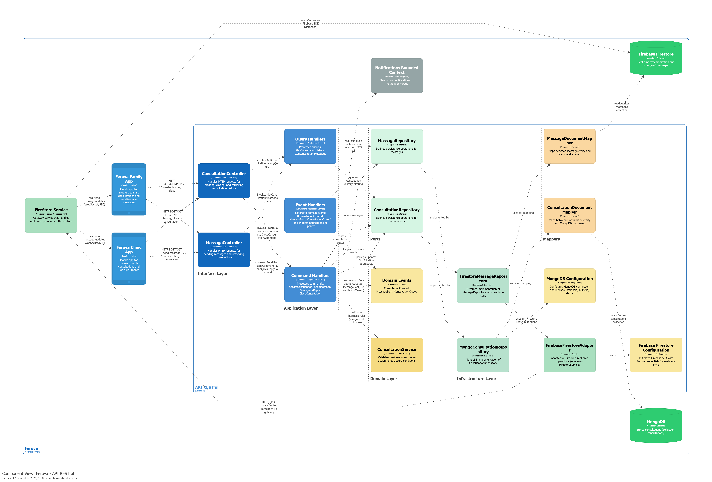	
</div>

##### 2.6.4.6. Bounded Context Software Architecture Code Level Diagrams
###### 2.6.4.6.1. Bounded Context Domain Layer Class Diagrams

<div align ="center">
	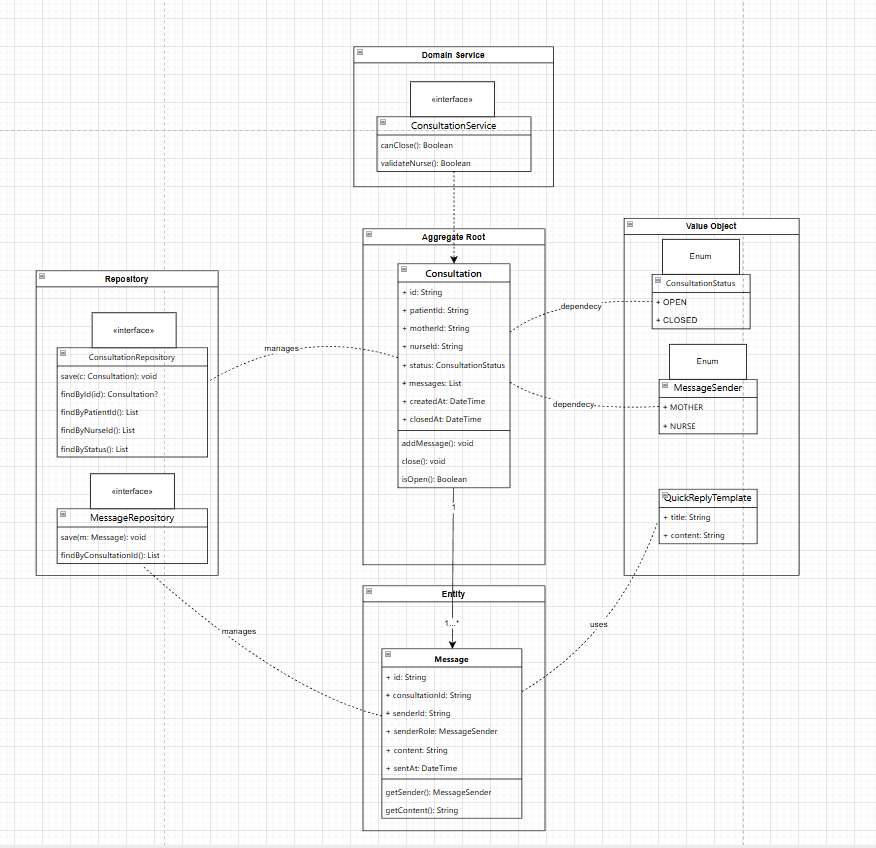	
</div>

###### 2.6.4.6.2. Bounded Context Database Design Diagram

<div align ="center">
		
</div>

#### 2.6.5. Bounded Context: `Treatment Tracking`

El bounded context Treatment Tracking es el corazon de la plataforma Ferova. Su proposito es gestionar el seguimiento diario del tratamiento de anemia de cada paciente, garantizando que la madre confirme cada dosis programada por la enfermera, calculando automaticamente el score de riesgo de abandono y clasificando a los pacientes en un semaforo verde, amarillo o rojo. Si un paciente lleva 72 horas sin confirmar su dosis el sistema escala la alerta automaticamente a la enfermera asignada.

##### 2.6.5.1. Domain Layer

En esta seccion se documentan las clases que forman el core del bounded context Treatment Tracking. Aqui se definen las reglas de negocio relacionadas con el ciclo de vida completo de un tratamiento de anemia, desde su inicio hasta su completado o abandono. Se incluyen el Aggregate Root Treatment, las entidades DailyDose y RiskScore, los Value Objects TreatmentStatus y RiskLevel, los Domain Services, las interfaces de los Repositories y los Domain Events generados por el bounded context.


###### Aggregate Root: Treatment

**Propósito:** Representa el tratamiento de anemia completo de un paciente incluyendo sus dosis diarias, su score de adherencia y su clasificación de riesgo de abandono.

| Categoría | Elemento | Detalle | Descripción |
| :--- | :--- | :--- | :--- |
| **Atributo** | `id` | String | Identificador único del tratamiento en MongoDB. Permite rastrear, buscar y referenciar un tratamiento específico desde cualquier parte del sistema. |
| **Atributo** | `patientId` | String | Identifica a qué paciente pertenece el tratamiento. Es la referencia lógica hacia el BC Patient Management. Sin este atributo el sistema no sabría a quién aplicar el seguimiento de dosis. |
| **Atributo** | `nurseId` | String | Identifica qué enfermera inició y es responsable del tratamiento. Es fundamental porque solo la enfermera asignada puede iniciar, completar o registrar el abandono del tratamiento según las invarianzas del dominio. |
| **Atributo** | `supplement` | String | Nombre del suplemento de hierro que debe tomar el paciente (ej. sulfato ferroso). La madre necesita saber exactamente qué suplemento darle a su hijo cada día. |
| **Atributo** | `quantity` | String | Cantidad del suplemento a administrar por dosis (ej. 2ml o 1 tableta). Sin este dato la madre no sabría cuánto darle a su hijo en cada toma diaria. |
| **Atributo** | `dosingHours` | String | Hora programada en que la madre debe dar la dosis diaria (ej. 08:00 AM). Es el dato que usa el BC Notifications para programar el recordatorio automático a la hora exacta cada día. |
| **Atributo** | `durationDays` | Integer | Número de días que dura el tratamiento definido por la enfermera al iniciarlo. Es la invarianza más importante del aggregate porque sin duración no hay fecha de fin y el sistema no sabría cuándo el tratamiento debe completarse. |
| **Atributo** | `startDate` | DateTime | Fecha en que la enfermera inició el tratamiento. Sirve como punto de referencia para calcular cuántos días lleva el paciente en tratamiento y cuánto falta para completarlo. |
| **Atributo** | `endDate` | DateTime | Fecha calculada automáticamente sumando durationDays a startDate. Es la fecha en que el tratamiento debería completarse si el paciente cumple todas sus dosis sin fallar ninguna. |
| **Atributo** | `status` | Enum | Estado actual del tratamiento (ACTIVE, COMPLETED o ABANDONED). Es el atributo que determina si el paciente sigue en tratamiento, lo completó exitosamente o lo abandonó antes de terminar. |
| **Atributo** | `adherenceScore` | Double | Puntaje calculado automáticamente que refleja el nivel de cumplimiento del tratamiento. Se recalcula con cada confirmación u omisión de dosis. Es el dato central que alimenta el semáforo de riesgo en FerovaClinic. |
| **Atributo** | `currentStreak` | Integer | Número de días consecutivos en que la madre ha confirmado la dosis sin fallar ninguna. Es el dato que usa el BC Achievements & Rewards para actualizar la racha y desbloquear insignias en FerovaFamilia. |
| **Atributo** | `totalConfirmed` | Integer | Contador acumulado de todas las dosis confirmadas por la madre desde el inicio del tratamiento. Es uno de los inputs principales del AdherenceCalculatorService para calcular el score de adherencia. |
| **Atributo** | `totalOmitted` | Integer | Contador acumulado de todas las dosis omitidas por la madre desde el inicio del tratamiento. Junto con totalConfirmed permite calcular el porcentaje de adherencia y determinar el nivel de riesgo de abandono del paciente. |
| **Atributo** | `completionObservation` | String | Texto que escribe la enfermera al completar el tratamiento exitosamente. Por ejemplo: "El paciente alcanzo niveles normales de hemoglobina de 11.5 g/dL." |
| **Atributo** | `abandonmentObservation` | String | Texto que escribe la enfermera al registrar el abandono del tratamiento. Por ejemplo: "La madre dejo de confirmar dosis por mas de 2 semanas sin responder a las alertas." |
| **Método** | `start()` | Logic | Inicia el tratamiento y define el periodo de vigencia. |
| **Método** | `confirmDose()` | Logic | Registra toma, incrementa racha y actualiza score de adherencia. |
| **Método** | `omitDose()` | Logic | Registra falta, reinicia racha y actualiza score de adherencia. |
| **Método** | `complete()` | Logic | Cierra el tratamiento exitosamente con observaciones. |
| **Método** | `abandon()` | Logic | Registra el abandono prematuro del proceso. |
| **Invarianza** | **Duración** | Regla | `durationDays` debe ser estrictamente mayor a 0. |
| **Invarianza** | **Autoría** | Regla | Solo la enfermera asignada puede iniciar, completar o abandonar. |
| **Invarianza** | **Frecuencia** | Regla | Una dosis solo puede confirmarse una vez por día. |
| **Invarianza** | **Unicidad** | Regla | Un paciente solo puede tener un tratamiento activo a la vez. |

###### Entidades del Dominio


| Entidad | Categoría | Elemento | Detalle | Descripción |
| :--- | :--- | :--- | :--- | :--- |
| **DailyDose** | **Atributo** | `id` | String | Identificador unico de cada registro de dosis diaria en MongoDB. Permite rastrear individualmente cada dosis del tratamiento para auditar el historial completo de confirmaciones y omisiones del paciente. |
| | **Atributo** | `treatmentId` | String | Referencia logica al tratamiento al que pertenece esta dosis diaria. Sin este atributo el sistema no sabria a que tratamiento asociar el registro de la dosis confirmada o omitida por la madre. |
| | **Atributo** | `scheduledDate` | DateTime | Fecha y hora programada en que la madre debia dar la dosis a su hijo. Es el dato de referencia que el sistema usa para calcular cuanto tiempo lleva el paciente sin confirmar y determinar si ya supero el umbral critico de 72 horas. |
| | **Atributo** | `confirmedAt` | DateTime | Fecha y hora exacta en que la madre confirmo la dosis en FerovaFamilia. Permite saber con precision cuando se realizo la confirmacion y calcular el tiempo transcurrido entre la dosis programada y la confirmacion real. |
| | **Atributo** | `status` | DoseStatus | Estado actual de la dosis que puede ser PENDING cuando aun no llega la hora, CONFIRMED cuando la madre la registro exitosamente u OMITTED cuando paso el tiempo y la madre no confirmo. Es el atributo mas importante de la entidad porque determina si esa dosis cuenta como cumplida o perdida en el calculo del score de adherencia. |
| | **Atributo** | `hoursWithoutConfirmation` | Integer | Numero de horas transcurridas desde la hora programada de la dosis sin que la madre haya confirmado. Es el atributo que dispara el escalamiento automatico de alertas. Cuando llega a 2 horas se envia el segundo recordatorio y cuando llega a 72 horas el paciente se agrega a la lista critica. |
| | **Método** | `confirm()` | void | Cambia el estado de la dosis a CONFIRMED y registra el confirmedAt con la fecha y hora actual. Se ejecuta cuando la madre presiona el boton de confirmacion en FerovaFamilia. Dispara el evento DailyDoseConfirmed hacia el BC Achievements & Rewards. |
| | **Método** | `omit()` | void | Cambia el estado de la dosis a OMITTED cuando el sistema detecta que paso el tiempo establecido sin confirmacion. Incrementa el contador totalOmitted del tratamiento y recalcula el adherenceScore automaticamente. |
| | **Método** | `getHoursWithoutConfirmation()` | Integer | Calcula y retorna el numero de horas transcurridas desde la hora programada de la dosis hasta el momento actual. Es el metodo que consulta el DoseReminderService para decidir si debe enviar el segundo recordatorio o escalar la alerta a la enfermera. |
| | **Método** | `isCritical()` | Boolean | Retorna true si las hoursWithoutConfirmation superan las 72 horas establecidas como umbral critico. Es el metodo que determina si el paciente debe agregarse a la lista critica y si la enfermera debe recibir la alerta de riesgo de abandono en FerovaClinic. |
| **RiskScore** | **Atributo** | `id` | String | Identificador unico del score de riesgo en MongoDB. Permite rastrear el historial de scores calculados para un paciente y ver como evoluciono su nivel de riesgo a lo largo del tratamiento. |
| | **Atributo** | `treatmentId` | String | Referencia logica al tratamiento para el que se calculo este score de riesgo. Sin este atributo el sistema no sabria a que tratamiento y paciente asociar el resultado del calculo de riesgo. |
| | **Atributo** | `score` | Double | Valor numerico del score de riesgo de abandono calculado automaticamente por el AdherenceCalculatorService. Va de 0 a 100 donde 0 significa adherencia perfecta y 100 significa riesgo maximo de abandono. Es el dato que determina el color del semaforo en FerovaClinic. |
| | **Atributo** | `riskLevel` | RiskLevel | Clasificacion del nivel de riesgo en LOW, MEDIUM o HIGH segun el score calculado. Es la representacion visual del semaforo que ve la enfermera en FerovaClinic. Verde para LOW, amarillo para MEDIUM y rojo para HIGH. |
| | **Atributo** | `calculatedAt` | DateTime | Fecha y hora en que se calculo este score de riesgo. Permite auditar cuando cambio el nivel de riesgo del paciente y dar contexto de gravedad. Por ejemplo, si el lunes Juan tenia score 20 (verde), el miercoles olvido 2 dosis y subio a 75 (rojo), y el viernes retomo bajando a 40 (amarillo); cuando la enfermera Rosa vea "Calculado el miercoles a las 10:00 AM" en rojo, entendera que Juan lleva desde ese dia en riesgo alto sin necesidad de revisar todo el historial manualmente. |
| | **Atributo** | `justification` | String | Texto explicativo que describe por que el sistema asigno ese score al paciente. Por ejemplo: "El paciente lleva 3 dias sin confirmar su dosis y tiene un historial de 5 omisiones en los ultimos 7 dias." Es el dato que le permite a la enfermera entender rapidamente por que un paciente aparece en rojo sin tener que revisar todo el historial manualmente. |
| | **Método** | `calculate()` | Double | Ejecuta el algoritmo de calculo del score de riesgo usando los tres inputs: dosis confirmadas, dosis omitidas y horas sin confirmacion. Retorna un valor entre 0 y 100 que representa el nivel de riesgo actual del paciente. Es el metodo mas importante de la entidad porque produce el dato central del semaforo de FerovaClinic. |
| | **Método** | `classify()` | RiskLevel | Toma el score calculado y lo convierte en un nivel de riesgo concreto. Si el score es menor a 30 retorna LOW, si esta entre 30 y 70 retorna MEDIUM y si supera 70 retorna HIGH. Es el metodo que determina el color del semaforo que ve la enfermera en su panel de FerovaClinic. |

###### Value Objects

| Value Object | Propósito | Valores / Definiciones | Reglas de Validación (Invariantes) | Comportamiento |
| :--- | :--- | :--- | :--- | :--- |
| **TreatmentStatus** | Define el estado actual del ciclo de vida del tratamiento de anemia. | ACTIVE, COMPLETED, ABANDONED. | Debe iniciar en ACTIVE y no puede ser nulo. | Determina si el paciente sigue en seguimiento o ha finalizado. |
| **DoseStatus** | Representa el estado de una dosis diaria individual para el control de adherencia. | PENDING, CONFIRMED, OMITTED. | El estado inicial es siempre PENDING antes de la acción de la madre. | Afecta directamente al cálculo del score de adherencia y racha. |
| **RiskLevel** | Clasificación del riesgo de abandono basada en el score calculado automáticamente. | LOW, MEDIUM, HIGH. | Depende de los umbrales del score (0-100). | Define el color del semáforo (Verde, Amarillo, Rojo) en FerovaClinic. |

###### Domain Services

| Servicio | Elemento | Detalle | Descripción |
| :--- | :--- | :--- | :--- |
| **AdherenceCalculatorService** | **Propósito** | Gestión de Riesgo | Gestiona la logica de calculo del score de adherencia y la clasificacion del nivel de riesgo de abandono de un paciente. |
| | **Método** | `calculateScore()` | Es el metodo central del bounded context. Recibe el total de dosis confirmadas y omitidas del paciente y calcula matematicamente el porcentaje de adherencia al tratamiento. Por ejemplo si Juan tiene 20 dosis confirmadas y 5 omitidas el sistema calcula su nivel de cumplimiento y retorna un valor entre 0 y 100. Sin este metodo el semaforo de riesgo de FerovaClinic no tendria ningun dato que mostrar a la enfermera. |
| | **Método** | `classifyRisk()` | Recibe el score calculado por calculateScore y lo convierte en una clasificacion concreta de LOW, MEDIUM o HIGH. Es el metodo que traduce un numero abstracto como 75.3 en algo que la enfermera puede entender de un vistazo en su panel: el semaforo rojo. Sin este metodo el score seria solo un numero sin significado practico para la enfermera. |
| | **Método** | `isCritical()` | Recibe las horas que lleva el paciente sin confirmar su dosis y retorna true si supera el umbral critico de 72 horas. Es el metodo que activa el proceso de escalamiento automatico. Cuando retorna true el sistema agrega al paciente a la lista critica y dispara el evento PatientAddedToCriticalList para que el BC Notifications envie la alerta de abandono a la enfermera en FerovaClinic. |
| **DoseReminderService** | **Propósito** | Gestión de Alertas | Gestiona la logica de programacion y escalamiento de recordatorios de dosis diaria. |
| | **Método** | `scheduleReminder()` | Recibe el ID del tratamiento y la hora programada de la dosis definida por la enfermera al iniciar el tratamiento. Programa automaticamente el recordatorio diario en el sistema para que el BC Notifications envie la notificacion push a la madre via Firebase FCM exactamente a la hora establecida. Sin este metodo los recordatorios no existirian y la madre nunca sabria cuando dar la dosis a su hijo. |
| | **Método** | `shouldEscalate()` | Recibe las horas que lleva el paciente sin confirmar su dosis y determina si ya es necesario escalar la situacion enviando un segundo recordatorio o una alerta a la enfermera. Retorna true cuando las horas superan 2 horas para el segundo recordatorio o 72 horas para la alerta de abandono. Es el metodo que implementa la logica de escalamiento multicapa del sistema sin que nadie tenga que intervenir manualmente. |

###### Repositories

| Repositorio | Elemento | Detalle | Descripción |
| :--- | :--- | :--- | :--- |
| **TreatmentRepository** | **Propósito** | Gestión de Persistencia | Interfaz para gestionar la persistencia y recuperación de los tratamientos de anemia en el sistema. |
| | **Método** | `save()` | Guarda un nuevo tratamiento o actualiza uno existente en MongoDB. Se ejecuta cuando la enfermera inicia un tratamiento, cuando la madre confirma una dosis y el adherenceScore cambia, o cuando la enfermera completa o registra el abandono del tratamiento. |
| | **Método** | `findById()` | Busca y retorna un tratamiento especifico por su ID. Se usa cuando el sistema necesita obtener los datos completos de un tratamiento para procesarlo, por ejemplo cuando la madre confirma una dosis y el sistema necesita actualizar el adherenceScore y el currentStreak del tratamiento correspondiente. |
| | **Método** | `findByPatientId()` | Busca y retorna el tratamiento activo de un paciente especifico. Se usa cuando FerovaFamilia necesita mostrar a la madre el estado actual del tratamiento de su hijo incluyendo la racha actual y el proximo recordatorio programado. |
| | **Método** | `findActiveByNurseId()` | Retorna todos los tratamientos activos asignados a una enfermera especifica. Es el metodo que alimenta el panel principal de FerovaClinic donde la enfermera ve el semaforo de todos sus pacientes activos con su nivel de riesgo actual. |
| | **Método** | `findCriticalPatients()` | Retorna la lista de pacientes criticos de una enfermera, es decir aquellos que llevan 72 horas o mas sin confirmar su dosis. Es el metodo mas urgente del repositorio porque alimenta la lista roja de FerovaClinic que le indica a la enfermera quienes necesitan atencion inmediata. |
| **DailyDoseRepository** | **Propósito** | Registro de Dosis | Interfaz para gestionar el almacenamiento y la consulta de los registros de dosis diarias. |
| | **Método** | `save()` | Guarda un nuevo registro de dosis diaria o actualiza uno existente en MongoDB. Se ejecuta cada vez que la madre confirma una dosis cambiando su estado a CONFIRMED o cuando el sistema detecta una omision cambiando su estado a OMITTED. |
| | **Método** | `findByTreatmentId()` | Retorna todas las dosis registradas de un tratamiento especifico. Se usa cuando FerovaFamilia necesita mostrar a la madre el historial completo de dosis del tratamiento de su hijo incluyendo cuales confirmo y cuales olvido a lo largo del tiempo. |
| | **Método** | `findByDate()` | Busca y retorna la dosis programada para un dia especifico dentro de un tratamiento. Es el metodo mas importante del repositorio porque el sistema lo usa cada vez que la madre intenta confirmar la dosis del dia para verificar que no haya sido confirmada anteriormente y respetar la invarianza de una sola confirmacion por dia. |
| **RiskScoreRepository** | **Propósito** | Historial de Riesgo | Interfaz para gestionar la persistencia de los cálculos de riesgo y niveles de adherencia. |
| | **Método** | `save()` | Guarda un nuevo score de riesgo o actualiza el existente en MongoDB. Se ejecuta cada vez que el AdherenceCalculatorService recalcula el score despues de una confirmacion u omision de dosis actualizando el nivel de riesgo del paciente en tiempo real para la enfermera en FerovaClinic. |
| | **Método** | `findByTreatmentId()` | Busca y retorna el score de riesgo actual de un tratamiento especifico. Es el metodo que usa FerovaClinic para mostrar el semaforo de cada paciente en el panel de la enfermera. Sin este metodo la enfermera no podria ver en tiempo real el nivel de riesgo de abandono de sus pacientes. |

###### Domain Events

| Evento | Descripción / Razón |
| :--- | :--- |
| **TreatmentStarted** | Se dispara cuando la enfermera inicia el tratamiento de un paciente desde FerovaClinic. Notifica al BC Notifications para que programe automaticamente los recordatorios diarios de dosis en FerovaFamilia a la hora definida por la enfermera. Sin este evento la madre nunca recibiria los recordatorios push de la dosis de su hijo. |
| **DailyDoseConfirmed** | Se dispara cuando la madre presiona el boton de confirmacion de dosis en FerovaFamilia. Notifica al BC Achievements & Rewards para que actualice la racha de dias consecutivos, sume los puntos correspondientes y verifique si la madre desbloqueo alguna insignia. Es el evento mas frecuente del bounded context porque ocurre potencialmente todos los dias por cada paciente activo. |
| **DailyDoseOmitted** | Se dispara automaticamente cuando el sistema detecta que la madre no confirmo la dosis en el tiempo establecido. Activa el proceso de escalamiento en el BC Notifications para enviar el segundo recordatorio a las 2 horas y la alerta de abandono a la enfermera a las 72 horas. Sin este evento el sistema no podria reaccionar automaticamente ante una omision de dosis. |
| **PatientAddedToCriticalList** | Se dispara cuando el sistema detecta que un paciente lleva 72 horas o mas sin confirmar su dosis y lo agrega automaticamente a la lista critica. Notifica al BC Notifications para que envie inmediatamente la alerta de riesgo de abandono a la enfermera asignada en FerovaClinic con el nombre del paciente, las horas sin confirmacion y el score de riesgo actual. |
| **RiskScoreUpdated** | Se dispara cada vez que el AdherenceCalculatorService recalcula el score de riesgo del paciente despues de una confirmacion u omision de dosis. Actualiza en tiempo real el color del semaforo del paciente en el panel de FerovaClinic para que la enfermera siempre vea el nivel de riesgo mas actualizado sin necesidad de recargar la pantalla manualmente. |
| **TreatmentCompleted** | Se dispara cuando la enfermera marca el tratamiento como completado exitosamente en FerovaClinic. Notifica al BC Notifications para que envie a la madre un mensaje celebratorio en FerovaFamilia informandole que su hijo supero el tratamiento de anemia. Tambien notifica al BC Achievements & Rewards para desbloquear la insignia de tratamiento completado que es la recompensa maxima de la gamificacion. |
| **TreatmentAbandoned** | Se dispara cuando la enfermera registra formalmente el abandono del tratamiento en FerovaClinic. Notifica al BC Analytics & Reporting para que actualice las estadisticas de abandono del distrito y refleje el caso en el mapa de calor de la posta medica correspondiente. Es el evento que alimenta los datos que el admin MINSA usa para identificar zonas criticas del distrito. |

##### 2.6.5.2. Interface Layer

En esta seccion se presentan las clases que forman parte de la Interface Layer del bounded context Treatment Tracking. Esta capa actua como la puerta de entrada al sistema recibiendo las peticiones HTTP que llegan desde FerovaFamilia y FerovaClinic y transformandolas en comandos y consultas que entiende la Application Layer. Se incluyen los Controllers REST, los Resources o modelos de solicitud y respuesta y los Assemblers que realizan la traduccion entre ambos mundos.

###### Controllers (REST)

| Controller | Elemento | Detalle | Descripción |
| :--- | :--- | :--- | :--- |
| **TreatmentController** | **Propósito** | Gestión del Ciclo de Vida | Expone los endpoints REST para gestionar el ciclo de vida completo del tratamiento de anemia de un paciente. Es el controller principal del bounded context porque concentra las operaciones mas criticas del sistema como iniciar, completar y registrar el abandono de un tratamiento. |
| | **Endpoint** | `POST /api/v1/treatments` | inicia un nuevo tratamiento para un paciente. Solo la enfermera asignada puede ejecutar esta operacion porque ella es quien define el suplemento, cantidad, hora de dosis y duracion del tratamiento. |
| | **Endpoint** | `PUT /api/v1/treatments/{id}/complete` | marca el tratamiento como completado exitosamente. Requiere una observacion final de la enfermera que justifique el cierre del tratamiento. |
| | **Endpoint** | `PUT /api/v1/treatments/{id}/abandon` | registra formalmente el abandono del tratamiento. Requiere una observacion de la enfermera que justifique el abandono para alimentar las estadisticas del BC Analytics & Reporting. |
| | **Endpoint** | `GET /api/v1/treatments/{patientId}` | retorna el tratamiento activo de un paciente especifico. Lo usa FerovaFamilia para mostrar a la madre el estado actual del tratamiento de su hijo. |
| **DailyDoseController** | **Propósito** | Registro de Dosis | Expone los endpoints REST para gestionar la confirmacion de dosis diaria. Es el controller mas frecuentemente usado del bounded context porque la madre lo invoca potencialmente todos los dias para registrar que le dio el suplemento a su hijo. |
| | **Endpoint** | `POST /api/v1/treatments/{id}/confirm-dose` | registra la confirmacion de la dosis del dia por parte de la madre. El sistema verifica que no haya sido confirmada anteriormente en ese dia respetando la invarianza de una sola confirmacion por dia. |
| | **Endpoint** | `GET /api/v1/treatments/{id}/doses` | retorna el historial completo de dosis del tratamiento ordenadas por fecha. Lo usa FerovaFamilia para mostrar a la madre un registro visual de sus confirmaciones y omisiones a lo largo del tratamiento. |
| **RiskScoreController** | **Propósito** | Monitoreo de Riesgo | Expone los endpoints REST para consultar el score de riesgo de abandono de los pacientes. Es el controller que alimenta el semaforo de FerovaClinic permitiendo a la enfermera ver el nivel de riesgo de cada uno de sus pacientes en tiempo real. |
| | **Endpoint** | `GET /api/v1/treatments/{id}/risk-score` | retorna el score de riesgo actual del paciente con su clasificacion en semaforo y la justificacion del score. Lo usa FerovaClinic para mostrar el color del semaforo de cada paciente en el panel de la enfermera. |
| | **Endpoint** | `GET /api/v1/treatments/critical-patients` | retorna la lista de pacientes criticos de la enfermera autenticada, es decir aquellos que llevan 72 horas o mas sin confirmar su dosis. Es el endpoint mas urgente del bounded context porque le permite a la enfermera identificar rapidamente quien necesita atencion inmediata. |

###### Resources (DTOs / Request & Response Models)

#### **1. StartTreatmentRequest**

**Propósito:** Contiene todos los datos necesarios para que la enfermera configure el tratamiento del paciente desde FerovaClinic.

```json
{
 "patientId": "string",
  "nurseId": "string",
  "supplement": "string",
  "quantity": "number",
  "dosingHours": "string",
  "durationDays": "number"
}
```

#### **2. TreatmentResponse**

**Propósito:** Retorna el estado completo del tratamiento para que FerovaFamilia y FerovaClinic puedan mostrar la informacion actualizada al usuario.

```json
{
  "id": "string",
  "patientId": "string",
  "nurseId": "string",
  "supplement": "string",
  "quantity": "number",
  "dosingHours": "string",
  "durationDays": "number",
  "startDate": "datetime",
  "endDate": "datetime",
  "status": "ACTIVE / COMPLETED / ABANDONED",
  "adherenceScore": "double",
  "currentStreak": "number"
  "completionObservation": "null",
  "abandonmentObservation": "null"
}
```

#### **3. CompleteTreatmentRequest**

**Propósito:** Requiere una observacion de la enfermera para justificar el cierre exitoso del tratamiento antes de marcarlo como completado.

```json
{
 "observation": "string"
}
```


#### **4. AbandonTreatmentRequest**

**Propósito:** Requiere una observacion de la enfermera para justificar el abandono del tratamiento y alimentar las estadisticas del BC Analytics & Reporting.

```json
{
	"observation": "string"
}
```
#### **5. ConfirmDoseRequest**

**Propósito:** Contiene el ID del tratamiento y la fecha de confirmacion para registrar que la madre dio la dosis del dia a su hijo.

```json
{
  "treatmentId": "string",
  "confirmedAt": "datetime"
}
```

#### **6. DailyDoseResponse**

**Propósito:** Retorna el estado de cada dosis diaria para mostrar el historial de confirmaciones y omisiones en FerovaFamilia.

```json
{
  "id": "string",
  "treatmentId": "string",
  "scheduledDate": "datetime",
  "confirmedAt": "datetime",
  "status": "PENDING / CONFIRMED / OMITTED",
  "hoursWithoutConfirmation": "number"
}
```
#### **7. RiskScoreResponse**

**Propósito:** Retorna el score de riesgo con su clasificacion en semaforo y la justificacion del score.

```json
{
  "treatmentId": "string",
  "score": "double",
  "riskLevel": "LOW / MEDIUM / HIGH",
  "calculatedAt": "datetime",
  "justification": "string"
}
```

#### **8. CriticalPatientResponse**

**Propósito:** Retorna los datos de cada paciente critico para que la enfermera pueda identificar rapidamente quien necesita atencion inmediata en FerovaClinic.

```json
{
  "patientId": "string",
  "treatmentId": "string",
  "hoursWithoutConfirmation": "number",
  "riskLevel": "string",
  "riskScore": "double"
}
```

###### Assemblers / Mappers

| Assembler / Mapper | Dirección de la Traducción | Propósito |
| :--- | :--- | :--- |
| **StartTreatmentCommandFromResourceAssembler** | `StartTreatmentRequest` → `StartTreatmentCommand` | convierte el StartTreatmentRequest en un StartTreatmentCommand para la Application Layer. Es necesario porque separa la representacion HTTP del comando de dominio evitando que los detalles del protocolo HTTP contaminen la logica de negocio. |
| **TreatmentResponseFromEntityAssembler** | `Treatment (Entity)` → `TreatmentResponse` | convierte la entidad Treatment en un TreatmentResponse para enviarlo al cliente. Garantiza que solo se exponga la informacion necesaria al frontend sin exponer los internos del aggregate. |
| **ConfirmDoseCommandFromResourceAssembler** | `ConfirmDoseRequest` → `ConfirmDoseCommand` | convierte el ConfirmDoseRequest en un ConfirmDoseCommand para la Application Layer. Separa la capa HTTP de la logica de confirmacion de dosis del dominio. |
| **DailyDoseResponseFromEntityAssembler** | `DailyDose (Entity)` → `DailyDoseResponse` | convierte la entidad DailyDose en un DailyDoseResponse para enviarlo al cliente. Permite mostrar el historial de dosis en FerovaFamilia sin exponer los internos de la entidad. |
| **RiskScoreResponseFromEntityAssembler** | `RiskScore (Entity)` → `RiskScoreResponse` | convierte la entidad RiskScore en un RiskScoreResponse para enviarlo al cliente. Transforma el dato tecnico del dominio en una respuesta legible que FerovaClinic puede mostrar directamente en el semaforo de la enfermera. |
 > ¿Que es un Assembler / Mapper?
 > Es un traductor entre dos mundos. El mundo HTTP que habla en JSON y el mundo del dominio que habla en objetos y comandos. Su unica funcion es convertir de un formato a otro sin agregar logica de negocio.

<div align ="center">
	
</div>

##### 2.6.5.3. Application Layer

En esta seccion se explican las clases que manejan los flujos de procesos del negocio dentro del bounded context Treatment Tracking. Esta capa actua como el director de orquesta coordinando las interacciones entre el Domain Layer y el Infrastructure Layer sin contener logica de negocio propia. Se incluyen los Command Handlers que procesan las acciones criticas del tratamiento, los Query Handlers que gestionan las consultas de informacion y los Event Handlers que notifican a los demas bounded contexts cuando ocurre algo relevante en el tratamiento.


###### Command Handlers

| Command Handler | Propósito | Descripción |
| :--- | :--- | :--- |
| **StartTreatment-CommandHandler** | Iniciar un nuevo tratamiento activo. | Recibe el StartTreatmentCommand con el patientId, nurseId, supplement, quantity, dosingHours y durationDays. Verifica que el paciente no tenga un tratamiento activo consultando el TreatmentRepository para respetar la invarianza de un solo tratamiento activo por paciente. Calcula la endDate sumando durationDays a la fecha actual. Crea el Aggregate Root Treatment con estado ACTIVE y lo persiste en MongoDB via TreatmentRepository. Delega al DoseReminderService la programacion automatica de los recordatorios diarios a la hora definida por la enfermera. Finalmente dispara el evento TreatmentStarted para que el BC Notifications active los recordatorios en FerovaFamilia. |
| **ConfirmDose-CommandHandler** | Registrar la confirmación de dosis diaria. | Recibe el ConfirmDoseCommand con el treatmentId y el confirmedAt. Busca el tratamiento en el TreatmentRepository y verifica que este activo. Consulta el DailyDoseRepository con findByDate para verificar que la dosis del dia no haya sido confirmada anteriormente respetando la invarianza de una sola confirmacion por dia. Llama al metodo confirmDose del Aggregate Root que actualiza el currentStreak, incrementa el totalConfirmed y recalcula el adherenceScore. Persiste los cambios en MongoDB. Delega al AdherenceCalculatorService el recalculo del score de riesgo y actualiza el RiskScore en el RiskScoreRepository. Finalmente dispara el evento DailyDoseConfirmed hacia el BC Achievements & Rewards para actualizar la racha y los puntos de la madre. |
| **CompleteTreatment-CommandHandler** | Finalizar exitosamente el tratamiento. | Recibe el CompleteTreatmentCommand con el treatmentId, nurseId y la completionObservation. Verifica que quien completa el tratamiento sea la enfermera asignada. Llama al metodo complete del Aggregate Root que cambia el status a COMPLETED y registra la completionObservation y la fecha de cierre. Persiste los cambios en MongoDB via TreatmentRepository. Dispara el evento TreatmentCompleted hacia el BC Notifications para que envie el mensaje celebratorio a la madre en FerovaFamilia y hacia el BC Achievements & Rewards para desbloquear la insignia de tratamiento completado. |
| **AbandonTreatment-CommandHandler** | Registrar el abandono del tratamiento. | Recibe el AbandonTreatmentCommand con el treatmentId, nurseId y la abandonmentObservation. Verifica que quien registra el abandono sea la enfermera asignada. Llama al metodo abandon del Aggregate Root que cambia el status a ABANDONED y registra la abandonmentObservation y la fecha de abandono. Persiste los cambios en MongoDB via TreatmentRepository. Dispara el evento TreatmentAbandoned hacia el BC Analytics & Reporting para que actualice las estadisticas de abandono del distrito y refleje el caso en el mapa de calor de la posta medica correspondiente. |

###### Query Handlers

| Query Handler | Propósito | Descripción |
| :--- | :--- | :--- |
| **GetTreatment-QueryHandler** | Consultar el estado del tratamiento activo. | Recibe el GetTreatmentQuery con el patientId. Consulta el TreatmentRepository con findByPatientId y retorna el tratamiento activo del paciente. Lo usa FerovaFamilia para mostrar a la madre el estado actual del tratamiento de su hijo incluyendo la racha actual, el adherenceScore y la hora de la proxima dosis programada. |
| **GetDoseHistory-QueryHandler** | Obtener el historial de dosis del paciente. | Recibe el GetDoseHistoryQuery con el treatmentId. Consulta el DailyDoseRepository con findByTreatmentId y retorna el historial completo de dosis ordenadas por fecha. Lo usa FerovaFamilia para mostrar a la madre un registro visual de todas sus confirmaciones y omisiones a lo largo del tratamiento permitiendole ver su progreso de adherencia dia a dia. |
| **GetRiskScore-QueryHandler** | Obtener el score de riesgo y semáforo. | Recibe el GetRiskScoreQuery con el treatmentId. Consulta el RiskScoreRepository con findByTreatmentId y retorna el score de riesgo actual del paciente con su clasificacion y justificacion. Lo usa FerovaClinic para mostrar el semaforo de color correcto para cada paciente en el panel de la enfermera en tiempo real. |
| **GetCriticalPatients-QueryHandler** | Listar pacientes en riesgo crítico (>72h). | Recibe el GetCriticalPatientsQuery con el nurseId. Consulta el TreatmentRepository con findCriticalPatients y retorna la lista de pacientes que llevan 72 horas o mas sin confirmar su dosis. Es el query handler mas urgente del bounded context porque alimenta la lista roja de FerovaClinic que le indica a la enfermera quienes necesitan atencion inmediata para evitar el abandono del tratamiento. |

###### Event Handlers

| Event Handler | Propósito | Descripción |
| :--- | :--- | :--- |
| **OnDoseOmitted-EventHandler** | Gestionar la omisión automática de dosis. | Reacciona al evento DailyDoseOmitted generado automaticamente por el sistema cuando detecta que la madre no confirmo la dosis en el tiempo establecido. Incrementa el totalOmitted del tratamiento, recalcula el adherenceScore via AdherenceCalculatorService y actualiza el RiskScore en MongoDB. Consulta al DoseReminderService con shouldEscalate para determinar si debe enviar el segundo recordatorio a las 2 horas o la alerta de abandono a la enfermera a las 72 horas. Dispara el evento RiskScoreUpdated para actualizar el semaforo de FerovaClinic en tiempo real. |
| **OnPatientAddedTo-CriticalList-EH** | Notificar alertas de abandono inminente. | Reacciona al evento PatientAddedToCriticalList generado cuando un paciente supera las 72 horas sin confirmar su dosis. Notifica al BC Notifications con el patientId, nurseId, horas sin confirmacion y score de riesgo para que envie inmediatamente la alerta de abandono a la enfermera asignada en FerovaClinic via Firebase FCM. |

##### 2.6.5.4. Infrastructure Layer

En esta seccion se presentan las clases que acceden a servicios externos dentro del bounded context Treatment Tracking. Esta capa contiene las implementaciones concretas de los Repositories definidos como interfaces en el Domain Layer, los adaptadores para servicios externos como Firebase FCM y la configuracion tecnica necesaria para el funcionamiento del bounded context. Es en esta capa donde se resuelve todo lo relacionado con la persistencia en MongoDB y la comunicacion con el BC Notifications para el escalamiento automatico de alertas de abandono.

###### Persistence Layer

| Repositorio | Implementación | Responsabilidades | Métodos y Descripciones |
| :--- | :--- | :--- | :--- |
| **MongoTreatmentRepository** | `TreatmentRepository` | Es el componente central del Bounded Context. Gestiona el ciclo de vida del Aggregate Root **Treatment** en MongoDB, persistiendo datos críticos como el `adherenceScore`, rachas actuales (`currentStreak`) y estados de finalización o abandono. | **save**: Guarda o actualiza el estado completo del tratamiento.<br>**findById**: Recupera un tratamiento por su ID único.<br>**findByPatientId**: Obtiene el tratamiento asociado a un paciente específico.<br>**findActiveByNurseId**: Lista los tratamientos vigentes asignados a una enfermera.<br>**findCriticalPatients**: obtener la lista de pacientes criticos. |
| **MongoDailyDoseRepository** | `DailyDoseRepository` | Gestiona la persistencia de los registros de dosis diarias en la colección `daily_doses`. Permite rastrear individualmente cada dosis para auditar el historial completo de confirmaciones y omisiones del paciente. | **save**: Registra una nueva toma o actualización de dosis.<br>**findAllByTreatmentId**: buscar todas las dosis de un tratamiento .<br>**findBySpecificDay**:  buscar la dosis de un dia especifico para verificar que no haya sido confirmada anteriormente. |
| **MongoRiskScoreRepository** | `RiskScoreRepository` | Gestiona la persistencia del score de riesgo de abandono en la colección `risk_scores`. Almacena el score calculado, nivel de riesgo y justificación para su visualización en el panel de enfermería de FerovaClinic. | **save(riskScore: RiskScore): void**: Guarda o actualiza el score mediante un **upsert**; si ya existe un score para el `treatmentId`, lo sobrescribe con los nuevos valores del `AdherenceCalculatorService`.<br>**findByTreatmentId(treatmentId: String): RiskScore?**: Busca el score actual para el "semáforo" de FerovaClinic. Retorna `null` si el tratamiento es nuevo y no tiene cálculos aún.<br>**findByRiskLevel(riskLevel: RiskLevel): List**: Retorna todos los scores de un nivel (HIGH, MEDIUM, LOW) para que el `GetCriticalPatientsQueryHandler` identifique todos los pacientes con nivel HIGH que necesitan atencion inmediata de la enfermera en FerovaClinic sin tener que revisar el score de cada paciente individualmente. |

###### Mapper

| Mapper | Responsabilidades | Descripción Técnica |
| :--- | :--- | :--- |
| **TreatmentDocumentMapper** | Transformación de `Treatment` ↔ `MongoDB Document` |  convierte entre el Aggregate Root Treatment del dominio y el documento MongoDB. Es necesario porque el Aggregate Root tiene metodos y comportamiento que no deben persistirse directamente en la base de datos, solo sus atributos de estado. |
| **DailyDoseDocumentMapper** | Transformación de `DailyDose` ↔ `MongoDB Document` | convierte entre la entidad DailyDose del dominio y el documento MongoDB. Garantiza que el estado de cada dosis diaria se mapee correctamente incluyendo el status y las horas sin confirmacion. |
| **RiskScoreDocumentMapper** | Transformación de `RiskScore` ↔ `MongoDB Document` | convierte entre la entidad RiskScore del dominio y el documento MongoDB. Asegura que el score, el nivel de riesgo y la justificacion se persistan correctamente para alimentar el semaforo de FerovaClinic. |

###### External Services

| Servicio | Responsabilidades | Métodos |
| :--- | :--- | :--- |
| **DoseReminderScheduler** | Es el componente que gestiona la programacion automatica de los recordatorios de dosis diaria. Cuando la enfermera inicia un tratamiento este componente registra la hora de dosis definida y programa un job diario recurrente que se ejecuta automaticamente a esa hora. Cuando llega la hora verifica si la madre ya confirmo la dosis y si no lo hizo dispara el evento DailyDoseOmitted para iniciar el proceso de escalamiento. Es el componente que garantiza que el sistema funcione de manera completamente automatica sin necesidad de intervencion manual.| **scheduleDailyReminder(treatmentId, dosingHours)**: Programa el job diario recurrente para el tratamiento recién iniciado.<br><br>**cancelReminder(treatmentId)**: Cancela el job recurrente de forma definitiva cuando el tratamiento se marca como completado o abandonado.<br><br>**checkPendingDoses()**: Verifica periódicamente qué dosis programadas carecen de confirmación y dispara los eventos de omisión correspondientes. |

###### External Services: DoseReminderScheduler

| Método | Escenario de Uso (UX/Flujo) | Comportamiento Interno (Lógica Técnica) |
| :--- | :--- | :--- |
| **scheduleDailyReminder**<br>`(treatmentId, dosingHours)` | La enfermera Rosa abre **FerovaClinic** e inicia el tratamiento de Juan definiendo la hora de dosis a las 8:00 AM. En ese momento, el `StartTreatmentCommandHandler` llama a este método pasando el `treatmentId` y "08:00". | Registra un **job** en el sistema que se ejecutará todos los días a las 8:00 AM automáticamente. Es como una alarma programada que suena cada día a la misma hora sin activación manual. Desde ese momento, el sistema verifica diariamente si María confirmó la dosis. |
| **cancelReminder**<br>`(treatmentId)` | Juan completa su tratamiento (o lo abandona) y Rosa lo marca en **FerovaClinic**. El `CompleteTreatmentCommandHandler` (o `Abandon`) llama a este método pasando el `treatmentId`. | Busca el job diario registrado para ese tratamiento y lo **cancela permanentemente**. Es como apagar la alarma diaria; el sistema deja de verificar la dosis porque el tratamiento terminó y no tiene sentido seguir enviando recordatorios. |
| **checkPendingDoses**<br>`()` | Este método no es llamado por ningún handler; el sistema lo ejecuta automáticamente cada pocos minutos como un **proceso en segundo plano** (background process). | Monitorea omisiones: Si a las 8:00 AM María no confirmó, registra 0 horas de retraso. A las 10:00 AM (2h después), si sigue sin confirmar, consulta a `DoseReminderService` y, al recibir un `shouldEscalate` true, dispara `DailyDoseOmitted`. Si pasan 24h o más, detecta el riesgo crítico y dispara `PatientAddedToCriticalList` para alertar a Rosa. |
| **Resumen del Flujo** | **Sincronización de Componentes** | **scheduleDailyReminder** enciende la alarma al iniciar el tratamiento, **checkPendingDoses** revisa continuamente si la alarma fue atendida o ignorada, y **cancelReminder** apaga la alarma cuando el tratamiento termina. |

###### Configuration: MongoConfig

| Componente | Responsabilidad | Detalles de Índices por Colección |
| :--- | :--- | :--- |
| **MongoConfig** | Configura la conexión a MongoDB para el bounded context Treatment Tracking. Define los índices necesarios para las colecciones `treatments`, `daily_doses` y `risk_scores` garantizando el rendimiento óptimo de las consultas más frecuentes del sistema. | **Colección treatments:**<br>• Índice en `patientId` para búsquedas rápidas por paciente.<br>• Índice en `nurseId` para obtener rápidamente todos los tratamientos activos de una enfermera.<br>• Índice en `status` para filtrar tratamientos ACTIVE rápidamente.<br><br>**Colección daily_doses:**<br>• Índice compuesto en `treatmentId` y `scheduledDate` para verificar rápidamente si la dosis del día ya fue confirmada.<br>• Índice en `status` para filtrar dosis OMITTED y detectar pacientes en riesgo.<br><br>**Colección risk_scores:**<br>• Índice único en `treatmentId` para garantizar un solo score de riesgo por tratamiento. |

##### Modelo de datos MongoDB


<h4>Coleccion treatments:</h4>

```json
{
  "_id": "treat:uuid",
  "patientId": "pat:uuid",
  "nurseId": "nurse:uuid",
  "supplement": "Sulfato ferroso",
  "quantity": "2ml",
  "dosingHours": "08:00",
  "durationDays": 90,
  "startDate": "2026-04-01T00:00:00Z",
  "endDate": "2026-06-30T00:00:00Z",
  "status": "ACTIVE",
  "adherenceScore": 85.5,
  "currentStreak": 14,
  "totalConfirmed": 15,
  "totalOmitted": 1,
  "completionObservation": null,
  "abandonmentObservation": null
}
```

<h4>Coleccion daily_doses:</h4>

```json
{
  "_id": "dose:uuid",
  "treatmentId": "treat:uuid",
  "scheduledDate": "2026-04-17T08:00:00Z",
  "confirmedAt": "2026-04-17T08:15:00Z",
  "status": "CONFIRMED",
  "hoursWithoutConfirmation": 0
}
```

<h4>Coleccion risk_scores:</h4>


```json
{
  "_id": "risk:uuid",
  "treatmentId": "treat:uuid",
  "score": 75.3,
  "riskLevel": "HIGH",
  "calculatedAt": "2026-04-17T10:00:00Z",
  "justification": "El paciente lleva 3 dias sin confirmar su dosis."
}
```

##### 2.6.5.5. Bounded Context Software Architecture Component Level Diagrams

<div align ="center">

</div>

##### 2.6.5.6. Bounded Context Software Architecture Code Level Diagrams
###### 2.6.5.6.1. Bounded Context Domain Layer Class Diagrams

<div align ="center">

</div>

###### 2.6.5.6.2. Bounded Context Database Design Diagram

<div align ="center">

</div>

#### 2.6.6. Bounded Context: `Achievements & Rewards`

El bounded context Achievements & Rewards gestiona la gamificacion del tratamiento de anemia dentro de FerovaFamilia. Su proposito es motivar a la madre a mantener la constancia en el tratamiento mediante recompensas digitales como rachas de dias consecutivos, puntos acumulados e insignias desbloqueables. Reacciona a los eventos generados por el BC Treatment Tracking y actualiza automaticamente el progreso de gamificacion de la madre sin necesidad de intervencion manual.

> ¿Que es la Gamificacion? <br>
> La gamificacion es aplicar elementos de juegos como puntos, rachas e insignias a una actividad que no es un juego, en este caso el tratamiento de anemia. El objetivo es motivar a la madre a cumplir con la dosis diaria de su hijo haciendolo mas entretenido y gratificante. Por ejemplo en lugar de decirle simplemente "dale el hierro a tu hijo", el sistema le dice "llevas 14 dias seguidos sin fallar, ganas 10 puntos hoy y desbloqueaste una insignia". Eso motiva mucho mas que un simple recordatorio.


##### 2.6.6.1. Domain Layer

En esta seccion se documentan las clases que forman el core del bounded context Achievements & Rewards. Aqui se definen las reglas de negocio relacionadas con el ciclo de vida de los logros y recompensas de la madre durante el tratamiento de anemia de su hijo. Se incluyen el Aggregate Root Achievement, la entidad Badge, los Value Objects AchievementStatus y BadgeType, el Domain Service AchievementEvaluatorService, las interfaces de los Repositories y los Domain Events generados por el bounded context.

###### Aggregate Root: Achievement (Domain Layer)

**Propósito:** Representa el registro completo de gamificación de una madre durante el tratamiento de anemia de su hijo. Gestiona la racha de días consecutivos, los puntos acumulados y el estado de las insignias desbloqueables.

| Categoría | Elemento | Detalle | Descripción |
| :--- | :--- | :--- | :--- |
| **Atributo** | `id` | String | Identificador unico del registro de gamificacion en MongoDB. Permite al sistema encontrar y actualizar el progreso de gamificacion de una madre especifica cada vez que confirma una dosis. Por ejemplo cuando Maria confirma su dosis el sistema busca su Achievement por id y actualiza su racha y puntos. |
| **Atributo** | `patientId` | String | Referencia logica al paciente cuyo tratamiento esta siendo gamificado. Sin este atributo el sistema no sabria a que paciente asociar el progreso de gamificacion de la madre. Por ejemplo cuando el BC Treatment Tracking dispara el evento DailyDoseConfirmed con el patientId, este BC usa ese dato para encontrar el Achievement correspondiente y actualizarlo. |
| **Atributo** | `motherId` | String | Referencia logica a la madre que esta participando en la gamificacion. Es necesario porque es la madre quien recibe las recompensas y notificaciones de logros en FerovaFamilia. Por ejemplo cuando se desbloquea una insignia el sistema usa el motherId para notificar a la madre correcta via Firebase FCM. |
| **Atributo** | `currentStreak` | Integer | Cuenta cuantos dias consecutivos lleva la madre confirmando la dosis sin fallar ninguna. Por ejemplo si Maria confirmo la dosis 7 dias seguidos su currentStreak es 7. Si falla un dia se reinicia a 0. En FerovaFamilia la madre ve el mensaje: "Llevas 7 dias consecutivos sin fallar una dosis." |
| **Atributo** | `longestStreak` | Integer | Guarda la racha mas larga que la madre ha logrado en todo el tratamiento. Aunque pierda su racha actual este dato nunca baja. Por ejemplo si Maria llego a 30 dias consecutivos pero luego fallo, su longestStreak se mantiene en 30. En FerovaFamilia la madre ve: "Tu mejor racha: 30 dias."|
| **Atributo** | `streakStartDate`| DateTime | Fecha en que inicio la racha actual de la madre. Sirve para mostrarle a la madre desde cuando viene cumpliendo sin fallar. Por ejemplo FerovaFamilia muestra: "Llevas una racha desde el 1 de abril." |
| **Atributo** | `totalPoints` | Integer | Saldo acumulado de todos los puntos que ha ganado la madre durante el tratamiento. Los puntos nunca se pierden aunque se pierda la racha. En FerovaFamilia la madre ve: "Tienes 140 puntos acumulados." Cada dosis confirmada suma 10 puntos automaticamente. |
| **Atributo** | `status` | Enum | Estado actual del proceso de gamificacion de la madre. Va de la mano con el estado del tratamiento del paciente. Si el tratamiento esta activo el status es ACTIVE. Si se completo es COMPLETED y si se abandono es ABANDONED. Sirve para que el sistema sepa si debe seguir actualizando la racha y los puntos o si el proceso de gamificacion ya termino. |
| **Método** | `updateStreak()` | void | Se ejecuta cada vez que la madre confirma la dosis del dia. Incrementa el currentStreak en 1 y verifica si supera el longestStreak actualizandolo de ser necesario. Por ejemplo cuando Maria confirma su septima dosis consecutiva este metodo cambia currentStreak de 6 a 7 y FerovaFamilia muestra: "Llevas 7 dias consecutivos sin fallar una dosis." |
| **Método** | `resetStreak()` | void | Se ejecuta automaticamente cuando la madre omite la dosis de un dia. Guarda el currentStreak en longestStreak si es mayor y reinicia el currentStreak a 0. El totalPoints no se toca porque los puntos acumulados se mantienen aunque se pierda la racha. FerovaFamilia muestra: "Perdiste tu racha de 14 dias. Vuelve a empezar hoy." |
| **Método** | `addPoints(points: Integer)` | void | Suma los puntos ganados al totalPoints de la madre. Se ejecuta despues de cada confirmacion de dosis. Por ejemplo cada dosis confirmada vale 10 puntos por lo que este metodo suma 10 al saldo actual. FerovaFamilia actualiza el contador: "Tienes 70 puntos acumulados." |
| **Método** | `unlockBadge(badge: Badge)` | void | Desbloquea una insignia especifica cuando la madre alcanza el hito correspondiente. Verifica primero que la insignia no haya sido desbloqueada anteriormente para respetar la invarianza. Por ejemplo cuando Maria cumple 7 dias consecutivos este metodo desbloquea la insignia FIRST_WEEK_COMPLETED y FerovaFamilia muestra una animacion celebratoria. |
| **Método** | `hasReachedMilestone(milestone: Integer):` | Boolean | Verifica si el currentStreak de la madre ha llegado a un hito especifico. Retorna true cuando el AchievementEvaluatorService debe evaluar si hay alguna insignia para desbloquear. Por ejemplo si la insignia tiene milestone 7 y el currentStreak de Maria es 7 retorna true y el sistema procede a desbloquearla. |
| **Invarianza** | `Non-Negative` | Regla | Tanto el `currentStreak` como el `totalPoints` nunca pueden tener valores negativos. |
| **Invarianza** | `Uniqueness` | Regla | Una insignia no puede desbloquearse dos veces para el mismo paciente; el logro es permanente. |
| **Invarianza** | `Persistence` | Regla | Los puntos acumulados son independientes de la racha; no se pierden al fallar una dosis diaria. |

###### Entity: Badge (Domain Layer)

**Propósito:** Representa una insignia desbloqueada o bloqueada dentro del sistema de gamificacion de Ferova. Cada insignia tiene un hito especifico que la madre debe alcanzar para desbloquearla.

| Categoría | Elemento | Detalle | Descripción |
| :--- | :--- | :--- | :--- |
| **Atributo** | `id` | String | Identificador unico de la insignia en MongoDB. Permite al sistema encontrar y actualizar el estado de una insignia especifica cuando la madre alcanza su hito correspondiente. |
| **Atributo** | `achievementId` | String | Referencia logica al Achievement al que pertenece esta insignia. Sin este atributo el sistema no sabria a que madre asociar la insignia desbloqueada. Por ejemplo cuando Maria desbloquea la insignia de primera semana el sistema usa el achievementId para vincular la insignia con el registro de gamificacion de Maria. |
| **Atributo** | `type` | BadgeType | Define que tipo de insignia es usando el enumerador BadgeType. Por ejemplo FIRST_WEEK_COMPLETED para la insignia de primera semana. Permite al sistema identificar rapidamente que insignia evaluar sin comparar textos. En FerovaFamilia cada tipo de insignia tiene un icono visual diferente. |
| **Atributo** | `name` | String | Nombre legible de la insignia que ve la madre en FerovaFamilia. Por ejemplo "Primera semana completada". Es el texto que aparece en la animacion celebratoria cuando se desbloquea y en la seccion de logros del perfil de la madre. |
| **Atributo** | `description` | String | Descripcion corta de lo que significa la insignia. Por ejemplo "Confirmaste la dosis 7 dias seguidos sin fallar". Ayuda a la madre a entender que logro alcanzo y por que merece la recompensa cuando revisa su historial de insignias en FerovaFamilia. |
| **Atributo** | `milestone` | Integer | Numero de dias consecutivos necesarios para desbloquear esta insignia. Por ejemplo la insignia FIRST_WEEK_COMPLETED tiene milestone 7 y la FIRST_MONTH_COMPLETED tiene milestone 30. Es el dato que usa el metodo isEligible para determinar si la madre ya merece la insignia. |
| **Atributo** | `isUnlocked` | Boolean | Indica si la insignia ya fue desbloqueada por la madre. Empieza en false y cambia a true cuando la madre alcanza el milestone. Es la invarianza que impide que la misma insignia se desbloquee dos veces. En FerovaFamilia las insignias bloqueadas aparecen en gris y las desbloqueadas en color. |
| **Atributo** | `unlockedAt` | DateTime | Fecha y hora exacta en que la madre desbloqueo la insignia. En FerovaFamilia la madre puede ver: "Desbloqueaste esta insignia el 7 de abril a las 8:15 AM." |
| **Método** | `unlock()` | void | Cambia isUnlocked a true y registra el unlockedAt con la fecha y hora actual. Se ejecuta cuando el Aggregate Root confirma que la madre alcanzo el milestone de esa insignia. Por ejemplo cuando Maria cumple 7 dias consecutivos este metodo marca la insignia FIRST_WEEK_COMPLETED como desbloqueada y FerovaFamilia muestra la animacion celebratoria. |
| **Método** | `isEligible(currentStreak: Integer)` | Boolean | Compara el currentStreak de la madre con el milestone de la insignia y verifica que no haya sido desbloqueada anteriormente. Retorna true si ambas condiciones se cumplen. Por ejemplo si la insignia tiene milestone 7, el currentStreak de Maria es 7 y la insignia aun esta bloqueada retorna true y el sistema procede a desbloquearla. |

###### Value Objects (Domain Layer)

| Value Object | Elemento | Descripción |
| :--- | :--- | :--- |
| **AchievementStatus** | **ACTIVE** | la madre esta participando activamente en la gamificacion porque el tratamiento de su hijo sigue en curso. El sistema sigue actualizando la racha y sumando puntos con cada confirmacion de dosis. En FerovaFamilia la madre ve su racha y puntos actualizandose en tiempo real. |
| | **COMPLETED** | el tratamiento del paciente se completo exitosamente. La madre recibio la insignia final TREATMENT_COMPLETED y su proceso de gamificacion queda cerrado. En FerovaFamilia se muestra un resumen final con todos los logros obtenidos durante el tratamiento. |
| | **ABANDONED** | el tratamiento fue abandonado formalmente. El sistema deja de actualizar la racha y los puntos. Los logros obtenidos hasta ese momento se mantienen en el historial pero no se generan nuevos. |
| **BadgeType** | **FIRST_WEEK_COMPLETED** | se desbloquea cuando la madre lleva 7 dias consecutivos confirmando la dosis sin fallar. Es la primera insignia que puede obtener la madre y sirve para engancharla en el sistema de gamificacion desde el inicio del tratamiento. |
| | **FIRST_MONTH_COMPLETED** | se desbloquea cuando la madre lleva 30 dias consecutivos confirmando la dosis. Representa un hito importante de constancia en el tratamiento de anemia. |
| | **HALF_TREATMENT_COMPLETED** | se desbloquea cuando el paciente llega a la mitad de su tratamiento con buena adherencia. Motiva a la madre a continuar hasta el final del tratamiento. |
| | **TREATMENT_COMPLETED** | es la insignia mas importante. Se desbloquea cuando el paciente completa todo el tratamiento exitosamente. Incluye la mayor celebracion en FerovaFamilia. |
| | **STREAK_RECOVERED** | se desbloquea cuando la madre pierde su racha y la recupera alcanzando nuevamente los 7 dias consecutivos. Premia la perseverancia de la madre que no se rindio despues de perder su racha. |

###### Domain Service: AchievementEvaluatorService (Domain Layer)

**Propósito:** Gestiona la logica de evaluacion de hitos y desbloqueo automatico de insignias cuando la madre alcanza un punto importante del tratamiento.

| Categoría | Elemento | Detalle | Descripción |
| :--- | :--- | :--- | :--- |
| **Método** | `evaluateMilestone(currentStreak, badges)` | Badge? | Recibe el currentStreak actual de la madre y la lista de todas sus insignias. Evalua si el currentStreak coincide con el milestone de alguna insignia que aun este bloqueada. Si encuentra una retorna la insignia a desbloquear, si no retorna null. Por ejemplo cuando Maria cumple 7 dias consecutivos este metodo recorre sus insignias, encuentra que FIRST_WEEK_COMPLETED tiene milestone 7 y aun esta bloqueada, y la retorna para que el Aggregate la desbloquee. |
| **Método** | `calculatePointsForDose()`| Integer | Calcula cuantos puntos debe recibir la madre por confirmar la dosis del dia. Actualmente retorna un valor fijo de 10 puntos por dosis pero esta separado como metodo del Domain Service para que en el futuro pueda implementarse logica mas compleja como puntos bonus por racha larga sin modificar el Aggregate Root. |
| **Método** | `shouldNotifyBadgeUnlock(badge: Badge)`| Boolean | Determina si el sistema debe notificar al BC Notifications sobre el desbloqueo de una insignia. Retorna true si la insignia es de tipo FIRST_WEEK_COMPLETED, FIRST_MONTH_COMPLETED, HALF_TREATMENT_COMPLETED, TREATMENT_COMPLETED o STREAK_RECOVERED. Siempre retorna true porque todas las insignias merecen una notificacion celebratoria para la madre. |

###### Repositories

| Repositorio | Método | Descripción |
| :--- | :--- | :--- |
| **AchievementRepository** | `save(achievement: Achievement): void` | guarda o actualiza el registro de gamificacion de una madre en MongoDB. Se ejecuta con cada confirmacion de dosis para actualizar la racha y los puntos en tiempo real. |
| | `findByPatientId(patientId: String): Achievement?` | busca el registro de gamificacion asociado a un paciente especifico. Lo usa el Event Handler cuando recibe el evento DailyDoseConfirmed del BC Treatment Tracking para encontrar el Achievement correcto y actualizarlo. |
| | `findByMotherId(motherId: String): Achievement?` | busca el registro de gamificacion de una madre especifica. Lo usa FerovaFamilia para mostrar el perfil de gamificacion de la madre con su racha, puntos e insignias. |
| **BadgeRepository** | `save(badge: Badge): void` | guarda o actualiza el estado de una insignia en MongoDB. Se ejecuta cuando se desbloquea una insignia para cambiar su isUnlocked a true y registrar el unlockedAt. |
| | `findByAchievementId(achievementId: String): List<Badge>` | retorna todas las insignias de un registro de gamificacion. Lo usa FerovaFamilia para mostrar todas las insignias del tratamiento incluyendo las bloqueadas en gris y las desbloqueadas en color. |
| | `findUnlockedByAchievementId(achievementId: String): List<Badge>` | retorna solo las insignias desbloqueadas. Lo usa FerovaFamilia para mostrar el historial de logros obtenidos por la madre durante el tratamiento. |

###### Domain Events

| Evento | Descripción |
| :--- | :--- |
| **StreakUpdated** | Se dispara cuando la madre confirma una dosis y su racha aumenta. FerovaFamilia actualiza el contador de racha en tiempo real mostrando el nuevo numero de dias consecutivos. |
| **StreakReset** | Se dispara cuando la madre omite una dosis y su racha se reinicia a cero. FerovaFamilia muestra el mensaje motivador: "Perdiste tu racha. Vuelve a empezar hoy." |
| **PointsEarned** | Se dispara cuando la madre gana puntos por confirmar una dosis. FerovaFamilia actualiza el saldo de puntos mostrando el nuevo total acumulado. |
| **BadgeUnlocked** | Se dispara cuando la madre desbloquea una insignia. Notifica al BC Notifications para que envie la notificacion celebratoria a la madre via Firebase FCM con el nombre de la insignia desbloqueada. |
| **AchievementCompleted** | Se dispara cuando el tratamiento del paciente se completa exitosamente y la madre recibe la insignia final TREATMENT_COMPLETED. Notifica al BC Notifications para enviar el mensaje de celebracion maxima a la madre en FerovaFamilia. |

##### 2.6.6.2. Interface Layer

En esta seccion se presentan las clases que forman parte de la Interface Layer del bounded context Achievements & Rewards. Esta capa actua como la puerta de entrada al sistema recibiendo las peticiones HTTP que llegan desde FerovaFamilia y transformandolas en comandos y consultas que entiende la Application Layer. Se incluyen los Controllers REST, los Resources o modelos de solicitud y respuesta y los Assemblers que realizan la traduccion entre ambos mundos.

##### Controllers (REST - Infrastructure Layer)

**Propósito:** Expone los endpoints REST para que FerovaFamilia pueda consultar el progreso de gamificacion de la madre incluyendo su racha actual, sus puntos acumulados y el estado de sus insignias. Es el unico controller del bounded context porque Achievements & Rewards no recibe comandos directos del usuario sino que reacciona automaticamente a eventos del BC Treatment Tracking.

**Razon:** Se necesita un controller porque FerovaFamilia necesita una forma de consultar el estado actual de la gamificacion de la madre cuando abre la pantalla de logros o cuando quiere ver su progreso. Sin este controller la app no tendria como obtener esa informacion del backend.

| Endpoint | Propósito | Descripción |
| :--- | :--- | :--- |
| **GET** `/api/v1/achievements/{patientId}` | Consultar progreso general. | Retorna el progreso completo de gamificacion de la madre incluyendo la racha actual, la racha mas larga, los puntos acumulados y el estado general. Lo usa FerovaFamilia cuando la madre abre su perfil de gamificacion para ver su progreso en tiempo real. Por ejemplo Maria abre FerovaFamilia y ve: "Racha actual: 14 dias. Mejor racha: 30 dias. Puntos: 140." |
| **GET** `/api/v1/achievements/{patientId}/badges` | Consultar galería de insignias. | Retorna la lista completa de insignias del tratamiento incluyendo las desbloqueadas en color y las bloqueadas en gris con el hito necesario para obtenerlas. Lo usa FerovaFamilia para mostrar la galeria de insignias de la madre. Por ejemplo Maria ve 5 insignias donde 2 estan en color porque ya las desbloqueo y 3 estan en gris porque aun no alcanzo su hito. |
| **GET** `/api/v1/achievements/{patientId}/badges/unlocked` | Consultar historial de logros. | Retorna solo las insignias que la madre ya desbloqueo con su fecha de obtencion. Lo usa FerovaFamilia para mostrar el historial de logros de la madre. Por ejemplo Maria ve: "Primera semana completada - desbloqueada el 7 de abril a las 8:15 AM." |

##### Resources (DTOs / Request & Response Models)

#### 1. AchievementResponse 

**Razon:** Contiene toda la informacion de gamificacion que necesita FerovaFamilia para mostrar el perfil de progreso de la madre. Sin este DTO el frontend no tendria un formato estandar para recibir los datos del backend. En el aplicativo este DTO alimenta la pantalla principal de gamificacion donde la madre ve su racha y puntos actualizados.

```json
{
  "id": "string",
  "patientId": "string",
  "motherId": "string",
  "currentStreak": "integer",
  "longestStreak": "integer",
  "streakStartDate": "datetime",
  "totalPoints": "integer",
  "status": "ACTIVE / COMPLETED / ABANDONED"
}
```

#### 2. BadgeResponse

**Razon:** Contiene la informacion de cada insignia que necesita FerovaFamilia para mostrarla correctamente en la galeria. El campo isUnlocked permite a la app decidir si mostrar la insignia en color o en gris. En el aplicativo este DTO alimenta cada tarjeta de insignia en la pantalla de logros de la madre.

```json
{
  "id": "string",
  "type": "string",
  "name": "string",
  "description": "string",
  "milestone": "integer",
  "isUnlocked": "boolean",
  "unlockedAt": "datetime"
}
```
##### Assemblers / Mappers

| Assembler / Mapper | Dirección de la Traducción | Razon | Ejemplo en el aplicativo |
| :--- | :--- | :--- | :--- |
| **AchievementResponseFromEntityAssembler** | `Achievement` <br> → <br> `AchievementResponse` | Convierte la entidad Achievement del dominio en un AchievementResponse que puede viajar via HTTP hacia FerovaFamilia. Es necesario porque el Aggregate Root tiene metodos y logica interna que no deben exponerse al frontend. Solo expone los atributos de estado que la madre necesita ver. | El GetAchievementQueryHandler obtiene el Aggregate Achievement de MongoDB con todos sus atributos y metodos internos. El Assembler toma solo id, patientId, motherId, currentStreak, longestStreak, streakStartDate, totalPoints y status y los convierte en un JSON limpio que FerovaFamilia puede mostrar directamente en la pantalla de gamificacion de la madre. |
| **BadgeResponseFromEntityAssembler** | `Badge` <br> → <br> `BadgeResponse` | Convierte la entidad Badge del dominio en un BadgeResponse que puede viajar via HTTP hacia FerovaFamilia. Garantiza que solo se exponga la informacion necesaria de cada insignia sin exponer los internos de la entidad. | El GetBadgesQueryHandler obtiene la lista de Badge de MongoDB. El Assembler convierte cada Badge en un BadgeResponse con su type, name, description, milestone, isUnlocked y unlockedAt. FerovaFamilia recibe la lista y muestra cada insignia con su estado correcto en la galeria de logros de la madre. |

##### 2.6.6.3. Application Layer

En esta seccion se explican las clases que manejan los flujos de procesos del negocio dentro del bounded context Achievements & Rewards. Esta capa actua como el director de orquesta coordinando las interacciones entre el Domain Layer y el Infrastructure Layer sin contener logica de negocio propia. Se incluyen los Query Handlers que gestionan las consultas de gamificacion desde FerovaFamilia y los Event Handlers que reaccionan automaticamente a los eventos generados por el BC Treatment Tracking para actualizar el progreso de gamificacion de la madre.

##### Query Handlers

| Query Handler | Razon | Funcionamiento | Ejemplo en el aplicativo |
| :--- | :--- | :--- | :--- |
| **GetAchievement-**<br>**QueryHandler** | Es el query handler principal del bounded context. FerovaFamilia necesita una forma de obtener el progreso completo de gamificacion de la madre cada vez que ella abre la pantalla de logros. Sin este handler la app no tendria como obtener los datos actualizados del backend. | Recibe el GetAchievementQuery con el patientId. Consulta el AchievementRepository con findByPatientId y retorna el Aggregate Achievement completo con la racha actual, la racha mas larga, los puntos acumulados y el estado de gamificacion. | Maria abre FerovaFamilia y va a la seccion de logros. La app envia una peticion GET al AchievementController. El controller crea el GetAchievementQuery con el patientId de Juan y lo pasa a este handler. El handler consulta MongoDB, obtiene el Achievement de Maria y lo retorna. La app muestra: "Racha actual: 14 dias. Mejor racha: 30 dias. Puntos: 140." |
| **GetBadges-**<br>**QueryHandler** | FerovaFamilia necesita obtener la lista completa de insignias del tratamiento para mostrar la galeria de logros de la madre. Sin este handler la app no sabria cuales insignias mostrar en color y cuales en gris. | Recibe el GetBadgesQuery con el patientId. Busca primero el Achievement con findByPatientId para obtener el achievementId. Luego consulta el BadgeRepository con findByAchievementId y retorna la lista completa de insignias ordenadas por milestone de menor a mayor. | Maria va a la seccion de insignias en FerovaFamilia. La app envia una peticion GET al AchievementController. El handler obtiene las 5 insignias de Maria: 2 desbloqueadas en color y 3 bloqueadas en gris con el hito necesario para obtenerlas. FerovaFamilia muestra la galeria completa de logros. |

##### Event Handlers

| Event Handler | Razon | Funcionamiento | Ejemplo en el aplicativo |
| :--- | :--- | :--- | :--- |
| **OnDailyDose-**<br>**Confirmed-**<br>**EventHandler** | Este es el event handler mas importante del bounded context. Cada vez que la madre confirma una dosis el BC Treatment Tracking dispara el evento DailyDoseConfirmed. Este handler reacciona automaticamente para actualizar toda la gamificacion de la madre sin que nadie tenga que hacer nada manualmente. | Recibe el evento DailyDoseConfirmed con el patientId. Busca el Achievement de la madre con findByPatientId. Llama al metodo updateStreak del Aggregate para incrementar la racha. Llama al metodo addPoints con los puntos calculados por el AchievementEvaluatorService. Llama al AchievementEvaluatorService con evaluateMilestone para verificar si la madre alcanzo algun hito. Si hay una insignia elegible llama al metodo unlockBadge del Aggregate y dispara el evento BadgeUnlocked. Finalmente persiste los cambios en MongoDB via AchievementRepository y dispara los eventos StreakUpdated y PointsEarned. | Maria confirma la dosis del dia 7 en FerovaFamilia. El BC Treatment Tracking dispara DailyDoseConfirmed. Este handler incrementa la racha de Maria a 7, suma 10 puntos a su saldo llegando a 70, detecta que alcanzo el milestone de la insignia FIRST_WEEK_COMPLETED y la desbloquea automaticamente. FerovaFamilia muestra la animacion celebratoria y Maria recibe una notificacion push: "Felicitaciones! Desbloqueaste la insignia Primera semana completada." |
| **OnDailyDose-**<br>**Omitted-**<br>**EventHandler** | Cuando la madre falla una dosis el sistema debe reiniciar su racha automaticamente. Este handler reacciona al evento DailyDoseOmitted del BC Treatment Tracking para actualizar el estado de gamificacion de la madre sin intervencion manual. | Recibe el evento DailyDoseOmitted con el patientId. Busca el Achievement de la madre con findByPatientId. Llama al metodo resetStreak del Aggregate que guarda el currentStreak en longestStreak si es mayor y reinicia el currentStreak a 0. Persiste los cambios en MongoDB y dispara el evento StreakReset. | Maria olvida confirmar la dosis del dia 15. El BC Treatment Tracking dispara DailyDoseOmitted. Este handler reinicia la racha de Maria a 0 pero mantiene sus 140 puntos acumulados intactos. FerovaFamilia muestra: "Perdiste tu racha de 14 dias. Vuelve a empezar hoy." |
| **OnTreatment-**<br>**Completed-**<br>**EventHandler** | Cuando el tratamiento del paciente se completa exitosamente el proceso de gamificacion debe cerrarse con la recompensa maxima. Este handler reacciona al evento TreatmentCompleted del BC Treatment Tracking para desbloquear la insignia final y cerrar el proceso de gamificacion. | Recibe el evento TreatmentCompleted con el patientId. Busca el Achievement de la madre con findByPatientId. Llama al metodo unlockBadge del Aggregate con la insignia TREATMENT_COMPLETED. Cambia el status del Achievement a COMPLETED. Persiste los cambios en MongoDB y dispara el evento AchievementCompleted para notificar al BC Notifications. | La enfermera Rosa marca el tratamiento de Juan como completado en FerovaClinic. El BC Treatment Tracking dispara TreatmentCompleted. Este handler desbloquea la insignia TREATMENT_COMPLETED de Maria, cambia su status a COMPLETED y notifica al BC Notifications. Maria recibe la notificacion push mas importante de todo el tratamiento: "Felicitaciones! Juan completo su tratamiento de anemia exitosamente. Desbloqueaste la insignia Tratamiento completado." |
| **OnTreatment-**<br>**Abandoned-**<br>**EventHandler** | Cuando el tratamiento es abandonado el proceso de gamificacion debe detenerse para que el sistema no siga actualizando la racha y los puntos de una madre cuyo hijo ya no esta en tratamiento activo. | Recibe el evento TreatmentAbandoned con el patientId. Busca el Achievement de la madre con findByPatientId. Cambia el status del Achievement a ABANDONED. Persiste los cambios en MongoDB via AchievementRepository. A partir de este momento el sistema deja de reaccionar a eventos de gamificacion para este paciente. | La enfermera Rosa registra el abandono del tratamiento de Juan en FerovaClinic. El BC Treatment Tracking dispara TreatmentAbandoned. Este handler cambia el status del Achievement de Maria a ABANDONED. Todos los logros obtenidos hasta ese momento como las insignias desbloqueadas y los puntos acumulados se mantienen en el historial de Maria pero el sistema deja de generar nuevas recompensas. |

##### 2.6.6.4. Infrastructure Layer

En esta seccion se presentan las clases que acceden a servicios externos dentro del bounded context Achievements & Rewards. Esta capa contiene las implementaciones concretas de los Repositories definidos como interfaces en el Domain Layer y la configuracion tecnica necesaria para el funcionamiento del bounded context. Es en esta capa donde se resuelve todo lo relacionado con la persistencia en MongoDB de los registros de gamificacion, insignias y la comunicacion con el BC Notifications para las alertas de logros desbloqueados.

##### Persistence

| Repositorio | Razon | Funcionamiento | Ejemplo en el aplicativo |
| :--- | :--- | :--- | :--- |
| **MongoAchievement-**<br>**Repository** | Es la implementacion concreta de la interfaz AchievementRepository definida en el Domain Layer. El Domain Layer solo define que operaciones necesita pero no sabe como ejecutarlas en MongoDB. Esta clase es la que sabe exactamente como guardar y recuperar un documento Achievement en la base de datos. | Implementa la interfaz AchievementRepository del Domain Layer. Gestiona la persistencia del registro de gamificacion de la madre en la coleccion achievements de MongoDB. Realiza el mapeo entre el Aggregate Root Achievement del dominio y el documento MongoDB correspondiente. Provee las siguientes operaciones:<br><br>• **save(achievement)**: guarda o actualiza el documento en la coleccion achievements. Se ejecuta con cada confirmacion de dosis para actualizar la racha y los puntos en tiempo real.<br>• **findByPatientId(patientId)**: busca el documento Achievement por patientId. Lo usa el Event Handler cuando recibe el evento DailyDoseConfirmed para encontrar el Achievement correcto y actualizarlo.<br>• **findByMotherId(motherId)**: busca el documento Achievement por motherId. Lo usa FerovaFamilia para mostrar el perfil de gamificacion de la madre cuando abre la pantalla de logros. | Maria confirma la dosis del dia 7. El OnDailyDoseConfirmedEventHandler actualiza el Aggregate Achievement de Maria incrementando su racha a 7 y sumando 10 puntos. Luego llama a save(achievement) y este repositorio convierte el Aggregate en un documento MongoDB y lo guarda en la coleccion achievements actualizando los campos currentStreak y totalPoints en tiempo real. |
| **MongoBadge-**<br>**Repository** | Es la implementacion concreta de la interfaz BadgeRepository definida en el Domain Layer. Sabe exactamente como guardar y recuperar documentos Badge en MongoDB incluyendo como filtrar solo las insignias desbloqueadas para mostrarlas en FerovaFamilia. | Implementa la interfaz BadgeRepository del Domain Layer. Gestiona la persistencia de las insignias en la coleccion badges de MongoDB. Provee las siguientes operaciones:<br><br>• **save(badge)**: guarda o actualiza el documento Badge en la coleccion badges. Se ejecuta cuando se desbloquea una insignia para cambiar su isUnlocked a true y registrar el unlockedAt con la fecha y hora del desbloqueo.<br>• **findByAchievementId(achievementId)**: retorna todas las insignias del tratamiento incluyendo las bloqueadas y desbloqueadas. Lo usa FerovaFamilia para mostrar la galeria completa de insignias con las desbloqueadas en color y las bloqueadas en gris.<br>• **findUnlockedByAchievementId(achievementId)**: retorna solo las insignias desbloqueadas. Lo usa FerovaFamilia para mostrar el historial de logros obtenidos por la madre durante el tratamiento con su fecha de obtencion. | Maria alcanza 7 dias consecutivos y desbloquea la insignia FIRST_WEEK_COMPLETED. El OnDailyDoseConfirmedEventHandler llama al metodo unlock de la insignia y luego llama a save(badge). Este repositorio actualiza el documento Badge en MongoDB cambiando isUnlocked a true y registrando el unlockedAt. FerovaFamilia muestra la insignia en color con la fecha de desbloqueo. |

##### Mappers

| Mapper | Razon | Ejemplo en el aplicativo |
| :--- | :--- | :--- |
| **Achievement-**<br>**DocumentMapper** | Convierte entre el Aggregate Root Achievement del dominio y el documento MongoDB. Es necesario porque el Aggregate tiene metodos y comportamiento que no deben persistirse directamente en la base de datos. Solo sus atributos de estado son los que se guardan en MongoDB. | El Aggregate Achievement de Maria tiene atributos como currentStreak, totalPoints y status pero tambien tiene metodos como updateStreak y addPoints. El mapper extrae solo los atributos de estado y los convierte en un documento MongoDB plano sin los metodos. Al leer de MongoDB hace el proceso inverso convirtiendo el documento en un Aggregate con todos sus metodos disponibles. |
| **Badge-**<br>**DocumentMapper** | Convierte entre la entidad Badge del dominio y el documento MongoDB. Garantiza que todos los atributos de la insignia incluyendo isUnlocked y unlockedAt se mapeen correctamente tanto al guardar como al leer de MongoDB. | Cuando se desbloquea la insignia FIRST_WEEK_COMPLETED de Maria el mapper convierte la entidad Badge con isUnlocked=true y unlockedAt="2026-04-07T08:15:00Z" en un documento MongoDB y lo guarda en la coleccion badges. Cuando FerovaFamilia consulta las insignias el mapper lee el documento y lo convierte de vuelta en una entidad Badge que el Assembler puede transformar en un BadgeResponse para enviarlo al frontend. |

##### Configuration

| Componente | Razon | Configuración de Índices |
| :--- | :--- | :--- |
| **MongoConfig** | Configura la conexion a MongoDB para el bounded context Achievements & Rewards. Define los indices necesarios para las colecciones achievements y badges garantizando el rendimiento optimo de las consultas mas frecuentes del sistema. Sin estos indices las consultas por patientId o achievementId serian lentas porque MongoDB tendria que recorrer todos los documentos de la coleccion. | **Colección achievements:**<br>• **Indice unico en patientId**: garantiza que cada paciente tenga un solo registro de gamificacion y permite buscar el Achievement de un paciente rapidamente con findByPatientId.<br>• **Indice en motherId**: permite buscar el Achievement de una madre especifica rapidamente con findByMotherId cuando FerovaFamilia carga la pantalla de logros.<br><br>**Colección badges:**<br>• **Indice en achievementId**: permite obtener todas las insignias de un Achievement rapidamente con findByAchievementId cuando FerovaFamilia carga la galeria de insignias.<br>• **Indice compuesto en achievementId e isUnlocked**: permite filtrar solo las insignias desbloqueadas rapidamente con findUnlockedByAchievementId sin recorrer toda la coleccion. |

##### Modelo de datos MongoDB

<h4>Coleccion achievements:</h4>

```json
{
  "_id": "ach:uuid",
  "patientId": "pat:uuid",
  "motherId": "user:uuid",
  "currentStreak": 14,
  "longestStreak": 30,
  "streakStartDate": "2026-04-04T00:00:00Z",
  "totalPoints": 140,
  "status": "ACTIVE"
}
```
<h4>Coleccion badges:</h4>

```json
{
  "_id": "badge:uuid",
  "achievementId": "ach:uuid",
  "type": "FIRST_WEEK_COMPLETED",
  "name": "Primera semana completada",
  "description": "Confirmaste la dosis 7 dias seguidos sin fallar",
  "milestone": 7,
  "isUnlocked": true,
  "unlockedAt": "2026-04-07T08:15:00Z"
}
```

##### 2.6.6.5. Bounded Context Software Architecture Component Level Diagrams

<div align="center">
	
</div>

##### 2.6.6.6. Bounded Context Software Architecture Code Level Diagrams
###### 2.6.6.6.1. Bounded Context Domain Layer Class Diagrams

<div align="center">
	
</div>

###### 2.6.6.6.2. Bounded Context Database Design Diagram

<div align="center">
	
</div>

### 2.6 Tactical-Level Domain-Driven Design
#### 2.6.7. Bounded Context: `<Analytics & Reporting>`

El bounded context Analytics & Reporting es el centro de inteligencia de la plataforma Ferova. Su proposito es recopilar, procesar y visualizar los datos de adherencia al tratamiento de anemia de todo el distrito para que el coordinador admin MINSA pueda tomar decisiones informadas. Genera el dashboard analitico con el porcentaje de adherencia por posta, el mapa de calor de zonas criticas y los reportes exportables en PDF para el MINSA central. No genera datos propios sino que los recibe de los demas bounded contexts especialmente de Treatment Tracking y Health Facility.

##### 2.6.7.1. Domain Layer

En esta seccion se documentan las clases que forman el core del bounded context Analytics & Reporting. Aqui se definen las reglas de negocio relacionadas con la generacion de reportes del distrito, el calculo de metricas de adherencia y la actualizacion del mapa de calor. Se incluyen el Aggregate Root Report, las entidades FacilityMetric y DistrictHeatMap, los Value Objects ReportStatus y RiskZone, el Domain Service ReportGeneratorService, las interfaces de los Repositories y los Domain Events generados por el bounded context.

###### Aggregate Root: Report (Domain Layer)

**Propósito:** Representa el reporte analitico completo de un distrito generado para el coordinador admin MINSA. Consolida las metricas de adherencia de todas las postas del distrito y permite su exportacion en PDF para el MINSA central.

| Categoría | Elemento | Detalle | Descripción |
| :--- | :--- | :--- | :--- |
| **Atributo** | `id` | String | Identificador unico del reporte en MongoDB. Permite al sistema encontrar y actualizar un reporte especifico cuando llegan nuevos datos de adherencia de las postas del distrito. |
| **Atributo** | `districtId` | String | Identificador del distrito incluido en el reporte. No limita la vision del admin a un solo distrito sino que permite organizar y agrupar los datos por distrito. El admin puede ver todos los distritos en el dashboard general o filtrar por un distrito especifico para ver sus postas en detalle. Por ejemplo el admin ve el mapa de calor nacional con todos los distritos y hace click en San Juan de Lurigancho para ver el detalle de sus postas. |
| **Atributo** | `districtName` | String | Nombre legible del distrito que representa el reporte. Por ejemplo "San Juan de Lurigancho" o "Ate Vitarte". Lo usa FerovaClinic para mostrar el nombre del distrito en el dashboard del admin en lugar de un ID tecnico. |
| **Atributo** | `generatedBy` | String | ID del admin MINSA que solicito la generacion del reporte. Permite auditar quien genero cada reporte y cuando para garantizar la trazabilidad de las decisiones tomadas con base en los datos del sistema. |
| **Atributo** | `period` | String | Periodo de tiempo que cubre el reporte. Por ejemplo "Abril 2026" o "Semana 15 - 2026". Permite al admin filtrar y comparar reportes de diferentes periodos para identificar tendencias de abandono a lo largo del tiempo en cada distrito. |
| **Atributo** | `adherencePercentage` | Double | Porcentaje global de adherencia al tratamiento en todo el distrito calculado automaticamente por el ReportGeneratorService. Es el dato mas importante del dashboard porque permite al admin ver de un solo vistazo si el distrito esta mejorando o empeorando su tasa de cumplimiento comparado con otros distritos. |
| **Atributo** | `criticalFacilitiesCount` | Integer | Numero de postas del distrito que tienen una tasa de adherencia por debajo del umbral critico del 50%. Permite al admin identificar rapidamente cuantas postas de ese distrito necesitan atencion inmediata sin tener que revisar cada una individualmente. |
| **Atributo** | `status` | ReportStatus | Estado actual del reporte que puede ser GENERATED cuando fue creado exitosamente o EXPORTED cuando el admin ya lo descargo en PDF para enviarlo al MINSA central. |
| **Atributo** | `generatedAt` | DateTime | Fecha y hora en que se genero el reporte. Permite al admin saber que tan recientes son los datos que esta viendo y decidir si necesita generar un nuevo reporte con datos mas actualizados. |
| **Método** | `generate()` | void | Ejecuta el proceso de generacion del reporte consolidando todas las metricas de adherencia de las postas del distrito. Calcula el adherencePercentage global y el criticalFacilitiesCount y cambia el status a GENERATED. Por ejemplo cuando el admin solicita el reporte de San Juan de Lurigancho este metodo consolida los datos de todas sus postas y genera el reporte completo. |
| **Método** | `export()` | void | Marca el reporte como exportado cambiando el status a EXPORTED y registra la fecha de exportacion. Se ejecuta cuando el admin descarga el reporte en PDF para enviarlo al MINSA central como evidencia del estado del programa de anemia en ese distrito. |
| **Método** | `addFacilityMetric(metric: FacilityMetric)` | void | Agrega la metrica de adherencia de una posta especifica al reporte. Se ejecuta cuando llega un nuevo reporte de adherencia de una enfermera y el sistema actualiza automaticamente las metricas del distrito correspondiente. |

###### Entities (Domain Layer)

#### 1. Entity: FacilityMetric
**Propósito:** Representa las metricas de adherencia de una posta medica especifica dentro del reporte del distrito. Permite comparar el rendimiento de cada posta individualmente e identificar cuales tienen mayor tasa de abandono dentro de cada distrito.

#### 2. Entity: DistrictHeatMap
**Propósito:** Representa el mapa de calor de un distrito especifico que muestra visualmente el nivel de adherencia de cada posta usando colores. El admin puede navegar entre distritos en el dashboard y ver el mapa de calor de cada uno individualmente o ver un mapa nacional con todos los distritos coloreados.

| Entidad | Categoría | Elemento | Detalle | Descripción |
| :--- | :--- | :--- | :--- | :--- |
| **FacilityMetric** | **Atributo** | `id` | String | Identificador unico de la metrica en MongoDB. Permite al sistema encontrar y actualizar las metricas de una posta especifica cuando llegan nuevos datos de adherencia. |
| | **Atributo** | `reportId` | String | Referencia logica al reporte al que pertenece esta metrica. Sin este atributo el sistema no sabria a que reporte del distrito asociar los datos de adherencia de una posta especifica. |
| | **Atributo** | `facilityId` | String | Identificador de la posta medica cuyas metricas se estan registrando. Permite al sistema identificar exactamente a que posta pertenecen los datos para mostrarlos correctamente en el mapa de calor del distrito. |
| | **Atributo** | `facilityName` | String | Nombre legible de la posta medica. Por ejemplo "Posta Medica San Juan". Lo usa FerovaClinic para mostrar el nombre de la posta en la comparativa de postas del dashboard del admin. |
| | **Atributo** | `adherencePercentage` | Double | Porcentaje de adherencia de los pacientes de esta posta especifica. Es el dato que determina el color de la posta en el mapa de calor. Por debajo de 50% es rojo, entre 50% y 75% es amarillo y por encima de 75% es verde. |
| | **Atributo** | `totalPatients` | Integer | Numero total de pacientes activos en tratamiento en esta posta. Permite al admin contextualizar el porcentaje de adherencia. Una posta con 5% de adherencia con 100 pacientes es mas critica que una con 5% de adherencia con 5 pacientes. |
| | **Atributo** | `criticalPatients` | Integer | Numero de pacientes de esta posta que llevan 72 horas o mas sin confirmar su dosis. Es el dato mas urgente de la metrica porque le indica al admin cuantos pacientes en esa posta estan en riesgo inminente de abandonar el tratamiento. |
| | **Atributo** | `updatedAt` | DateTime | Fecha y hora de la ultima actualizacion de las metricas de esta posta. Permite al admin saber que tan recientes son los datos de cada posta en el dashboard. |
| | **Método** | `updateMetrics(adherence: Double, critical: Integer)` | void | Actualiza el porcentaje de adherencia y el numero de pacientes criticos de la posta cuando llegan nuevos datos del BC Treatment Tracking. Recalcula automaticamente si la posta sigue siendo critica o si mejoro su situacion. |
| | **Método** | `isCritical()` | Boolean | Retorna true si el adherencePercentage de la posta esta por debajo del umbral critico del 50%. Es el metodo que usa el ReportGeneratorService para calcular el criticalFacilitiesCount del reporte del distrito. |
| **DistrictHeatMap** | **Atributo** | `id` | String | Identificador unico del mapa de calor en MongoDB. |
| | **Atributo** | `districtId` | String | Identificador del distrito que representa este mapa de calor. Permite al sistema devolver el mapa de calor correcto cuando el admin selecciona un distrito especifico en el dashboard de FerovaClinic. |
| | **Atributo** | `districtName` | String | Nombre legible del distrito. Por ejemplo "San Juan de Lurigancho". Lo usa FerovaClinic para mostrar el nombre del distrito sobre el mapa de calor cuando el admin lo selecciona. |
| | **Atributo** | `zones` | List\<RiskZone\> | Lista de zonas del mapa de calor cada una representando una posta con su nivel de riesgo RiskZone. Es el dato principal que Google Maps API usa para colorear cada posta en el mapa del distrito con verde, amarillo o rojo segun su nivel de adherencia. |
| | **Atributo** | `updatedAt` | DateTime | Fecha y hora de la ultima actualizacion del mapa de calor. Permite al admin saber si los colores del mapa reflejan los datos mas recientes o si necesita actualizar la vista. |
| | **Método** | `updateZone(facilityId: String, riskZone: RiskZone)` | void | Actualiza el nivel de riesgo de una posta especifica en el mapa de calor cuando llegan nuevos datos de adherencia. Cambia el color de la posta en el mapa de verde a amarillo o rojo segun el nuevo nivel de riesgo calculado por el ReportGeneratorService. |
| | **Método** | `getCriticalZones()` | List\<RiskZone\> | Retorna la lista de postas que estan en zona roja critica dentro de este distrito. Lo usa el dashboard del admin para mostrar rapidamente cuales postas necesitan atencion inmediata cuando selecciona un distrito especifico. |

###### Value Objects (Domain Layer)


#### 1. ReportStatus

Representa los estados por los que pasa un reporte analítico del distrito, permitiendo al admin saber si el reporte es nuevo o ya fue exportado al MINSA central. 

#### 2. RiskZone

Define los niveles de riesgo de cada posta médica basándose en su tasa de adherencia para colorear visualmente el mapa de calor en FerovaClinic.


| Entidad | Categoría | Elemento | Descripción |
| :--- | :--- | :--- | :--- |
| **ReportStatus** | **Estado** | `GENERATED` | el reporte fue generado exitosamente con los datos actuales del distrito y esta disponible para que el admin lo revise en FerovaClinic. El admin puede ver el porcentaje de adherencia global y la comparativa entre postas del distrito. |
| | **Estado** | `EXPORTED` | el admin ya descargo el reporte en PDF y lo envio al MINSA central. Indica que el reporte fue utilizado para tomar decisiones institucionales y queda registrado como evidencia del estado del programa de anemia en ese distrito. |
| **RiskZone** | **Nivel** | `GREEN` | la posta tiene una tasa de adherencia mayor al 75%. Sus pacientes estan cumpliendo bien el tratamiento y aparece en color verde en el mapa de calor de FerovaClinic. No requiere atencion inmediata del admin. |
| | **Nivel** | `YELLOW` | la posta tiene una tasa de adherencia entre 50% y 75%. Aparece en color amarillo en el mapa de calor. Requiere monitoreo mas frecuente para evitar que caiga a zona roja critica. |
| | **Nivel** | `RED` | la posta tiene una tasa de adherencia menor al 50%. Aparece en color rojo en el mapa de calor. Es una zona critica que requiere intervencion inmediata del admin y refuerzo de las enfermeras asignadas a esa posta. |

###### Domain Services (Domain Layer)

#### 1. ReportGeneratorService

**Proposito:** Gestiona la logica de generacion del reporte del distrito consolidando las metricas de todas las postas y calculando los indicadores globales de adherencia para el dashboard del admin MINSA.

| Servicio | Categoría | Elemento | Descripción |
| :--- | :--- | :--- | :--- |
| **ReportGeneratorService** | **Método** | `generateDistrictReport(districtId: String)` | Consolida todas las metricas de adherencia de las postas de un distrito especifico y genera el reporte completo. Calcula el adherencePercentage global promediando los porcentajes de todas las postas y cuenta las postas criticas. Es el metodo principal del servicio que el admin invoca desde FerovaClinic cuando solicita ver el reporte actualizado de un distrito especifico. |
| | **Método** | `calculateAdherencePercentage(metrics: List)` | Calcula el porcentaje global de adherencia de un distrito promediando los porcentajes de todas sus postas. Por ejemplo si el distrito tiene 3 postas con 80%, 60% y 40% de adherencia este metodo retorna 60% como promedio global del distrito que aparece en el dashboard del admin. |
| | **Método** | `classifyZone(adherencePercentage: Double)` | Clasifica una posta en GREEN, YELLOW o RED segun su porcentaje de adherencia. Por ejemplo una posta con 45% de adherencia retorna RED y el mapa de calor la muestra en color rojo en FerovaClinic indicando al admin que esa posta necesita atencion inmediata. |

###### Repositories 

| Repositorio | Categoría | Elemento | Descripción |
| :--- | :--- | :--- | :--- |
| **ReportRepository** | **Método** | `save(report: Report)` | guarda o actualiza el reporte del distrito en MongoDB. Se ejecuta cuando el admin solicita la generacion de un nuevo reporte o cuando se actualiza con nuevos datos de adherencia de las postas. |
| | **Método** | `findAll()` | retorna todos los reportes de todos los distritos ordenados por fecha. Lo usa el dashboard general del admin para mostrar una vision global del estado de todos los distritos del sistema. |
| | **Método** | `findByDistrictId(districtId: String)` | retorna todos los reportes de un distrito especifico ordenados por fecha. Lo usa FerovaClinic cuando el admin filtra por un distrito especifico para ver su historial de reportes. |
| | **Método** | `findLatestByDistrictId(districtId: String)` | retorna el reporte mas reciente de un distrito especifico. Lo usa el dashboard del admin para mostrar siempre los datos mas actualizados de cada distrito cuando lo selecciona. |
| **FacilityMetricRepository** | **Método** | `save(metric: FacilityMetric)` | guarda o actualiza las metricas de adherencia de una posta especifica en MongoDB. Se ejecuta cada vez que llega un nuevo reporte de adherencia de una enfermera del BC Treatment Tracking. |
| | **Método** | `findByReportId(reportId: String)` | retorna todas las metricas de adherencia de un reporte especifico. Lo usa FerovaClinic para mostrar la comparativa de adherencia entre todas las postas del distrito cuando el admin selecciona un reporte. |
| | **Método** | `findCriticalByDistrictId(districtId: String)` | retorna las postas criticas de un distrito especifico con adherencia menor al 50%. Lo usa el dashboard del admin para destacar las postas que necesitan atencion inmediata dentro de cada distrito. |
| **DistrictHeatMapRepository** | **Método** | `save(heatMap: DistrictHeatMap)` | guarda o actualiza el mapa de calor de un distrito en MongoDB. Se ejecuta cada vez que cambia el nivel de riesgo de alguna posta del distrito y el mapa necesita actualizarse. |
| | **Método** | `findAll()` | retorna los mapas de calor de todos los distritos. Lo usa FerovaClinic para renderizar el mapa de calor nacional con todos los distritos coloreados segun su nivel de adherencia usando Google Maps API. |
| | **Método** | `findByDistrictId(districtId: String)` | retorna el mapa de calor de un distrito especifico. Lo usa FerovaClinic cuando el admin hace click en un distrito del mapa nacional para ver el detalle de sus postas coloreadas segun su nivel de riesgo. |

##### Relaciones y dependencias en BC Analytics & Reporting

#### Pregunta 1: ¿Qué tiene que ver Treatment Tracking con `save(metric)` y `updateMetrics`?

La relación es la siguiente:

1. La enfermera submite su reporte de adherencia semanal desde **FerovaClinic**.
2. El BC **Treatment Tracking** genera el evento `TreatmentAbandoned` o calcula las métricas de adherencia de sus pacientes.
3. Ese evento llega al BC **Analytics & Reporting** vía un **Event Handler**.
4. El flujo concreto es:
   - La enfermera submite su reporte desde FerovaClinic con sus dosis confirmadas y omitidas.
   - El BC Treatment Tracking calcula el porcentaje de adherencia de esa posta.
   - Dispara el evento con `facilityId`, `adherencePercentage` y `criticalPatients`.
   - El BC Analytics & Reporting recibe ese evento y llama a `updateMetrics` en la entidad `FacilityMetric` con los nuevos datos.
   - Luego llama a `save(metric)` para persistir los cambios en MongoDB.

> **Nota:** `updateMetrics` y `save` no los invoca directamente el administrador. Los invoca automáticamente el **Event Handler** cuando llega información nueva del BC Treatment Tracking.

---

#### Pregunta 2: ¿De dónde proviene el `districtId` del Aggregate Root `Report`?

El `districtId` **no** viene del BC Treatment Tracking directamente. Viene del BC **Health Facility**.

El flujo es el siguiente:

1. Cuando la enfermera se registra en FerovaClinic queda asociada a una posta específica vía el BC Health Facility. Esa posta tiene un `facilityId` y un `districtId` registrados en el sistema.
2. Cuando el BC Treatment Tracking genera eventos de adherencia, incluye el `facilityId` de la posta de la enfermera.
3. El BC Analytics & Reporting usa ese `facilityId` para **consultar al BC Health Facility** y obtener el `districtId` correspondiente.
4. Health Facility retorna los datos de la posta incluyendo su `districtId` y `districtName`.
5. Analytics & Reporting usa ese `districtId` para asociar el reporte al distrito correcto.

**Resumen del flujo del districtId:**

- Evento llega con `facilityId` → Analytics & Reporting consulta a Health Facility → Obtiene `districtId` y `districtName` → Asigna al Report.

---

#### Conclusión y corrección

Esto significa que el BC **Analytics & Reporting** tiene una dependencia con **dos bounded contexts upstream**:

| Upstream BC | Rol |
|-------------|------|
| **Treatment Tracking** | Provee los datos de adherencia de los pacientes |
| **Health Facility** | Provee la información geográfica de las postas (incluyendo `districtId`) |

> Esto ya lo teníamos definido en el **Context Mapping**, donde establecimos que tanto Treatment Tracking como Health Facility son **upstream** de Analytics & Reporting con el patrón **Customer/Supplier**.

###### Domain Events (Domain Layer)

| Evento | Descripción |
| :--- | :--- |
| **DistrictReportGenerated** | Se dispara cuando el admin solicita la generacion del reporte de un distrito y el ReportGeneratorService lo completa exitosamente. Indica que el reporte esta disponible para su revision en FerovaClinic con el porcentaje de adherencia global y la comparativa entre postas del distrito seleccionado. |
| **HeatMapUpdated** | Se dispara cuando el nivel de riesgo de alguna posta de cualquier distrito cambia y el mapa de calor se actualiza automaticamente. Indica que Google Maps API debe actualizar el color de la posta en el mapa del distrito en FerovaClinic para que el admin siempre vea los datos mas recientes. |
| **ReportExported** | Se dispara cuando el admin descarga el reporte de un distrito en PDF para enviarlo al MINSA central. Indica que el reporte fue utilizado oficialmente para tomar decisiones institucionales y cambia el status del reporte a EXPORTED. |

##### 2.6.7.2. Interface Layer

En esta seccion se presentan las clases que forman parte de la Interface Layer del bounded context Analytics & Reporting. Esta capa actua como la puerta de entrada al sistema recibiendo las peticiones HTTP que llegan desde FerovaClinic cuando el admin MINSA interactua con el dashboard analitico. Se incluyen los Controllers REST, los Resources o modelos de solicitud y respuesta y los Assemblers que realizan la traduccion entre ambos mundos.

###### Controllers 

#### ReportController

**Propósito:** Expone los endpoints REST para que el admin MINSA pueda generar, consultar y exportar los reportes analiticos de los distritos desde FerovaClinic. Es el controller principal del bounded context porque concentra las operaciones mas importantes del dashboard analitico.

**Razón:** Se necesita este controller porque el admin necesita una forma de solicitar la generacion de reportes, ver el historial de reportes anteriores y exportarlos en PDF para enviarlos al MINSA central. Sin este controller el admin no tendria como interactuar con el sistema analitico desde FerovaClinic.

| Endpoint | Descripción | Razón | Ejemplo en el Aplicativo |
| :--- | :--- | :--- | :--- |
| **POST** `/api/v1/reports/generate` | Solicita la generacion de un nuevo reporte analitico para un distrito especifico. Lo invoca el admin desde FerovaClinic cuando quiere ver los datos actualizados de adherencia de un distrito. El ReportGeneratorService consolida las metricas de todas las postas del distrito y genera el reporte completo. | Se necesita un endpoint POST porque generar un reporte es una operacion que modifica el estado del sistema creando un nuevo documento en MongoDB. No es una simple consulta sino una accion que produce un resultado nuevo. | El admin abre FerovaClinic, selecciona el distrito San Juan de Lurigancho y presiona el boton "Generar reporte". FerovaClinic envia POST /api/v1/reports/generate con el districtId y el periodo. El sistema genera el reporte con 60% de adherencia global y 3 postas criticas y lo muestra en el dashboard del admin. |
| **GET** `/api/v1/reports` | Retorna todos los reportes de todos los distritos ordenados por fecha. Lo usa FerovaClinic para mostrar al admin una vision global del historial de reportes de todo el sistema. | El admin necesita ver todos los reportes de todos los distritos para poder comparar el rendimiento entre distritos y identificar cuales tienen tendencias de mejora o deterioro a lo largo del tiempo. | El admin abre la seccion de historial de reportes en FerovaClinic y ve una lista con todos los reportes generados ordenados por fecha incluyendo el distrito, el periodo, el porcentaje de adherencia global y el numero de postas criticas. |
| **GET** `/api/v1/reports/{districtId}` | Retorna todos los reportes de un distrito especifico ordenados por fecha. Lo usa FerovaClinic cuando el admin filtra por un distrito especifico para ver su historial de reportes y analizar tendencias. | Ademas de la vision global el admin necesita poder profundizar en un distrito especifico para ver como ha evolucionado su tasa de adherencia a lo largo del tiempo y tomar decisiones focalizadas. | El admin hace click en San Juan de Lurigancho en el dashboard y FerovaClinic muestra el historial de reportes de ese distrito con su evolucion de adherencia mes a mes. |
| **GET** `/api/v1/reports/{districtId}/latest` | Retorna el reporte mas reciente de un distrito especifico. Lo usa el dashboard principal del admin para mostrar siempre los datos mas actualizados de cada distrito sin tener que buscar en el historial. | Cuando el admin abre el dashboard necesita ver los datos mas recientes de cada distrito inmediatamente sin tener que navegar por el historial. Este endpoint es el mas frecuentemente usado del controller porque se invoca cada vez que el admin abre el dashboard. | El admin abre FerovaClinic y el dashboard muestra automaticamente el ultimo reporte de cada distrito con su porcentaje de adherencia y numero de postas criticas actualizado. |
| **PUT** `/api/v1/reports/{id}/export` | Marca el reporte como exportado y genera el archivo PDF para descargarlo. Lo invoca el admin desde FerovaClinic cuando quiere enviar el reporte al MINSA central como evidencia oficial del estado del programa de anemia en ese distrito. | Se necesita un endpoint PUT porque exportar un reporte modifica su estado de GENERATED a EXPORTED. No es solo una descarga sino una accion que cambia el estado del reporte en el sistema para auditar que fue utilizado oficialmente. | El admin revisa el reporte de San Juan de Lurigancho en FerovaClinic y presiona el boton "Exportar PDF". El sistema cambia el status del reporte a EXPORTED, genera el PDF y lo descarga automaticamente para que el admin lo adjunte al informe que enviara al MINSA central. |

#### HeatMapController

**Propósito:** Expone los endpoints REST para que el admin MINSA pueda visualizar el mapa de calor de todos los distritos o de un distrito especifico desde FerovaClinic usando Google Maps API.

**Razón:** El mapa de calor es la visualizacion mas impactante del bounded context porque permite al admin identificar de un vistazo las zonas criticas del pais sin tener que leer tablas de datos. Se necesita un controller separado porque el mapa de calor tiene su propia logica de consulta independiente de los reportes textuales.

| Endpoint | Descripción | Razón | Ejemplo en el Aplicativo |
| :--- | :--- | :--- | :--- |
| **GET** `/api/v1/heatmap` | Retorna los mapas de calor de todos los distritos para renderizar el mapa nacional en FerovaClinic. Cada distrito aparece coloreado segun su nivel de adherencia usando Google Maps API. | El admin necesita una vision nacional del mapa de calor para identificar rapidamente que distritos estan en zona roja a nivel de todo el pais sin tener que revisar cada distrito individualmente. | El admin abre FerovaClinic y ve el mapa del Peru con todos los distritos coloreados. San Juan de Lurigancho aparece en rojo con 45% de adherencia, Miraflores en verde con 85% y Villa El Salvador en amarillo con 62%. |
| **GET** `/api/v1/heatmap/{districtId}` | Retorna el mapa de calor de un distrito especifico con todas sus postas coloreadas segun su nivel de adherencia. Lo usa FerovaClinic cuando el admin hace click en un distrito del mapa nacional para ver el detalle de sus postas. | Ademas de la vision nacional el admin necesita poder profundizar en un distrito especifico para ver exactamente cuales postas dentro de ese distrito estan en zona critica y cuales tienen buena adherencia. | El admin hace click en San Juan de Lurigancho en el mapa nacional. FerovaClinic muestra el mapa del distrito con sus postas coloreadas. La Posta Medica Huascar aparece en rojo con 30% de adherencia, la Posta Medica Zarate en amarillo con 65% y la Posta Medica Canto Grande en verde con 80%. |

#### FacilityMetricController

**Propósito:** Expone los endpoints REST para que el admin MINSA pueda ver la comparativa de adherencia entre todas las postas de un distrito especifico desde FerovaClinic.

**Razón:** Ademas del mapa visual el admin necesita una tabla comparativa con los datos exactos de adherencia de cada posta incluyendo el numero de pacientes totales y criticos para poder priorizar sus intervenciones correctamente.

| Endpoint | Descripción | Razón | Ejemplo en el Aplicativo |
| :--- | :--- | :--- | :--- |
| **GET** `/api/v1/metrics/{reportId}` | Retorna todas las metricas de adherencia de las postas incluidas en un reporte especifico. Lo usa FerovaClinic para mostrar la tabla comparativa de postas cuando el admin selecciona un reporte del historial. | El admin necesita ver los datos exactos de cada posta en formato tabla para poder comparar sus porcentajes de adherencia y tomar decisiones informadas sobre donde enfocar sus intervenciones. | El admin selecciona el reporte de Abril 2026 de San Juan de Lurigancho en FerovaClinic y ve una tabla con todas las postas del distrito mostrando su nombre, porcentaje de adherencia, total de pacientes y pacientes criticos ordenadas de menor a mayor adherencia. |
| **GET** `/api/v1/metrics/{districtId}/critical` | Retorna las postas criticas de un distrito especifico con adherencia menor al 50%. Lo usa FerovaClinic para destacar las postas que necesitan atencion inmediata en el dashboard del admin. | El admin necesita identificar rapidamente cuales postas de un distrito estan en situacion critica sin tener que revisar toda la tabla de postas. Este endpoint le da directamente la lista de postas que requieren su intervencion inmediata. | El admin abre el dashboard de San Juan de Lurigancho y FerovaClinic muestra automaticamente una seccion de alertas criticas con las postas que tienen menos del 50% de adherencia destacadas en rojo con su numero de pacientes criticos. |

###### Resources (DTOs / Request & Response Models)


#### 1. GenerateReportRequest 

**Razon:** Contiene los datos necesarios para que el ReportGeneratorService genere el reporte del distrito correcto en el periodo solicitado por el admin. Sin este DTO el sistema no sabria de que distrito generar el reporte ni para que periodo.

**Ejemplo en el aplicativo:** El admin selecciona San Juan de Lurigancho y el periodo Abril 2026 en FerovaClinic. La app envia este DTO al ReportController con districtId, districtName, generatedBy con el ID del admin autenticado y period con "Abril 2026".

```json
{
  "districtId": "string",
  "districtName": "string",
  "generatedBy": "string",
  "period": "string"
}

```


#### 2. ReportResponse  

**Razon:** Contiene toda la informacion del reporte que necesita FerovaClinic para mostrar el dashboard analitico del admin. Sin este DTO el frontend no tendria un formato estandar para recibir y mostrar los datos del reporte.

**Ejemplo en el aplicativo:**  FerovaClinic recibe este DTO y muestra en el dashboard: "San Juan de Lurigancho - Abril 2026 - Adherencia global: 60% - Postas criticas: 3 - Generado: 19 de abril 2026."

```json
{
  "id": "string",
  "districtId": "string",
  "districtName": "string",
  "generatedBy": "string",
  "period": "string",
  "adherencePercentage": "double",
  "criticalFacilitiesCount": "integer",
  "status": "GENERATED / EXPORTED",
  "generatedAt": "datetime"
}

```

#### 3. HeatMapResponse   

**Razon:** Contiene los datos del mapa de calor que Google Maps API necesita para colorear cada posta del distrito. Cada zone incluye el facilityId, las coordenadas GPS y el nivel de riesgo RiskZone.

**Ejemplo en el aplicativo:**  FerovaClinic recibe este DTO y usa las coordenadas y el RiskZone de cada zone para colorear las postas en el mapa del distrito con rojo, amarillo o verde segun su nivel de adherencia.

```json
{
  "districtId": "string",
  "districtName": "string",
  "zones": [
    {
      "facilityId": "string",
      "location": "gps_coordinates",
      "riskZone": "GREEN / YELLOW / RED"
    }
  ],
  "updatedAt": "datetime"
}

```
#### 4. FacilityMetricResponse    

**Razon:** Contiene las metricas de adherencia de una posta especifica que necesita FerovaClinic para mostrar la tabla comparativa de postas en el dashboard del admin.

**Ejemplo en el aplicativo:**  FerovaClinic recibe una lista de estos DTOs y los muestra en una tabla ordenada de menor a mayor adherencia para que el admin identifique rapidamente cuales postas necesitan su atencion.


```json
{
  "id": "string",
  "facilityId": "string",
  "facilityName": "string",
  "adherencePercentage": "double",
  "totalPatients": "integer",
  "criticalPatients": "integer",
  "updatedAt": "datetime"
}
```

###### Assembler / Mapper


| Assembler / Mapper | Dirección de la Traducción | Razon | Ejemplo en el aplicativo |
| :--- | :--- | :--- | :--- |
| **GenerateReport-**<br>**CommandFrom-**<br>**ResourceAssembler** | `GenerateReportRequest` → `GenerateReportCommand` | Convierte el GenerateReportRequest en un GenerateReportCommand para la Application Layer. Separa la representacion HTTP del comando de dominio evitando que los detalles del protocolo HTTP contaminen la logica de negocio. | El ReportController recibe el JSON con districtId, districtName, generatedBy y period. El Assembler lo convierte en un GenerateReportCommand limpio que el GenerateReportCommandHandler puede procesar sin saber nada sobre HTTP. |
| **ReportResponse-**<br>**FromEntityAssembler** | `Report` → `ReportResponse` | Convierte el Aggregate Root Report del dominio en un ReportResponse que puede viajar via HTTP hacia FerovaClinic. Garantiza que solo se exponga la informacion necesaria al frontend sin exponer los internos del aggregate. | El GenerateReportCommandHandler obtiene el Aggregate Report con todos sus atributos y metodos internos. El Assembler extrae solo los atributos de estado necesarios y los convierte en un JSON limpio que FerovaClinic puede mostrar directamente en el dashboard del admin. |
| **HeatMapResponse-**<br>**FromEntityAssembler** | `DistrictHeatMap` → `HeatMapResponse` | Convierte la entidad DistrictHeatMap del dominio en un HeatMapResponse que puede viajar via HTTP hacia FerovaClinic con el formato que Google Maps API necesita para renderizar el mapa de calor correctamente. | El GetHeatMapQueryHandler obtiene el DistrictHeatMap de MongoDB con su lista de zones. El Assembler convierte cada zone en el formato correcto con las coordenadas GPS y el RiskZone que Google Maps API necesita para colorear cada posta en el mapa del distrito. |
| **FacilityMetric-**<br>**ResponseFrom-**<br>**EntityAssembler** | `FacilityMetric` → `FacilityMetricResponse` | Convierte la entidad FacilityMetric del dominio en un FacilityMetricResponse que puede viajar via HTTP hacia FerovaClinic. Permite mostrar la tabla comparativa de postas en el dashboard del admin sin exponer los internos de la entidad. | El GetFacilityMetricsQueryHandler obtiene la lista de FacilityMetric de MongoDB. El Assembler convierte cada entidad en un FacilityMetricResponse con su nombre de posta, porcentaje de adherencia, total de pacientes y pacientes criticos para mostrar la tabla comparativa en FerovaClinic. |

##### 2.6.7.3. Application Layer

En esta seccion se explican las clases que manejan los flujos de procesos del negocio dentro del bounded context Analytics & Reporting. Esta capa actua como el director de orquesta coordinando las interacciones entre el Domain Layer y el Infrastructure Layer sin contener logica de negocio propia. Se incluyen los Command Handlers que procesan las acciones de generacion y exportacion de reportes, los Query Handlers que gestionan las consultas del dashboard analitico y los Event Handlers que reaccionan automaticamente a los eventos generados por los BC Treatment Tracking y Health Facility.

###### Commands

| Command Handler | Razon | Funcionamiento | Ejemplo en el aplicativo |
| :--- | :--- | :--- | :--- |
| **GenerateReport-**<br>**CommandHandler** | Es el command handler mas importante del bounded context. El admin necesita una forma de solicitar la generacion de un reporte actualizado de un distrito especifico. Sin este handler el sistema no podria consolidar las metricas de todas las postas y generar el reporte del distrito. | Recibe el GenerateReportCommand con el districtId, districtName, generatedBy y period. Consulta el FacilityMetricRepository con findCriticalByDistrictId para obtener las metricas actuales de todas las postas del distrito. Delega al ReportGeneratorService el calculo del adherencePercentage global y el conteo de postas criticas. Crea el Aggregate Report con los datos calculados y lo persiste en MongoDB via ReportRepository. Dispara el evento DistrictReportGenerated. | El admin presiona "Generar reporte" para San Juan de Lurigancho en FerovaClinic. Este handler consolida las metricas de las 5 postas del distrito, calcula el 60% de adherencia global y detecta 3 postas criticas. Guarda el reporte en MongoDB y FerovaClinic muestra el dashboard actualizado con los nuevos datos. |
| **ExportReport-**<br>**CommandHandler** | El admin necesita poder exportar el reporte en PDF para enviarlo oficialmente al MINSA central. Sin este handler el sistema no podria cambiar el status del reporte a EXPORTED ni generar el archivo PDF descargable. | Recibe el ExportReportCommand con el reportId. Busca el reporte en el ReportRepository con findById. Llama al metodo export() del Aggregate Report que cambia el status de GENERATED a EXPORTED y registra la fecha de exportacion. Persiste los cambios en MongoDB via ReportRepository. Genera el archivo PDF con todos los datos del reporte y lo retorna al ReportController para que FerovaClinic lo descargue automaticamente. Dispara el evento ReportExported. | El admin revisa el reporte de Abril 2026 de San Juan de Lurigancho en FerovaClinic y presiona "Exportar PDF". Este handler cambia el status del reporte a EXPORTED, genera el PDF con las metricas del distrito y FerovaClinic lo descarga automaticamente para que el admin lo adjunte al informe del MINSA central. |

###### Querys

| Query Handler | Razon | Funcionamiento | Ejemplo en el aplicativo |
| :--- | :--- | :--- | :--- |
| **GetAllReports-**<br>**QueryHandler** | El admin necesita una vision global de todos los reportes de todos los distritos para comparar el rendimiento entre distritos y detectar tendencias de mejora o deterioro a nivel nacional. | Recibe el GetAllReportsQuery. Consulta el ReportRepository con findAll y retorna todos los reportes de todos los distritos ordenados por fecha de generacion de mas reciente a mas antiguo. El ReportResponseFromEntityAssembler convierte cada Report en un ReportResponse para enviarlo a FerovaClinic. | El admin abre la seccion de historial de reportes en FerovaClinic y ve la lista completa de todos los reportes generados de todos los distritos con su porcentaje de adherencia y numero de postas criticas ordenados por fecha. |
| **GetReportsBy-**<br>**DistrictQueryHandler** | El admin necesita poder profundizar en un distrito especifico para ver la evolucion historica de su tasa de adherencia a lo largo del tiempo y tomar decisiones focalizadas. | Recibe el GetReportsByDistrictQuery con el districtId. Consulta el ReportRepository con findByDistrictId y retorna todos los reportes del distrito ordenados por fecha. El ReportResponseFromEntityAssembler convierte cada Report en un ReportResponse para enviarlo a FerovaClinic. | El admin hace click en San Juan de Lurigancho en FerovaClinic y ve el historial de reportes del distrito mostrando como su adherencia fue de 48% en febrero a 55% en marzo y 60% en abril indicando una tendencia de mejora. |
| **GetLatestReport-**<br>**QueryHandler** | El dashboard principal del admin necesita mostrar automaticamente los datos mas recientes de cada distrito cada vez que abre FerovaClinic sin que tenga que buscar manualmente en el historial. | Recibe el GetLatestReportQuery con el districtId. Consulta el ReportRepository con findLatestByDistrictId y retorna el reporte mas reciente del distrito. El ReportResponseFromEntityAssembler convierte el Report en un ReportResponse para enviarlo a FerovaClinic. | El admin abre FerovaClinic y el dashboard muestra automaticamente el ultimo reporte de cada distrito con su porcentaje de adherencia global y numero de postas criticas actualizado sin necesidad de navegar por el historial. |
| **GetHeatMap-**<br>**QueryHandler** | El admin necesita ver el mapa de calor nacional con todos los distritos coloreados segun su nivel de adherencia para identificar rapidamente las zonas criticas del pais sin tener que revisar cada distrito individualmente. | Recibe el GetHeatMapQuery sin parametros. Consulta el DistrictHeatMapRepository con findAll y retorna los mapas de calor de todos los distritos. El HeatMapResponseFromEntityAssembler convierte cada DistrictHeatMap en un HeatMapResponse con el formato que Google Maps API necesita para colorear cada distrito en el mapa nacional. | El admin abre la seccion de mapa de calor en FerovaClinic y ve el mapa del Peru con todos los distritos coloreados. San Juan de Lurigancho aparece en rojo con 45% de adherencia, Miraflores en verde con 85% y Villa El Salvador en amarillo con 62%. |
| **GetDistrict-**<br>**HeatMapQueryHandler** | El admin necesita poder profundizar en un distrito especifico para ver exactamente cuales postas dentro de ese distrito estan en zona critica y cuales tienen buena adherencia para priorizar sus intervenciones. | Recibe el GetDistrictHeatMapQuery con el districtId. Consulta el DistrictHeatMapRepository con findByDistrictId y retorna el mapa de calor del distrito con todas sus postas coloreadas. El HeatMapResponseFromEntityAssembler convierte el DistrictHeatMap en un HeatMapResponse para enviarlo a FerovaClinic. | El admin hace click en San Juan de Lurigancho en el mapa nacional de FerovaClinic y ve el mapa del distrito con sus postas coloreadas individualmente. La Posta Medica Huascar en rojo con 30%, la Posta Medica Zarate en amarillo con 65% y la Posta Medica Canto Grande en verde con 80%. |
| **GetFacilityMetrics-**<br>**QueryHandler** | El admin necesita ver los datos exactos de adherencia de cada posta en formato tabla para poder comparar su rendimiento y tomar decisiones informadas sobre donde enfocar sus intervenciones dentro de cada distrito. | Recibe el GetFacilityMetricsQuery con el reportId. Consulta el FacilityMetricRepository con findByReportId y retorna todas las metricas de las postas del reporte ordenadas de menor a mayor adherencia. El FacilityMetricResponseFromEntityAssembler convierte cada FacilityMetric en un FacilityMetricResponse para enviarlo a FerovaClinic. | El admin selecciona el reporte de Abril 2026 de San Juan de Lurigancho en FerovaClinic y ve una tabla con todas las postas del distrito ordenadas de menor a mayor adherencia mostrando nombre, porcentaje de adherencia, total de pacientes y pacientes criticos. |
| **GetCritical-**<br>**FacilitiesQueryHandler** | El admin necesita identificar rapidamente cuales postas de un distrito estan en situacion critica sin tener que revisar toda la tabla de postas para poder actuar de manera inmediata. | Recibe el GetCriticalFacilitiesQuery con el districtId. Consulta el FacilityMetricRepository con findCriticalByDistrictId y retorna solo las postas con adherencia menor al 50%. El FacilityMetricResponseFromEntityAssembler convierte cada FacilityMetric en un FacilityMetricResponse para enviarlo a FerovaClinic. | El admin abre el dashboard de San Juan de Lurigancho en FerovaClinic y la seccion de alertas criticas muestra automaticamente solo las postas con adherencia critica: "Posta Medica Huascar - 30% adherencia - 15 pacientes criticos" y "Posta Medica San Hilarion - 42% adherencia - 8 pacientes criticos." |

###### Events

| Event Handler | Razon | Funcionamiento | Ejemplo en el aplicativo |
| :--- | :--- | :--- | :--- |
| **OnTreatment-**<br>**Abandoned-**<br>**EventHandler** | Cuando el BC Treatment Tracking registra el abandono de un tratamiento los datos de adherencia de la posta correspondiente deben actualizarse automaticamente en el sistema analitico para que el mapa de calor y el dashboard reflejen siempre los datos mas recientes. | Recibe el evento TreatmentAbandoned con el facilityId y los datos de adherencia actualizados. Consulta al BC Health Facility para obtener el districtId correspondiente a esa posta. Busca la FacilityMetric de esa posta en el FacilityMetricRepository. Llama al metodo updateMetrics con el nuevo adherencePercentage y criticalPatients. Persiste los cambios en MongoDB. Llama al metodo updateZone del DistrictHeatMap con el nuevo RiskZone calculado por el ReportGeneratorService. Persiste el mapa de calor actualizado. Dispara el evento HeatMapUpdated. | Un paciente de la Posta Medica Huascar abandona su tratamiento. El BC Treatment Tracking dispara TreatmentAbandoned. Este handler actualiza automaticamente la adherencia de la Posta Medica Huascar de 35% a 30% y cambia su color en el mapa de calor de amarillo a rojo. El admin ve el cambio en tiempo real en FerovaClinic sin necesidad de generar un nuevo reporte. |
| **OnAdherence-**<br>**ReportSubmitted-**<br>**EventHandler** | Cuando la enfermera submite su reporte de adherencia semanal desde FerovaClinic los datos de su posta deben actualizarse automaticamente en el sistema analitico para que el dashboard del admin siempre refleje los datos mas recientes de todas las postas del distrito. | Recibe el evento AdherenceReportSubmitted con el facilityId, el adherencePercentage calculado y el criticalPatients. Consulta al BC Health Facility para obtener el districtId correspondiente a esa posta. Busca la FacilityMetric de esa posta en el FacilityMetricRepository. Si no existe crea una nueva FacilityMetric para esa posta. Llama al metodo updateMetrics con los nuevos datos. Persiste los cambios en MongoDB. Recalcula el RiskZone de la posta con el ReportGeneratorService. Actualiza el DistrictHeatMap con el nuevo nivel de riesgo. Persiste el mapa de calor actualizado y dispara el evento HeatMapUpdated. | La enfermera Rosa submite su reporte de adherencia semanal de la Posta Medica Zarate en FerovaClinic con 65% de adherencia y 3 pacientes criticos. Este handler actualiza automaticamente las metricas de la posta en el sistema analitico y cambia su color en el mapa de calor a amarillo. El admin ve el cambio en tiempo real en su dashboard sin necesidad de solicitar un nuevo reporte. |

##### 2.6.7.4. Infrastructure Layer

En esta seccion se presentan las clases que acceden a servicios externos dentro del bounded context Analytics & Reporting. Esta capa contiene las implementaciones concretas de los Repositories definidos como interfaces en el Domain Layer, los adaptadores para servicios externos como Google Maps API y la configuracion tecnica necesaria para el funcionamiento del bounded context. Es en esta capa donde se resuelve todo lo relacionado con la persistencia en MongoDB de los reportes, metricas de postas y mapas de calor, y la comunicacion con Google Maps API para renderizar el mapa de calor del distrito en FerovaClinic.

###### Persistence

| Implementación | Razon | Funcionamiento | Ejemplo en el aplicativo |
| :--- | :--- | :--- | :--- |
| **MongoReport-**<br>**Repository** | Es la implementacion concreta de la interfaz ReportRepository definida en el Domain Layer. El Domain Layer solo define que operaciones necesita pero no sabe como ejecutarlas en MongoDB. Esta clase es la que sabe exactamente como guardar y recuperar un documento Report en la base de datos incluyendo como ordenarlos por fecha y como filtrar por distrito. | Implementa la interfaz ReportRepository del Domain Layer. Gestiona la persistencia de los reportes analiticos del distrito en la coleccion reports de MongoDB. Realiza el mapeo entre el Aggregate Root Report del dominio y el documento MongoDB correspondiente. Provee las siguientes operaciones:<br><br>**save(report)** → guarda o actualiza el documento Report en la coleccion reports. Se ejecuta cuando el admin genera un nuevo reporte o cuando exporta uno existente cambiando su status a EXPORTED.<br>**findAll()** → retorna todos los reportes de todos los distritos ordenados por fecha de generacion de mas reciente a mas antiguo. Lo usa el GetAllReportsQueryHandler para mostrar el historial global de reportes al admin.<br>**findByDistrictId(districtId)** → retorna todos los reportes de un distrito especifico ordenados por fecha. Lo usa el GetReportsByDistrictQueryHandler cuando el admin filtra por un distrito especifico para ver su historial.<br>**findLatestByDistrictId(districtId)** → retorna solo el reporte mas reciente de un distrito especifico. Lo usa el GetLatestReportQueryHandler para mostrar los datos mas actualizados de cada distrito en el dashboard principal del admin. | El admin genera el reporte de San Juan de Lurigancho en Abril 2026. El GenerateReportCommandHandler crea el Aggregate Report con adherencePercentage 60% y criticalFacilitiesCount 3. Luego llama a save(report) y este repositorio convierte el Aggregate en un documento MongoDB y lo guarda en la coleccion reports. Cuando el admin abre el dashboard este repositorio ejecuta findLatestByDistrictId y retorna el reporte mas reciente para mostrarlo en FerovaClinic. |
| **MongoFacility-**<br>**MetricRepository** | Es la implementacion concreta de la interfaz FacilityMetricRepository definida en el Domain Layer. Sabe exactamente como guardar y recuperar documentos FacilityMetric en MongoDB incluyendo como filtrar las postas criticas de un distrito especifico sin recorrer toda la coleccion gracias a los indices definidos en MongoConfig. | Implementa la interfaz FacilityMetricRepository del Domain Layer. Gestiona la persistencia de las metricas de adherencia de cada posta en la coleccion facility_metrics de MongoDB. Provee las siguientes operaciones:<br><br>**save(metric)** → guarda o actualiza el documento FacilityMetric en la coleccion facility_metrics. Se ejecuta cada vez que llega un nuevo reporte de adherencia de una enfermera via el OnAdherenceReportSubmittedEventHandler.<br>**findByReportId(reportId)** → retorna todas las metricas de las postas de un reporte especifico. Lo usa el GetFacilityMetricsQueryHandler para mostrar la tabla comparativa de postas cuando el admin selecciona un reporte del historial.<br>**findCriticalByDistrictId(districtId)** → retorna solo las postas con adherencia menor al 50% de un distrito especifico. Lo usa el GetCriticalFacilitiesQueryHandler para mostrar la seccion de alertas criticas en el dashboard del admin. | La enfermera Rosa submite su reporte de adherencia con 65% para la Posta Medica Zarate. El OnAdherenceReportSubmittedEventHandler llama a save(metric) y este repositorio actualiza el documento FacilityMetric en MongoDB con el nuevo adherencePercentage y criticalPatients. Cuando el admin consulta las postas criticas este repositorio ejecuta findCriticalByDistrictId y retorna solo las postas con adherencia menor al 50%. |
| **MongoDistrict-**<br>**HeatMapRepository** | Es la implementacion concreta de la interfaz DistrictHeatMapRepository definida en el Domain Layer. Sabe exactamente como guardar y recuperar los mapas de calor de todos los distritos en MongoDB incluyendo como devolver todos los mapas para el mapa nacional o solo el de un distrito especifico cuando el admin hace click en uno. | Implementa la interfaz DistrictHeatMapRepository del Domain Layer. Gestiona la persistencia de los mapas de calor en la coleccion district_heat_maps de MongoDB. Provee las siguientes operaciones:<br><br>**save(heatMap)** → guarda o actualiza el documento DistrictHeatMap en la coleccion district_heat_maps. Se ejecuta cada vez que cambia el nivel de riesgo de alguna posta del distrito y el mapa necesita actualizarse.<br>**findAll()** → retorna los mapas de calor de todos los distritos. Lo usa el GetHeatMapQueryHandler para renderizar el mapa nacional con todos los distritos coloreados usando Google Maps API.<br>**findByDistrictId(districtId)** → retorna el mapa de calor de un distrito especifico. Lo usa el GetDistrictHeatMapQueryHandler cuando el admin hace click en un distrito del mapa nacional para ver el detalle de sus postas coloreadas. | Un paciente de la Posta Medica Huascar abandona su tratamiento. El OnTreatmentAbandonedEventHandler actualiza el DistrictHeatMap de San Juan de Lurigancho cambiando el RiskZone de la Posta Medica Huascar de YELLOW a RED. Luego llama a save(heatMap) y este repositorio actualiza el documento en MongoDB. El admin ve el cambio en tiempo real en el mapa de calor de FerovaClinic. |

###### Mapper

| Mapper | Razon | Ejemplo en el aplicativo |
| :--- | :--- | :--- |
| **ReportDocument-**<br>**Mapper** | Convierte entre el Aggregate Root Report del dominio y el documento MongoDB. Es necesario porque el Aggregate tiene metodos y comportamiento que no deben persistirse directamente en la base de datos. Solo sus atributos de estado son los que se guardan en MongoDB. | El Aggregate Report tiene atributos como adherencePercentage y status pero tambien tiene metodos como generate() y export(). El mapper extrae solo los atributos de estado y los convierte en un documento MongoDB plano. Al leer de MongoDB hace el proceso inverso convirtiendo el documento en un Aggregate con todos sus metodos disponibles. |
| **FacilityMetric-**<br>**DocumentMapper** | Convierte entre la entidad FacilityMetric del dominio y el documento MongoDB. Garantiza que todos los atributos de la metrica incluyendo el adherencePercentage y criticalPatients se mapeen correctamente tanto al guardar como al leer de MongoDB. | El mapper toma la entidad FacilityMetric con sus datos de adherencia y la transforma en el formato BSON que MongoDB entiende. Cuando se consulta una posta, el mapper reconstruye la entidad para que la lógica de dominio pueda usar los datos de pacientes críticos. |
| **DistrictHeatMap-**<br>**DocumentMapper** | Convierte entre la entidad DistrictHeatMap del dominio y el documento MongoDB. Garantiza que la lista de zones con sus RiskZone se mapee correctamente en MongoDB incluyendo las coordenadas GPS de cada posta que Google Maps API necesita para renderizar el mapa de calor. | Al persistir el mapa de calor de un distrito, el mapper recorre la lista de zonas y guarda cada una con su `facilityId`, `location` (GPS) y su `RiskZone`. Al recuperar el mapa, asegura que la estructura sea idéntica para que el GoogleMapsAdapter pueda procesarla sin errores. |

###### External Services

| Implementación | Razon | Funcionamiento | Ejemplo en el aplicativo |
| :--- | :--- | :--- | :--- |
| **GoogleMaps-**<br>**Adapter** | Es el adaptador que gestiona la comunicacion con Google Maps API para renderizar el mapa de calor del distrito en FerovaClinic. Sin este adaptador el sistema no podria mostrar las postas coloreadas en el mapa interactivo del distrito ni calcular las distancias entre postas. | Recibe la lista de zones del DistrictHeatMap con sus coordenadas GPS y sus niveles de riesgo RiskZone. Construye el payload requerido por la API de Google Maps y ejecuta la llamada para renderizar cada posta en el mapa con el color correspondiente. Retorna el mapa renderizado con todas las postas coloreadas segun su nivel de adherencia. Provee las siguientes operaciones:<br><br>**renderHeatMap(zones: List)** → recibe la lista de zonas con coordenadas y niveles de riesgo y retorna el mapa de calor renderizado con cada posta coloreada en verde, amarillo o rojo segun su RiskZone. Lo usa FerovaClinic para mostrar el mapa interactivo del distrito al admin.<br>**getCoordinates(facilityId: String)** → consulta a Google Maps API las coordenadas GPS de una posta especifica usando su facilityId. Lo usa el OnAdherenceReportSubmittedEventHandler cuando necesita agregar una nueva posta al mapa de calor del distrito. | El admin abre el mapa de calor de San Juan de Lurigancho en FerovaClinic. El GetDistrictHeatMapQueryHandler obtiene el DistrictHeatMap de MongoDB con sus zones. El GoogleMapsAdapter recibe la lista de zones con las coordenadas GPS y los RiskZone de cada posta y llama a Google Maps API para renderizar el mapa con la Posta Medica Huascar en rojo, la Posta Medica Zarate en amarillo y la Posta Medica Canto Grande en verde. FerovaClinic muestra el mapa interactivo al admin. |

###### Configuration

| Configuración | Razon | Funcionamiento |
| :--- | :--- | :--- |
| **MongoConfig** | Configura la conexion a MongoDB para el bounded context Analytics & Reporting. Define los indices necesarios para las colecciones reports, facility_metrics y district_heat_maps garantizando el rendimiento optimo de las consultas mas frecuentes del sistema. Sin estos indices las consultas serian lentas porque MongoDB tendria que recorrer todos los documentos de cada coleccion. | Inicializa la base de datos y crea los siguientes índices:<br><br>**Coleccion reports:**<br>* Indice en `districtId` para busquedas rapidas por distrito con `findByDistrictId`.<br>* Indice compuesto en `districtId` y `generatedAt` para obtener rapidamente el reporte mas reciente con `findLatestByDistrictId`.<br>* Indice en `status` para filtrar reportes `GENERATED` o `EXPORTED` rapidamente.<br><br>**Coleccion facility_metrics:**<br>* Indice en `reportId` para obtener rapidamente todas las metricas de un reporte con `findByReportId`.<br>* Indice compuesto en `districtId` y `adherencePercentage` para filtrar rapidamente las postas criticas con `findCriticalByDistrictId`.<br><br>**Coleccion district_heat_maps:**<br>* Indice unico en `districtId` para garantizar un solo mapa de calor por distrito y permitir busquedas rapidas con `findByDistrictId`. |
| **GoogleMapsConfig** | Configura la conexion con Google Maps API. Inicializa el cliente de Google Maps con las credenciales del proyecto Ferova y define los parametros de conexion como el timeout de las llamadas a la API y el numero maximo de reintentos ante fallos de conexion. Sin esta configuracion el GoogleMapsAdapter no podria autenticarse correctamente con la API de Google Maps para renderizar el mapa de calor. | Gestiona las credenciales y parámetros de infraestructura para la integración externa:<br><br>* **Autenticación:** Carga la API Key oficial del proyecto Ferova.<br>* **Timeout:** Define el tiempo máximo de espera para las respuestas de Google Maps para evitar bloqueos en el hilo principal.<br>* **Retries:** Establece la lógica de reintentos automáticos ante errores de red intermitentes.<br>* **Cliente:** Expone el cliente de Google Maps inicializado para ser usado por el `GoogleMapsAdapter`. |

###### Modelo de datos MongoDB

<h4>Coleccion reports:</h4>

```json
{
  "_id": "rep:uuid",
  "districtId": "dist:uuid",
  "districtName": "San Juan de Lurigancho",
  "generatedBy": "admin:uuid",
  "period": "Abril 2026",
  "adherencePercentage": 60.0,
  "criticalFacilitiesCount": 3,
  "status": "GENERATED",
  "generatedAt": "2026-04-19T10:00:00Z"
}

```

<h4>Coleccion facility_metrics:</h4>

```json
{
  "_id": "metric:uuid",
  "reportId": "rep:uuid",
  "facilityId": "facility:uuid",
  "facilityName": "Posta Medica Huascar",
  "adherencePercentage": 30.0,
  "totalPatients": 45,
  "criticalPatients": 15,
  "updatedAt": "2026-04-19T09:00:00Z"
}

```

<h4>Coleccion district_heat_maps:</h4>

```json
{
  "_id": "heatmap:uuid",
  "districtId": "dist:uuid",
  "districtName": "San Juan de Lurigancho",
  "zones": [
    {
      "facilityId": "facility:uuid",
      "facilityName": "Posta Medica Huascar",
      "coordinates": { "lat": -12.0031, "lng": -77.0082 },
      "riskZone": "RED"
    },
    {
      "facilityId": "facility:uuid2",
      "facilityName": "Posta Medica Zarate",
      "coordinates": { "lat": -12.0155, "lng": -77.0021 },
      "riskZone": "YELLOW"
    }
  ],
  "updatedAt": "2026-04-19T09:30:00Z"
}

```

##### 2.6.7.5. Bounded Context Software Architecture Component Level Diagrams

<div align="">
	
</div>

##### 2.6.7.6. Bounded Context Software Architecture Code Level Diagrams
###### 2.6.7.6.1. Bounded Context Domain Layer Class Diagrams

<div align="">
	
</div>


###### 2.6.7.6.2. Bounded Context Database Design Diagram

<div align="">
	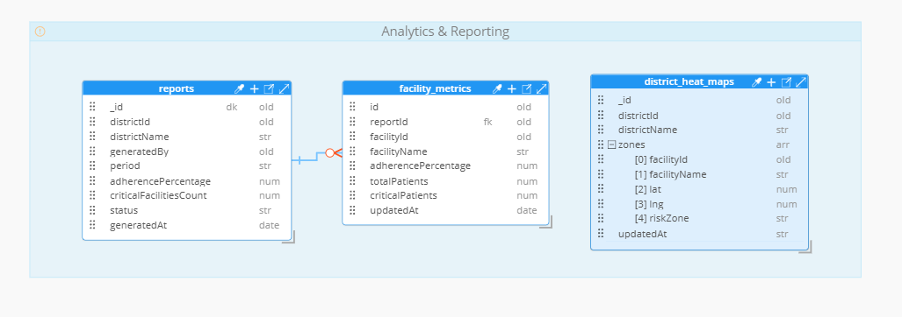
</div>
