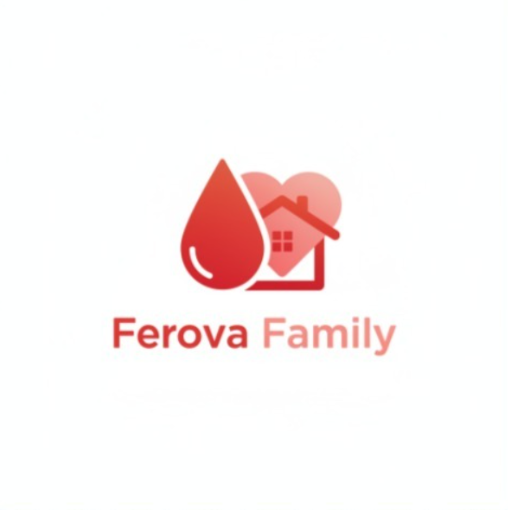
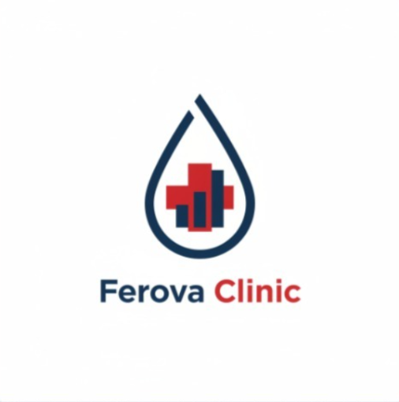
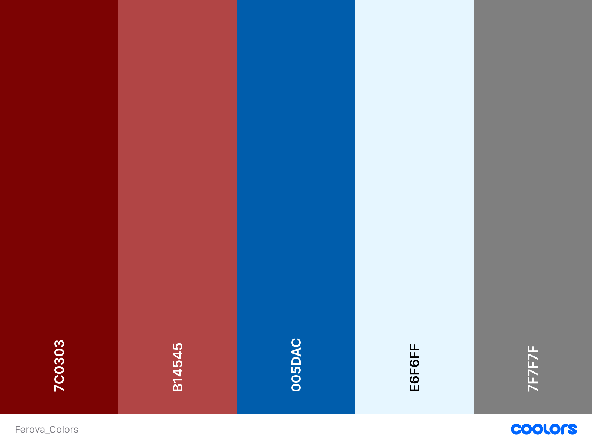

## Capítulo III: Solution UI/UX Design

### 3.1 Product Design

En esta sección se presenta el diseño de nuestros productos de software (Landing Page, Ferova Clinic y Ferova Family). Presentamos la información acerca de los estilos generales que se utilizarán para cada producto que diseñemos. Además, se incluye la infomación sobre el diseño de las interfaces de usuario y como estas mejoran la experiencia del usuario (UX/UI).

#### 3.1.1 Style Guidelines
##### 3.1.1.1 General Style Guidelines

Incluiremos la guía de estilos para nuestras dos aplicaciones: **FerovaFamily** y **FerovaClinic**

**Branding**

Para Ferova Family, el branding se diseñó para mostrar confianza y profesionalismo, abarcando el tema de la salud. Los tres iconos del logo (Gota de sangre, corazón y casa) representan la salud y bienestar que nuestra aplicación promete mediante sus funcionalidades principales. En el tema de colores, el color rojo representa la vitalidad y temas de salud de la persona y el color salmón representa la calidez, contrastando de buena manera con el otro color. El diseño incluye el logo del producto y su nombre para que sea fácil de identificar.

El branding de Ferova Clinic se diseñó para mostrar profesionalismo, enfocado en el análisis de datos. Los iconos del logo (gota de sangre, barras y cruz roja) muestran la conexión entre el análisis de datos y la salud. En los colores, el color azul muestra profesionalismo y confianza y el color rojo muestra todo lo relacionado a la salud. El diseño incluye el logo del producto y su nombre para que sea identificable.

**Typography**

Para las dos aplicaciones, se selecciono la tipografía "Inter" como fuente principal y secundaria por su legibilidad, tono profesional y neutralidad. Esta fuente es agradable al usuario, mostrando diferencias claras en cada letra.

**Colors**

La paleta de colores de Ferova Family y Ferova Clinic se compone de 4 colores y sus variantes. Los colores, en conjunto, permiten mostrar una claridad en el diseño de las dos aplicaciones.

- #7C0303 (Lava derretida): Utilizado en Ferova Family. Este color y sus variaciones están asociadas a la vitalidad y salud, también se le relaciona a la urgencia. Representa la salud principalmente. Utilizada en botones primarios y la interfaz de la aplicación.

- #B14545 (Malva polvorienta): Utilizado en Ferova Family. Este color y sus variaciones están asociadas a la calidez y empatía. Representa el hogar principalmente. Utilizada en botones secundarios, fondos de cards, etc.

- #005DAC (Azul báltico): Utilizado en Ferova Clinic. Transmite profesionalismo y confianza médica. Representa lo técnico y analítico. Utilizada en botones primarios y la interfaz de la aplicación.

- #E6F6FF (Azul Alice): Utilizado en Ferova Clinic. Transmite claridad y limpieza. Representa el orden y organización. Utilizada en cards y botones secundarios.

- #7F7F7F (Gris): Utilizado en las dos aplicaciones. Color que transmite equilibrio. Utilizado en textos secundarios, botones desactivados, etc.

**Spacing**

El diseño de las dos aplicaciones utiliza correctamente los espaciados para mantener un orden entre los distintos componentes que se muestran en la pantalla. Cada componente fue posicionado para que exista un espaciado y no se muestre abultado. En las dos aplicaciones, existira un espacio predefinido para la muestra del contenido y los componentes están diseñados para que se ajuste según la resolución del dispositivo.

**Tono de comunicación y Lenguaje aplicado**

Para Ferova Family, hemos tomado la decisión de tener un tono de comunicación empático, cercano al usuario y motivador. Esto debido a que la madre (el usuario principal) que utilizará esta app estará preocupada por el tratamiento de su hijo. Nosotros como desarrolladores, tenemos que tomar en cuenta esto: Debemos utilizar un lenguaje cercado al usuario, sin utilizar tecnicismos, un lenguaje amigable para que reduzca la ansiedad durante el tratamiento y motivador, que premie al usuario por los pequeños avances.

Por el otro lado, para Ferova Clinic, hemos tomado la decisión de tener un tono de comunicación profesional, directo y analítico. Esto debido a que el médico (el usuario principal) que utilizará esta app necesita acceder a todos los datos del usuario de una manera eficaz. Nosotros como desarrolladores, tenemos que tomar en cuenta lo siguiente: Debemos utilizar un lenguaje con las terminologías adecuadas, el lenguaje debe ser directo y todo se tiene que basar en los datos almacenados de los pacientes.

#### 3.1.2 Information Architecture
##### 3.1.2.1 Organization Systems
##### 3.1.2.2 Labelling Systems
##### 3.1.2.3 SEO Tags and Meta Tags
##### 3.1.2.4 Searching Systems
##### 3.1.2.5 Navigation Systems
#### 3.1.3 Landing Page UI Design
##### 3.1.3.1 Landing Page Wireframe
##### 3.1.3.2 Landing Page Mock-up
#### 3.1.4 Mobile Applications UX/UI Design
##### 3.1.4.1 Mobile Applications Wireframes
##### 3.1.4.2 Mobile Applications Wireflow Diagrams
##### 3.1.4.3 Mobile Applications Mock-ups
##### 3.1.4.4 Mobile Applications User Flow Diagrams
##### 3.1.4.5 Mobile Applications Prototyping
