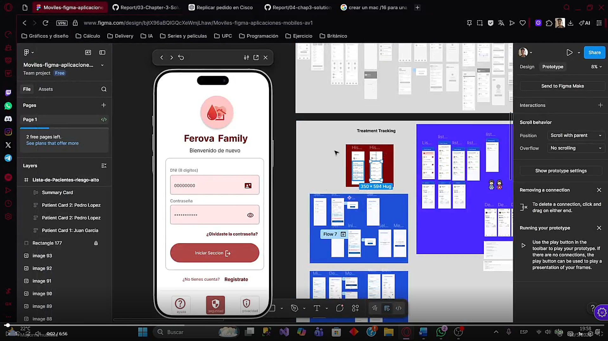

## Capítulo III: Solution UI/UX Design
### 3.1 Product Design

En esta sección se presenta el diseño de nuestros productos de software (Landing Page, Ferova Clinic y Ferova Family). Presentamos la información acerca de los estilos generales que se utilizarán para cada producto que diseñemos. Además, se incluye la infomación sobre el diseño de las interfaces de usuario y como estas mejoran la experiencia del usuario (UX/UI).

#### 3.1.1 Style Guidelines
##### 3.1.1.1 General Style Guidelines

Incluiremos la guía de estilos para nuestras dos aplicaciones: **FerovaFamily** y **FerovaClinic**

**Branding**

Para Ferova Family, el branding se diseñó para mostrar confianza y profesionalismo, abarcando el tema de la salud. Los tres iconos del logo (Gota de sangre, corazón y casa) representan la salud y bienestar que nuestra aplicación promete mediante sus funcionalidades principales. En el tema de colores, el color rojo representa la vitalidad y temas de salud de la persona y el color salmón representa la calidez, contrastando de buena manera con el otro color. El diseño incluye el logo del producto y su nombre para que sea fácil de identificar.


El branding de Ferova Clinic se diseñó para mostrar profesionalismo, enfocado en el análisis de datos. Los iconos del logo (gota de sangre, barras y cruz roja) muestran la conexión entre el análisis de datos y la salud. En los colores, el color azul muestra profesionalismo y confianza y el color rojo muestra todo lo relacionado a la salud. El diseño incluye el logo del producto y su nombre para que sea identificable.


**Typography**

Para las dos aplicaciones, se selecciono la tipografía "Inter" como fuente principal y secundaria por su legibilidad, tono profesional y neutralidad. Esta fuente es agradable al usuario, mostrando diferencias claras en cada letra.


**Colors**

La paleta de colores de Ferova Family y Ferova Clinic se compone de 4 colores y sus variantes. Los colores, en conjunto, permiten mostrar una claridad en el diseño de las dos aplicaciones.


- #7C0303 (Lava derretida): Utilizado en Ferova Family. Este color y sus variaciones están asociadas a la vitalidad y salud, también se le relaciona a la urgencia. Representa la salud principalmente. Utilizada en botones primarios y la interfaz de la aplicación.

- #B14545 (Malva polvorienta): Utilizado en Ferova Family. Este color y sus variaciones están asociadas a la calidez y empatía. Representa el hogar principalmente. Utilizada en botones secundarios, fondos de cards, etc.

- #005DAC (Azul báltico): Utilizado en Ferova Clinic. Transmite profesionalismo y confianza médica. Representa lo técnico y analítico. Utilizada en botones primarios y la interfaz de la aplicación.

- #E6F6FF (Azul Alice): Utilizado en Ferova Clinic. Transmite claridad y limpieza. Representa el orden y organización. Utilizada en cards y botones secundarios.

- #7F7F7F (Gris): Utilizado en las dos aplicaciones. Color que transmite equilibrio. Utilizado en textos secundarios, botones desactivados, etc.

**Spacing**

El diseño de las dos aplicaciones utiliza correctamente los espaciados para mantener un orden entre los distintos componentes que se muestran en la pantalla. Cada componente fue posicionado para que exista un espaciado y no se muestre abultado. En las dos aplicaciones, existira un espacio predefinido para la muestra del contenido y los componentes están diseñados para que se ajuste según la resolución del dispositivo.

**Tono de comunicación y Lenguaje aplicado**

Para Ferova Family, hemos tomado la decisión de tener un tono de comunicación empático, cercano al usuario y motivador. Esto debido a que la madre (el usuario principal) que utilizará esta app estará preocupada por el tratamiento de su hijo. Nosotros como desarrolladores, tenemos que tomar en cuenta esto: Debemos utilizar un lenguaje cercado al usuario, sin utilizar tecnicismos, un lenguaje amigable para que reduzca la ansiedad durante el tratamiento y motivador, que premie al usuario por los pequeños avances.

Por el otro lado, para Ferova Clinic, hemos tomado la decisión de tener un tono de comunicación profesional, directo y analítico. Esto debido a que el médico (el usuario principal) que utilizará esta app necesita acceder a todos los datos del usuario de una manera eficaz. Nosotros como desarrolladores, tenemos que tomar en cuenta lo siguiente: Debemos utilizar un lenguaje con las terminologías adecuadas, el lenguaje debe ser directo y todo se tiene que basar en los datos almacenados de los pacientes.

#### 3.1.2 Information Architecture

En esta sección, se plantean los sistemas en los que se basarán nuestra aplicación, incluyendo los Tags de busqueda.

##### 3.1.2.1 Organization Systems

En las dos aplicaciones se emplea la organización jerárquica para destacar las notificaciones emergentes, logros a cumplir, alertas de probabilidad alta de abandono de tratamiento o alertas de consumo de medicamentos. Esta jerarquía permite mostrar al usuario diferenciar entre las alertas importantes de las demás.

En varias funcionalidades de las aplicaciones utilizamos la organización secuencial, donde el usuario realizará una serie de pasos para completar, sea un formulario o datos preestablecidos. La secuencia nos permite que el usuario realice todos los pasos obligatoriamente para obtener datos.

También se utiliza la organización matricial, principalmente en todo acerca de exportación de datos, donde se permite el filtrado por fecha, nombre o rango de días. Esta organización es importante ya que permite analizar gran información de datos facilmente.

##### 3.1.2.2 Labelling Systems

Se presentará el sistema de etiquetado para la página de presentación (Landing Page) y nuestras dos aplicaciones: Ferova Family y Ferova Clinic. Nuestro sistema se ha diseñado para separar y mostrar los datos de forma clara, minimizando la cantidad de información a un punto que sea fácil de entender y manejar.

**Landing Page**

- Presentación: Presentación de Slogan de nuestra empresa. Incluye botones de descarga e imagen que representa la aplicación.
- Problema: Datos estadísticos sobre la anemia y como afecta a los infantes.
- Funcionalidades: Funcionalidades principales de la aplicación para madres.
- Para quién: Muestra las funcionalidades para cada aplicación.
- Cómo funciona: Ruta guiada sobre las funciones de la aplicación Ferova Family.
- Opiniones: Opiniones de los usuarios que utilizaron la app para madres.
- Descarga de Apps: Botones de descarga de la aplicación.

**Ferova Family**

- Inicio: Muestra la información esencial sobre la aplicación. Muestra los niños registrados, la dosis registrada, muestra de logros y cantidad de hierro absorbida y cards de acceso rápido.
- Diario: Muestra toda la información acerca de la nutrición de un niño: Hierro absorbido, alimentos consumidos, creación de nueva dieta e historial de dietas y Tips de consumo de comidas.
- Citas: Muestra toda la información sobre las citas médicas para los niños: Selección de niño, cita actual, reserva de citas e historial de citas.
- Consultas: Muestra toda la información sobre consultas médicas virtuales: Consultas por niño, consultas realizadas y creación de nueva consulta.
- Notificaciones: Muestra de todas las notificaciones de la aplicación.

**Ferova Clinic**

- Inicio: Muestra la información esencial sobre la aplicación. Muestra los pacientes, estado de riesgo clínico de cada paciente, agenda de actividades diarias y cards de acceso rápido.
- Pacientes: Muestra toda la información acerca de los pacientes registrados. Se puede vincular un paciente, seleccionar un paciente, monitoreo de pacientes según riesgo, detalle de cada paciente.
- Consultas: Muestra toda la información acerca de las consultas: Bandeja de consultas por paciente y chat con el paciente.
- Historial: Muestra la información del historial médico de cada paciente registrado. Se puede registrar y actualizar un historial médico
- Notificaciones: Muestra de todas las notificaciones de la aplicación.

##### 3.1.2.3 SEO Tags and Meta Tags

1. Landing Page

**Charset**
```html
<meta charset="UTF-8">
```
Su función principal es indicar como interpreta el navegador los caracteres de texto en la página. UTF-8 signfica codificación universal, lo que muestra una correcta visualización de todos los caracteres, incluyendo los especiales como la letra "ñ", garantizando una experiencia consistente por cada idioma.

**Viewport**
```html
<meta name="viewport" content="width=device-width initial-scale=1.0">
```
Muestra que la página se adapta a cada resolución de pantalla de dispositivo, o sea, siendo responsiva por cada dispositivo: Desde PC hasta tablet o celular. Ajusta el ancho del contenido al ancho del dispositivo y establece un zoom 1:1 para la correcta visualización de los datos.

2. Ferova Family y Ferova Clinic

**Se tiene que ver durante el desarrollo de la app**

##### 3.1.2.4 Searching Systems

En esta sección, mostraremos los diferentes metodos de busqueda y filtrado de nuestras aplicaciones Ferova Family y Ferova Clinic.

**Ferova Family**
- Pestaña Diario:
1. Busqueda de alimentos ricos en hierro
2. Filtro de busqueda de alimentos ricos en hierro.

**Ferova Clinic**
- Pestaña Inicio:
1. Busqueda de pacientes para dar de alta.
2. Busqueda de pacientes para registro de control de hemoglobina.
- Pestaña Pacientes:
1. Registro de nuevo paciente utilizando busqueda de DNI de la madre registrada.
2. Filtro de pacientes por nivel de riesgo.
- Pestaña Consultas:
1. Busqueda de consultas por paciente
- Pestaña Historial:
1. Busqueda por paciente registrado.

##### 3.1.2.5 Navigation Systems

La navegación es muy importante ya que permite utilizar todas las funcionalidades que fueron implementadas en una aplicación. Hemos implementado la navegación de la siguiente manera:

1. Ferova Family: En Ferova Family se organizo mediante secciones, las cuales permiten acceder a todos los beneficios que la aplicación ofrece. Además, se incluyen botones que acceden a otras funcionalidades dentro de cada sección:

- Inicio
- Diario
- Citas
- Consultas

2. Ferova Clinic: En Ferova Clinic, se organizo mediante secciones, permitiendo acceder a todas las funcionalidades de la aplicación. Además, se incluyen botones que acceden a otras funcionalidades dentro de cada sección:

- Inicio
- Pacientes
- Consultas
- Historial

#### 3.1.3 Landing Page UI Design


##### 3.1.3.1 Landing Page Wireframe

Para elaborar nuestro prototipo de baja fidelidad, hemos utilizado la plataforma Figma, que nos permite crear, representar y exportar nuestros prototipos. Gracias a esta herramienta, podemos presentar un Wireframe de una buena calidad de una manera sencilla.

<p style="word-break: break-all; overflow-wrap: break-word; white-space: normal;">
  Enlace: <a href="https://www.figma.com/design/8SDOF7pysWSWxqzSrdOfnh/PruebaIHC?node-id=0-1&t=p67FuxKKSjztKY2p-1" target="_blank" style="word-break: break-all; overflow-wrap: break-word;">
    https://www.figma.com/design/8SDOF7pysWSWxqzSrdOfnh/PruebaIHC?node-id=0-1&t=p67FuxKKSjztKY2p-1
  </a>
</p>


##### 3.1.3.2 Landing Page Mock-up

Hemos finalizado con éxito el mock-up de la página de inicio, aplicando los principios y elementos de diseño clave. Gracias a estas directrices, la experiencia para los usuarios de nuestra plataforma será mucho más sencilla e intuitiva.

<p style="word-break: break-all; overflow-wrap: break-word; white-space: normal;">
  Enlace: <a href="https://www.figma.com/design/8SDOF7pysWSWxqzSrdOfnh/PruebaIHC?node-id=0-1&t=p67FuxKKSjztKY2p-1" target="_blank" style="word-break: break-all; overflow-wrap: break-word;">
    https://www.figma.com/design/8SDOF7pysWSWxqzSrdOfnh/PruebaIHC?node-id=0-1&t=p67FuxKKSjztKY2p-1
  </a>
</p>


**Segmentos de la Landing Page**


**La aplicación** <br>
Es una app que ayuda a controlar y dar seguimiento al tratamiento de la anemia, facilitando el registro de dosis, el monitoreo y la comunicación con personal de salud. <br>


**El problema** <br>
La anemia infantil sigue siendo alta en Perú, principalmente por el abandono del tratamiento y la falta de información y seguimiento adecuado.
<br>


**Las funcionalidades** <br>
Incluye registro de dosis, recordatorios, monitoreo del progreso, teleconsultas e información nutricional para apoyar el tratamiento.
<br>


**Público objetivo** <br>
Está dirigida a cuidadores de niños y personal de salud, priorizando simplicidad para usuarios y herramientas de seguimiento para profesionales.
<br>


**Testimonios** <br>
Los usuarios destacan que la app mejora la organización del tratamiento y facilita el seguimiento, generando confianza en su uso.
<br>


#### 3.1.4 Mobile Applications UX/UI Design
##### 3.1.4.1 Mobile Applications Wireframes
Los siguientes wireframes corresponden a la aplicación web SUMADI

Principios aplicados
-**Jerarquía funcional clara:**

 El flujo de navegación prioriza las acciones más relevantes para proveedores, como gestión de productos, visualización de órdenes y acceso a reportes de ventas.

-**Consistencia y patrones de diseño:**

 Los componentes mantienen uniformidad en su comportamiento visual e interactivo, asegurando coherencia entre pantallas y módulos.

-**Accesibilidad en interfaces:**

 Se aplicaron contrastes adecuados, fuentes legibles, botones de tamaño óptimo y estructura de navegación compatible con teclado y lectores de pantalla.

-**Diseño adaptativo:**

 Los wireframes consideran que la aplicación será utilizada tanto en pantallas de laptop como en tablets, por lo que el diseño es responsivo y se ajusta a distintos anchos de pantalla.

-**Arquitectura de información enfocada al flujo de tareas:**

La estructura prioriza la eficiencia operativa, permitiendo a los proveedores registrar productos, atender pedidos y monitorear métricas clave en el menor número de clics posible.

**Sección Home**

Pantalla principal de la aplicacion: Permita vesualizar la información primaria sobre el progreso de la persona anémica
<p align="center">

</p>
**Sección Notificación**

Wireframes de notificaciones sobre alertas o avances del usuario en la aplicación
<p align="center">

</p>
**Sección Health Facility**

Pantalla de información de centros médicos para la programación de citas que necesita el paciente

<br>Postas cercanas<br>
<p align="center">

</p>
<br>Detalle de posta<br>
<p align="center">

</p>
<br>Reserva de cita parte 1<br>
<p align="center">

</p>
<br>Reserva de cita parte 2<br>
<p align="center">

</p>
<br>Cancelar cita<br>
<p align="center">

</p>
<br>Cita confirmada<br>
<p align="center">

</p>
<br>Cita actual<br>
<p align="center">

</p>
<br>Cita cancelada<br>
<p align="center">

</p>
**Sección Patient Management**

Sección donde el nutricionista o enfermero/a puede visualizar la información de su paciente asignado

<br>
<p align="center">

</p>
<br>

**Sección Nutritional Diary**

Sección de la app donde se puede ver la información del progreso del paciente y los pasos a seguir de su tratamiento diario

<br>Resumen diario<br>
<p align="center">

</p>
<br>historial<br>
<p align="center">

</p>
<br>Registro de alimento<br>
<p align="center">

</p>
<br>Registro de alimento (vacio)<br>
<p align="center">

</p>
<br>Registro de alimento (lleno)<br>
<p align="center">

</p>
**Sección Achivements and Badges**

Sección donde el paciente puede ver su progreso en el tratamiento en forma de logros y recompensas virtuales

<br>Dosis Confirmada<br>
<p align="center">

</p>
<br>Perdida de racha<br>
<p align="center">

</p>
<br>Progresión<br>
<p align="center">

</p>
**Sección Comunication**

Sección de comunicación entre el encargado del paciente y el profesional de la salud encargado del seguimiento de su caso

<br>Consulta<br>
<p align="center">

</p>
<br>Nueva consulta<br>
<p align="center">

</p>
<br>Bandeja de consultas<br>
<p align="center">

</p>
<br>Inicio de consulta<br>
<p align="center">

</p>
<br>Mensajes en la consulta<br>
<p align="center">

</p>

##### 3.1.4.2 Mobile Applications Wireflow Diagrams

Cada Wireflow Diagram representa el recorrido visual e interactivo que realiza el usuario dentro de la aplicación para cumplir un objetivo específico (User Goal). En cada flujo se detalla la secuencia de pantallas y acciones que permiten alcanzar dicho propósito, desde la navegación inicial hasta la confirmación o registro de una tarea.

<table width="100%">
  <tr>
    <th width="25%">User Goal</th>
    <th width="75%">Imágen</th>
  </tr>
  <tr>
    <td>UG-01 — Ingreso de datos de paciente: El flujo muestra cómo el usuario accede a su perfil desde el menú principal para registrar los datos de un nuevo paciente. El proceso concluye al guardar el registro.</td>
    <td>
      <br>
    </td>
  </tr>
  <tr>
    <td> 
      UG-02 — Crear nueva entrada del diario nutricional: El flujo muestra como el usuario registra una nueva entrada de alimento al diario nutricional. Esto permita agregar un nuevo alimento al diario nutricional.
    </td>
    <td>
        <br>
    </td>
  </tr>
  <tr>
    <td> UG-03 — Monitorear el progreso del paciente: El cuidador visualiza gráficos o reportes con la evolución de hemoglobina, dosis cumplidas y avance general del tratamiento. </td>
    <td>
        <br>
    </td>
  </tr>
  <tr>
    <td> UG-04 — Comunicación con el personal médico: El cuidador puede enviar consultas o realizar teleconsultas con enfermeros(as) y nutricionistas para resolver dudas sobre el tratamiento.</td>
    <td>
        <br>
    </td>
  </tr>
  <tr>
    <td>UG-05 — Recibir alertas de riesgo o abandono: La aplicación identifica posibles interrupciones en el tratamiento y envía alertas preventivas para reducir el abandono y reforzar la adherencia.</td>
    <td>
        <br>
    </td> 
  </tr>
  <tr>
    <td>UG-06 — Reservar cita para paciente: El cuidador puede agendar una cita para la revisión del paciente dentro de una posta médica registrada dentro de la aplicación.</td>
    <td>
        <br>
    </td>
  </tr>
  <tr>
    <td>UG-07 — Cancelar cita reservada: El ciudador pueda cancelar una cita de revisión para la evaluación del paciente  .</td>
    <td>
        <br>
    </td>
  </tr>
  <tr>
    <td>UG-08 — Confirmar dosis diaria: El cuidador puede verificar la suministración del medicamento diario al paciente mediante la pestaña de notificaciones.</td>
    <td>
        <br>
    </td>
  </tr>
  <tr>
    <td>UG-09 — Visualización de datos de pacientes: El personal medico puede revisar los datos de sus pacientes asignados para estudiarlos y crear un plan de tratamientos para el último.</td>
    <td>
        <br>
    </td>
  </tr>
  <tr>
    <td>UG-10 — Iniciar tratamiento: El medico asignado puede iniciar el tratamiento asignando los suplementos correspondientes a uno de sus pacientes. </td>
    <td>
        <br>
    </td>
  </tr>
</table>

##### 3.1.4.3 Mobile Applications Mock-ups

**Version Mobile - Profesional de salud**

**Inicio de tratamiento**

El profesional puede asignar a un determinado paciente su tratamiento


**Lista de tratamientos y detalle**

El profesional puede observar los tratamientos de sus pacientes asignados y los detalles de estos mismos


**Lista de pacientes y sus detalles**

El profesional puede observar la información principal de sus pacientes y su progreso dentro del tratamiento


**Perfil del profesional**

Pantalla donde el profesional puede observar su perfil, accesos rapidos para la aplicación e información relacionada con sus pacientes


**Finalizar tratamiento**

Pantalla donde el profesional puede dar de alta a sus pacientes dando el tratamiento por terminado


**Bandeja de consultas**

Pantalla donde el profesional puede interactuar con sus pacientes asignados por medio de chats privados


**Historial medico y control**

Sección donde el profesional puede crear, actualizar y revisar un historial médico y de controles
<br>

Historial de paciente


Selección de historial médico


Control de hemoglobina


Historial de controles


**Asignación de pacientes**

Sección donde el padre/madre, tutor o apoderado es capaz de registrar a su hijo/a a seguimiento dentro de la aplicación

Asignar paciente


Registrar paciente


Busqueda de paciente


**Version Mobile - Tutor de paciente**

**Pagina principal**

En esta sección el encargado del paciente puede ver la información principal sobre el progreso del paciente en su tratamiento


**Health Facility**

En esta sección el tutor puede ver toda la información sobre las postas medicas: Localización, detalles, programación de citas

Localización de postas


Reserva de citas


**Patient management**

El tutor es capaz de añadir pacientes a la aplicación para su continuo tratamiento


**Nutritional Diary**

En esta sección el responsable del paciente puede ver la información del plan nutricional que necesita el paciente

Busqueda


Registro de alimentos


Detalles de alimentos


Historial alimenticio


**Achivements and badges**

El tutor podra observar el progreso del paciente por medio de logros y medallas 

Medallas


Racha de dosis 


Racha recuperada


Progreso


**Comunication**

En esta sección el tutor puede contactar al profesional de salud para preguntas y dudas con respecto al tratamiento del paciente


##### 3.1.4.4 Mobile Applications User Flow Diagrams

**User Flow 1 Ingreso de datos de paciente:** <br> El flujo muestra cómo el usuario accede a su perfil desde el menú principal para registrar los datos de un nuevo paciente. El proceso concluye al guardar el registro.


**User Flow 2 Crear nueva entrada del diario nutricional:** <br> El flujo muestra como el usuario registra una nueva entrada de alimento al diario nutricional. Esto permita agregar un nuevo alimento al diario nutricional.


**User Flow 3 Monitorear el progreso del paciente:** <br> El cuidador visualiza gráficos o reportes con la evolución de hemoglobina, dosis cumplidas y avance general del tratamiento.


**User Flow 4 Comunicación con el personal médico:** <br> El cuidador puede enviar consultas o realizar teleconsultas con enfermeros(as) y nutricionistas para resolver dudas sobre el tratamiento.


**User Flow 5 Recibir alertas de riesgo o abandono:** <br> La aplicación identifica posibles interrupciones en el tratamiento y envía alertas preventivas para reducir el abandono y reforzar la adherencia.


**User Flow 6 Reservar cita para paciente:** <br> El cuidador puede agendar una cita para la revisión del paciente dentro de una posta médica registrada dentro de la aplicación.


**User Flow 7 Cancelar cita reservada:** <br> El ciudador pueda cancelar una cita de revisión para la evaluación del paciente.


**User Flow 8 Confirmar dosis diaria:** <br> El cuidador puede verificar la suministración del medicamento diario al paciente mediante la pestaña de notificaciones.


**User Flow 9 Visualización de datos de pacientes:** <br> El personal medico puede revisar los datos de sus pacientes asignados para estudiarlos y crear un plan de tratamientos para el último.


**User Flow 10 Iniciar tratamiento:** <br> El medico asignado puede iniciar el tratamiento asignando los suplementos correspondientes a uno de sus pacientes.


##### 3.1.4.5 Mobile Applications Prototyping

En cuanto a la arquitectura de información, el prototipo móvil de SUMADI emplea una navegación jerárquica clara, acompañada de flujos secuenciales en procesos clave como el registro de pacientes y la creación y asignacion de tratamientos. También se definieron paginas intuitivas y herramientas de búsqueda que facilitan una interacción fluida y dirigida.<br>

Además, se grabó un video donde se explican los principales flujos de interacción del prototipo móvil, mostrando cómo las decisiones de diseño se reflejan en la experiencia del usuario. <br>



Mobile Application Prototyping

<p style="word-break: break-all; overflow-wrap: break-word; white-space: normal;">
  <a href="https://upcedupe-my.sharepoint.com/:v:/g/personal/u20231c426_upc_edu_pe/IQDpH06QhVQzRrM26MwmIDINAVMO2nQs8GG8SDmSM8knnL8?nav=eyJyZWZlcnJhbEluZm8iOnsicmVmZXJyYWxBcHAiOiJTdHJlYW1XZWJBcHAiLCJyZWZlcnJhbFZpZXciOiJTaGFyZURpYWxvZy1MaW5rIiwicmVmZXJyYWxBcHBQbGF0Zm9ybSI6IldlYiIsInJlZmVycmFsTW9kZSI6InZpZXcifX0%3D&e=LwkLQG" target="_blank" style="word-break: break-all; overflow-wrap: break-word;">
    https://upcedupe-my.sharepoint.com/:v:/g/personal/u20231c426_upc_edu_pe/IQDpH06QhVQzRrM26MwmIDINAVMO2nQs8GG8SDmSM8knnL8?nav=eyJyZWZlcnJhbEluZm8iOnsicmVmZXJyYWxBcHAiOiJTdHJlYW1XZWJBcHAiLCJyZWZlcnJhbFZpZXciOiJTaGFyZURpYWxvZy1MaW5rIiwicmVmZXJyYWxBcHBQbGF0Zm9ybSI6IldlYiIsInJlZmVycmFsTW9kZSI6InZpZXcifX0%3D&e=LwkLQG
  </a>
</p>
